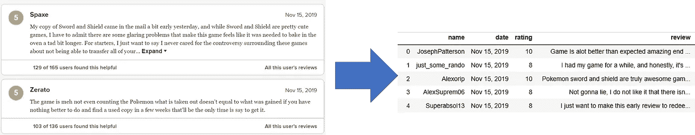
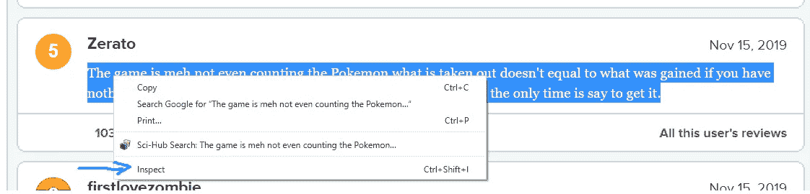
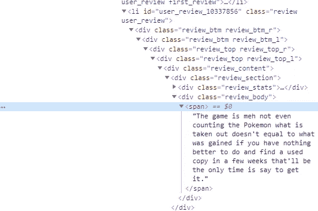

# 使用 BeautifulSoup 的 Web 抓取元评论

> 原文：<https://towardsdatascience.com/web-scraping-metacritic-reviews-using-beautifulsoup-63801bbe200e?source=collection_archive---------7----------------------->

## 一个简单的 6 步指南，使用 BeautifulSoup 收集游戏评论并保存到 pandas dataframe 中。



我决定刮掉[元批评口袋妖怪的评论](https://www.metacritic.com/game/switch/pokemon-sword/user-reviews)，因为我想给负面游戏评论做个主题模型。我很好奇这些游戏是如何被评论家称赞，却被大多数玩家评价很差的。为什么游戏玩家讨厌口袋妖怪？在[这篇](/using-mallet-lda-to-learn-why-players-hate-pokémon-sword-shield-23b12e4fc395)文章中会有更多相关内容。与此同时，我是这样从网站上搜集评论的。

** *底部全码。嵌入代码(在灰色框中)用于解释目的****

1.  **导入包。你需要的主要包装是 request、BeautifulSoup 和 pandas。**

```
*#To get the url, and scrap the html page* import requests
from bs4 import BeautifulSoup*#To save the reviews in a dataframe* import pandas as pd
```

2.**弄清楚网页的 Html 结构。** Html 标签用于标记页面元素，相似的元素通常包含在相同的标签内。您希望熟悉 Html 标签模式，哪些标签包含哪些信息，以及找到这些标签的最佳方法。

找到重要标签最简单的方法是使用 Chrome，选择你感兴趣的文本，点击右键，然后“检查”。



Highlight the text of interest, and right-click to ‘Inspect’

这将打开一个包含页面 Html 的单独窗口。我们突出显示的文本在 *span* 标签中。你可以展开 *span* 标签，点击*span<span>旁边的小三角就可以看到文字。*



A segment of each review’s html structure. We are interested in the user review in the span tag.

BeautifulSoup (BS)可以在 *span* 标签中找到评论，但是在 *span* 标签中还有其他页面元素是**而不是**评论。更好的方法是告诉 BS 找到一个特定于评论的外部标签，然后在其中找到一个 *span* 标签。

如果您滚动页面的 Html，您会注意到每个评论的文本都嵌套在 *div 类*中。这些类遵循固定的结构，并在页面上的每个评论中重复。

记下 *review_content* div 类。它包含用户名、评分和评论文本等评论内容。另外，请注意 *review_content* 中的其他类，因为我们将使用它们来告诉 BS 如何找到评论文本。

3.使用 BS 解析页面。发出 URL 请求，并将响应解析成 BS。

```
url = '[https://www.metacritic.com/game/switch/pokemon-sword/user-reviews?page=](https://www.metacritic.com/game/switch/pokemon-sword/user-reviews)0'

user_agent = {'User-agent': 'Mozilla/5.0'}
response = requests.get(url, headers = user_agent)

soup = BeautifulSoup(response.text, 'html.parser')
```

4.**创建一个字典来保存你想要抓取的信息**。关键字是功能名称，值是列表。

```
review_dict = {'name':[], 'date':[], 'rating':[], 'review':[]}
```

5.告诉 BS 如何找到你想要的信息，并将它们添加到字典列表中。我们将讨论如何复习课文。其他元素的代码在这篇文章的底部。

```
#look for review_content tags since every user review has this tag

for review in soup.find_all('div', class_='review_content'): #within review_content tag, look for the presence of longer reviewsif review.find('span', class_='blurb blurb_expanded'): review_dict['review'].append(review.find('span', class_=’blurb blurb_expanded').text)

else: review_dict[‘review’].append(review.find('div',class_='review_body').find('span').text)
```

我们使用 *find all* 来获取页面中所有的 *review_content* 标签。这与查找页面上的所有评论是一样的，因为每个评论都包含在这个 div 类中。

if-else 语句确保从正确的标记中提取文本，这取决于评论是否很长。

我们先来看‘else’条件。对于每个 *review_content* 标签，我们寻找一个靠近包含文本评论的 span 标签的 div 类。在本例中，我使用了 *review_body* div 类。由于这个类中只有一个 *span* 标签，我们可以使用 *find* 来查找第一个 *span* 标签。

关于“如果”的条件。较长的评论(需要用户点击“展开”来查看全文)在一个*blurb blurb _ expanded*span 类中。较短的评论没有这个类。由于 *blurb blurb_expanded* 只出现在较长的评论中，我们可以*直接找到*它。

因为 Metacritic 上的所有评论都有相同的元素，所以我们可以将所需的信息添加到列表中，它们将是有序的。

6.将字典转换成数据帧。

```
sword_reviews = pd.DataFrame(review_dict)
```

呜哇！仅此而已。如果你想收集所有的评论，你只需要遍历所有的页面，就像我在下面的代码中所做的那样:

Web Scraper for Metacritic Game Reviews

在这篇文章中，我们使用 BS 创建了一个简单的 web scraper。我们可以这样做，因为页面没有动态内容。对于动态页面，你可能想尝试使用 *Selenium，*当与 BS 结合使用时会非常强大。

网络抓取可能很耗时，但它是获取在线内容的一个途径。我个人认为网络抓取对 NPL 项目很有用，因为它可以方便地访问当前的对话，并快速感知情绪，这对营销/传播活动的实时评估很有用。

希望这篇帖子对你有帮助。刮的开心！