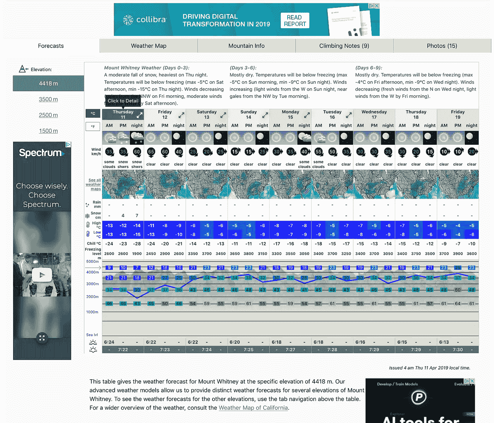
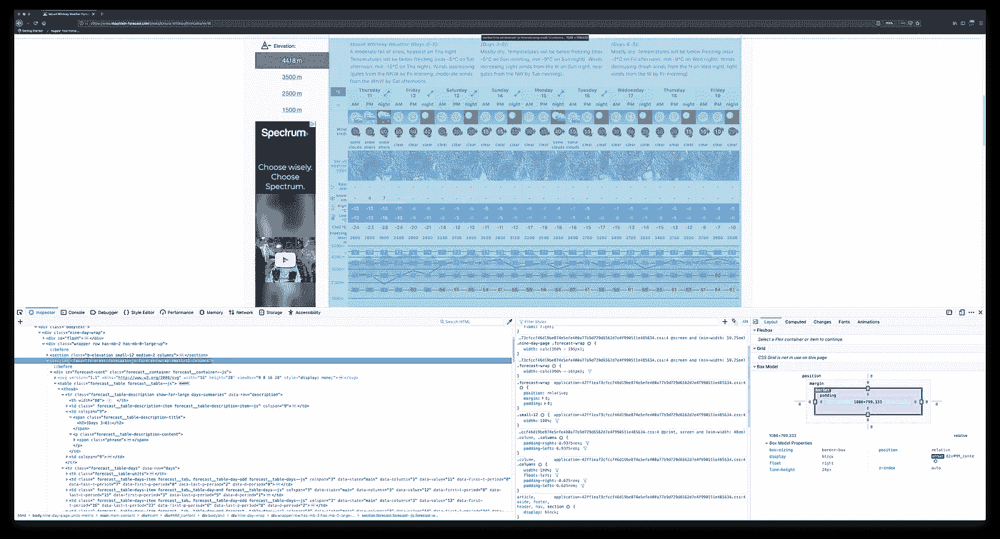
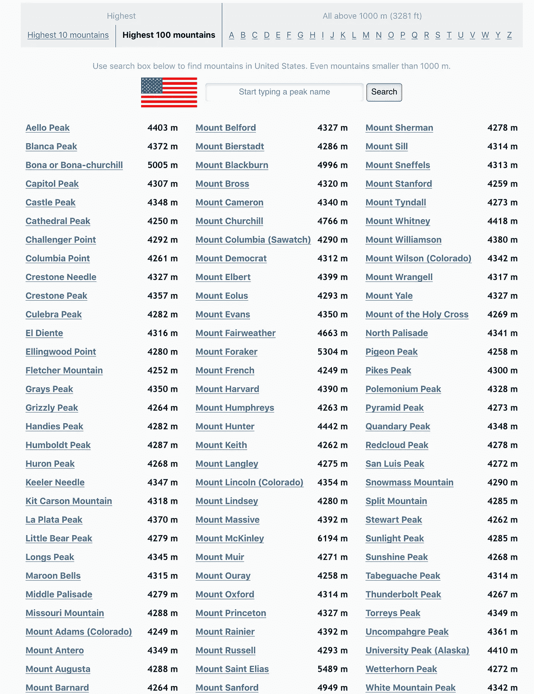
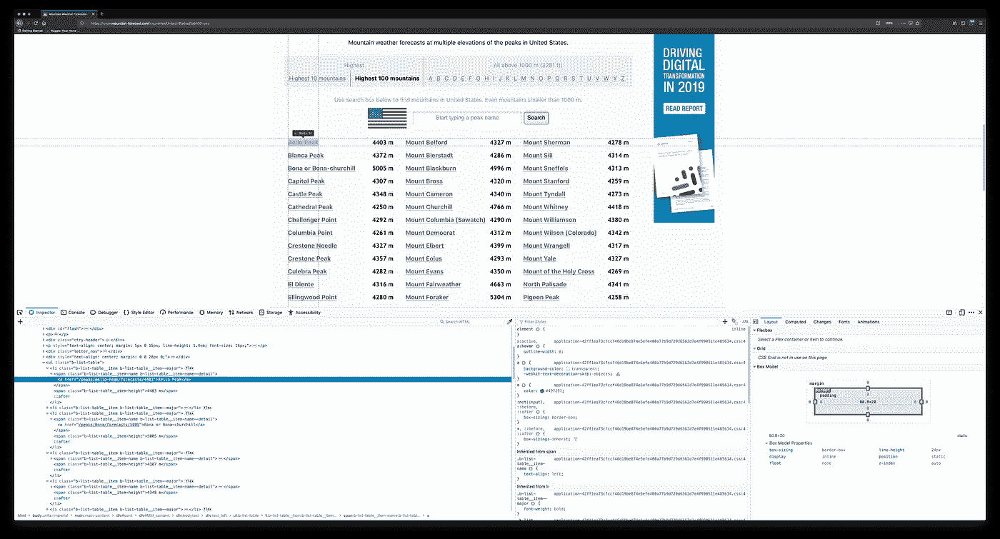
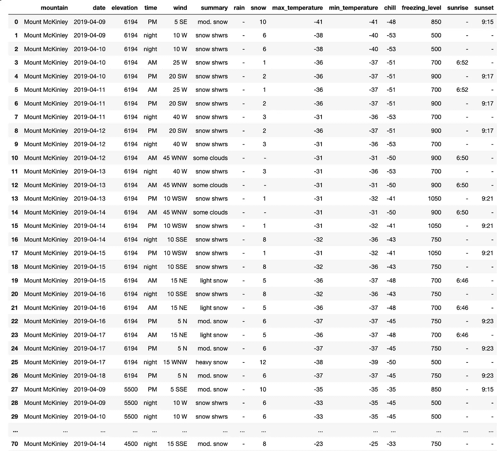
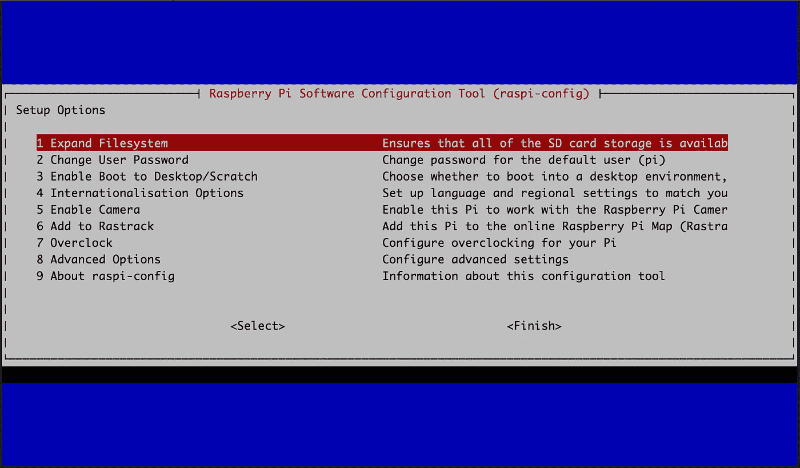

# 使用 Python 和 Raspberry Pi 的网络抓取山区天气预报

> 原文：<https://towardsdatascience.com/web-scraping-mountain-weather-forecasts-using-python-and-a-raspberry-pi-f215fdf82c6b?source=collection_archive---------5----------------------->

@[andresvourakis](http://andresvourakis.com) (image on the left), [@ilyapavlov](https://unsplash.com/@ilyapavlov) (image on the right)

## 从没有 API 的网站提取数据

# 动机

在向您介绍这个项目之前，让我告诉您一点它背后的动机。除了数据科学和机器学习，我的另一个爱好是在山里度过时光。计划去任何一座山的旅行都需要很多仔细的计划，以便将风险降到最低。这意味着随着峰会的临近，要密切关注天气状况。在这方面，我最喜欢的网站是[Mountain-Forecast.com](https://www.mountain-forecast.com)，它给你提供了世界上几乎任何一座不同海拔高度的山的天气预报。唯一的问题是，它没有提供任何历史数据(据我所知)，这些数据有时在确定是去旅行还是等待更好的条件时会很有用。

这个问题在我的脑海里已经有一段时间了，我最终决定做点什么。下面，我将描述我如何使用 Python 和 Beautiful Soup 为 Mountain-Forecast.com 的[编写一个 web scraper，并将其放入一个树莓派来收集每天的数据。](https://www.mountain-forecast.com)

> 如果你想直接跳到代码，那就去查看一下 [GitHub](https://github.com/avourakis/Mountain-Forecast-Web-Scraper) 上的资源库。

# 网页抓取

## 检查网站

为了找出我需要的目标元素，我从检查页面的源代码开始。这可以通过右击感兴趣的元素并选择*检查*来轻松完成。这将显示 HTML 代码，从中我们可以看到包含每个字段的元素。

Weather Forecast Table

Inspector for Weather Forecast Table

幸运的是，每座山的预报信息都包含在一个表格中。唯一的问题是每一天都有多个相关联的子列(即 AM、PM 和 night)，所以我需要找到一种方法来遍历它们。此外，由于天气预报是在不同的海拔高度提供的，我需要提取它们中每一个的链接，并单独抓取它们。

类似地，我检查了包含美国最高的 100 座山的 URL 的目录。

Highest 100 mountains directory

Inspector for highest 100 mountains directory

这似乎是一个容易得多的任务，因为我从表中需要的只是 URL 和山脉名称，没有特定的顺序。

## 用美汤解析网页

熟悉了页面的 HTML 结构之后，就该开始了。

我的第一个任务是收集我感兴趣的山脉的 URL。我编写了几个函数来将信息存储在一个字典中，其中*键*是山脉名称，而*值*是与之相关联的所有 URL 的列表(按海拔划分的 URL)。然后我使用`pickle`模块将字典序列化并保存到一个文件中，以便在需要时可以方便地检索。下面是我为此编写的代码:

我的下一个任务是收集字典中每座山的天气预报。我用`requests`获取页面内容，用`beautifulsoup4`解析页面内容。

从代码中可以看出，我手动将每个感兴趣的元素保存到它自己的变量中，而不是遍历它们。这并不漂亮，但我决定这样做，因为我对所有的元素(即天气图和冰冻比例)都不感兴趣，其中有几个元素需要与其他元素不同的处理方式。

## 保存数据

因为我的目标是每天收集数据，预测每天更新，所以找到一种方法来更新旧的预测，而不是创建副本并追加新的预测，这一点很重要。我使用`pandas`模块将数据转换成 *DataFrame* (由行和列组成的二维数据结构)，并能够轻松地操作它，然后将其保存为 CSV 文件。下面是代码的样子:

数据收集和操作完成后，我得到了这个表:

# 在 Raspberry Pi 上运行刮刀

Raspberry Pi 是一款低成本、信用卡大小的计算机，可用于各种项目，如复古游戏仿真、家庭自动化、机器人或网络抓取。在 Raspberry Pi 上运行 scraper 可能是让您的个人台式机或笔记本电脑一直运行，或者投资购买服务器的更好替代方案。

## 设置它

首先我需要在 Raspberry Pi 上安装一个操作系统，我选择了 *Raspbian Stretch Lite* ，这是一个基于 Debian 的操作系统，没有图形桌面，只有一个终端。

在安装了 *Raspbian Stretch Lite* 之后，我使用命令`sudo raspi-config`打开配置工具并更改密码，展开文件系统，更改主机名并启用 SSH。

最后，我使用`sudo apt-get update && sudo apt-get upgrade`来确保一切都是最新的，并继续安装运行我的脚本所需的所有依赖项(例如，熊猫、美丽的汤 4 等等)

## 自动化脚本

为了安排脚本每天运行，我使用了`cron`，这是一个基于时间的作业调度器，在类似 Unix 的计算机操作系统(即 Ubuntu、Raspbian、macOS 等)中使用。使用以下命令，该脚本计划在每天上午 10:00 运行。

`0 10 * * * /usr/bin/python3 /home/pi/scraper.py`

这是最终设置的样子:

Raspberry Pi 3 connected to the internet via Ethernet

由于在 Raspberry Pi 上启用了 SSH，我现在可以使用我的个人笔记本电脑或电话通过终端(不需要额外的显示器和键盘)轻松地连接到它，并密切关注 scraper。

我希望你喜欢这篇文章，它启发了你使用 Python 和 Raspberry Pi 编写自己的 Web Scraper。如果你有任何问题或反馈，我很乐意在下面的评论中阅读:)