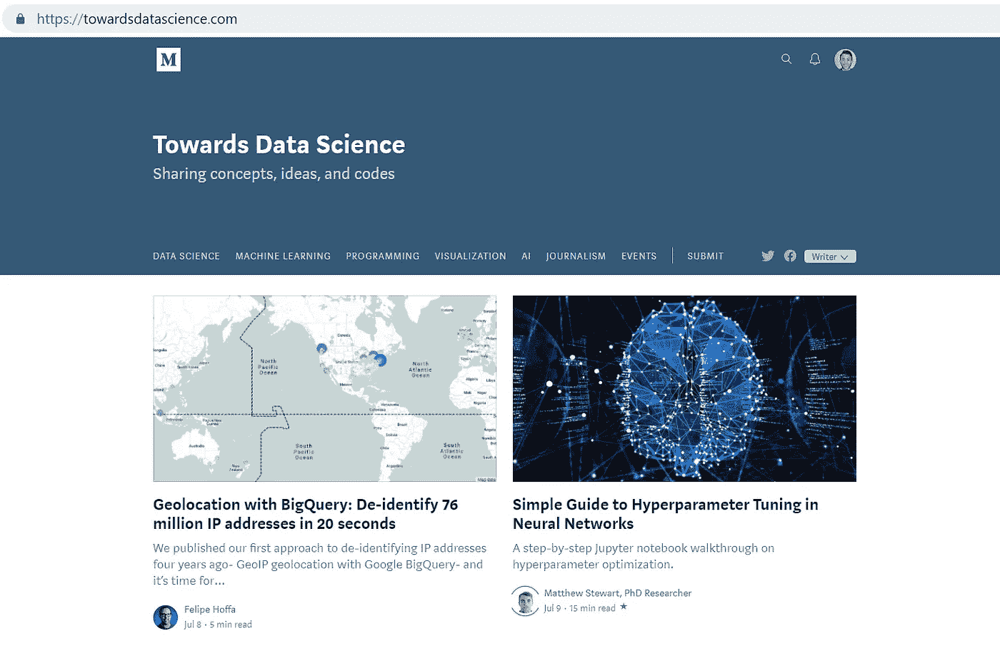
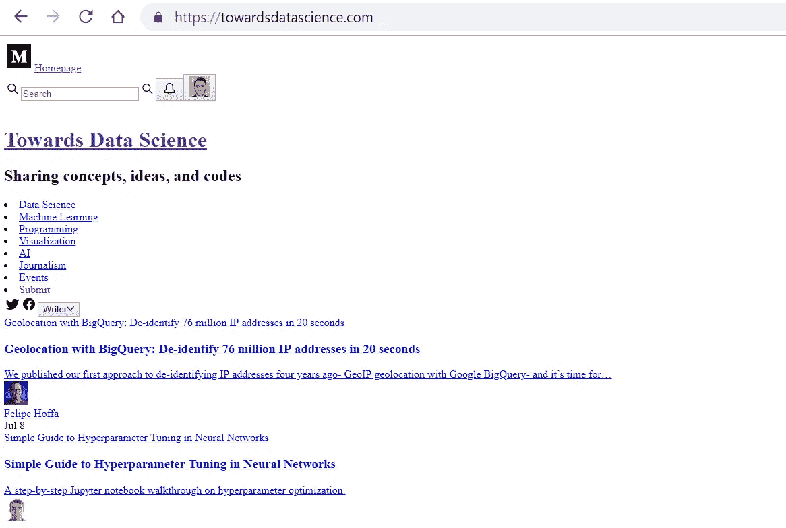
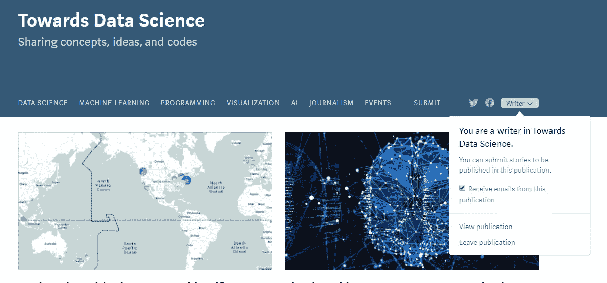
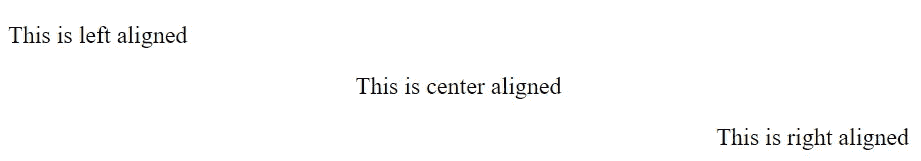
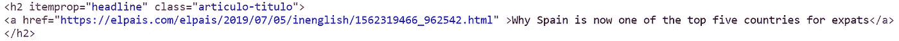
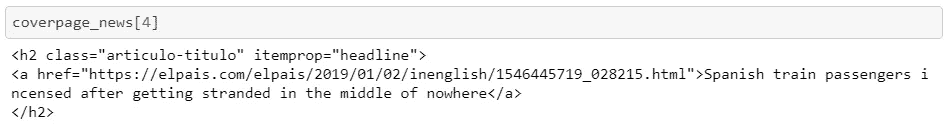

# Python 中的 Web 抓取新闻文章

> 原文：<https://towardsdatascience.com/web-scraping-news-articles-in-python-9dd605799558?source=collection_archive---------1----------------------->

## [一个端到端的机器学习项目](https://towardsdatascience.com/tagged/an-end-to-end-ml-project)

## 用 Python 构建 web 抓取应用程序变得简单


[Source](https://generalassemb.ly/coding/front-end-web-development/html)

本文是我将讲述开发一个机器学习项目的**整个过程**的系列文章的第二篇。如果你还没有读过第一本书，我强烈建议你读一读[这里](/text-classification-in-python-dd95d264c802)。

该项目包括创建一个**实时网络应用程序**，该应用程序从几家报纸收集数据，并显示新闻文章中讨论的不同主题的摘要。

这是通过能够预测给定新闻文章类别的监督机器学习**分类模型**，从报纸上获取最新新闻的 **web 抓取方法**，以及向用户显示所获得结果的交互式 **web 应用**来实现的。

正如我在本系列的第[篇](/text-classification-in-python-dd95d264c802)文章中解释的那样，撰写这些文章背后的动机是，互联网上发表的许多关于数据科学和机器学习模型的文章或内容、书籍或文献都专注于使用训练数据进行建模的部分。然而，机器学习项目不仅仅是这样:一旦你有了一个训练好的模型，你需要给它输入新的数据，更重要的是，你需要给最终用户提供有用的见解。

整个过程分为三个不同的岗位:

*   分类模型训练([环节](/text-classification-in-python-dd95d264c802))
*   新闻文章网络抓取(本帖)
*   应用创建和部署([链接](/deploying-a-text-classification-model-7ad2d23a556d)

github 回购可以在[这里](https://github.com/miguelfzafra/Latest-News-Classifier)找到。它包括所有的代码和一个完整的报告。

在[第一篇](/text-classification-in-python-dd95d264c802)文章中，我们用 Python 开发了**文本分类模型**，它允许我们获得某篇新闻文章文本，并以整体良好的准确性预测其类别。

这篇文章涵盖了第二部分:新闻文章网络抓取。我们将创建一个脚本，**从不同的报纸中抓取最新的新闻文章**并存储文本，这些文本将在以后被输入到模型中以获得其类别的预测。我们将在以下步骤中介绍它:

1.  网页和 HTML 简介
2.  用 Python 中的 BeautifulSoup 进行网页抓取

# 1.网页设计和 HTML 简介

如果我们想要能够从一个网站上提取新闻文章(或者，事实上，任何其他类型的文本)，第一步就是要知道一个网站*是如何工作的*。我们将以[走向数据科学](https://towardsdatascience.com)网页为例。

当我们将一个 *url* 插入网络浏览器(即谷歌 Chrome、火狐等……)并访问它时，我们看到的是**三种技术**的结合:

1.  HTML(超文本标记语言):它是向网站添加内容的标准语言。它允许我们插入文本，图像和其他东西到我们的网站。一句话，HTML 决定了一个网页的**内容**。
2.  CSS(层叠样式表):这种语言允许我们设置网站的视觉设计。这意味着，它决定了一个网页的**风格**。
3.  **JavaScript** : JavaScript 允许我们将内容和风格**交互**。

注意这三种都是编程语言。它们将允许我们创建和操作网页设计的各个方面。


然而，如果我们希望每个人都能在浏览器中访问一个网站，我们需要知道更多的事情:建立一个 web 服务器，使用某个域，等等。但是因为我们只对从网页中提取内容感兴趣，所以这对于今天来说已经足够了。

让我们用一个例子来说明这些概念。当我们访问[数据科学](http://www.towardsdatascience.com)主页时，我们会看到以下内容:



如果我们从网页上删除了 CSS 内容，我们会看到类似这样的内容:



如果我们禁用了 **JavaScript** ，我们将无法再使用这个弹出窗口:



此时，我会提出以下问题:

> “如果我想通过网页抓取来提取网页的内容，我需要在哪里查找？”

如果你的答案是 **HTML** 代码，那么你就完全明白了。在上面的例子中我们可以看到，禁用 CSS 后，内容(文本、图像等)仍然存在。

所以，在执行网页抓取方法之前的最后一步是理解一点 HTML 语言。

从一个非常基本的角度来看，HTML 是由具有属性的元素组成的。一个元素可以是一个段落，一个属性可以是这个段落是粗体的。

有许多不同类型的元素，每一种都有自己的属性。为了识别一个元素(举例来说，这意味着设置一些文本是标题还是段落)，我们使用**标签**。这些标签用 *< >* 符号表示(例如，一个 *< p >* 标签表示某个文本正在充当一个段落)。

例如，下面的 HTML 代码允许我们更改段落的对齐方式:



因此，当我们访问一个网站时，我们将能够在 HTML 代码中找到内容和属性。

一旦我们提出了这些概念，我们就准备好进行网络抓取了！

# 2.用 Python 中的 BeautifulSoup 进行网页抓取

Python 中有几个包允许我们从网页中抓取信息。其中最常见的就是 **BeautifulSoup** 。官方的包装信息可以在[这里](https://www.crummy.com/software/BeautifulSoup/bs4/doc/)找到。

BeautifulSoup 允许我们解析给定 URL 的 HTML 内容，并通过用标签和属性标识元素来访问它们。为此，我们将使用它从网站中提取某些文本。

这是一个非常容易使用但功能强大的软件包。用几乎 3-5 行代码，我们将能够从互联网上提取任何我们想要的文本。

要安装它，请在您的 Python 发行版中键入以下代码:

```
! pip install beautifulsoup4
```

为了给 BeautifulSoup 提供任何页面的 HTML 代码，我们还需要导入`requests`模块。如果您的 python 发行版中尚未包含它，为了安装它，请键入:

```
! pip install requests
```

我们将使用`requests`模块从页面中获取 HTML 代码，然后使用 BeautifulSoup 包在其中导航。我们将学习使用两个足以完成我们任务的命令:

*   `find_all(element tag, attribute)`:它允许我们从一个介绍标签和属性的网页中定位任何 HTML 元素。该命令将定位相同类型的所有元素。为了只得到第一个，我们可以用`find()`来代替。
*   `get_text()`:一旦我们找到一个给定的元素，这个命令将允许我们提取里面的文本。

因此，在这一点上，我们需要做的是**浏览我们网页**的 HTML 代码(例如，在 Google Chrome 中我们需要进入网页，按下右键并转到*查看源代码*)和**定位我们想要抓取的元素**。一旦我们看到了源代码，我们可以简单地用 Ctrl+F 或 Cmd+F 进行搜索。

一旦我们确定了感兴趣的元素，我们将**用`requests`模块获得 HTML 代码**，用**模块提取这些元素**。

我们将以 [*国家报英文*](https://elpais.com/elpais/inenglish.html) 为例。我们将首先尝试从首页抓取新闻标题，然后从中提取文本。

一旦我们进入网站，我们需要检查 HTML 代码来定位新闻文章。快速浏览后，我们可以看到 frontpage 中的每篇文章都是这样一个元素:



标题是一个带有`itemprop=”headline"`和`class=”articulo-titulo"`属性的`<h2>`(标题-2)元素。它有一个包含文本的`href`属性的`<a>`元素。因此，为了提取文本，我们需要编写以下命令:

```
***# importing the necessary packages*** import requests
from bs4 import BeautifulSoup
```

使用`requests`模块，我们可以获取 HTML 内容并保存到`coverpage`变量中:

```
r1 = requests.get(url)
coverpage = r1.content
```

接下来，我们需要创建一个 *soup* 来让 BeautifulSoup 工作:

```
soup1 = BeautifulSoup(coverpage, 'html5lib')
```

最后，我们可以找到我们正在寻找的元素:

```
coverpage_news = soup1.find_all('h2', class_='articulo-titulo')
```

这将返回一个列表，其中每个元素都是一篇新闻文章(因为使用`find_all`我们将获得所有出现的内容):



如果我们编写以下命令，我们将能够提取文本:

```
coverpage_news[4].get_text()
```

如果我们想要访问一个属性的值(在本例中是链接)，我们可以键入以下内容:

```
coverpage_news[4]['href']
```

我们会得到纯文本的链接。

如果你已经理解了这一点，你就可以在网上搜集任何你想要的内容。

下一步是用`href`属性访问每篇新闻文章的内容，再次获取源代码，并在 HTML 代码中找到段落，最终用 BeautifulSoup 获取它们。这与之前的想法相同，但是我们需要定位标识新闻文章内容的标签和属性。

完整过程的代码如下。我将展示代码，但不会像以前一样输入相同的细节，因为这是完全相同的想法。

```
***# Scraping the first 5 articles***number_of_articles = 5***# Empty lists for content, links and titles*** news_contents = []
list_links = []
list_titles = []

for n in np.arange(0, number_of_articles):

 ***# only news articles (there are also albums and other things)***    if "inenglish" not in coverpage_news[n].find('a')['href']:  
        continue

 ***# Getting the link of the article***    link = coverpage_news[n].find('a')['href']
    list_links.append(link)

 ***# Getting the title***    title = coverpage_news[n].find('a').get_text()
    list_titles.append(title)

 ***# Reading the content (it is divided in paragraphs)***    article = requests.get(link)
    article_content = article.content
    soup_article = BeautifulSoup(article_content, 'html5lib')
    body = soup_article.find_all('div', class_='articulo-cuerpo')
    x = body[0].find_all('p')

 ***# Unifying the paragraphs***    list_paragraphs = []
    for p in np.arange(0, len(x)):
        paragraph = x[p].get_text()
        list_paragraphs.append(paragraph)
        final_article = " ".join(list_paragraphs)

    news_contents.append(final_article)
```

所有的细节都可以在我的 github [repo](https://github.com/miguelfzafra/Latest-News-Classifier) 中找到。

值得一提的是，该代码仅**对该网页** **有用，尤其是**。如果我们想再刮一个，我们**应该期望**元素用**不同的标签和属性**识别。但是一旦我们知道如何识别它们，过程就完全一样了。

此时，我们能够提取不同新闻文章的内容。最后一步是应用我们在[第一篇帖子](/text-classification-in-python-dd95d264c802)中训练的机器学习模型来预测其类别并向用户显示总结。这将在本系列的最后一篇文章中介绍。