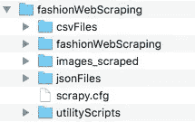
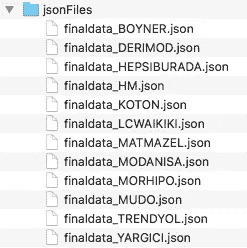
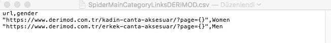
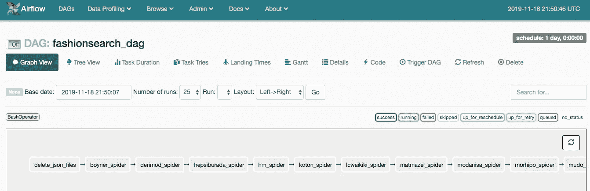
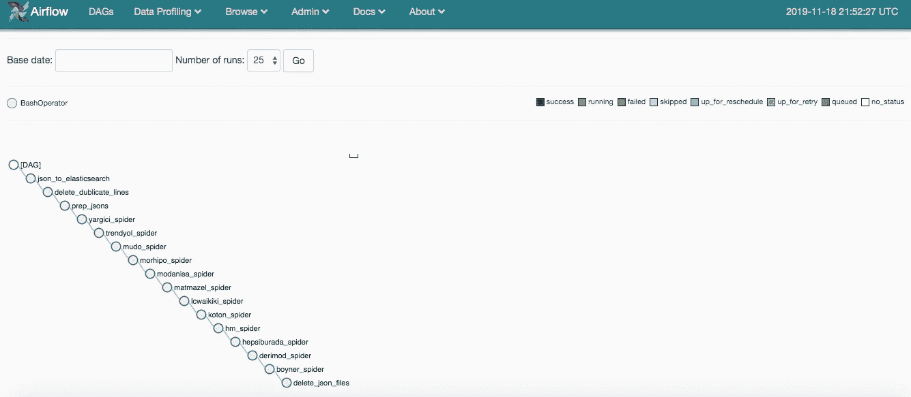

# 使用 Python 和 Scrapy 在 30 分钟内抓取 10 家在线商店的网页

> 原文：<https://towardsdatascience.com/web-scraping-of-10-online-shops-in-30-minutes-with-python-and-scrapy-a7f66e42446d?source=collection_archive---------7----------------------->

获取启动应用程序项目所需的源数据


Photo by [NEW DATA SERVICES](https://unsplash.com/@new_data_services?utm_source=medium&utm_medium=referral) on [Unsplash](https://unsplash.com?utm_source=medium&utm_medium=referral)

*   你是一个全栈开发者
*   你想开发一个奇妙的网络应用程序
*   你充满动力，全身心地投入到你的项目中

即使您勾选了上面的框，在编写一行代码之前，您仍然需要一个领域相关的数据集。这是因为现代应用程序同时或成批处理大量数据，为用户提供价值。

在这篇文章中，我将解释我生成这样一个数据集的工作流程。你将会看到我是如何在没有任何人工干预的情况下处理许多网站的自动抓取的。

我的目标是为一个**价格比较 WebApp** 生成一个数据集。我将使用的产品类别是手提袋。对于这样的应用程序，应该每天从不同的在线卖家那里收集手袋的产品和价格信息。虽然有些卖家提供了一个 API 供你访问所需的信息，但并不是所有的卖家都遵循同样的途径。所以，web 报废是不可避免的！

在整个例子中，我将使用 **Python** 和 **Scrapy** 为 10 个不同的卖家生成网络蜘蛛。然后，我将使用 **Apache Airflow** 自动执行这个过程，这样就不需要人工干预来定期执行整个过程。

# 源代码和现场演示 Web 应用程序

你可以在我的 [GitHub 资源库](https://github.com/eisbilen/FashionSearch)中找到所有相关的源代码。你也可以[访问实时网络应用](https://fashionsearch-2cab5.web.app/)，它使用了这个网络废弃项目提供的数据。


Photo by [Waldemar Brandt](https://unsplash.com/@waldemarbrandt67w?utm_source=medium&utm_medium=referral) on [Unsplash](https://unsplash.com?utm_source=medium&utm_medium=referral)

# 我的网页抓取工作流程

在开始任何网页抓取项目之前，我们必须定义哪些网站将被纳入该项目。我决定覆盖土耳其手提袋类的 10 个访问量最大的网上商店。你可以在我的 GitHub 库中看到它们[。](https://github.com/eisbilen/FashionSearch)

# 步骤 1:安装 Scrapy 并设置项目文件夹

你必须将 Scrapy 安装到你的电脑中，并在创建 Scrapy 蜘蛛之前生成一个 Scrapy 项目。请看看下面的帖子了解更多信息。

[](/fuel-up-the-deep-learning-custom-dataset-creation-with-web-scraping-ba0f44414cf7) [## 为深度学习加油:通过网络抓取创建自定义数据集

### 使用 Scrapy 和 Python 创建深度学习数据集。

towardsdatascience.com](/fuel-up-the-deep-learning-custom-dataset-creation-with-web-scraping-ba0f44414cf7) 

```
**#install the scrapy**
$ pip install scrapy**#install the image for downloading the product images**
$ pip install image**#start web scraping project with scraps**
$ scrapy startproject **fashionWebScraping**
$ cd **fashionWebScraping**
$ ls**#create project folders which are explained below**
$ mkdir csvFiles
$ mkdir images_scraped
$ mkdir jsonFiles
$ mkdir utilityScripts
```

**项目文件夹和文件**



The folder structure of the project

我在本地计算机上创建了一个文件夹结构，将项目文件整齐地放入不同的文件夹中。

**【CSV files】**文件夹包含每个网站抓取的 CSV 文件。蜘蛛将从这些 CSV 文件中读取“起始 URL”来启动抓取，因为我不想在蜘蛛中硬编码它们。

**‘fashion web scraping’**文件夹包含了 Scrapy 蜘蛛和助手脚本，如**‘settings . py’**，**‘item . py’**，**‘pipelines . py’**。我们必须修改一些零碎的助手脚本来成功地执行抓取过程。

刮下的产品图片将保存在**‘images _ scraped’**文件夹中。



在抓取网页的过程中，所有的产品信息，如价格、名称、产品链接和图片链接都将存储在**‘JSON files’**文件夹中的 JSON 文件中。

将有实用程序脚本来执行一些任务，如:

*   **'deldub.py'** 检测并删除报废结束后 JSON 文件中重复的产品信息。
*   **'jsonPrep.py'** 是另一个实用程序脚本，用于在报废结束后检测并删除 JSON 文件中的空行项目。
*   **'deleteFiles.py'** 删除前一次报废时生成的所有 JSON 文件。
*   **' JSON tos . py '**通过读取 JSON 文件，在远程位置填充 ElasticSearch 集群。这是提供实时全文搜索体验所必需的。
*   **'sitemap_gen.py'** 用于生成涵盖所有产品链接的站点地图。

# 步骤 2:了解特定网站的 URL 结构，并填充 CSV 文件以启动 URL

创建项目文件夹后，下一步是用我们想要抓取的每个网站的起始 URL 填充 CSV 文件。

几乎每个电子商务网站都提供分页功能，让用户浏览产品列表。每次导航到下一页时，URL 中的 page 参数都会增加。请参见下面的示例 URL，其中使用了“page”参数。

```
[https://www.derimod.com.tr/kadin-canta-aksesuar/?page=1](https://www.derimod.com.tr/kadin-canta-aksesuar/?p=1)
```

我将使用`{}`占位符，这样我们可以通过增加“page”的值来迭代 URL。我还将使用 CSV 文件中的“性别”列来定义特定 URL 的性别类别。

因此，最终的 CSV 文件将如下所示:



同样的原则也适用于项目中的其他网站。你可以在我的 GitHub 库中找到填充的 CSV 文件。

# 步骤 3:修改“项目. py”和“设置. py”

要开始抓取，我们必须修改“items.py”来定义用于存储抓取数据的“item objects”。

> 为了定义通用的输出数据格式，Scrapy 提供了`[***Item***](https://docs.scrapy.org/en/latest/topics/items.html#scrapy.item.Item)`类。`[***Item***](https://docs.scrapy.org/en/latest/topics/items.html#scrapy.item.Item)`对象是用来收集抓取数据的简单容器。它们提供了一个类似于[字典的](https://docs.python.org/2/library/stdtypes.html#dict) API，用一种方便的语法来声明它们的可用字段。
> 
> 【scrapy.org】*出自*[](https://docs.scrapy.org/en/latest/topics/items.html)

```
***#items.py in fashionWebScraping folder**
import scrapy
from scrapy.item import Item, Fieldclass FashionwebscrapingItem(scrapy.Item):

 **#product related items, such as id,name,price**
 gender=Field()
 productId=Field()
 productName=Field()
 priceOriginal=Field()
 priceSale=Field()**#items to store links**
 imageLink = Field()
 productLink=Field()**#item for company name**
 company = Field()passclass ImgData(Item):**#image pipline items to download product images**
 image_urls=scrapy.Field()
 images=scrapy.Field()*
```

*然后我们要修改‘settings . py’。这是定制图像管道和蜘蛛行为所必需的。*

> *Scrapy [设置](https://docs.scrapy.org/en/latest/topics/settings.html)允许你定制所有 Scrapy 组件的行为，包括核心、扩展、管道和蜘蛛本身。*
> 
> ****出自***[【scrapy.org】](https://docs.scrapy.org/en/latest/topics/settings.html)*

```
****# settings.py in fashionWebScraping folder
# Scrapy settings for fashionWebScraping project****# For simplicity, this file contains only settings considered important or commonly used. You can find more settings consulting the documentation:****#** [**https://doc.scrapy.org/en/latest/topics/settings.html**](https://doc.scrapy.org/en/latest/topics/settings.html) **#** [**https://doc.scrapy.org/en/latest/topics/downloader-middleware.html**](https://doc.scrapy.org/en/latest/topics/downloader-middleware.html) **#** [**https://doc.scrapy.org/en/latest/topics/spider-middleware.html**](https://doc.scrapy.org/en/latest/topics/spider-middleware.html)BOT_NAME = 'fashionWebScraping'
SPIDER_MODULES = ['fashionWebScraping.spiders']
NEWSPIDER_MODULE = 'fashionWebScraping.spiders'**# Crawl responsibly by identifying yourself (and your website) on the user-agent**
USER_AGENT = 'fashionWebScraping'**# Obey robots.txt rules**
ROBOTSTXT_OBEY = True**# See** [**https://doc.scrapy.org/en/latest/topics/settings.html**](https://doc.scrapy.org/en/latest/topics/settings.html) **# download-delay
# See also autothrottle settings and docs
# This to avoid hitting servers too hard** DOWNLOAD_DELAY = 1**# Override the default request headers:** DEFAULT_REQUEST_HEADERS = {
'Accept': 'text/html,application/xhtml+xml,application/xml;q=0.9,*/*;q=0.8',
'Accept-Language': 'tr',
}**# Configure item pipelines
# See** [**https://doc.scrapy.org/en/latest/topics/item-pipeline.html**](https://doc.scrapy.org/en/latest/topics/item-pipeline.html)ITEM_PIPELINES = {'scrapy.pipelines.images.ImagesPipeline': 1}IMAGES_STORE = '/Users/erdemisbilen/Angular/fashionWebScraping/images_scraped'**
```

**“item.py”和“settings.py”对我们项目中的所有蜘蛛都有效。**

****

**Photo by [Nguyen Bui](https://unsplash.com/@renichinguyen?utm_source=medium&utm_medium=referral) on [Unsplash](https://unsplash.com?utm_source=medium&utm_medium=referral)**

# **第四步:构建蜘蛛**

> **[Scrapy spider](https://docs.scrapy.org/en/latest/topics/spiders.html)是定义如何抓取某个站点(或一组站点)的类，包括如何执行抓取(即跟随链接)以及如何从页面中提取结构化数据(即抓取项目)。换句话说，蜘蛛是为特定站点(或者，在某些情况下，一组站点)定义抓取和解析页面的自定义行为的地方。**
> 
> *****出自***[***scrapy.org***](https://docs.scrapy.org/en/latest/topics/spiders.html)**

```
****fashionWebScraping $** scrapy genspider fashionBOYNER boyner.com
*Created spider ‘fashionBOYNER’ using template ‘basic’ in module:
fashionWebScraping.spiders.fashionBOYNER***
```

**上面的 shell 命令创建了一个空的蜘蛛文件。让我们将代码写入我们的***fashion boyner . py***文件:**

```
****# 'fashionBOYNER.py' in fashionWebScraping/Spiders folder****# import scrapy and scrapy items**
import scrapy
from fashionWebScraping.items import FashionwebscrapingItem
from fashionWebScraping.items import ImgData
from scrapy.http import Request**# To read from a csv file**
import csvclass FashionboynerSpider(scrapy.Spider):
 name = 'fashionBOYNER'
 allowed_domains = ['BOYNER.com']
 start_urls = ['http://BOYNER.com/']**# This function helps us to scrape the whole content of the website
 # by following the starting URLs in a csv file.**def start_requests(self):**# Read main category URLs from a csv file**with open ("/Users/erdemisbilen/Angular/fashionWebScraping/
  csvFiles/SpiderMainCategoryLinksBOYNER.csv", "rU") as f:

    reader=csv.DictReader(f)for row in reader:
      url=row['url']**# Change the page value incrementally to navigate through
      the product list
      # You can play with the range value according to maximum  
      product quantity, 30 pages to scrape as default**
      link_urls = [url.format(i) for i in range(1,30)]for link_url in link_urls:
        print(link_url)**# Pass the each link containing products to 
        parse_ product_pages function with the gender metadata**request=Request(link_url, callback=self.parse_product_pages,
        meta={'gender': row['gender']})yield request**# This function scrapes the page with the help of xpath provided**
 def parse_product_pages(self,response):

  item=FashionwebscrapingItem()

 **# Get the HTML block where all the products are listed
  # <div> HTML element with the "product-list-item" class name**content=response.xpath('//div[starts-with(@class,"product-list-
  item")]')**# loop through the each <div> element in the content**
  for product_content in content:image_urls = []**# get the product details and populate the items**
   item['productId']=product_content.xpath('.//a/@data
   -id').extract_first()item['productName']=product_content.xpath('.//img/@title').
   extract_first()item['priceSale']=product_content.xpath('.//ins[@class=
   "price-payable"]/text()').extract_first()item['priceOriginal']=product_content.xpath('.//del[@class=
   "price-psfx"]/text()').extract_first()if item['priceOriginal']==None:
    item['priceOriginal']=item['priceSale']item['imageLink']=product_content.xpath('.//img/
   @data-original').extract_first()

   item['productLink']="https://www.boyner.com.tr"+
   product_content.xpath('.//a/@href').extract_first()image_urls.append(item['imageLink'])item['company']="BOYNER"
   item['gender']=response.meta['gender']if item['productId']==None:
    breakyield (item)**# download the image contained in image_urls**
   yield ImgData(image_urls=image_urls)def parse(self, response):
  pass**
```

**我们的蜘蛛类包含两个函数，分别是' **start_requests** 和' **parse_product_pages** '。**

**在' **start_requests** '函数中，我们从已经生成的特定 CSV 文件中读取，以获得起始 URL 信息。然后我们迭代占位符`{}`来将产品页面的 URL 传递给‘parse _ product _ pages’函数。**

**我们还可以使用“meta={'gender': row['gender']} '参数将“gender”元数据传递给“Request”方法中的“parse_product_pages”函数。**

**在' **parse_product_pages** '函数中，我们执行实际的 web 抓取，并用抓取的数据填充 Scrapy 条目。**

**我使用 Xpath 来定位网页上包含产品信息的 HTML 部分。**

**下面的第一个 Xpath 表达式从被废弃的当前页面中提取整个产品列表。所有必需的产品信息都包含在“content”的“div”元素中。**

```
****#  // Selects nodes in the document from the current node that matches the selection no matter where they are****# '//div[starts-with(@class,"product-list-item")]' selects the all div elements which has class value start**content = response.xpath('//div[starts-with(@class,"product-list-item")]')**
```

**我们需要在“内容”中循环访问各个产品，并将它们存储在 Scrapy 项目中。借助 XPath 表达式，我们可以很容易地在“内容”中找到所需的 HTML 元素。**

```
****# loop through the each <div> element in the content**
  for product_content in content:image_urls = []**# get the product details and populate the items

   # ('.//a/@data-id') extracts 'data-id' value of <a> element
   inside the product_content** item['productId']=product_content.xpath('.//a/@data
   -id').extract_first()**# ('.//img/@title') extracts 'title' value of  element
   inside the product_content**   
   item['productName']=product_content.xpath('.//img/@title').
   extract_first()**# ('.//ins[@class= "price-payable"]/text()') extracts text value
   of <ins> element which has 'price-payable' class attribute inside
   the product_content **  
   item['priceSale']=product_content.xpath('.//ins[@class=
   "price-payable"]/text()').extract_first()**# ('.//del[@class="price-psfx"]/text()') extracts text value
   of <del> element which has 'price-psfx' class attribute inside
   the product_content**
   item['priceOriginal']=product_content.xpath('.//del[@class=
   "price-psfx"]/text()').extract_first()if item['priceOriginal']==None:
     item['priceOriginal']=item['priceSale']**# ('.//img/@data-original') extracts 'data-original' value of
    element inside the product_content**
   item['imageLink']=product_content.xpath('.//img/
   @data-original').extract_first()**# ('.//a/@href') extracts 'href' value of
   <a> element inside the product_content
**   item['productLink']="https://www.boyner.com.tr"+
   product_content.xpath('.//a/@href').extract_first()**# assigns the product image link into the 'image_urls' which is
   defined in the image pipeline**
   image_urls.append(item['imageLink'])item['company']="BOYNER"
   item['gender']=response.meta['gender']if item['productId']==None:
    breakyield (item)

   **# download the image contained in image_urls**
   yield ImgData(image_urls=image_urls)**
```

**同样的原则也适用于其他网站。你可以在我的 GitHub 库里看到[所有 10 个蜘蛛的代码。](https://github.com/eisbilen/FashionSearch/tree/master/fashionWebScraping/spiders)**

****

**Photo by [Tim Mossholder](https://unsplash.com/@timmossholder?utm_source=medium&utm_medium=referral) on [Unsplash](https://unsplash.com?utm_source=medium&utm_medium=referral)**

# **第五步:运行蜘蛛并将抓取的数据存储在 JSON 文件中**

**在抓取过程中，每个产品项目都存储在一个 JSON 文件中。每个网站都有一个特定的 JSON 文件，其中填充了每次蜘蛛运行的数据。**

```
****fashionWebScraping $** scrapy crawl -o rawdata_BOYNER.json -t jsonlines fashionBOYNER**
```

**使用 **jsonlines** 格式比 **JSON** 格式更节省内存，尤其是当你在一个会话中抓取大量网页时。**

**请注意，JSON 文件名以“rawdata”开头，这表示下一步是在我们的应用程序中使用废弃的原始数据之前检查和验证它们。**

# **步骤 6:清理和验证 JSON 文件中的抓取数据**

**在废弃过程结束后，在应用程序中使用它们之前，您可能需要从 JSON 文件中删除一些行项目。**

**您可能有包含空字段或重复值的行项目。这两种情况都需要一个我用 **'jsonPrep.py'** 和 **'deldub.py '处理的修正过程。****

****'jsonPrep.py'** 查找具有空值的行项目，并在检测到时删除它们。您可以在下面找到带有解释的代码:**

```
**# **‘jsonPrep.py’ in fashionWebScraping/utilityScripts folder**
import json
import sys
from collections import OrderedDict
import csv
import os**# Reads from jsonFiles.csv file for the names and locations of all json files need to be validated** 
with open("/Users/erdemisbilen/Angular/fashionWebScraping/csvFiles/ jsonFiles.csv", "rU") as f:reader=csv.DictReader(f)**# Iterates the json files listed in jsonFiles.csv**
 for row in reader:

 ** # Reads from jsonFiles.csv file for jsonFile_raw column**
  jsonFile=row['jsonFile_raw']**# Opens the jsonFile**
   with open(jsonFile) as json_file:
    data = []
    i = 0seen = OrderedDict()

    **# Iterates in the rows of json file**
    for d in json_file:
     seen = json.loads(d)**# Do not include the line item if the product Id is null
**     try:
      if seen["productId"] != None:
       for key, value in seen.items():
        print("ok")
        i = i + 1
        data.append(json.loads(d))

     except KeyError:
      print("nok")

    print (i)

    baseFileName=os.path.splitext(jsonFile)[0]**# Write the result as a json file by reading filename from the
    'file_name_prep' column** with open('/Users/erdemisbilen/Angular/fashionWebScraping/
    jsonFiles/'+row['file_name_prep'], 'w') as out:json.dump(data, out)**
```

**删除空行项目后，结果将保存到“jsonFiles”项目文件夹中，文件名以“prepdata”开头。**

****'deldub.py'** 查找重复的行项目，并在检测到时删除它们。您可以在下面找到带有解释的代码:**

```
****# 'deldub.py' in fashionWebScraping/utilityScripts folder**
import json
import sys
from collections import OrderedDict
import csv
import os**# Reads from jsonFiles.csv file for the names and locations of all json files need to be validated for dublicate lines**with open("/Users/erdemisbilen/Angular/fashionWebScraping/csvFiles/ jsonFiles.csv", newline=None) as f:

 reader=csv.DictReader(f)**# Iterates the json files listed in jsonFiles.csv**
 for row in reader:**# Reads from jsonFiles.csv file for jsonFile_raw column**
  jsonFile=row['jsonFile_prep']**# Opens the jsonFile**
  with open(jsonFile) as json_file:
   data = json.load(json_file)seen = OrderedDict()
   dubs = OrderedDict()**# Iterates in the rows of json file**
   for d in data:
    oid = d["productId"]**# Don't include the item if the product Id has dublicate value**
    if oid not in seen:
     seen[oid] = delse:
     dubs[oid]=dbaseFileName=os.path.splitext(jsonFile)[0]**# Write the result as a json file by reading filename from the
     'file_name_final' column**with open('/Users/erdemisbilen/Angular/fashionWebScraping/
     jsonFiles/'+row['file_name_final'], 'w') as out:
      json.dump(list(seen.values()), out)with open('/Users/erdemisbilen/Angular/fashionWebScraping/
     jsonFiles/'+'DELETED'+row['file_name_final'], 'w') as out:
      json.dump(list(dubs.values()), out)**
```

**删除重复的行项目后，将结果保存到“jsonFiles”项目文件夹中，文件名以“finaldata”开头。**

****

**Photo by [James Pond](https://unsplash.com/@jamesponddotco?utm_source=medium&utm_medium=referral) on [Unsplash](https://unsplash.com?utm_source=medium&utm_medium=referral)**

# **使用 Apache Airflow 自动执行完整的刮擦工作流程**

**一旦我们定义了刮擦过程，我们就可以进入工作流自动化。我将使用 **Apache Airflow，**它是由 **Airbnb 开发的基于 Python 的工作流自动化工具。****

**我将提供安装和配置 Apache Airflow 的终端命令，你可以参考我下面的帖子了解更多细节。**

**[](https://medium.com/swlh/my-deep-learning-journey-from-experimentation-to-production-844cb271a476) [## 我的深度学习之旅:从实验到生产

### 用 Apache Airflow 构建自动化机器学习管道

medium.com](https://medium.com/swlh/my-deep-learning-journey-from-experimentation-to-production-844cb271a476) 

```
$ python3 --version
Python 3.7.3$ virtualenv --version
15.2.0$ cd /path/to/my/airflow/workspace$ virtualenv -p `which python3` venv
$ source venv/bin/activate(venv) $ pip install apache-airflow
(venv) $ mkdir airflow_home
(venv) $ export AIRFLOW_HOME=`pwd`/airflow_home
(venv) $ airflow initdb
(venv) $ airflow webserver
```

**创建 DAG 文件**

> *在 Airflow 中，一个*`*DAG*`*——或者一个有向无环图——是你想要运行的所有任务的集合，以反映它们的关系和依赖性的方式组织。*
> 
> *例如，一个简单的 DAG 可以包含三个任务:A、B 和 C。它可以说 A 必须在 B 可以运行之前成功运行，但是 C 可以随时运行。它可以说任务 A 在 5 分钟后超时，B 在失败的情况下最多可以重启 5 次。它还可能会说工作流将在每晚 10 点运行，但不应该在某个特定日期开始。*

在 Python 文件中定义的 DAG 用于组织任务流。我们不会在 DAG 文件中定义实际的任务。

让我们创建一个 DAG 文件夹和一个空的 python 文件，开始用 Python 代码定义我们的工作流。

```
(venv) $ mkdir dags
```

Airflow 提供了几个运算符来描述 DAG 文件中的任务。下面我列出了常用的。

> `[***BashOperator***](http://airflow.apache.org/_api/airflow/operators/bash_operator/index.html#airflow.operators.bash_operator.BashOperator)` *-执行一个 bash 命令*
> 
> `[***PythonOperator***](http://airflow.apache.org/_api/airflow/operators/python_operator/index.html#airflow.operators.python_operator.PythonOperator)` *-调用任意的 Python 函数*
> 
> `[***EmailOperator***](http://airflow.apache.org/_api/airflow/operators/email_operator/index.html#airflow.operators.email_operator.EmailOperator)`*——发邮件*
> 
> `[***SimpleHttpOperator***](http://airflow.apache.org/_api/airflow/operators/http_operator/index.html#airflow.operators.http_operator.SimpleHttpOperator)`*——发送一个 HTTP 请求*
> 
> `***Sensor***` *-等待一定时间，文件，数据库行，S3 键等…*

我打算现在只使用**‘bash operator’**，因为我将使用 python 脚本完成我的所有任务。

由于我将使用**‘bash operator’，**有一个包含特定任务的所有命令的 bash 脚本来简化 dag 文件会很好。

[通过遵循本教程](https://www.taniarascia.com/how-to-create-and-use-bash-scripts/)，我为每个任务生成了 bash 脚本。你可以在[我的 Github 库](https://github.com/eisbilen/FashionSearch/tree/master/bin)中找到它们。

然后，我可以使用我创建的 bash 命令编写如下所示的 DAG 文件。有了下面的配置，我的任务将被安排和执行每天的基础上气流。您可以根据需要在 DAG 文件中更改开始日期或计划间隔。您可以进一步使用本地执行器或 celery 执行器来并行运行任务实例。由于我使用的是顺序执行器，这是最原始的执行器，所以我的所有任务实例都将顺序工作。

```
**# 'fashionsearch_dag.py' in Airflow dag folder**
import datetime as dt
from airflow import DAG
from airflow.operators.bash_operator import BashOperator
from datetime import datetime, timedeltadefault_args = {
'owner': 'airflow',
'depends_on_past': False,
'start_date': datetime(2019, 11, 23),
'retries': 1,
'retry_delay': timedelta(minutes=5),# 'queue': 'bash_queue',
# 'pool': 'backfill',
# 'priority_weight': 10,
# 'end_date': datetime(2016, 1, 1),
}dag = DAG(dag_id='fashionsearch_dag', default_args=default_args, schedule_interval=timedelta(days=1))**# This task deletes all json files which are generated in previous scraping sessions**
t1 = BashOperator(
task_id='delete_json_files',
bash_command='run_delete_files',
dag=dag)**# This task runs the spider for** [**www.boyner.com**](http://www.boyner.com) **# And populates the related json file with data scraped**
t2 = BashOperator(
task_id='boyner_spider',
bash_command='run_boyner_spider',
dag=dag)**# This task runs the spider for** [**www.derimod.com**](http://www.derimod.com) **# And populates the related json file with data scraped**
t3 = BashOperator(
task_id='derimod_spider',
bash_command='run_derimod_spider',
dag=dag)**# This task runs the spider for** [**www.hepsiburada.com**](http://www.hepsiburada.com) **# And populates the related json file with data scraped**
t4 = BashOperator(
task_id='hepsiburada_spider',
bash_command='run_hepsiburada_spider',
dag=dag)**# This task runs the spider for** [**www.hm.com**](http://www.hm.com) **# And populates the related json file with data scraped**
t5 = BashOperator(
task_id='hm_spider',
bash_command='run_hm_spider',
dag=dag)**# This task runs the spider for** [**www.koton.com**](http://www.koton.com) **# And populates the related json file with data scraped**
t6 = BashOperator(
task_id='koton_spider',
bash_command='run_koton_spider',
dag=dag)**# This task runs the spider for** [**www.lcwaikiki.com**](http://www.lcwaikiki.com) **# And populates the related json file with data scraped**
t7 = BashOperator(
task_id='lcwaikiki_spider',
bash_command='run_lcwaikiki_spider',
dag=dag)**# This task runs the spider for** [**www.matmazel.com**](http://www.matmazel.com) **# And populates the related json file with data scraped**
t8 = BashOperator(
task_id='matmazel_spider',
bash_command='run_matmazel_spider',
dag=dag)**# This task runs the spider for** [**www.modanisa.com**](http://www.modanisa.com) **# And populates the related json file with data scraped**
t9 = BashOperator(
task_id='modanisa_spider',
bash_command='run_modanisa_spider',
dag=dag)**# This task runs the spider for** [**www.morhipo.com**](http://www.morhipo.com) **# And populates the related json file with data scraped**
t10 = BashOperator(
task_id='morhipo_spider',
bash_command='run_morhipo_spider',
dag=dag)**# This task runs the spider for** [**www.mudo.com**](http://www.mudo.com) **# And populates the related json file with data scraped**
t11 = BashOperator(
task_id='mudo_spider',
bash_command='run_mudo_spider',
dag=dag)**# This task runs the spider for** [**www.trendyol.com**](http://www.trendyol.com) **# And populates the related json file with data scraped**
t12 = BashOperator(
task_id='trendyol_spider',
bash_command='run_trendyol_spider',
dag=dag)**# This task runs the spider for** [**www.yargici.com**](http://www.yargici.com) **# And populates the related json file with data scraped**
t13 = BashOperator(
task_id='yargici_spider',
bash_command='run_yargici_spider',
dag=dag)**# This task checks and removes null line items in json files**
t14 = BashOperator(
task_id='prep_jsons',
bash_command='run_prep_jsons',
dag=dag)**# This task checks and removes dublicate line items in json files**
t15 = BashOperator(
task_id='delete_dublicate_lines',
bash_command='run_del_dub_lines',
dag=dag)**# This task populates the remote ES clusters with the data inside the JSON files**
t16 = BashOperator(
task_id='json_to_elasticsearch',
bash_command='run_json_to_es',
dag=dag)**# With sequential executer, all tasks depends on previous task
# No paralell task execution is possible
# Use local executer at least for paralell task execution**t1 >> t2 >> t3 >> t4 >> t5 >> t6 >> t7 >> t8 >> t9 >> t10 >> t11 >> t12 >> t13 >> t14 >> t15 >> t16
```

要启动 DAG 工作流，我们需要运行气流调度程序。这将使用*‘air flow . CFG’*文件中指定的配置执行调度程序。Scheduler 监控位于“dags”文件夹中的每个 DAG 中的每个任务，并在满足依赖关系时触发任务的执行。

```
(venv) $ airflow scheduler
```

一旦我们运行了气流调度程序，我们就可以通过在浏览器上访问[http://0 . 0 . 0:8080](http://0.0.0.0:8080)来查看我们的任务状态。Airflow 提供了一个用户界面，我们可以在其中查看和跟踪我们计划的 Dag。



AirFlow Dag Graph View



AirFlow Dag Tree View

# 结论

我试着从头到尾向你展示我的网页抓取工作流程。

希望这能帮助你掌握 web 报废和工作流自动化的基础知识。

查看我的新文章，了解我如何使用 Web scrapping 和自然语言处理来自动创建电子学习内容:

[](/how-to-automate-content-creation-process-for-e-learning-platform-852877fcd668) [## 如何自动化电子学习平台的内容创建流程

### 在 5 分钟内生成 2000 个问题

towardsdatascience.com](/how-to-automate-content-creation-process-for-e-learning-platform-852877fcd668)**