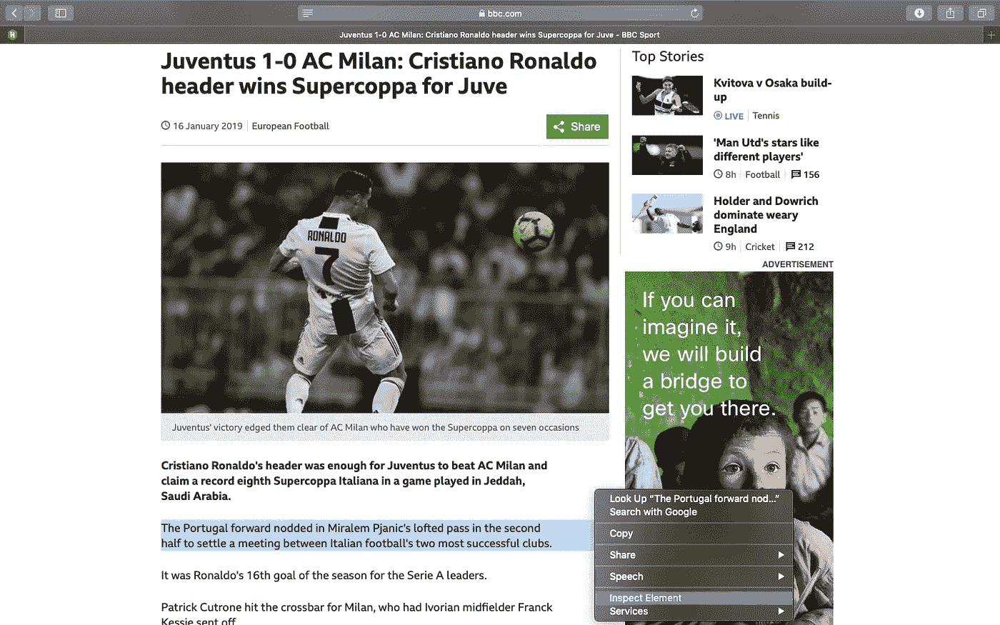
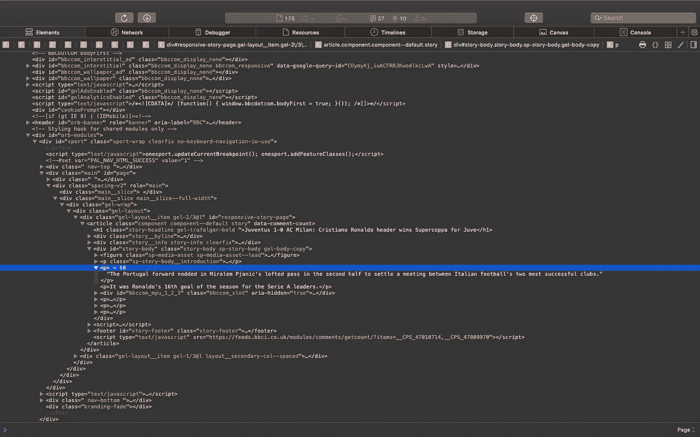
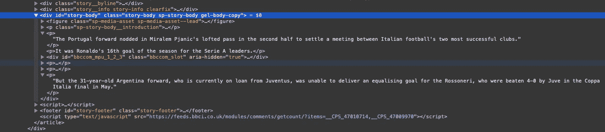

# 使用 Python 在 5 分钟内学会网络抓取

> 原文：<https://towardsdatascience.com/web-scraping-using-python-4cb2faade338?source=collection_archive---------2----------------------->


Figure 1: Image Source- [The Data School](https://www.thedataschool.co.uk/manuela-marolla/web-scraping-101-a-short-introduction/)

# 什么是网页抓取？

网页抓取是从网页中获取或提取想要的信息。

# 使用 BeautifulSoup 刮擦

对于网络抓取，我们将使用非常流行的 Python 库`BeautifulSoup`。对于网络抓取，你首先需要有一些关于 HTML 标签的基本知识。HTML 中使用的一些标签如下所示。

有关 HTML 标签的更多信息，请参考[https://www.w3schools.com/tags/](https://www.w3schools.com/tags/)。

# 入门指南

要开始使用 scraping，请确保您的系统上安装了 Python(第 3 版)和 BeautifulSoup。如果您没有安装 BeautifulSoup，那么只需在终端/命令提示符下键入以下命令-

```
pipinstallbeautifulsoup4
```

# 我们刮吧！

## 检查

抓取的第一步是选择你想要抓取数据的网站并检查它。在本教程中，我们将尝试从[BBC](https://www.bbc.com/sport/football/46897172)[上发表的这篇](https://www.bbc.com/sport)文章中搜集信息。

要检查网站，请右键单击页面上的任意位置，然后选择“检查元素”/“查看页面源代码”。要查看网页上特定实体(如文本或图像)的位置，请选择网页上的该部分，然后右键单击并选择“检查元素”/“查看页面源代码”。



Figure 2: Webpage to be scraped

检查完网页后，会弹出一个窗口，显示所选内容在网页 HTML 代码中的确切位置，如下所示。



Figure 3: HTML code of the webpage

因为我们的目标是提取文章的全部内容，所以记下包含文章全部文本的标签`<div>`是很重要的。现在让我们仔细看看网页，并识别出`<div>`标签。



Figure 4: HTML code showing the required tags

正如我们所看到的，`<div class=”story-body sp-story-body gel-body-copy”>`是我们正在寻找的标签。现在，我们已经得到了我们所需要的一切，所以让我们直接进入代码并做一些整理吧！

## 从语法上分析

现在我们可以开始解析网页，并使用`BeautifulSoup`搜索我们需要的特定元素。为了连接到网站并获取 HTML，我们将使用 Python 的`urllib`。让我们导入所需的库-

```
from urllib.request import urlopen
from bs4 import BeautifulSoup
```

获取网址-

```
url = "[https://www.bbc.com/sport/football/46897172](https://www.bbc.com/sport/football/46897172)"
```

连接到网站-

```
# We use try-except incase the request was unsuccessful because of 
# wrong URL
try:
   page = urlopen(url)
except:
   print("Error opening the URL")
```

创建一个 BeautifulSoup 对象用于解析-

```
soup = BeautifulSoup(page, 'html.parser')
```

## 提取所需的元素

我们现在使用 BeautifulSoup 的`soup.find()`方法来搜索包含我们感兴趣的文章文本的标签`<div class=”story-body sp-story-body gel-body-copy”>`。

```
content = soup.find('div', {"class": "story-body sp-story-body gel-      body-copy"})
```

我们现在遍历`content`来找到其中所有的`<p>`(段落)标签，从而得到文章的整个正文。

```
article = ''
for i in content.findAll('p'):
    article = article + ' ' +  i.text
```

## 保存解析的文本

我们可以将搜集到的信息保存在`.txt`或`.csv`文件中。

```
with open('scraped_text.txt', 'w') as file:
    file.write(article)
```

整个代码-

输出-

```
 Cristiano Ronaldo’s header was enough for Juventus to beat AC Milan and claim a record eighth Supercoppa Italiana in a game played in Jeddah, Saudi Arabia. The Portugal forward nodded in Miralem Pjanic’s lofted pass in the second half to settle a meeting between Italian football’s two most successful clubs. It was Ronaldo’s 16th goal of the season for the Serie A leaders. Patrick Cutrone hit the crossbar for Milan, who had Ivorian midfielder Franck Kessie sent off. Gonzalo Higuain, reportedly the subject of interest from Chelsea, was introduced as a substitute by Milan boss Gennaro Gattuso in Italy’s version of the Community Shield. But the 31-year-old Argentina forward, who is currently on loan from Juventus, was unable to deliver an equalising goal for the Rossoneri, who were beaten 4–0 by Juve in the Coppa Italia final in May.
```

# 结论

当您想要从多个来源收集数据以进行分析或研究时，Web 抓取非常有用。

BeautifulSoup 是一个优秀的网页抓取库，可用于小型项目，但对于大型项目，其他库如 Scrapy 更适合。

希望你已经理解了网页抓取的概念，现在可以根据你的需要从不同的网站抓取数据。

感谢阅读。刮的开心！😊