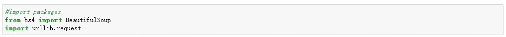
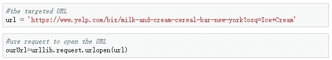
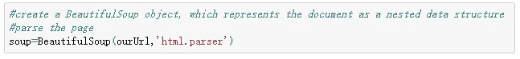
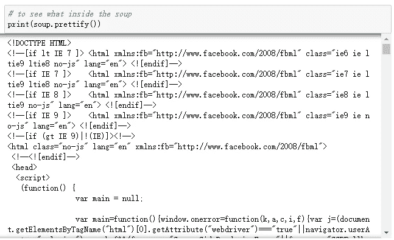
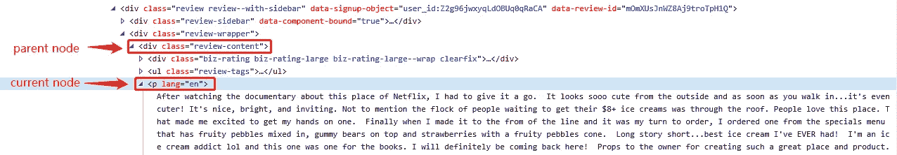
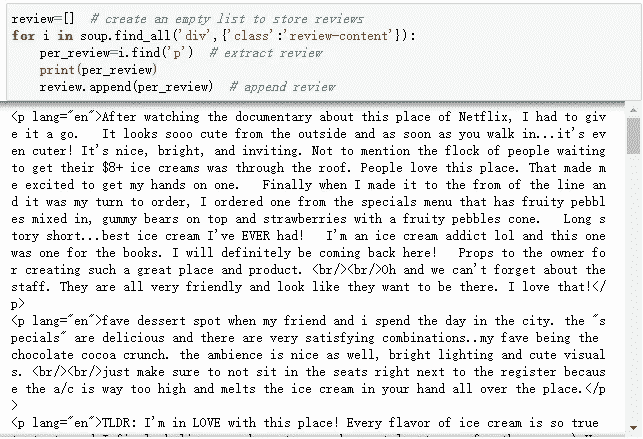
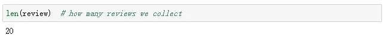
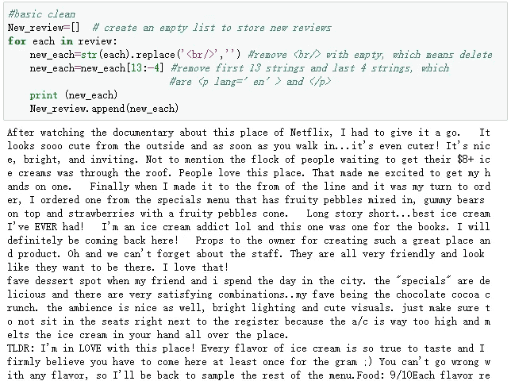

# 使用 Python 进行 Web 抓取:一步一步的指南

> 原文：<https://towardsdatascience.com/web-scraping-using-python-a-step-by-step-guide-36ca0fb87074?source=collection_archive---------15----------------------->

Photoed by [Heidi Sandstrom](https://unsplash.com/photos/iy_l7I-sD_0) on [Unsplash](https://unsplash.com/?utm_source=unsplash&utm_medium=referral&utm_content=creditCopyText)

从网站提取数据的需求正在增加。当我们进行与数据相关的项目时，如价格监控、商业分析或新闻聚合，我们总是需要记录来自网站的数据。但是，一行一行的复制粘贴数据已经过时了。在这篇文章中，我们将教你如何成为从网站中提取数据的“内部人员”，也就是用 python 做[网络搜集。](https://www.octoparse.com/blog/how-to-build-a-web-crawler-from-scratch-a-guide-for-beginners)

## **第 0 步:介绍**

Web 抓取是一种技术，可以帮助我们将 HTML 非结构化数据转换为电子表格或数据库中的结构化数据。除了使用 python 编写代码，使用 API 或[数据提取工具](https://www.octoparse.com/blog/top-30-free-web-scraping-software)如 [Octoparse](http://www.octoparse.com) 访问网站数据也是网络抓取的其他选择。

对于一些大型网站，如 Airbnb 或 Twitter，他们会为开发者提供 API 来访问他们的数据。API 代表应用程序编程接口，是两个应用程序相互通信的通道。对于大多数人来说，API 是从网站获取数据的最佳途径。

但是，大多数网站没有 API 服务。有时候即使他们提供了 API，你得到的数据也不是你想要的。因此，编写 python 脚本来构建网络爬虫成为另一种强大而灵活的解决方案。

**那么为什么要用 python 而不是其他语言呢？**

*   灵活性:众所周知，网站更新很快。不仅仅是内容，网站结构也会经常变化。Python 是一种易于使用的语言，因为它可以动态输入并且非常高效。因此，人们可以很容易地改变他们的代码，并跟上网络更新的速度。
*   **强大** : Python 拥有大量成熟的库。例如，请求，beautifulsoup4 可以帮助我们从网页中获取 URL 和信息。Selenium 通过赋予网络爬虫模仿人类浏览行为的能力，可以帮助我们避免一些反抓取技术。此外，re、numpy 和 pandas 可以帮助我们清理和处理数据。

现在让我们开始使用 Python 进行 web 抓取的旅程吧！

## **第一步:导入 Python 库**

在本教程中，我们将向你展示如何从 Yelp 上抓取评论。我们将使用两个库:bs4 中的 [BeautifulSoup](https://www.crummy.com/software/BeautifulSoup/bs4/doc/) 和 urllib 中的 [request](https://realpython.com/python-requests/) 。这两个库通常用于用 Python 构建网络爬虫。第一步是用 Python 导入这两个库，这样我们就可以使用这些库中的函数。

## **第二步:从网页中提取 HTML】**

我们需要从"[https://www . yelp . com/biz/milk-and-cream-麦片-酒吧-纽约？osq =冰淇淋+奶油](https://www.yelp.com/biz/milk-and-cream-cereal-bar-new-york?osq=Ice+Cream)”。首先，让我们将 URL 保存在一个名为 URL 的变量中。然后我们可以访问该网页上的内容，并通过使用请求中的 *urlopen()* 函数将 HTML 保存在“ourUrl”中。

然后我们应用漂亮的汤来解析页面。

现在我们有了“汤”，这是这个网站的原始 HTML，我们可以使用一个名为*pretify()*的函数来清理原始数据并打印出来，以查看“汤”中 HTML 的嵌套结构。

## **第三步:定位并抓取评论**

接下来，我们应该找到这个网页上的 HTML 评论，提取并存储它们。对于网页中的每个元素，它们总是有一个唯一的 HTML“ID”。为了检查他们的 ID，我们需要在网页上检查他们。

点击“Inspect element”(或“Inspect”，取决于不同的浏览器)，我们可以看到评论的 HTML。

在这种情况下，评论位于名为“p”的标签下。所以我们将首先使用名为 find_all()的函数来查找这些评论的父节点。然后在循环中定位父节点下带有标签“p”的所有元素。找到所有“p”元素后，我们将它们存储在一个名为“review”的空列表中。

现在我们从那个页面得到所有的评论。看看我们提取了多少评论。

## **第四步:清理评论**

你一定注意到了，还有一些无用的文本，比如每次复习开始时的“ *< p lang='en' >* ”、复习中间的“*</>*”、每次复习结束时的“ *< /p >* ”。

* *代表单行符。我们不需要任何评论换行，所以我们需要删除它们。另外，" *< p lang='en' >* "和" *< /p >* "是 HTML 的开头和结尾，我们也需要删除它们。

最后，我们用不到 20 行代码成功地获得了所有干净的评论。

这只是一个从 Yelp 收集 20 条评论的演示。但在现实情况下，我们可能需要面对很多其他情况。例如，我们将需要分页等步骤，以转到其他页面，并提取该商店的其余评论。或者，我们还需要收集其他信息，如审核者姓名、审核者位置、审核时间、评分、签到……

为了实现上面的操作并获得更多的数据，我们需要学习更多的函数和库，比如 selenium 或正则表达式。花更多的时间研究网络抓取的挑战是很有趣的。

*原载于 2019 年 8 月 28 日*[*【https://www.octoparse.com】*](https://www.octoparse.com/blog/web-scraping-using-python)*。*