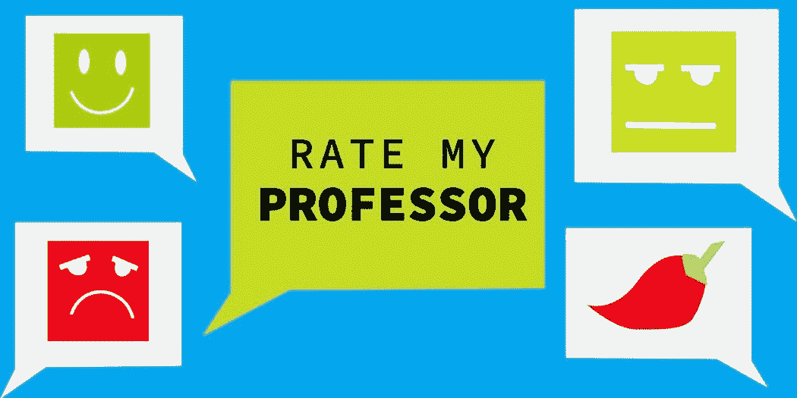
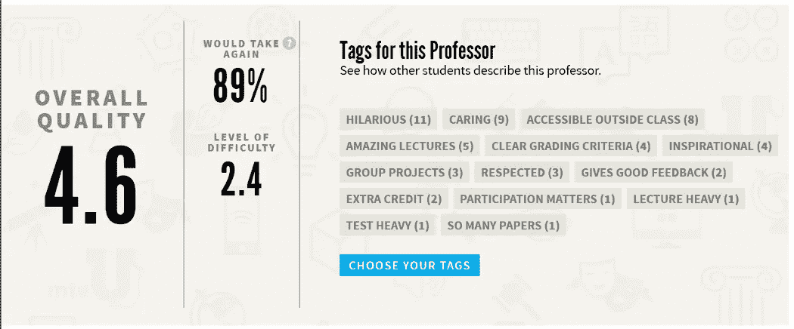
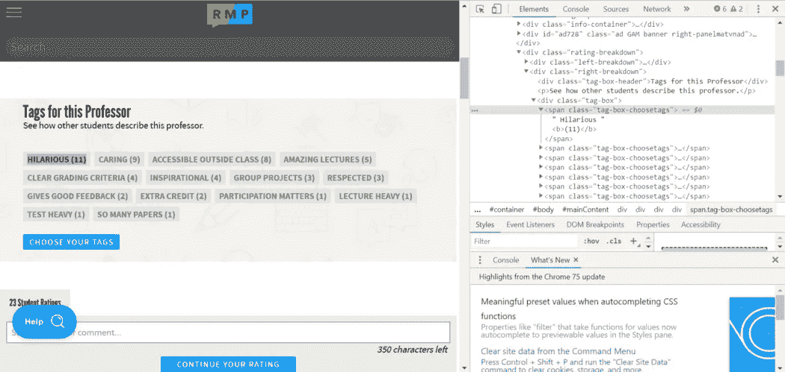

# 使用 Python 库的 Web 抓取。

> 原文：<https://towardsdatascience.com/web-scraping-using-python-libraries-fe3037152ed1?source=collection_archive---------8----------------------->

## 让我们使用 Python 从 web 中抓取数据。


Photo by [Sai Kiran Anagani](https://unsplash.com/@_imkiran?utm_source=unsplash&utm_medium=referral&utm_content=creditCopyText) on [Unsplash](https://unsplash.com/s/photos/websites?utm_source=unsplash&utm_medium=referral&utm_content=creditCopyText)

今天我们将清理“[评价我的教授](https://www.ratemyprofessors.com/?source=post_page---------------------------)的网站。关于我的教授网站的一点见解，这是一个包含学校，教授和大学评级的网站。你可以搜索任何教授或学校，并在参加他们的课程之前获得他们的评级。这是一个方便的功能，有助于更多地了解你的教授或你想加入的大学。在本教程中，我们将看到如何刮取和提取一个特定的教授的标签。我警告你们，这并不违法，但是从网站上收集大量数据会导致你的 IP 地址被封。只做一次或两次，但不要愚蠢地将它放在循环中，并试图将请求放在循环中。



Rate My Professor.

# 什么是网页抓取？

Web 抓取(也称为抓取、数据提取、数据收集等。)是一种用于从网站提取数据的技术。有时，网络抓取非常有用，我们可以直接从网络上获得我们想要的数据，但有时这是一种不好的方法，因为这就像是未经允许从网站上窃取宝贵的数据，但将你的抓取过程限制在一次或两次，这样可以避免你陷入麻烦。

**网页抓取所需的最有用的库是:**

1.  [美汤](https://www.crummy.com/software/BeautifulSoup/bs4/doc/?source=post_page---------------------------)。
2.  [请求](https://2.python-requests.org/en/master/?source=post_page---------------------------)。

# 这些是我们将在本教程中遵循的步骤:

1.  **导入所需的库。**
2.  **获取 URL 并将其存储在变量中。**
3.  **使用请求库向网站发出请求。**
4.  **使用美汤库从网站获取 HTML(原始)数据。**
5.  **使用 soup.findAll 方法获得我们正在寻找的受尊重的标签。**
6.  **移除所有的 HTML 标签并将其转换为纯文本格式。**

你可能想知道要提取什么标签，在 Rate My Professor 网站上，每个教授都会有他/她尊敬的标签，如(**滑稽、繁重的家庭作业、努力学习或失败等。我们将尝试在这些教程中添加这些标签，如下所示。**



在我们开始之前，请确保以较慢的速度收集数据，您也可以使用 VPN 服务来获得不同的 IP 地址，这可以防止您的 IP 地址被禁止，但我希望你们能够按照说明进行操作。这里有一篇 [**文章**](https://hackernoon.com/how-to-scrape-a-website-without-getting-blacklisted-271a605a0d94?source=post_page---------------------------) 会让你知道如何抓取一个网站而不被列入黑名单。本教程中重要的一点是，我没有必要解释每一行代码，这里也不需要，因为 python 代码是不言自明的。不过，我会尽量不把你弄糊涂，用一种简单的方式把事情说清楚。所以我写了这个教程，这样每个人都可以理解，不管他们的编程背景如何。此外，完整的源代码可以在我的 [GitHub](https://github.com/Tanu-N-Prabhu/Python/blob/master/Data%20Scraping%20from%20the%20Web/Web_Scraping_Rate_My_Professor_Website.ipynb) 中找到。互联网上可能有很多教程，但这个教程很容易理解，因为我已经尽可能地解释了代码，有些部分是一个机械的过程，你只需要遵循它们，如果你有任何疑问，请在下面的评论部分告诉我。完整的源代码可以在下面给出的我的 [GitHub](https://github.com/Tanu-N-Prabhu/Python/blob/master/Data%20Scraping%20from%20the%20Web/Web_Scraping_Rate_My_Professor_Website.ipynb) 上找到。

[](https://github.com/Tanu-N-Prabhu/Python/blob/master/Data%20Scraping%20from%20the%20Web/Web_Scraping_Rate_My_Professor_Website.ipynb) [## 塔努-北帕布/Python

### 这个存储库帮助您从头开始理解 python。-塔努-北帕布/蟒蛇

github.com](https://github.com/Tanu-N-Prabhu/Python/blob/master/Data%20Scraping%20from%20the%20Web/Web_Scraping_Rate_My_Professor_Website.ipynb) 

## 让我们开始吧。

# 1.导入所需的库

让我们导入几个重要的库，比如 [Requests](https://2.python-requests.org/en/master?source=post_page---------------------------) 和 [BeautifulSoup](https://www.crummy.com/software/BeautifulSoup/bs4/doc/?source=post_page---------------------------) 。

```
import requests
from bs4 import BeautifulSoup
```

# 2.获取 URL 并将其存储在一个变量中。

让我们将教授的 URL 存储在名为“ **url** ”的变量中。网站的网址可以在这里找到:“ [**评我的教授**](https://www.ratemyprofessors.com/ShowRatings.jsp?tid=1986099&source=post_page---------------------------) ”。

```
url = ‘[https://www.ratemyprofessors.com/ShowRatings.jsp?tid=1986099'](https://www.ratemyprofessors.com/ShowRatings.jsp?tid=1986099')
```

# 3.使用请求库向网站发出请求。

这里我们通过传递“ **url** ”作为参数来使用请求库，注意不要多次运行。如果你得到像**响应 200** 那么它是成功的，如果你得到别的东西，那么可能是代码或你的浏览器有问题，我不知道。

```
page = requests.get(url)
page**<Response [200]>**
```

# 4.使用漂亮的汤库从网站获取 HTML(原始)数据。

这里我们通过将 **page.text** 作为参数传递并使用 **HTML 解析器来使用 BeautifulSoup。您可以尝试打印这个汤，但是打印这个汤并不能给你答案，相反它包含了大量的 HTML 数据，所以我决定不在这里展示它。**

```
soup = BeautifulSoup(page.text, “html.parser”)
```

# 5.使用 soup.findAll 方法获得我们正在寻找的受尊重的标签。

这里是您添加您正在寻找的标签的地方，要获得标签名称，您所要做的就是在相应的标签上右键单击**或在网页中的标签上单击 **Ctrl-Shift-I** ，然后一个带有所选标签的页面将在您的右侧为您打开，如下所示:**



Press **Inspect** or **Ctrl-Shift-I** on the respected tag (in this case it’s **Hilarious**)

然后，您可以复制 HTML 标签和类(如果有的话)，然后将它放在 **soup.findAll** 方法中。在这种情况下，HTML 标记是“ **span** ”，类是“**tag-box-choose tags”**

```
proftags = soup.findAll(“span”, {“class”: “tag-box-choosetags” })
proftags**[<span class=”tag-box-choosetags”> Hilarious <b>(11)</b></span>, <span class=”tag-box-choosetags”> Caring <b>(9)</b></span>, 
<span class=”tag-box-choosetags”> Accessible outside class <b>(8)</b></span>, 
<span class=”tag-box-choosetags”> Amazing lectures <b>(5)</b></span>, 
<span class=”tag-box-choosetags”> Clear grading criteria <b>(4)</b></span>, 
<span class=”tag-box-choosetags”> Inspirational <b>(4)</b></span>, <span class=”tag-box-choosetags”> Group projects <b>(3)</b></span>, <span class=”tag-box-choosetags”> Respected <b>(3)</b></span>, 
<span class=”tag-box-choosetags”> Gives good feedback <b>(2)</b></span>, 
<span class=”tag-box-choosetags”> EXTRA CREDIT <b>(2)</b></span>, <span class=”tag-box-choosetags”> Participation matters <b>(1)</b></span>, 
<span class=”tag-box-choosetags”> Lecture heavy <b>(1)</b></span>, <span class=”tag-box-choosetags”> Test heavy <b>(1)</b></span>, <span class=”tag-box-choosetags”> So many papers <b>(1)</b></span>]**
```

# 6.删除所有的 HTML 标签并将其转换为纯文本格式。

这里我们移除所有的 HTML 标签，并将其转换为文本格式，这可以通过放置在 for 循环中的 **get_text** 方法来完成。这将 HTML 转换成文本格式。

```
for mytag in proftags:
  print(mytag.get_text())**Hilarious (11)  
Caring (9)  
Accessible outside class (8)  
Amazing lectures (5)  
Clear grading criteria (4)  
Inspirational (4)  
Group projects (3)  
Respected (3)  
Gives good feedback (2)  
EXTRA CREDIT (2)  
Participation matters (1)  
Lecture heavy (1)  
Test heavy (1)  
So many papers (1)**
```

因此，我们得到了上述信息，我们正在寻找。我们拿到了教授的所有标签。这就是我们如何通过使用请求和漂亮的汤库从互联网上收集数据。坦率地说，这是我教授“数据科学”的教授。他是整个大学最好的教授之一。我喜欢他的教学和他的风格。

感谢你们花时间阅读我的教程，敬请期待更多更新。请在下面的评论区告诉我你对这个教程的看法。此外，如果你对代码有任何疑问，评论区都是你的。祝你有愉快的一天。