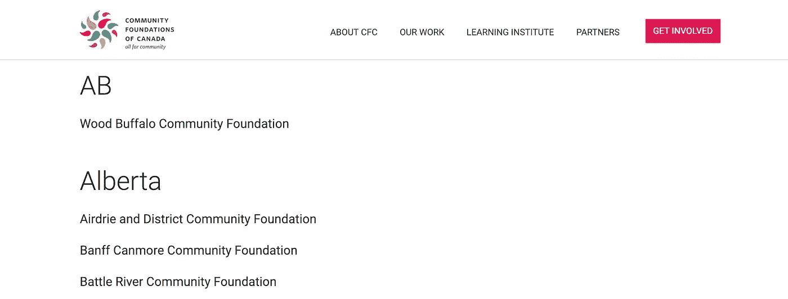
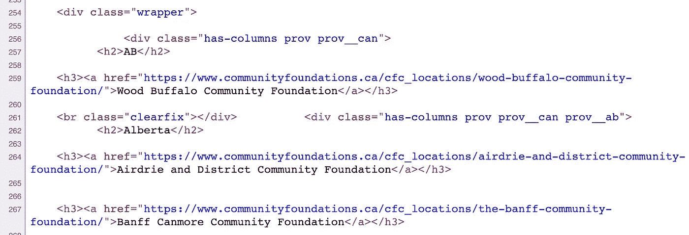
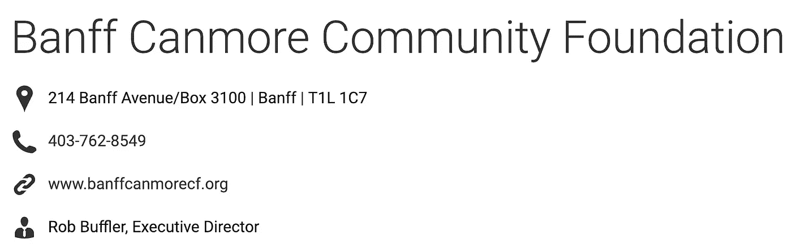
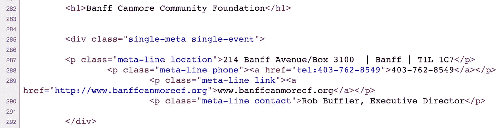
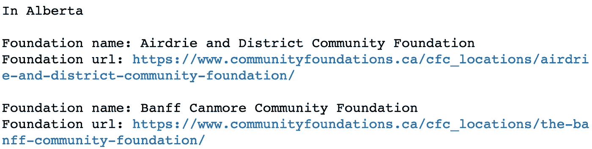
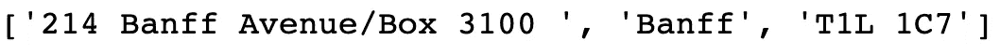
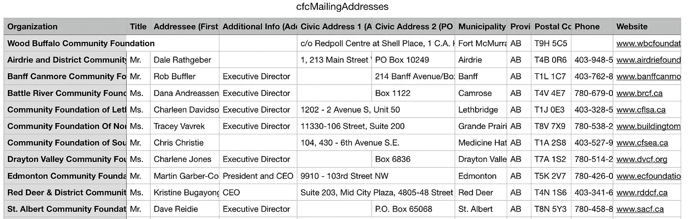
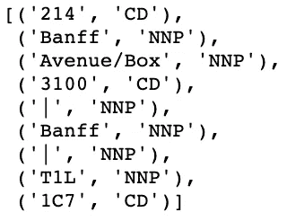
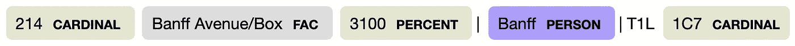

# 用漂亮的汤来刮网页——一个使用案例

> 原文：<https://towardsdatascience.com/web-scraping-with-beautiful-soup-a-use-case-fc1c60c8005d?source=collection_archive---------8----------------------->


在这篇文章中，我将简要介绍从网页中获取数据的方法，即*网页抓取、*使用 Python 和库(如请求)来获取数据并解析数据。当一个网站没有一个 API，或者没有一个符合你需求的 API 时，网络抓取就变得必要了。

作为一个例子，我使用了一个具有一致 HTML 结构的网页，但是这种方法是可以推广的。虽然有一些框架，如 Scrapy，可以提供这样的服务，但我决定把它作为一次学习经历。

# 使用案例

一个非营利组织希望与全国各地的*加拿大社区基金会(CFC)* 站点建立联系。他们让我找到每个联系人和他们的邮寄地址，并将所有信息以特殊格式放入电子表格中。

通过将每个必填字段复制粘贴到电子表格中来手动完成这项任务，意味着要做 195 次(基础)* 11 次(字段)= 2145 次！所以我的下一个想法是通过抓取 CFC 网站来自动化这个过程。

幸运的是，所有的 CFC 信息都以一种简单明了的模式包含在他们的网站上。

# **什么是网页抓取？**

根据 Ryan Mitchell 的书*Web Scraping with Python*(O ' Reilly)，它是通过 API 以外的任何方式收集数据的实践。人们可以编写一个程序来查询 web 服务器，请求和检索数据，解析数据以提取信息，并存储数据以供以后分析。

## 检查页面！

web 抓取的第一步是深入查看您要抓取的页面，您需要在您选择的 web 浏览器的开发者菜单中打开“显示/查看页面源代码”。正如米切尔所说，如果你能在浏览器中看到它，你就能通过 Python 脚本访问它。并且，如果你可以访问它，你可以*将它存储*在数据库中，以便*检索*和*分析*。

在浏览 CFC 网页时，几乎没有什么东西是相关的。CFC 网站的省份包含在

## HTML 标题中，而基金会的链接和名称在

### 标题中。此外，链接包括文本' *cfc_locations '，*，这将有助于将它们与任何其他链接区分开来。



CFC Website



Source View

这些链接中的每一个怎么样？我们来考察一个:



整齐地打包，具有一致的 HTML 结构，信息来自一个

容器。地址在一个段落中，该段落的 CSS 类包括关键字' *location* '，联系人的姓名和职务在' *meta-line contact* '类中。虽然这里没有包括该省，但可以从上一页获得。

# 查询服务器、请求和检索数据

对于这些任务，我选择使用 [*请求:HTTP for Humans*](http://docs.python-requests.org/en/master/) 库:

```
session = requests.Session()
```

但是，这将发送以下标头，

```
>>> session.headers['User-Agent']
'python-requests/2.19.1'
```

我们基本上是在告诉他们的网站，有人在用 Python 抓取他们的网站。一些网站实际上会阻止这类请求。一般来说，人们希望自己的外表和行为尽可能人性化。实现这一点的一种方法是更改随请求一起发送的标头。

如果你想知道你的浏览器正在发送什么标题，你可以看看[https://www . whatismybrowser . com/detect/what-http-headers-is-my-browser-sending](https://www.whatismybrowser.com/detect/what-http-headers-is-my-browser-sending)。在我的例子中，我将标题改为

```
my_headers = {"User-Agent":"Mozilla/5.0 (Macintosh; Intel Mac OS
          X 10_14_3) AppleWebKit/537.36 (KHTML, like Gecko)
          Chrome/71.0.3578.98 Safari/537.36", 
          "Accept":"text/html,application/xhtml+xml,application/xml;
          q=0.9,image/webp,image/apng,*/*;q=0.8"}
```

另一件重要的事情是检查网站的 [robots.txt](https://en.wikipedia.org/wiki/Robots_exclusion_standard) 文件，确保你没有违反他们的政策。该文件指示网站的哪些区域不应该被所有或某些用户代理处理或扫描。在我们的例子中，robots.txt 只禁止抓取 */wp-admin/。*

下一步是用请求库检索信息，

```
url = '[https://communityfoundations.ca/find-a-community-foundation/'](https://communityfoundations.ca/find-a-community-foundation/')
response = session.get(url, headers=my_headers)
```

*网页中包含的所有内容*现在都在响应对象中。

# 美味的汤

解析我们刚刚获得的信息怎么样？这就是[美汤](https://www.crummy.com/software/BeautifulSoup/) ( *BS4* )库的用武之地。BS4 是一个 Python 库，用于解析 HTML 和 XML 文档——即使是标记格式错误或设计不良的页面。它提供了导航、搜索和修改解析树的简单方法。所以让我们来做一个汤吧！

```
html_soup = BeautifulSoup(response.text, 'html.parser')
```

我们现在可以导航和搜索 html_soup。为此，BS4 有一些非常有用的函数，其中包括函数 find_all()，在这个函数中可以使用正则表达式和 lambda 函数。还可以引用属性来访问搜索结果，例如。名字和。文本:

```
container = html_soup.find_all(["h2", "h3"], 
                               class_=lambda x: x != 'hidden')for lines in container:
    if lines.name == 'h2': 
        province = lines.text
        print('In', province, "\n")
    if lines.name == 'h3':
        foundation = lines.text
        print('Foundation name:', foundation)   
        print('Foundation url:', lines.find_all("a", 
            href=re.compile("cfc_locations"))[0].get('href'), "\n")
```



下一步是查询和检索基金会的每个 URL 的数据。我们必须记住两件事。第一，我们只需要查询服务器*一次*，因为数据将被存储在本地。第二，我们需要有礼貌，我们不想让服务器过载，因为请求会破坏它或者超时。这就是 time.sleep()函数出现的地方。在本例中，我在请求之间增加了 10 秒。

```
subresponse = []for lines in container:
    if lines.name == 'h3': 
        url_fou = lines.find_all("a",
                  href=re.compile("cfc_locations"))[0].get('href')
        subresponse.append(session.get(url_fou, 
                                       headers=my_headers))
        time.sleep(10)
```

我们现在可以用 BS4 解析数据，并继续提取其余的信息，例如地址，在 CFC 格式的情况下，可以使用正则表达式按文本中包含的竖线将其拆分。

```
html_subsoup = []for counter in range(1, len(subresponse)):
     html_subsoup.append(BeautifulSoup(subresponse[counter].text, 
                                      'html.parser'))
     c_location = html_subsoup[counter].find_all('p', 
                                      class_='meta-line location')
     address_array = re.split(r' \| ', c_location[0].text)
     print(address_array)
```



同样，我们从这个人的名字、头衔等开始。

# 性别化

这里使用的另一个 Python 库是 [*Genderize*](https://pypi.org/project/Genderize/) *，*作为标题前缀的联系人姓名也是必需的(先生或女士)。这个库是 [Genderize.io](https://genderize.io/) web 服务的一个客户端，它的 API 是免费的，但限制在每天 1000 个姓名。所以不应该用它来调试代码！

Genderize 将返回给定名称的“男性”或“女性”，因此我创建了一个字典来返回前缀。

```
>>> genderDict = {"male": 'Mr.',
                  "female": 'Ms.'}
>>> gen = Genderize().get(['John'])[0]['gender']
>>> print(genderDict.get(gen, "None"))Mr.
```

# 熊猫

在处理完所有数据后(完整代码可以在[这里找到](https://github.com/brodriguezmilla/WebScrapingCFCBS4))，最后一步是将信息写入一个[*pandas*](https://pandas.pydata.org/)data frame，并写入一个 CSV 文件。

```
df = pd.DataFrame({'Organization': organization,
                   'Title': gender_title,
                   'Addressee': person,
                   'Addressee Job Title': person_title,
                   'Civic Address 1 (Street Address)': street,
                   'Civic Address 2 (PO Box)': pobox,
                   'Municipality': municipality,
                   'Province or Territory': provinces, 
                   'Postal Code': postalCode,
                   'Phone': phone,
                   'Website': org_url
                   })cols = ['Organization', 'Title', {add in here the others}]df.to_csv('data/cfcMailingAddresses.csv', encoding='utf-8',
          index=False, columns=cols)
```

# 最终产品

以下是 CSV 文件的快照:



虽然还有改进的余地，例如在 genderize 数据库中找不到的名字，或者用 m .或 Mme 称呼魁北克人，但该脚本满足了其一般用途。可以通过添加断言和抛出异常来进一步细化代码。

# 那拉提

作为这次学习经历的一部分，我决定尝试两个自然语言处理(NLP)库， *NLTK* 和 *spaCy* 来解析地址。这是结果。

NLTK 没有为地址给出正确的标签。大多数标记都被识别为名词，包括一个像班夫这样的地方。

```
def preprocess_without_stopwords(sent):
    sent = nltk.word_tokenize(sent)
    sent = [word for word in sent if word not in en_stop]
    sent = nltk.pos_tag(sent)
    return sentpreprocessed_address = preprocess_without_stopwords(address_test)
```



spaCy 也没有给出地址的正确标签。虽然它比 NLTK 更好地将班夫大道识别为一个地方，但班夫被识别为一个人。

```
addr = nlp(address_test)
sentences = [x for x in addr.sents]
displacy.render(nlp(str(sentences[0])), jupyter=True, style='ent')
```



训练地理数据模型本身可能是另一个非常有趣的项目！

GitHub 上的全 jupyter 笔记本:[https://github.com/brodriguezmilla/WebScrapingCFCBS4](https://github.com/brodriguezmilla/WebScrapingCFCBS4)