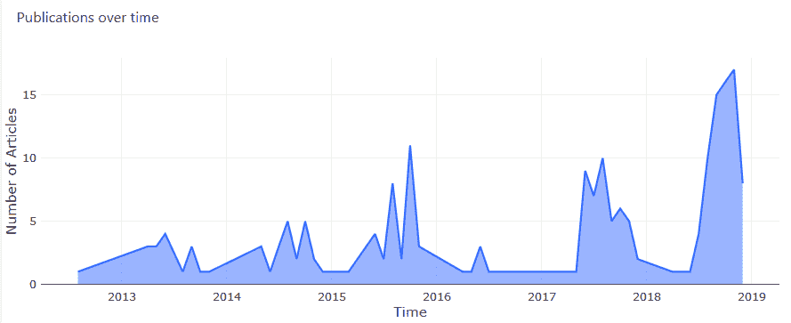

# 使用 Python 进行 Web 抓取—从头到尾

> 原文：<https://towardsdatascience.com/web-scraping-with-python-a-to-copy-z-277a445d64c7?source=collection_archive---------0----------------------->

## 处理美丽的声音，避免阻塞，用 API 丰富，存储在数据库中并可视化数据

*作者* [*沙伊阿尔达孜*](https://medium.com/u/46f36e995de5?source=post_page-----277a445d64c7--------------------------------) *&* [*艾坦葛苏托*](https://medium.com/u/e0226be1cccd?source=post_page-----277a445d64c7--------------------------------)*—2019 年 2 月*


Photo by [michael podger](https://unsplash.com/@jammypodger7470?utm_source=medium&utm_medium=referral) on [Unsplash](https://unsplash.com?utm_source=medium&utm_medium=referral)

# 介绍

*   浏览网页并提取选定文本或图像的行为。
*   获取新数据或丰富当前数据的优秀工具。
*   通常是需要大量数据的数据科学项目的第一步。
*   API 的另一种选择是数据检索。也就是说，如果你没有 API 或者它在某些方面受到限制。

例如:

通过用最新的新闻故事丰富最新的股票价格来跟踪和预测股票市场的价格。这些新闻故事可能无法从 API 中获得，因此需要从新闻网站中获取。这是通过浏览网页并提取感兴趣的文本(或图像)来完成的。

# 背景

我们的网络抓取项目是 [ITC(以色列技术挑战赛)](https://www.itc.tech/)的数据科学研究员计划的一部分，该计划旨在让我们了解数据科学家面临的现实问题，并提高我们的编码技能。

在本帖中，我们展示了我们前进道路上的主要步骤和挑战。我们已经包含了代码片段和关于如何为 web 抓取创建端到端管道的建议。为了简单起见，我们这里展示的代码片段不是 OOP(面向对象编程),但是我们强烈建议在您的 web scraper 实现中编写 OOP 代码。

**我们使用的主要工具:**

*   Python (3.5)
*   [*beautiful soup*](https://pypi.org/project/beautifulsoup4/)库，用于处理从网页源代码(HTML 和 CSS)中提取文本
*   [*请求*](https://pypi.org/project/requests/) 库用于处理与网页的交互(使用 HTTP 请求)
*   MySQL 数据库——用于存储我们的数据( [mysql.connector](https://pypi.org/project/mysql-connector-python/) 是 Python 的 MySQL API)
*   API 调用——丰富我们的数据
*   代理标头轮换—生成随机标头并获得免费代理 IP，以避免 IP 阻塞

**工作流程**


Web scraping timeline

# 网站

在这个项目中，我们可以自由选择任何网站。其他人选择的网站从电子商务到新闻网站，展示了网络抓取的不同应用。

我们选择了一个科学文章的网站，因为我们认为这将是有趣的，看看我们可以获得什么样的数据，以及我们可以从这些数据中收集到什么样的见解。

我们选择保持网站匿名。无论如何，这篇文章的目标是概述如何为任何感兴趣的网站建立一个管道。

# 刮刮刮刮

## 美丽的声音

首先，你必须检查网站，以确定你想收集哪些数据。它包括对网站结构的基本理解，这样你的代码就可以抓取你想要的数据。

为了检查网站的结构，打开网页的检查器，右击页面→点击“检查元素”。


Inspect element of a web page

然后，找到您想要抓取的数据并单击它。检查器面板中高亮显示的部分显示感兴趣的网页部分的底层 HTML 文本。Beautifulsoup 将使用元素的 CSS 类从 html 中提取数据。

在下面的截图中，你可以看到“关键词”部分是需要刮除的。使用检查器，可以定位“keywords”部分的 HTML 元素及其 CSS 类。


Getting the exact location of keywords

其结构如下:

div(class = " keywords-section ")→div(class = " keyword ")。

使用 beautiful soup，获取所有关键字的代码如下:

Code snippet — getting all keywords out of an article

从这里开始，几乎是一样的。找到所需的部分，检查 HTML 元素并获取数据。beautifulsoup 的完整文档和更多示例可以在这里找到(非常友好)。

抓取过程在短时间内涉及许多 [HTTP GET 请求](https://en.wikipedia.org/wiki/Hypertext_Transfer_Protocol#Request_methods)，因为在许多情况下，人们可能需要在多个页面之间自动导航，以便获取数据。此外，拥有一个令人敬畏的 scraper 不仅仅是为了得到你想要的数据，也是为了获得新的数据或频繁更新现有数据——**这可能会导致被网站屏蔽。**这让我们进入下一部分:

# 如何避开街区？

一般来说，网站不喜欢机器人抓取工具，但他们可能不会完全阻止它，因为搜索引擎机器人抓取网站，以便对它们进行分类。有一个机器人排除标准，它定义了网站的条款和条件，通常可以在网站的 robots.txt 文件中找到。比如*维基百科*的 robots.txt 文件可以在这里找到:【https://en.wikipedia.org/robots.txt】**。**

*维基百科 robots.txt 的前几行:*

```
*# robots.txt for [http://www.wikipedia.org/](http://www.wikipedia.org/) and friends
#
# Please note: There are a lot of pages on this site, and there are
# some misbehaved spiders out there that go _way_ too fast. If you're
# irresponsible, your access to the site may be blocked.*
```

*如你所见，维基百科的限制并不太严格。但是有些网站非常严格，不允许抓取网站的部分或者全部。他们的 robots.txt 会包括这个:*

```
*User-agent: *
Disallow: /*
```

## *怎么处理积木？*

*一种方法是在向网站发出请求时通过不同的代理和用户代理(头)进行轮换。此外，考虑你向网站发出请求的频率以避免成为“垃圾邮件发送者”也很重要。*

****注意——这只是出于学习目的。我们不鼓励你违反任何网站的条款。****

*下面是如何通过几个简单的步骤实现这个方法。*

***代理池***

*用 Python 可以很容易地实现一个[代理服务器](https://en.wikipedia.org/wiki/Proxy_server)。免费代理列表可以在这里找到(注意，免费代理通常没有付费代理稳定，速度也慢。如果你觉得免费的服务不够好，可以考虑付费服务)。*

*查看免费代理列表，可以使用 BeautifulSoup 来获取 IP 地址和端口。上述网站的结构如下所示。*

**

*Table of free proxies*

*以下函数检索所有代理的 IP 和端口，并返回它们的列表:*

*A function to get a proxies IPs and ports*

***集管池***

*在 Python 中使用 requests 包时，有许多 HTTP 头可以作为请求的一部分传递。我们传递了两个头元素(对我们来说已经足够了)，即[接受头](https://developer.mozilla.org/en-US/docs/Web/HTTP/Headers/Accept)(用户权限)和[用户代理](https://en.wikipedia.org/wiki/User_agent#User_agent_identification)(伪浏览器)。*

*伪随机头池创建如下(参见下面的代码):*

*   *创建一个“accepts”的字典对象，其中每个 accept 头都与一个特定的浏览器相关(取决于用户代理)。可以在[这里](https://developer.mozilla.org/en-US/docs/Web/HTTP/Content_negotiation/List_of_default_Accept_values)找到接受报头的列表。该列表包含每个用户代理的默认值，并且可以更改。*
*   *使用 Python 中的[假用户代理](https://pypi.org/project/fake-useragent/)包获得一个随机用户代理。如下面的代码所示，这非常容易使用。我们建议预先创建一个用户代理列表，以防假用户代理不可用。一个用户代理的例子:*‘Mozilla/5.0(Windows NT 6.2；rv:21.0)壁虎/20130326 火狐/21.0'**
*   *用*接受*和*用户代理*作为键和相应的值创建一个字典对象*

*部分代码([下面附录中的全部功能](https://medium.com/p/b04114e7289d#a7a9)):*

***使用标头和代理池***

*下面的代码展示了一个如何使用我们之前写的函数的例子。为了简单起见，我们没有包括 OOP 代码。参见[附录](https://medium.com/p/b04114e7289d#a7a9)了解 random_header()的完整功能。*

*Pools creation and usage*

*在此之前，我们简要介绍了网络抓取，并讨论了如何避免被网站屏蔽的更高级的技术。*

*在下一节中，我们将展示如何使用 [API](https://en.wikipedia.org/wiki/Application_programming_interface) 调用来丰富数据的两个示例: [Genderize.io](https://genderize.io/) 和 [Aylien 文本分析](https://aylien.com/text-api/)。*

# *使用 API 进行数据丰富*

## *性别化*

*Genderize 使用个人的名字来预测他们的性别(限于男性和女性)。*

*该 API 的输出被构造为 JSON，如下例所示:*

*{ "姓名":"彼得"，"性别":"男性"，"概率":" 0.99 "，"计数":796}*

*这使得用每个人的性别来丰富作者数据变得非常方便。由于包含了预测性别的概率，因此可以设置一个阈值来确保更高质量的预测(我们将阈值设置为 60% —参见下面的代码片段)。这个 API 带来的价值是能够确定特定主题作者的性别分布。*

*我们不必担心 API 限制(1000 次呼叫/天),因为我们每天只能收集大约 120 篇文章，这意味着平均每天不到 500 个作者。如果一个人能够超过这个每日限额，则必须考虑 API 限额。避免这个每日限制的一个方法是检查被评估的第一个名字是否已经在我们的数据库中被丰富。这将允许我们在不浪费 API 调用的情况下根据现有数据确定性别。*

*给渴望技术的人一些代码片段:*

*连接性别化:*

*作者性别丰富:*

## *艾利安文本分析*

*我们对特定主题的关键词随时间的增长很感兴趣(想想 Google Trends ),因此决定我们应该用更多的关键词来丰富我们的数据。为此，我们使用了一个名为 Aylien Text Analysis 的 API，特别是概念提取 API。这个 API 允许用户输入文本，文本经过处理后输出使用 [NLP](https://en.wikipedia.org/wiki/Natural_language_processing) 从文本中提取的关键字列表。我们为每篇文章收集的不同字段中有两个是标题和摘要，这些字段被连接起来用作 API 的输入。下面是 JSON 输出的一个例子:*

```
*{
 “text”:”Apple was founded by Steve Jobs, Steve Wozniak and Ronald Wayne.”,
 “language”:”en”,
 “concepts”:{
 “http://dbpedia.org/resource/Apple_Inc.":{
 “surfaceForms”:[
 {
 “string”:”Apple”,
 “score”:0.9994597361117074,
 “offset”:0
 }
 ],
 “types”:[
 “http://www.wikidata.org/entity/Q43229”,
 “http://schema.org/Organization",
 “http://dbpedia.org/ontology/Organisation",
 “http://dbpedia.org/ontology/Company"
 ],
 “support”:10626
 }
 }
}*
```

*为了避免重复的关键字，我们检查了数据库的关键字表中不存在该关键字。为了避免在每篇文章中添加太多的关键词，制定了两种方法。第一个是简单的关键字限制，如下面的代码片段所示。另一种方法利用输出文件中每个关键词的得分(相关性概率)——这允许用户设置一个阈值(我们使用 80%),以确保为每篇文章添加最相关的关键词。*

*下图展示了 API 的工作原理:*

**

*下面是我们用来连接 Aylien Text API 服务的代码片段:*

*连接到 aylien:*

*使用 Aylien API 丰富关键字:*

*让我们进入最后一部分。到目前为止，我们已经介绍了 web 抓取和如何避免被阻塞，以及如何使用 API 调用来丰富数据。在这篇文章的最后一部分，我们将介绍如何建立一个数据库来存储数据，以及如何访问这些数据进行可视化。可视化是一个强大的工具，可以用来从数据中提取洞察力。*

# *存储数据— MySQL 数据库*

*为网络抓取项目(或其他一般项目)建立数据库时，应考虑以下因素:*

*   *表格创建*
*   *新数据插入*
*   *数据更新(每小时/每天…)*

## *表格创建*

*管道的这一阶段应该小心进行，并且应该验证所选择的结构(就列类型、长度、键等而言。)适用于数据，可以处理极端情况(缺失数据、非英文字符等)。).避免依赖网站使用的 id 作为主键/唯一键，除非你有非常好的理由(在我们的例子中，一篇文章的 *doi_link* 是一个在任何地方都可以接受的唯一字符串，所以我们使用它作为一篇文章的唯一标识符)。*

*使用 mysql.connector 包创建表格的示例:*

*SQL 命令:*

*建立数据库的功能:*

*Tables creation*

*注意—在第 12、17、23 和 25 行中，我们使用了 logger 对象。这是为了记录到一个外部日志文件，它非常重要。建议创建一个日志类，你可以在这篇文章的下面看到更多，或者点击[这里](https://medium.com/p/277a445d64c7#0a7a)。*

## *数据插入*

*插入新数据与更新现有数据略有不同。当新数据插入数据库时，应该确保没有重复。此外，在出现错误的情况下，应该捕捉它，记录它并保存导致该错误的数据部分以供将来检查。*

*如下所示，我们再次使用 mysql.connector 的光标来执行 SQL insert 命令。*

*Data insertion*

## *数据更新*

*动态数据需要频繁更新。应该定义两次更新之间的时间增量(差异),这取决于数据类型和源。在我们的项目中，我们必须考虑到所有文章的引用数量必须定期更新。以下代码演示了更新过程:*

*Data update*

# *形象化*

*为了帮助理解收集的数据，可以使用可视化来提供易于理解的数据概述。*

*我们创建的可视化使我们能够深入了解以下用例:*

*   *高级趋势*
*   *确定特定主题中的主要机构/国家*
*   *确定特定主题中的顶尖研究人员*
*   *上述用例支持数据驱动的方法，适用于:R&D 投资、咨询、普通合伙企业*

## *redash——可视化的开源工具*

*为了探索上述用例，我们创建了数据的可视化。我们通过使用一个简单但功能强大的开源工具 [Redash](https://redash.io/) 做到了这一点，该工具连接到我们的 AWS 机器(也可以使用其他类型的实例)。*

*为了设置 Redash，请执行以下操作:*

*   *点击以下链接:[https://redash.io/help/open-source/setup#aws](https://redash.io/help/open-source/setup#aws)*
*   *选择相关的 AWS 实例，以便在您的机器上创建 Redash 映像。*

*在继续之前，这里有一个我们为主题**[**神经网络**](https://en.wikipedia.org/wiki/Artificial_neural_network)**收集的数据的概述。*****

**********

*****如您所见，检索到的数据并不多——这是因为我们在 AWS (Amazon Web Services)机器上可用的时间有限。由于缺乏足够的数据，读者应该半信半疑地评估结果——在这个阶段，这只是一个概念证明，绝不是一个成品。*****

## *****解决上述使用案例—高级趋势:*****

*****对于高水平趋势，我们简单地绘制了过去 5 年每月发表的研究论文数量。*****

**********

```
*****SELECT publication_date, count(id) AS num 
FROM articles 
GROUP BY publication_date 
ORDER BY publication_date;*****
```

*******性别分布*******

*****这种可视化利用来自 genderize 的丰富的作者数据来查看特定主题中作者的性别分布。如下图所示，由于 genderize API 的限制，有很大一部分作者的性别是未知的。*****

**********

```
*****SELECT gender, count(ID) 
FROM authors 
GROUP BY gender;*****
```

*******确定该领域的领先国家*******

*****当收集每个作者的从属关系时，我们能够提取每个作者的国家，允许我们创建下面的可视化。由于中国对人工智能的浓厚兴趣，中国如预期的那样发表了主题为“神经网络”的大多数研究论文。这些信息可能会引起政策制定者的兴趣，因为人们可以跟踪领先国家的人工智能进展。首先，监测这些领先国家以寻找合作机会，从而在这两个国家推进人工智能是有帮助的。其次，政策制定者可以利用这些见解来效仿领先国家，在自己的国家内推进人工智能。*****

**********

*****Leading countries in the field of Neural Networks*****

```
*****SELECT country, count(affiliation_id) AS counter
FROM affiliations 
GROUP BY country 
ORDER BY counter DESC;*****
```

*******确定该领域的顶级主要作者*******

*****作为确定顶级研究人员的第一种方法，我们决定将主要作者与其名字相关的引用次数进行比较。*****

**********

*****Number of citations for each author*****

```
*****SELECT CONCAT(authors.first_name,” “, authors.last_name) AS name, SUM(articles.citations) AS num_citations 
FROM authors JOIN authors_article_junction JOIN articles
WHERE authors_article_junction.author_ID = authors.ID AND articles.ID = authors_article_junction.article_ID 
 AND authors_article_junction.importance = 1 
GROUP BY authors.ID 
ORDER BY num_citations DESC 
LIMIT 10;*****
```

*******关键词图*******

*****单词越大，在数据库中出现的频率就越高*****

**********

*****Keywords map*****

```
*****SELECT keywords.keyword_name, COUNT(keywords_ID) AS num 
FROM keyword_article_junction JOIN keywords 
WHERE keyword_article_junction.keywords_ID = keywords.ID 
GROUP BY keywords.keyword_name 
ORDER BY num DESC 
LIMIT 20;*****
```

*******Redash 中我们仪表板的快照*******

**********

*****Redash dashboard*****

# *****结论*****

*****我们已经完成了 Python A-Z 系列的 Web 抓取。在第一部分中，我们简要介绍了网络抓取，并谈到了如何避免被网站屏蔽的更先进的技术。此外，我们还展示了如何使用 API 调用来丰富数据，以提取进一步的见解。最后，我们展示了如何创建一个数据库来存储从 web 抓取中获得的数据，以及如何使用开源工具 Redash 来可视化这些数据。*****

# *****附录*****

## *****未来笔记*****

*   *****考虑使用 grequests 来并行化 get 请求。这可以通过执行以下操作来实现:*****

*****由于免费代理的速度有限，这可能不会像应该的那样有效，但仍然值得一试。*****

*   *****使用 Selenium 处理 Javascript 元素。*****

## *****完整函数—随机 _ 头*****

*****创建随机标题的完整功能如下:*****

*******注意** —在第 22 行，我们将一条消息保存到一个日志文件中。在你的代码中有日志是非常重要的！我们建议使用简单易用的[日志包](https://docs.python.org/2/library/logging.html)。*****

## *****记录流量*****

*****我们构建并在代码中到处使用的 logger 类:*****

*****Logger class and example of how to use it*****