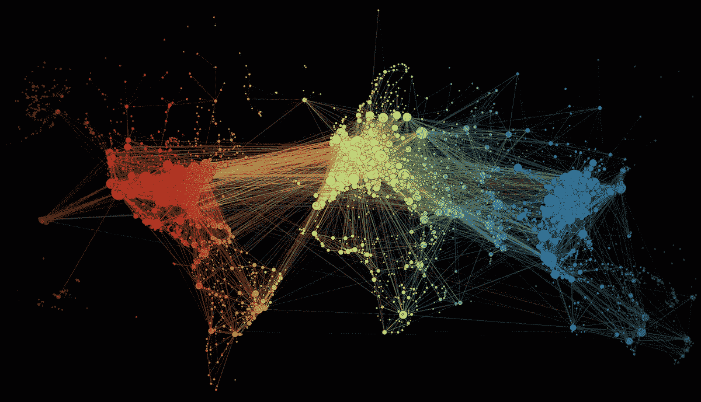
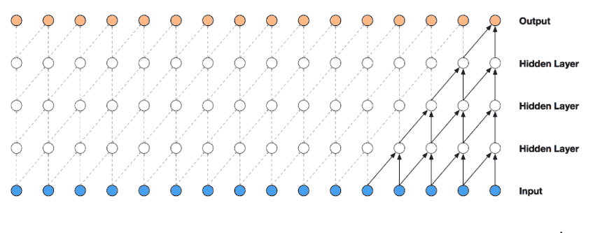

# 网络流量预测

> 原文：<https://towardsdatascience.com/web-traffic-forecasting-f6152ca240cb?source=collection_archive---------7----------------------->

> 使用谷歌 DeepMind 的 Wavenets

*与* [*合写 Apoorva Reddy Addvalli*](https://medium.com/@apoorvareddy_24043)*[*at Indra Bandi*](https://medium.com/@bandiatindra)*

**

***动机:**时间序列作为统计学和机器学习中的一个重要概念，往往很少被我们这样的数据爱好者所探索。为了改变这种趋势，我们决定解决当今时代最紧迫的时间序列问题之一，*“预测网络流量”*。*

*这个博客反映了我们在[网络流量时间序列预测](https://www.kaggle.com/c/web-traffic-time-series-forecasting)中的头脑风暴，这也是一个由 Kaggle 主办的比赛。我们相信这种预测可以帮助网站服务器有效地处理停机。我们实现的技术可以扩展到金融市场、天气预报、音频和视频处理中的各种应用。不仅如此，了解你的网站的流量轨迹也可以打开商机！*

***一、数据集***

*[数据集](https://www.kaggle.com/c/web-traffic-time-series-forecasting/data)由 145k 个时间序列组成，代表不同维基百科文章的每日页面浏览量，从 2015 年 7 月 1 日开始，到 2017 年 9 月 10 日结束(804 个数据点)。目标是预测数据集中每篇文章在 2017 年 9 月 13 日到 2017 年 11 月 13 日之间的日浏览量(64 个数据点)。*

**

***Fig 1\. Trends for websites in the dataset***

***二。接近***

*从过去的模式中学习来预测未来可以通过以下方式实现:*

1.  *传统移动平均线，基于 ARIMA 的技术*
2.  *递归神经网络——长短期记忆(LSTM)，门控递归单元(GRU)*
3.  *[波网](https://arxiv.org/abs/1609.03499)*

*波网的日益流行和我们对利用神经网络进行预测的兴趣使我们选择了波网。“谷歌深度思维”是 Wavenets ( *目前用于谷歌的人工智能服务，云文本到语音*)背后的策划者，这进一步激发了我们的兴趣。*

*我们的研究还表明，Wavenets 的性能与 RNNs 相当或更好。这里有一篇文章的链接，这篇文章讲述了 Wavenets 如何捕捉 LSTMs 之类的长期依赖关系，但对于训练来说更快、更轻量。*

****潜得更深！****

*为了获得直观的理解，让我们首先关注波网的复杂性，并理解为什么它们似乎适合我们的任务。*

*波网的神奇之处在于“*因果膨胀卷积*”逻辑，该逻辑提高了神经网络的效率，以捕捉时间流量&长期相关性，而不增加过多的学习权重。*

*让我们看看这些花哨的术语到底是什么意思-*

***A .典型卷积层***

**

***Fig.2 Typical Convolution Layer***

*上面是一个典型的卷积层的表现。对于 1d 卷积层，我们在输入序列上滑动权重过滤器，将其顺序应用于序列的**重叠区域**。*

*在上面的图像中，我们使用 X(0)和 X(1)来预测 y(0 ),这个序列对所有的 y 继续下去。我们可以看到过去和未来的数据被用来预测 y(0)。如果我们把这些 x 想象成时间序列值，那就有明显的问题了。我们会用未来来预测 y，所以我们的模型是作弊！*

*因此，我们必须确保输入不会影响及时处理它们的输出步骤。*

*解决方法是什么？— **因果卷积***

***B.** **因果卷积***

**

***Fig 3\. Causal Convolutions***

*这就是我们调整卷积设计的步骤，以限制未来 X 影响过去的预测，加强**因果**关系。如果你也想限制你的输入， *keras* 为我们简化了它。设置*填充=* ***【因果】*** 。*

***C.** **因果性扩张回旋***

**

***Fig 4\. Causal Dilated Convolutions***

*现在我们已经捕获了时间流，让我们理解波网如何有效地捕获长程相关性(*感受野*)，而不会导致影响计算效率的隐藏层的指数增加。*

*为了解决这一问题，Wavenets 采用了扩张的概念，通过以*恒定扩张率*跳过输入，使感受野作为卷积层数的函数呈指数增加。通过设置特定的扩张率，您可以从更早的时间段获得类似季度、月份和年份的信息(在上面的表示中，我们在第一层捕获双月模式)。我们可以看到，同样的四个层现在将所有十六个输入系列值连接到高亮显示的输出。*

*由于上述规范，我们的波网可以用更少的参数捕获更多的信息，消耗更少的历元来收敛。因此，Wavenets 可以将感受野扩大到> 400，而 RNNs 仅在 100-300 有效。*

***三世。计算资源***

*我们在谷歌云平台(GCP)上使用 **Nvidia** Tesla K80 GPU 对我们的模型进行了 7-8 小时 3500 个纪元的训练。*

***四世。** **模型建筑***

*我们的解决方案受到 Kaggle 上第六名的启发。在竞争时没有缺失值处理，所以我们从缺失值处理开始。Wavenet 架构包括:*

*   *剩余块= 32*
*   *跳过连接= 32*
*   *8 个扩展因果卷积层*
*   *每层 32 个宽度为 2 的过滤器*
*   *指数增长的膨胀率(1，2，4，8，…，128)*
*   *2 个(时间分布)完全连接的图层映射到最终输出*

**

****Fig 5\. Overview of the residual block and the entire architecture****

*转到围绕扩展因果卷积的主要逻辑的架构，包括*

*   *门控激活*
*   *剩余连接和跳过连接*

*为了获得一个鸟瞰图，扩展的因果卷积分成两个分支，并通过调节信息流的激活单元( *tanh 和 sigmoid* ),这本质上类似于递归神经网络中的门控机制。它们随后通过逐元素乘法被重新组合。*

*在时间序列中，当我们使用跳过连接在网络中前进时，需要保留较早的要素图层。可以认为这是对季节性和趋势的延续，季节性和趋势是最终预测处理的时间序列的主要驱动因素。架构中的剩余连接使模块的输入能够通过卷积，然后与卷积输出进行积分。*

***五.精度测量***

*我们使用 SMAPE(对称平均绝对百分比误差)的修改版本作为我们的准确性度量，这也是竞争的目标损失。SMAPE 由下式给出:*

**

*SMAPE 不能直接使用，因为在零值附近行为不稳定。在代码中，我们通过用 1 替换这些值来忽略不连续性。*

***六。结果***

*我们从两个方面验证了我们的结果。我们上传了我们的提交文件，得到了 35.89 的最终解决方案，略高于第二名的分数。*

**

*我们通过模型预测了数据集中过去 64 天的数据。以下是我们随机选择的 6 篇维基百科文章的趋势。正如你所看到的，页面浏览日志的趋势被很好地捕捉到了。像所有时间序列预测一样，峰值仍然很难捕捉。*

**

***Fig 6\. Forecasted Trends***

***七。结论***

*●实现了高质量的长期预测*

*●有效捕捉季节性模式和长期趋势*

*●包括节假日、星期几、语言等外部信息，可能有助于我们的模型更准确地捕捉高点和低点*

*请随意浏览我们的[代码](https://github.com/apoorva1995reddy/Web-Traffic-Forecasting-)。*

***八世。参考文献***

1.  *【https://arxiv.org/pdf/1609.03499.pdf *
2.  *[https://github.com/sjvasquez/web-traffic-forecasting](https://github.com/sjvasquez/web-traffic-forecasting)*
3.  *[https://bair.berkeley.edu/blog/2018/08/06/recurrent/](https://bair.berkeley.edu/blog/2018/08/06/recurrent/)*
4.  *[https://medium . com/@ kion . Kim/wave net-a-network-good-to-know-7 caaae 735435](https://medium.com/@kion.kim/wavenet-a-network-good-to-know-7caaae735435)*
5.  *[https://github.com/JEddy92/TimeSeries_Seq2Seq](https://github.com/JEddy92/TimeSeries_Seq2Seq)*
6.  *[https://github.com/Arturus/kaggle-web-traffic](https://github.com/Arturus/kaggle-web-traffic)*
7.  *[https://www . ka ggle . com/arjunsurendran/using-lstm-on-training-data](https://www.kaggle.com/arjunsurendran/using-lstm-on-training-data)*