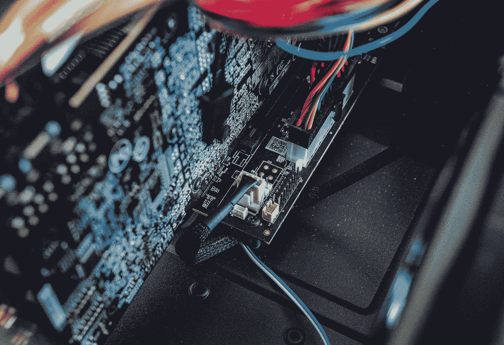
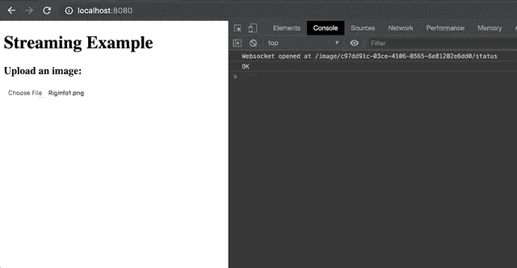

# 使用 Scala 的 WebSocket 流

> 原文：<https://towardsdatascience.com/websocket-streaming-with-scala-fab2feb11868?source=collection_archive---------27----------------------->

## 阿卡河如何让生活变得更简单

Photo by [Vitaly Sacred](https://unsplash.com/@vitalysacred?utm_source=medium&utm_medium=referral) on [Unsplash](https://unsplash.com?utm_source=medium&utm_medium=referral)

假设你有一个处理器，一个图像处理器，这个图像处理器有几个处理阶段。每个阶段都以不同的方式改变或处理图像。这个图像处理非常棒，你想和全世界分享。所以你编写了一个服务器来上传文件并运行图像处理。也许每个处理阶段都是一个`Flow[BufferedImage]`。为了便于讨论，我们假设每个阶段大约需要一秒钟，看起来像这样:

然后，您将所有的流程阶段链接在一起，这可能看起来有点像`Flow[BufferedImage, ImageProcessed]`:

然后，您构建了一个方法，将这个流作为一个流运行:

> 在现实世界中，这不会进入`Sink.ignore`，因为我们可能会将处理后的图像保存到 S3 桶或其他存储中。

使用 Akka Http，您可以轻松定义一个`Route`来处理文件上传:

> 现在我们的朋友可以使用我们的图像服务了！但是，如果我们想通知用户我们的处理进度**呢？**

我们从 Akka Http 文档中知道，我们使用`Flow[Message]`来处理 WebSockets，正如他们的例子所示:

[Akka WebSocket Example](https://doc.akka.io/docs/akka-http/current/server-side/websocket-support.html)

但是*我们如何从外部*与这个 WebSocket 流*对话*？🤔

答案是`preMaterialize`一个`Source`，然后从`Sink`和这个预物质化的`Source`构建一个`Flow`…让我们开始吧:

现在，我们发送给`wsActor`的任何东西都将被发送回我们的 JavaScript web 客户端！我们的新路由现在包含 WebSocket 处理程序:

我们更新处理阶段以通知我们的`wsActor`:

现在，当我们上传一张图片时，我们会得到一个很好的列表，告诉我们图片正在经历哪些处理阶段😎

所有代码(包括前端！)这里的[是开源的](https://github.com/duanebester/akka-ws-test)。🐾