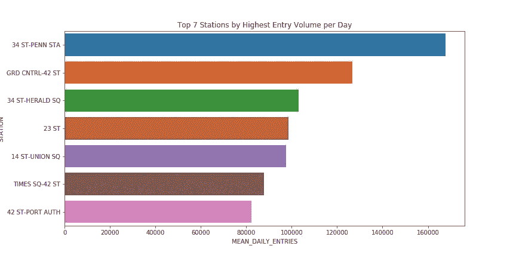
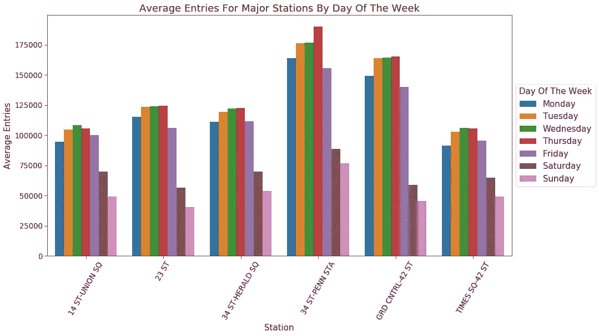
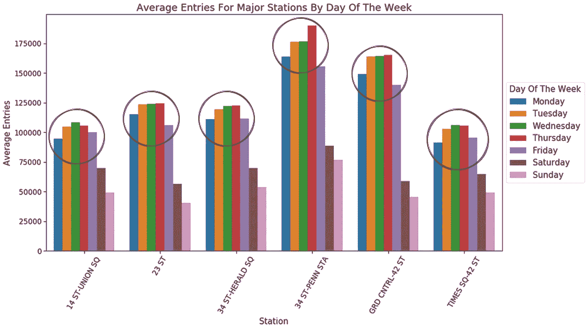

# 第 1 周@ Metis Singapore 数据科学训练营-项目 1:关于纽约市 MTA、十字转门和从众所周知的消防水管中喝水的探索性数据分析(EDA)

> 原文：<https://towardsdatascience.com/week-1-metis-singapore-data-science-bootcamp-project-1-exploratory-data-analysis-eda-on-the-b35b8c5d4417?source=collection_archive---------24----------------------->

如果你对这个项目的代码感兴趣，你可以在这个 [repo](https://github.com/xianjinseow92/projects/tree/master/NYC%20MTA%20Turnstile%20Project) 找到它。

我在梅蒂斯的第一周非常艰难。我要说，加上紧张的连续课程和紧张的最后期限，我可以有把握地说，在过去的一周里，我平均每晚只睡了 4 个小时。到目前为止，最具挑战性的工作是设置我的 github.io(我开玩笑的。最具挑战性的部分是项目)，我已经放弃了，所以你在媒体上看到我。

本周的重点是掌握数据分析的基本工具；python、matplotlib、seaborn 和我们的工作流(最小可行产品、设计流程)围绕着一个关于 MTA 地铁交通数据的项目。该项目的目标是帮助一个假想的非营利组织，该组织旨在促进妇女的认识和参与，以提出一个优化的 canvasing 战略。

我们被给予了很大的自由去做我们想做的事情(我们都知道，权力越大，责任越大),以我们认为对这个假设的组织的目的有用的方式来解释结果并提供建议。

## 网页抓取:

我要说的是，我没有任何编码背景，对我来说，第一个最大的障碍是自动收集数据的方法。其中我非常感谢 [Julia Kho](https://medium.com/u/75b5f5a46f52?source=post_page-----b35b8c5d4417--------------------------------) 关于网络搜集 MTA 十字转门数据的帖子，可以在[这里](/how-to-web-scrape-with-python-in-4-minutes-bc49186a8460)找到。

## 探索性数据分析:

Average Entries for the Top 7 NYC Stations with the Highest Average Entries

Split-Histograph Data Of an Average Entry by Day of the Week for the Top 7 NYC Stations with the Highest Average Entries

“探索性数据分析”(EDA)是对这个项目过程的全面描述，意思是从研究到可视化数据集以从中提取意义，直到当前数据足够有用以进行广泛的统计建模和/或假设测试。

从上面我们看到的图表中，我们观察到人流量最高的车站是 ***34 街——佩恩车站*** 、 ***42 街——大中央车站*** 和 ***34 街——先驱广场*** (如果你用谷歌快速搜索一下，这是真的)。

另一个要注意的有趣的点是，与周末相比， ***工作日的人流量更高***——这与我的预期(收集数据之前)大相径庭。我预计周末会产生比平日更多的人流量(这是新加坡的典型情况)。

提出清晰讲述数据故事的可视化效果是 EDA 最令人愉快的部分之一，这些可视化效果代表了您收集的完整信息包以及您对如何构建这些信息的创造性见解。这真的很有趣，因为它可以挑战一个人自己的假设，让一个人更多地了解这个世界(在新加坡，而不是在纽约)。如果不深入研究数据本身，我永远不会知道外国的交通模式。

但是在到达那里之前，你通常必须花一些时间处理数据，把它转换成一种包含有意义信息的可用格式。我和我的队友在完成数据清理后的感受可以用下面的图片来最好地概括:

True story

## 进一步分析:

我想更深入地研究这一点，而不是仅仅*了解白天的交通，我还想知道它在一天的时间里是如何波动的。早上更挤吗？下午？晚上？甚至在晚上？我们可以从数据中提取和解读更多的东西，如果时间允许，我肯定会回来重新访问这个数据集。*

## *所用指标的缺点:*

****入口 vs 出口****

*一个伟大的数据科学家知道自己的偏见，必须留意和质疑他/她的假设的可信度，并测试其准确性。我们在这里使用的度量是入口(进入车站的人数)。但是用入门作为衡量标准有效吗？为什么不考虑退场？人们是否会更容易接受 canvasing(接收传单，更愿意与调查员交谈，发送电子邮件等)。)改为出站？有很多事情要考虑，如果时间允许，我想重新考虑这个想法。*

## *最终反射:*

*这第一周真的就像用消防水管喝水一样；从早上第一件事就是接受结对编程练习的轰炸，到像代码的时间复杂性这样的理论密集型主题，为了跟上手头的材料，必须进行大量的课后学习。但奇怪的是，如此忙碌，并意识到仍有如此多有趣的东西有待学习，这是一种极大的满足感。*

*作为对我本周所学内容的最后反思，我想转向工作生活中的一个核心问题，这个问题在课堂上经常被忽视。当我的导师在本周初介绍 MTA 项目时，他给了我们一个尖锐的警告，我们在训练营的最后期限将是不公平的，我们需要 ***放弃完美主义*** 。总是有另一个步骤来尝试使数据更加完美，扩展您的项目和分析的范围，或者调整您的模型以获得更好的准确性。然而在现实世界中， ***时间是最重要的资源*** ，知道何时约束自己往往比你想法的质量 更有价值。*

***我希望改进并继续努力的事情:***

1.  *使用 git 和 gitHub 进行项目管理*
2.  *学习为项目的每个阶段设定适当的截止日期，即网络搜集、数据清理、数据处理、数据探索、解释和结果，然后是最终演示。我将在我做的下一个项目中牢记这些，尽职尽责地实践适当的技能/习惯，不仅成为一名智能数据科学家，而且成为一名了解交付有用产品的实际期限的实用科学家！*

*期待我的下一篇帖子！*