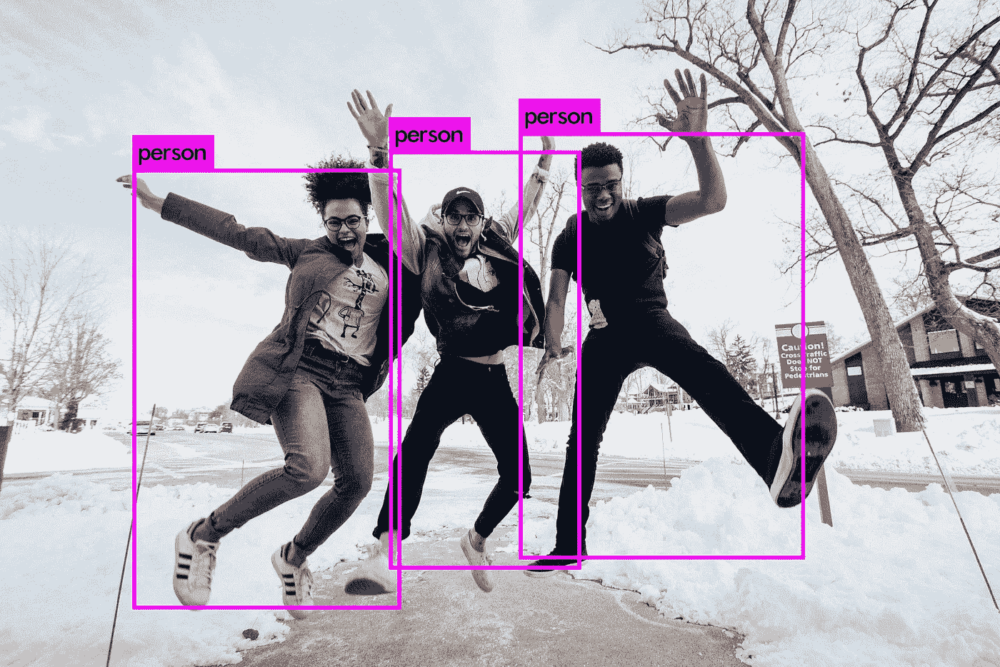
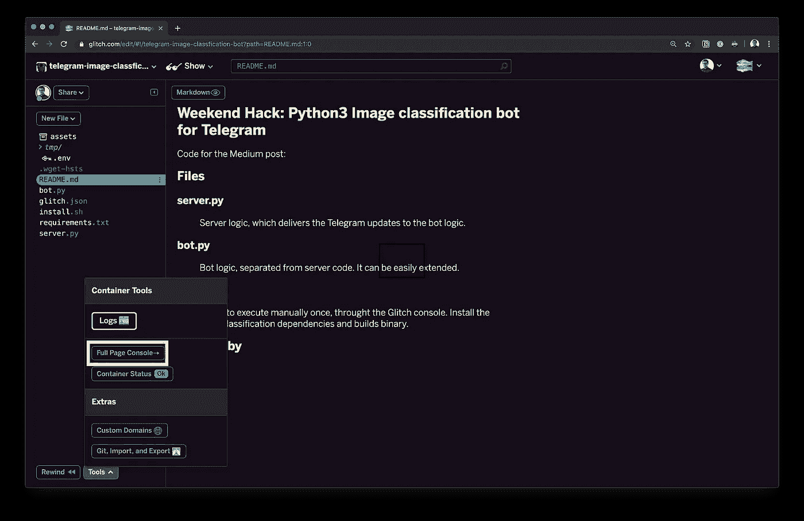
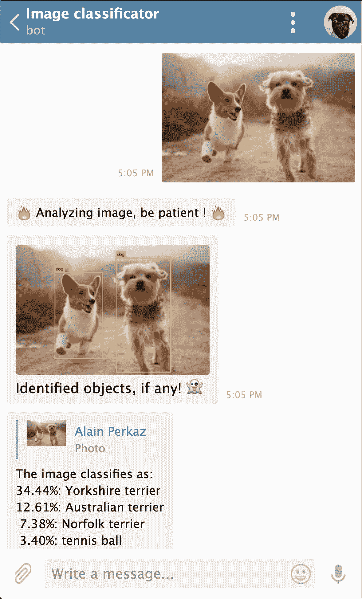
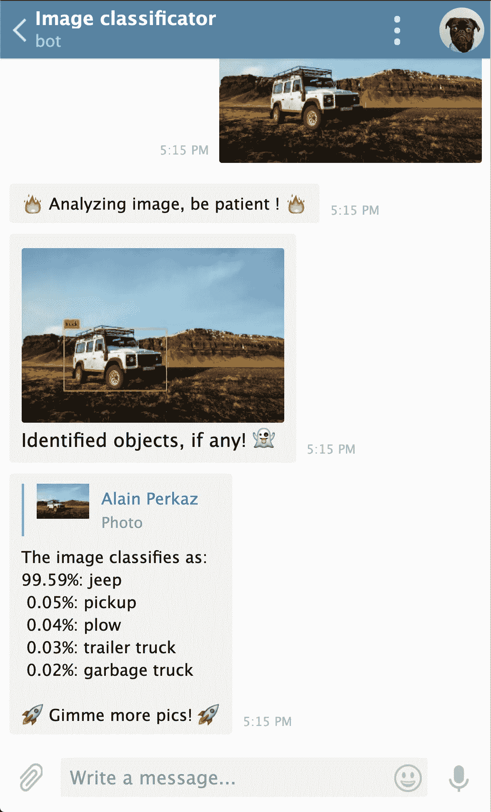

# 周末黑客:使用 Python 为 Telegram 构建一个图像识别机器人

> 原文：<https://towardsdatascience.com/weekend-hack-building-an-image-recognition-bot-for-telegram-using-python-958646b4c4e5?source=collection_archive---------11----------------------->



Object recognition with our bot. Original image by [Zachary Nelson](https://unsplash.com/@zacharytnelson?utm_source=unsplash&utm_medium=referral&utm_content=creditCopyText) on [Unsplash](https://unsplash.com/search/photos/people?utm_source=unsplash&utm_medium=referral&utm_content=creditCopyText)

这篇文章的目标是用 Python 构建一个电报机器人，它使用**神经网络**执行**图像识别**。本文分为三个主要部分:简介、技术选择和分步设置。

这篇文章是**周末黑客**系列的第四个实例，这是一系列关于探索新概念的简短开发故事。聚焦于**边做边学**，提供了分步说明。

# 介绍

**自动图像识别**(例如。对象识别和图像分类)可以为商业提供巨大的价值。如果你运行一个论坛、约会应用或任何用户上传内容的平台，自动识别图像可能是至关重要的。好处是双重的:

一方面，它**为最终用户**提供价值，允许他们通过分类主题对图像进行搜索，同时避免繁琐的手动分类任务。一个实际的例子是 Unsplash 搜索功能，[通过主题](https://unsplash.com/search/photos/flower)搜索高质量的图像。

另一方面，自动图像识别**也为系统所有者提供价值，**因为它允许[过滤掉包含裸体的图像](https://algorithmia.com/algorithms/sfw/NudityDetectioni2v)。简而言之，它允许以自动化的方式提高所提供服务的质量。好吧？

正如我们所见，应用程序是无止境的，好处是显而易见的。主要问题仍然是，为这项任务选择哪种解决方案？存在大量第三方解决方案，以及从开源或专有软件构建自己的图像识别管道的可能性。在下一部分，**我们将探索不同的选择**。

# 技术选择

如上所述，有无数的供应商使用 API 提供图像和视频识别:[谷歌视觉](https://cloud.google.com/vision/)、[亚马逊识别](https://aws.amazon.com/rekognition/)、[澄清](https://www.clarifai.com/) …一个主要问题是，我的数据会安全吗？正如谷歌在其[数据使用常见问题](https://cloud.google.com/vision/docs/data-usage)中所说:

> 当您将图像发送到 Cloud Vision API 时，我们必须将该图像存储一小段时间，以便执行分析并将结果返回给您。**存储的图像通常会在几小时内被删除**。Google 还会临时记录一些关于您的 Vision API 请求的元数据(例如收到请求的时间和请求的大小)，以改善我们的服务并打击滥用行为。

> “秘密删除”…秘密是什么意思？

如果您担心数据所有权和隐私，也可以选择利用现有技术构建自己的图像识别管道。开源中也有一堆替代方案: [TensorFlow](https://www.tensorflow.org/) 、 [Darknet](https://pjreddie.com/darknet/) 、 [MLpack](http://mlpack.org/) 、[Keras](https://keras.io/)……这些方案可以让你更好地控制图像数据所有权的归属。

在本教程中，我们将**专注于使用 [Darnet](https://pjreddie.com/darknet/) 构建我们自己的图像分类器和对象识别机器人**。我们将在 [**Glitch**](https://glitch.com/) 中设置一个用 Python 编写的电报机器人来与图像分类器接口。

用户流程将如下:选择一张图片，并将其发送到我们的电报机器人。它会对其进行分类和物体识别，并将结果发送给我们。简单对吗？

Easier said than done…

# 逐步设置

好吧，让我们开始吧！

## 1.设置 Python bot 的 bot 框架

为了不重复我自己，我将建议你按照下面帖子中给出的一步一步的说明来做。按照前两个步骤，根据自己的喜好修改应用程序名称。不要太关注机器人句柄，因为我们稍后会添加一个特定的句柄来处理收到的图片。

[](https://medium.com/@alainperkaz_51714/weekend-hack-building-an-unsplash-bot-for-telegram-with-python-5d63d2d9620d) [## 周末黑客:用 Python 为 Telegram 构建一个 Unsplash bot

### 使用 Python 和 Glitch 构建您的第一个电报机器人，它提供来自 Unsplash 的高分辨率图像！

medium.com](https://medium.com/@alainperkaz_51714/weekend-hack-building-an-unsplash-bot-for-telegram-with-python-5d63d2d9620d) 

## 2.添加暗网

为了分析发送给机器人的图像，首先我们需要安装和构建 Darknet。**所有的安装命令都可以在[故障项目](https://glitch.com/~telegram-image-classfication-bot)的`install.sh`文件**中找到。

要输入命令，在我们的 Glitch 项目中选择**工具>全页控制台**。



Select the Full Page Console to install Darknet

要安装 Darknet，请导航至**。Glitch 应用程序中的数据**目录。这是至关重要的，因为当你的 Glitch 应用程序进入睡眠状态时，这个目录将被保留！

```
cd .data
git clone [https://github.com/pjreddie/darknet.git](https://github.com/pjreddie/darknet.git)
cd darknet
make
```

值得一提的是，虽然你可以训练你自己的模型(并且应该，[取决于用例](https://www.youtube.com/watch?v=X813AkGuPDE)，但是这通常是一个计算量非常大的操作。考虑到我们将在**故障**实例中运行我们的机器人，而**的能量和空间**非常有限(1 个 CPU、512 个 RAM、200 MB 存储空间)，训练模型是非常不可行的。

对于我们的情况，使用预先训练的模型权重是最好的解决方案。我们将使用以前训练中产生的现有重量，使我们能够快速达到速度。我们将下载两个权重文件， **darknet19.weights** 用于图像分类，而 **yolov3-tiny.weights** 用于对象识别。

```
# execute in the ./darkent directory
wget [https://pjreddie.com/media/files/darknet19.weights](https://pjreddie.com/media/files/darknet19.weights)
wget [https://pjreddie.com/media/files/yolov3-tiny.weights](https://pjreddie.com/media/files/yolov3-tiny.weights)
```

请注意，由于目前 Glitch 中可用的空间和 CPU 能力的限制，我们选择了相当小的权重文件。如果您在另一个更强大的环境中运行，请随意尝试其他权重([图像分类](https://pjreddie.com/darknet/imagenet/)、[对象检测](https://pjreddie.com/darknet/yolo/))。你也会得到更好的结果！

## 3.装上电线

太好了，现在我们已经准备好了我们的机器人框架，并且安装了暗网，我们可以把它连接起来了。我不会解释每一行代码，完整的注释代码可以查看 [**故障项目**](https://glitch.com/~telegram-image-classfication-bot) 。

下面是**主处理程序**的代码摘录(注意它使用了助手函数)。每当有新图片发送到机器人时，它就会被触发。

```
[@bot](http://twitter.com/bot).message_handler(content_types=['photo'])
def handle(message): # extract the image name for further operations
  image_name = save_image_from_message(message)

  # execute object recognition
  object_recognition_image(image_name) # send object recognition results
  bot.send_photo(message.chat.id, open('.data/darknet/predictions.jpg','rb'), 'Identified objects')

  # execute image classification
  classification_list_result = classify_image(image_name)

  # send classification results
  output = 'The image classifies as:\n'
  for result in classification_list_result:
    output += result
  output += '\n🚀 Gimme more pics! 🚀'

  bot.reply_to(message, output)

  # remove picture from server
  cleanup_remove_image(image_name);
```

完整的源代码可从以下网址获得:

 [## 电报图像分类机器人

### 电报图像分类机器人🎏Glitch 是一个友好的社区，每个人都可以在这里发现和创建最好的应用程序…

glitch.com](https://glitch.com/~telegram-image-classfication-bot) 

## 4.测试机器人

完美，现在我们准备好了，让我们做一些测试！

我们 bot 的电报 **ID** 是:***@ wh _ image _ classicator _ bot，*** 随便测试一下。分类和识别能力受到现有技术限制的限制，但结果令人鼓舞。



Classification and object recognition on dog picture



Classification and object recognition on 4x4 picture

## 摘要

按需图像识别 API 提供了无与伦比的功能，但当隐私或离线处理至关重要时，自定义图像识别管道是一个很好的替代方案。

请注意，我们的示例只是触及了表面，使用其他训练集和方法可以实现更准确的图像识别。

## 资源

*   故障项目→[https://glitch.com/~telegram-image-classfication-bot](https://glitch.com/~telegram-image-classfication-bot)
*   暗网文件→【https://pjreddie.com/darknet /

其他**周末黑**帖子:

[](https://medium.com/@alainperkaz_51714/weekend-hack-building-an-unsplash-bot-for-telegram-with-python-5d63d2d9620d) [## 周末黑客:用 Python 为 Telegram 构建一个 Unsplash bot

### 使用 Python 和 Glitch 构建您的第一个电报机器人，它提供来自 Unsplash 的高分辨率图像！

medium.com](https://medium.com/@alainperkaz_51714/weekend-hack-building-an-unsplash-bot-for-telegram-with-python-5d63d2d9620d)