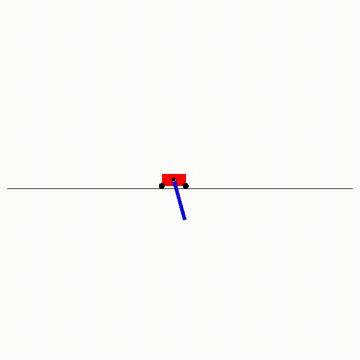
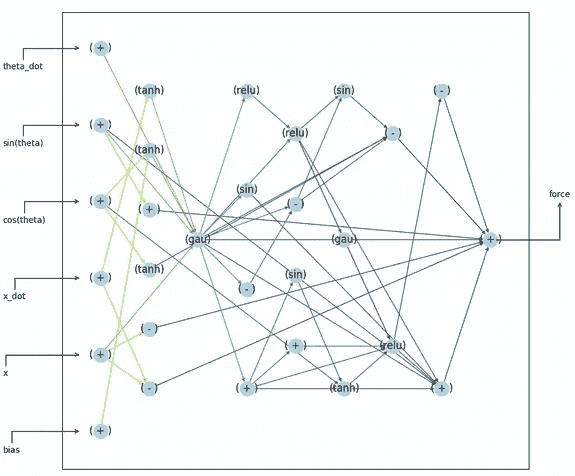

# 重量不可知的神经网络

> 原文：<https://towardsdatascience.com/weight-agnostic-neural-networks-fce8120ee829?source=collection_archive---------16----------------------->

你有没有想过为什么大多数哺乳动物出生后就能完成相当复杂的任务，比如走路？他们还没有时间体验这个世界，所以他们显然还没有学会如何表演动作。他们的大脑必须预先布线才能行走，但如果大脑结构依赖于特定的重量，那么从经验中学习的个体可能在出生后不久就失去行动能力，或者永远不会有能力开始。

受此启发，亚当·盖尔和大卫·哈向世界介绍了[重量不可知神经网络](https://arxiv.org/pdf/1906.04358.pdf) (WANN)，这是一种开发神经网络的进化策略，可以独立于连接的重量执行任务*。*

在这篇文章中，我们将简要介绍重量不可知的神经网络，并使用代码实现在月球着陆器健身房环境中训练我们自己的 WANNs。

# 整洁的

本文的进化策略是建立在 [*神经进化的扩充拓扑*](http://nn.cs.utexas.edu/downloads/papers/stanley.cec02.pdf) (NEAT)之上的。NEAT 是*遗传算法* (GA)的一种，通过改变智能体的结构对其进行变异:可以添加或删除节点和连接，可以改变节点和连接权重的激活函数；换句话说，它们的*拓扑*是*的扩充*。

代理，在这种情况下是神经网络，根据他们在特定任务中的表现进行排序。

# 沃恩

本文的目的是使用 NEAT 的进化策略来开发网络，该网络在给定的任务和一定的权重值范围内表现良好。不同于标准反向传播中使用精确调整的权重来执行任务，网络结构将进化以促进任务解决方案。

作者通过消除连接权重的突变来构建 NEAT，而不是通过增加连接、增加权重或改变节点的激活函数来进化网络。连接权重设置为共享值。

此外，用各种共享权重来评估代理的性能。通过使用性能的平均值对代理进行排序，可以开发出这样的网络，在该网络中，*结构*使得任务能够被完成，*而不是权重*。

# 探索代码

作者开源了他们的代码，你可以在 [Google GitHub](https://github.com/google/brain-tokyo-workshop) 上找到。我们将使用这个代码的[改编版本来训练和探测网络。](https://github.com/TTitcombe/brain-tokyo-workshop)

WANN 进化策略的本质产生了具有许多跳跃连接的稀疏网络。这种结构不容易与 PyTorch 和 TensorFlow 等流行的 ML 库兼容，这些库将反向传播作为学习机制。因此，编写代码时没有使用这些库，也没有使用 GPU。然而，由于 WANN generation 评估程序是令人尴尬的并行*，正如作者所说，我们可以在训练时使用多核。*

**注意:如果你不确定你的机器有多少个 CPU 核心，进入系统设置(Windows)或者在终端中输入*`lscpu`*(Ubuntu)**

*首先，我们将探索代码中提供的一个预先训练好的网络。这里有两足步行机、小车回转、搬运环境以及解决 MNIST 问题的“冠军”。*

*使用`git clone https://github.com/TTitcombe/brain-tokyo-workshop.git`获取代码的本地副本，并导航到**brain-Tokyo-workshop/wann release/prettyNeatWann**目录。*

*作者提供了一系列在健身房环境中预先训练的“冠军”。我们可以运行 *CartPoleSwingUp* 冠军*

```
*python wann_test.py -p p/swingup.json -i champions/swing.out --nReps 1 --view True*
```

*这段代码运行网络，在[-2，2]范围内的共享权重值之间循环，证明网络能够独立于权重值运行，如下所示。*

**

*All shared weight values perform equally, but some perform more equally than others*

*显然，该模型对所有共享权重值的表现并不一样好，其最佳表现也不是完美的，但是我们对各种权重都有半成功的策略—非 WANN 模型对权重变化的鲁棒性不如此。*

*最终的适应值表明，尽管在共享权重值上存在一些性能变化，但是无论具体值如何，网络的性能通常都很好。*

**

# *可视化网络*

*该团队还提供了可视化网络的代码。我们可以执行一个简短的脚本来查看 *SwingUp* 冠军:*

```
*import matplotlib.pyplot as pltfrom vis.viewInd import viewInd viewInd("champions/swing.out", "swingup")
plt.show()*
```

**

*由于稀疏连接和跳跃连接，它比传统的神经网络更混乱，但它更容易解释，因为激活函数和结构已经过显式优化。*

*该网络最引人注目的特征是`x`参数(手推车的位置)几乎与计算力的输出节点直接相连，只被一个具有反向激活功能的隐藏神经元截获。这条线的作用是提供一个朝向屏幕中心的力*，而不考虑共享重量值*的符号:网络已经学会了如何以重量不可知的方式将手推车送到中心。*

*事实上，这种模式出现了两次；也许网络了解到权重值占据很小的范围，因此不会产生强大的力，因此网络通过加倍模式来加倍向内的力。如果是这种情况，网络并不完全是权重不可知的，但是在更大范围的权重值上训练网络可以补救这一点。*

*第二，几个节点经过一个早期层中具有高斯激活函数的节点。高斯激活函数关于 y 轴对称，因此对于 *x* 和 *-x:* 输出相同的结果。该节点对于权重的符号是不可知的。*

**

*The gaussian activation function*

*另一个经常出现的激活函数是正弦函数( *sin* )。其循环模式使得输出在某种程度上与输入幅度无关。具有输入无关区域的激活函数的流行可能是权重不可知论的网络优化的直接结果。*

# *训练我们自己的人*

*代码为*摇摆*、*行走*、*两足行走*和一个 MNIST 分类任务提供了训练脚本。我们将在 [*月球登陆者*开放的健身房环境](https://gym.openai.com/envs/LunarLanderContinuous-v2/)中训练一名 WANN，以证明那些任务并不是因为天生适合 WANN 而选择的。*

*首先，我们在[域配置](https://github.com/TTitcombe/brain-tokyo-workshop/blob/master/WANNRelease/prettyNeatWann/domain/config.py)中创建一个“lunar”任务，指定有 8 个输入和 2 个输出。此外，我们为所有输入和输出神经元设置一个线性激活函数，并允许隐藏神经元使用任何激活函数。*

*然后，我们通过复制[“laptop _ swing”配置 json](https://github.com/TTitcombe/brain-tokyo-workshop/blob/master/WANNRelease/prettyNeatWann/p/laptop_swing.json) 来定义训练算法的参数，我们称之为“laptop_lunar”，只是将任务从“swingup”更改为“lunar”。该配置文件指定了要运行的代数和群体中的代理数，以及其他因素。我们只是运行一个轻量级实验来演示如何做到这一点，所以我们可以保持参数较小。*

*现在，我们开始训练:*

```
*python wann_train.py -p p/laptop_lunar.json -n 2 -o lunar*
```

*指定应该使用我的两个内核；如果你有更多，就用它们。*

*在我那台有点过时的 i7 上，平均每一代运行一分钟左右(这开始于 10 秒，但随着网络越来越擅长这项任务而稳步增长，因此不会很快失败)。结果，我只完成了 300 个纪元，就不得不占用我的 CPU 来完成其他任务。然而，网络很早就成功地完成了这项任务:300 个周期后，着陆器可以安全着陆。*

**

# *结论和后续步骤*

*权重不可知的神经网络论文提出了一种通过在网络结构中直接编码解决方案来开发更多可解释网络的方法。与反向传播相比，WANNs 对节点输入的变化具有很强的鲁棒性，这可以形成对恶意攻击甚至是破坏网络的强大防御的基础。*

*为了那些致力于人工智能的人，WANNs 向我们展示了一种编码智慧和行为的方法，就像在动物王国里发生的一样。*

*从一开始就为代理人提供非零智能，可以让他们比其他方式更快地利用自己的经验。我很有兴趣看到通过反向传播对 WANNs 进行微调与从头开始训练模型进行比较。*