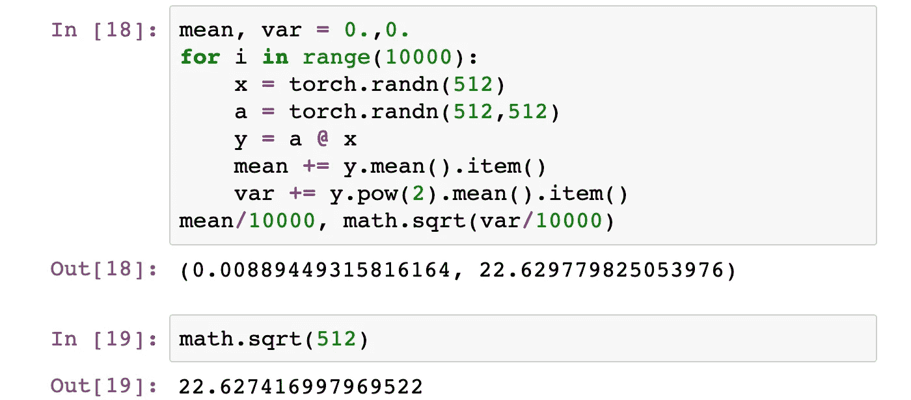
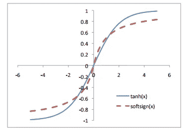
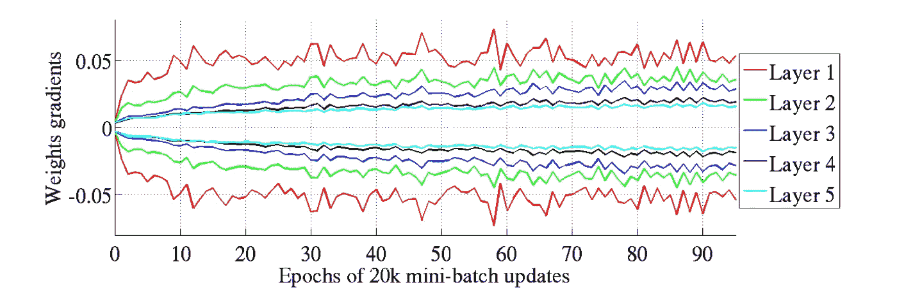
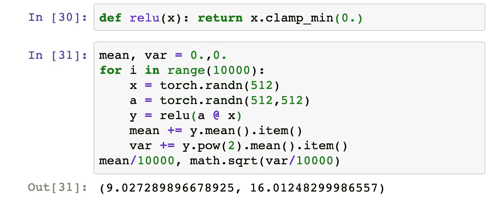

# 神经网络中的权重初始化:从基础到明凯的旅程

> 原文：<https://towardsdatascience.com/weight-initialization-in-neural-networks-a-journey-from-the-basics-to-kaiming-954fb9b47c79?source=collection_archive---------1----------------------->

我想邀请你和我一起探索初始化神经网络层权重的不同方法。一步一步地，通过各种简短的实验和思考练习，我们将发现为什么足够的权重初始化在训练深度神经网络中如此重要。在这一过程中，我们将涵盖研究人员多年来提出的各种方法，并最终深入探讨最适合您最有可能使用的当代网络架构的方法。

下面的例子来自我自己对一套笔记本的[重新实现](https://nbviewer.jupyter.org/github/jamesdellinger/fastai_deep_learning_course_part2_v3/blob/master/02_fully_connected_my_reimplementation.ipynb?flush_cache=true)，这套笔记本是[杰瑞米·霍华德](https://www.usfca.edu/faculty/jeremy-howard)在[fast . ai 深度学习第二部分课程的最新版本](https://www.fast.ai/2019/03/06/fastai-swift/)中涵盖的，目前[正在 2019 年春天在 USF 的数据研究所](https://www.usfca.edu/data-institute/certificates/deep-learning-part-two)举行。

## 为什么要初始化权重

权重初始化的目的是防止层激活输出在正向通过深度神经网络的过程中爆炸或消失。如果出现任何一种情况，损耗梯度要么过大，要么过小，不利于回流，网络将需要更长时间才能收敛，如果网络能够收敛的话。

矩阵乘法是神经网络的基本数学运算。在具有几层的深度神经网络中，一次正向传递只需要在每层的输入和权重矩阵之间执行连续的矩阵乘法。一层的乘法结果成为下一层的输入，以此类推。

为了说明这一点，让我们假设我们有一个包含一些网络输入的向量 **x** 。在训练神经网络时，这是标准做法，以确保我们的输入值按比例调整，使它们落入均值为 0、标准差为 1 的正态分布中。


让我们假设我们有一个简单的 100 层网络，没有激活，并且每一层都有一个矩阵 **a** 包含该层的权重。为了完成一次前向传递，我们必须在 100 层中的每一层执行层输入和权重之间的矩阵乘法，这将产生总计 *100* 次连续矩阵乘法。

事实证明，从我们将输入缩放到的同一标准正态分布初始化图层权重值从来都不是一个好主意。为了了解原因，我们可以通过我们假设的网络模拟一次向前传递。


哇哦。在这 100 次乘法中的某处，层输出变得如此之大，以至于计算机都无法识别它们的标准差和平均值。我们实际上可以看到这发生了多长时间。


激活输出在我们网络的 29 层内爆炸。我们显然将权重初始化得太大了。

不幸的是，我们还必须担心防止图层输出消失。为了了解当我们将网络权重初始化得过小时会发生什么情况，我们将调整权重值，这样，虽然它们仍处于平均值为 0 的正态分布中，但它们的标准偏差为 0.01。


在上述假设的向前传递过程中，激活输出完全消失。

综上所述，如果权重初始化过大，网络学习效果不会很好。当权重初始化过小时，也会发生同样的情况。

## 如何才能找到最佳点？

请记住，如上所述，完成神经网络正向传递所需的数学只需要一系列矩阵乘法。如果我们有一个输出 **y** ，它是我们的输入向量 **x** 和权重矩阵 **a** 之间的矩阵乘法的乘积，则 **y** 中的每个元素 *i* 被定义为


其中 *i* 是权重矩阵 **a** 的给定行索引， *k* 既是权重矩阵 **a** 的给定列索引，也是输入向量 **x** 的元素索引， *n* 是 **x** 中元素的范围或总数。这也可以在 Python 中定义为:

```
y[i] = sum([c*d for c,d in zip(a[i], x)])
```

我们可以证明，在给定的层，我们从标准正态分布初始化的输入矩阵 **x** 和权重矩阵 **a** 的矩阵乘积，平均起来，具有非常接近输入连接数量的平方根的标准偏差，在我们的示例中为√512。



如果我们从矩阵乘法是如何定义的角度来看待它，这一特性并不令人惊讶:为了计算 **y** ，我们对输入 **x** 的一个元素与一列权重 **a** 的逐元素乘法的 512 个乘积求和。在我们的示例中，使用标准正态分布对 **x** 和 **a** 进行初始化，这 512 个产品中的每一个的平均值为 0，标准差为 1。


因此，这 512 个产品的*和*的平均值为 0，方差为 512，因此标准差为√512。

这就是为什么在上面的例子中，我们看到我们的层输出在 29 次连续矩阵乘法后爆炸。在我们最基本的 100 层网络架构的情况下，我们希望每层的输出具有大约 1 的标准偏差。可以想象，这将允许我们在尽可能多的网络层上重复矩阵乘法，而不会出现激活爆炸或消失。

如果我们首先通过将所有随机选择的值除以√512 来缩放权重矩阵 **a** ，填充输出 **y** 的一个元素的逐元素乘法现在平均起来只有 1/√512 的方差。


这意味着矩阵 **y** 的标准偏差将是 1，该矩阵包含通过输入 **x** 和权重 **a** 之间的矩阵乘法生成的 512 个值中的每一个。让我们用实验来证实这一点。


现在让我们重新运行我们的快速和肮脏的 100 层网络。与之前一样，我们首先从[-1，1]内的标准正态分布中随机选择层权重，但这次我们将这些权重缩放 1/√ *n* ，其中 *n* 是一层的网络输入连接数，在我们的示例中为 512。


成功！我们的层输出既没有爆炸也没有消失，即使在我们假设的 100 层之后。

虽然乍一看，我们似乎可以到此为止了，但现实世界的神经网络并不像我们的第一个例子所显示的那样简单。为了简单起见，省略了激活函数。然而，我们在现实生活中从来不会这样做。正是由于在网络层的末端放置了这些非线性激活函数，深度神经网络能够创建描述现实世界现象的复杂函数的近似逼近，然后这些函数可以用于生成令人震惊的预测，例如手写样本的分类。

## Xavier 初始化

直到几年前，最常用的激活函数都是关于一个给定值对称的，并且其范围渐近地接近与该中点正/负一定距离的值。双曲线正切函数和软设计函数就是这类激活的例子。



Tanh and softsign activation functions. Credit: Sefik Ilkin Serengil’s [blog.](https://sefiks.com/2017/11/10/softsign-as-a-neural-networks-activation-function/)

我们将在假设的 100 层网络的每一层后添加一个双曲正切激活函数，然后看看当我们使用我们自己开发的权重初始化方案时会发生什么，其中层权重按 1/√ *n.*


第 100 层的激活输出的标准偏差下降到大约 0.06。这绝对是小的方面，但至少激活没有完全消失！

回想起来，发现我们的本土体重初始化策略的旅程似乎很直观，但您可能会惊讶地听到，直到 2010 年，这还不是初始化体重层的常规方法。

当 Xavier Glorot 和 Yoshua Bengio 发表了他们题为 [*理解训练深度前馈神经网络*](http://proceedings.mlr.press/v9/glorot10a/glorot10a.pdf) 的难度的里程碑式论文时，他们将其实验与“常用的启发式方法”进行比较，该方法是从[-1，1]中的*均匀*分布初始化权重，然后按 1/√ *n* 进行缩放。

事实证明，这种“标准”方法实际上并不那么有效。


用“标准”权重初始化重新运行我们的 100 层双曲正切网络导致激活梯度变得极小——它们几乎就像消失了一样。

这种糟糕的性能实际上促使 Glorot 和 Bengio 提出了他们自己的权重初始化策略，他们在论文中称之为“规范化初始化”，现在被普遍称为“Xavier 初始化”。

Xavier 初始化将层的权重设置为从随机均匀分布中选择的值，该分布介于


其中 *nᵢ* 是该层的传入网络连接数，或称“扇入”，而 *nᵢ₊₁* 是该层的传出网络连接数，也称为“扇出”

Glorot 和 Bengio 认为 Xavier 权重初始化将保持激活的方差和反向传播的梯度沿着网络的层向上或向下。在他们的实验中，他们观察到 Xavier 初始化使 5 层网络能够在各层之间保持几乎相同的权重梯度方差。


With Xavier init. Credit: [Glorot & Bengio](http://proceedings.mlr.press/v9/glorot10a/glorot10a.pdf).

相反，使用“标准”初始化导致网络较低层的权重梯度(较高)和最高层的权重梯度(接近于零)之间的方差差距更大。



Without Xavier init. Credit: [Glorot & Bengio](http://proceedings.mlr.press/v9/glorot10a/glorot10a.pdf).

为了证明这一点，Glorot 和 Bengio 证明了用 Xavier 初始化的网络在 [CIFAR-10 图像分类任务](https://www.cs.toronto.edu/~kriz/cifar.html)中实现了更快的收敛和更高的精度。

让我们再次运行我们的 100 层 tanh 网络，这次使用 Xavier 初始化:


在我们的实验网络中，Xavier 初始化的执行与我们之前导出的自制方法完全相同，在该方法中，我们从随机正态分布中采样值，并根据传入网络连接数的平方根进行缩放， *n* 。

## 明凯初始化

从概念上讲，当使用关于零对称且输出在[-1，1]内的激活函数(如 softsign 和 tanh)时，我们希望每层的激活输出平均值为 0，平均标准偏差约为 1。这正是我们自己开发的方法和 Xavier 所实现的。

但是如果我们使用 ReLU 激活函数呢？想要以同样的方式缩放随机初始权重值还有意义吗？


ReLU activation function. Credit: Kanchan Sarkar’s [blog](https://medium.com/@kanchansarkar/relu-not-a-differentiable-function-why-used-in-gradient-based-optimization-7fef3a4cecec).

为了了解会发生什么，让我们在假设的网络层中使用 ReLU 激活代替 tanh，并观察其输出的预期标准偏差。



事实证明，当使用 ReLU 激活时，单个层的平均标准偏差非常接近输入连接数目的平方根*除以两个*的平方根，或者我们示例中的√512/√2。


通过这个数字缩放权重矩阵 **a** 的值将导致每个单独的 ReLU 层平均具有 1 的标准偏差。


正如我们之前所展示的，将层激活的标准偏差保持在 1 左右将允许我们在深度神经网络中堆叠几个层，而不会出现梯度爆炸或消失。

这种对如何最好地初始化具有类 ReLU 激活的网络中的权重的探索是明凯等人的动机。艾尔。为了[提出他们自己的初始化方案](https://arxiv.org/pdf/1502.01852.pdf)，这是为使用这种非对称、非线性激活的深度神经网络定制的。

在他们 2015 年的论文中，何等人。艾尔。证明了如果采用以下输入权重初始化策略，深度网络(例如 22 层 CNN)将更早收敛:

1.  创建一个张量，其维数适合给定层的权重矩阵，并使用从标准正态分布中随机选择的数字填充它。
2.  将每个随机选择的数字乘以 *√* 2/ *√n* ，其中 *n* 是从前一层的输出进入给定层的传入连接数(也称为“扇入”)。
3.  偏置张量被初始化为零。

我们可以按照这些指导来实现我们自己版本的明凯初始化，并验证如果在我们假设的 100 层网络的所有层使用 ReLU，它确实可以防止激活输出爆炸或消失。


作为最后的比较，下面是如果我们使用 Xavier 初始化会发生什么。


哎哟！当使用 Xavier 初始化权重时，激活输出在第 100 层时几乎完全消失了！

顺便提一下，当他们训练使用 ReLUs 的更深层次的网络时，他等。艾尔。发现一个使用 Xavier 初始化的 30 层 CNN 完全失速，根本不学习。然而，当同一个网络按照上述三步程序初始化时，它的收敛速度大大提高。


Convergence of a **30-layer** CNN thanks to Kaiming init. Credit: [He et. al.](https://arxiv.org/pdf/1502.01852.pdf)

这个故事对我们的启示是，我们从头开始训练的任何网络，尤其是用于计算机视觉应用的网络，几乎肯定会包含 ReLU 激活功能，并且有几层深度。在这种情况下，明凯应该是我们的首要策略。

## 是的，你也可以成为一名研究员

更重要的是，我不羞于承认，当我第一次看到泽维尔和明凯公式时，我感到害怕。他们各自的平方根是 6 和 2，我不禁觉得他们一定是某种神谕智慧的结果，我自己无法理解。让我们面对现实吧，有时候深度学习论文中的数学看起来很像象形文字，只是没有 T2 罗塞塔石碑来帮助翻译。

但我认为，我们在这里的旅程向我们表明，这种受到威胁的下意识反应虽然完全可以理解，但绝不是不可避免的。尽管明凯和(尤其是)Xavier 的论文确实包含了相当多的数学内容，但我们亲眼目睹了实验、经验观察和一些简单的常识如何足以帮助推导出支撑当前最广泛使用的权重初始化方案的核心原则集。

换句话说:当有疑问时，鼓起勇气，尝试一下，看看会发生什么！