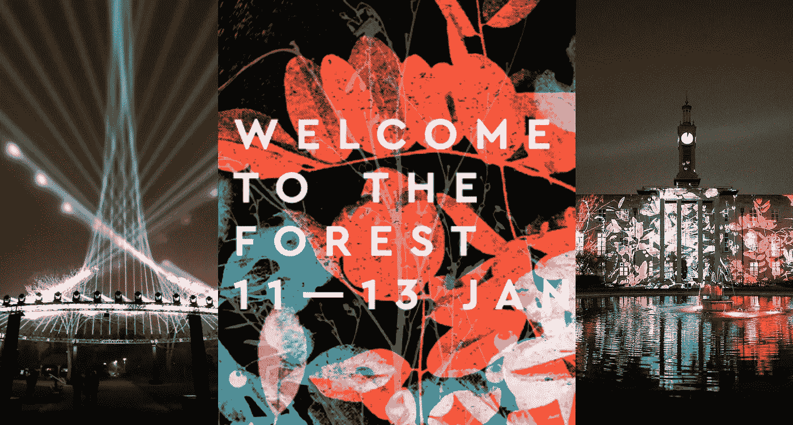
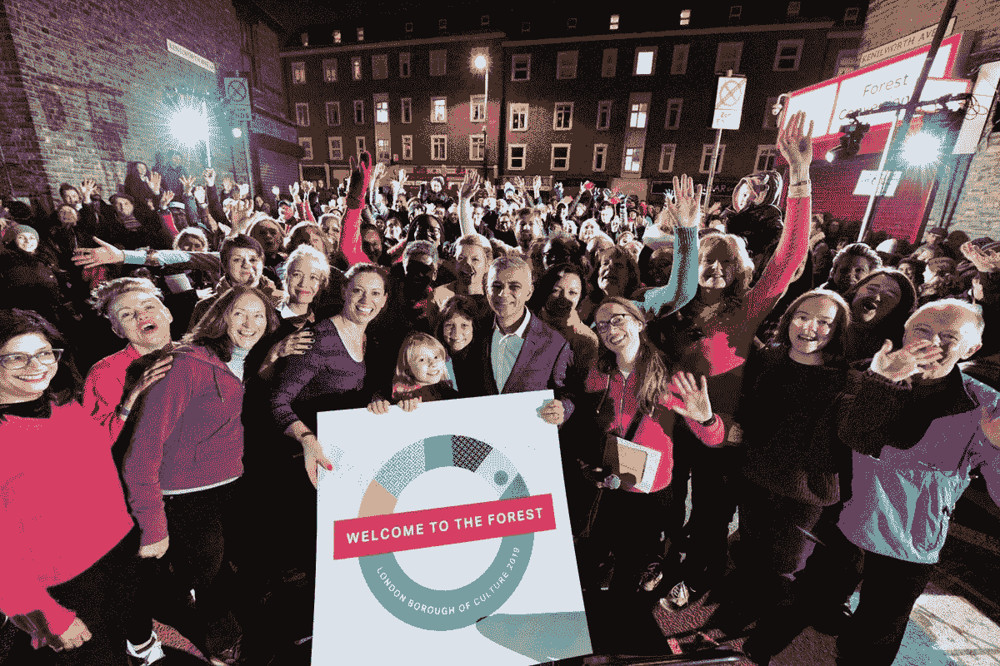
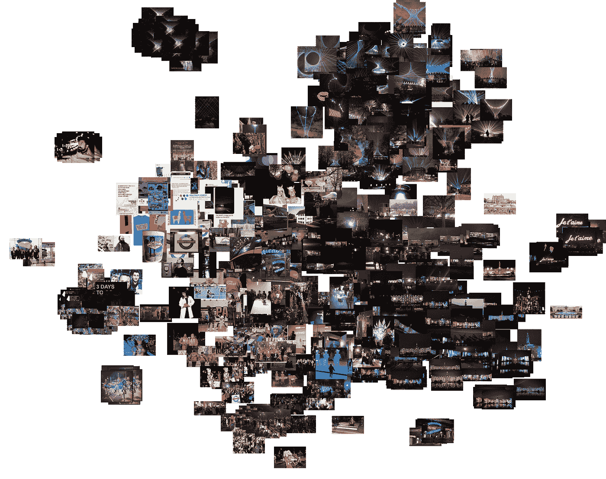

# 欢迎来到森林。伦敦文化区 2019 推特分析

> 原文：<https://towardsdatascience.com/welcome-to-the-forest-london-borough-of-culture-2019-twitter-analysis-9ea25cf4f033?source=collection_archive---------20----------------------->

## 欢迎来到森林。我们有乐趣和游戏！

上周末，2019 年 1 月 11 日星期五至 1 月 13 日星期日，伦敦的沃尔瑟姆森林区举办了为期三天的大型活动，庆祝被选为有史以来第一个市长伦敦文化区。该活动名为[欢迎来到森林](https://wfculture19.co.uk/welcome-to-the-forest)，被描述为“沃尔瑟姆森林有史以来最大的派对，每个人都被邀请”。

家庭和孩子聚集在森林里，伦敦市长萨迪克·汗和主管文化的副市长贾丝汀·西蒙斯和他们所有的伙伴也是如此！数百名来自当地艺术机构和音乐家的人士也做出了贡献。听起来很有趣，对吧？

事实上，每个人都被邀请了，但不幸的是，我没能参加聚会！因此，为了克服我的 FOMO，我决定使用官方标签#WelcometotheForest 收集 3300 条关于该活动的推文。这篇博文展示了我的分析结果。

请向下滚动，通过数据可视化查看我的分析！

## 数据和方法

组织者推广的官方标签是#WelcometotheForest。在事件发生时，我使用 [Twitter API](https://developer.twitter.com/en/docs/developer-utilities/twitter-libraries.html) 收集了 3300 条包含这个标签的推文。需要注意的是，我只收集了包含# WelcometotheForest 的推文。当然，有许多关于欢迎来到森林的推文不包含这个标签。

在收集了这些推文之后，我运用了一系列先进的统计和机器学习技术——特别是自然语言处理和计算机视觉——来帮助我更详细地了解这个事件。

具体来说，我使用[谷歌云自然语言 API](https://cloud.google.com/natural-language/) 来计算每条推文的情感，然后我使用 [gensim 库的 Word2Vec 模型](https://radimrehurek.com/gensim/models/word2vec.html)来对推文的整个语料库进行语义分析，此外，我还使用[谷歌云的视觉 API](https://cloud.google.com/vision/docs/) 来检测关于在线上传的每张图像的特征和标签，最后，我使用预训练的卷积神经网络来进行特征提取和反向图像搜索，以基于视觉相似性对这些图像进行聚类。

多拗口啊！

## 分析推文

我分析的主要内容来自我通过 Twitter API 收集的 3300 条推文。下面，我报告以下五个指标:

1.  每天和每小时的推文数量；
2.  每天推文的平均情绪；
3.  推文中排名前 10 的单词和标签；
4.  基于语义学习的“WelcometotheForest”热门词汇：
5.  基于视觉相似性的《欢迎来到森林》最受欢迎的图片。

## 推特频率

下面的条形图显示了从活动前的周三到活动后的周三(1 月 9 日至 16 日)的所有推文。“欢迎来到森林”最受欢迎的一天是 1 月 11 日星期五，有 932 条推特使用标签#WelcometotheForest。然而，很大一部分推文(全天平均 66%)是转发推文，因此在 1 月 11 日星期五实际上只有 364 条不同的推文。

Bar chart showing the number of tweets by day during the festival

一天中最繁忙的时间(活动当天的平均时间)是晚上 7 点到 10 点之间，晚上 8 点是最繁忙的时间，总共有 324 条推文(185 条没有转发)。

Bar chart showing the average tweets per hour

## 情感分析

为了判断派对是好是坏，我进行了情绪分析。每条推文的情绪是使用谷歌的云 NLP API 计算的。下面的条形图显示了每天推文的平均情绪，其中-1 表示非常消极的情绪，+1 表示非常积极的情绪。

我们看到，对森林的欢迎始于相对较高的情绪，在 1 月 10 日星期四有所下降，直到一路攀升至 0.73 的非常强烈的情绪。总体而言,《欢迎来到森林》全天的平均人气为 0.57，非常好！看来我错过了很多乐趣…

Line chart showing the average sentiment of the tweets per day

## 文本频率分析和热门标签

下面的柱状图显示了一个词和一个标签在所有推文的正文中出现的次数，分别在左边和右边。值得注意的是，因为标签也出现在推文的正文中，所以在计算词频时，它们成为了一个[混淆变量](https://en.wikipedia.org/wiki/Confounding)。因此，我采取措施将 hashtag 计数从单词计数中移除。

Bar graphs showing the count of words and hashtags appearing in all the tweets

不出所料，标签#welcometotheforest 出现得最多，然而有趣的是，标签#wfculture19 和#mylocalculture 也大量出现。即使在扣除标签数后，“wfculture19”这个词出现的次数最多，其次是“culture”，但“wfcouncil”和“erlandcooper”也获得了一些好评！

我在谷歌上快速搜索了一下这条信息，发现#wfculture19 和#mylocalculture 是官方标签，由[沃尔瑟姆森林委员会的](https://twitter.com/WFculture19)和[伦敦市长文化团队的](https://twitter.com/LDN_Culture)的推特账户推广。

然而，上述结果对于告诉我们人们对该事件的看法并不十分有用。在上面的子集里，我们只找到名词而不是形容词。因此，我使用其他机器学习技术来尝试挖掘一些形容词。

# 语义

为了从推文中获得更细致的文本理解，我使用自然语言处理和机器学习进行了语义分析。

[Word2Vec](https://en.wikipedia.org/wiki/Word2vec) 是一个神经语言机器学习模型，它将大量文本(在这种情况下，来自 3300 条推文的文本)作为输入，并输出一个向量空间，通常有数百个维度，每个唯一的单词对应于空间中的一个向量——一个单词嵌入。具体来说，空间中距离较近的物体意味着它们是相似的。“最近邻居”是来自 Word2Vec 模型的少数几个基于余弦度量相似性得分与“ *WelcometotheForest* 最相似的单词。下面的散点图显示了“*欢迎来到森林*”的最近邻居。

重要的是，“*妙不可言*”、“*好玩*”、*、【享受】、【得意】*这些词就在身边，还有*、【孩子】、*、*、【家庭】、*、*、【牵连】。这是一个非常积极的结果！统计数据表明，这些词最能代表人们在推特上谈论“欢迎来到森林”时的感受。这似乎是一个非常愉快和包容的事件！*

PCA output of the nearest neighbours of #WelcometotheForest from the Word2Vec model

## 最受欢迎的艺术品

在从推文中检索有用的文本信息后，我最终转向了图像数据。总共 3300 条推文中有 732 条附有图片。利用这些图像，我给电脑编了程序来学习它们之间的视觉相似性。一种叫做特征提取和逆向图像搜索的技术正是这样做的。

使用在 [TensorFlow 后端](https://www.tensorflow.org/guide/keras)上运行的 [Keras VGG16](https://keras.io/applications/#vgg16) 神经网络模型，我首先为数据集中的每张图像提取了一个特征。一个特征是每个图像的 4096 元素的数字数组。我们的期望是“该特征形成图像的非常好的表示，使得相似的图像将具有相似的特征”([吉恩·科岗，2018](http://ml4a.github.io/ml4a/convnets/) )。然后使用主成分分析(PCA)降低特征的维度以创建[嵌入](https://developers.google.com/machine-learning/crash-course/embeddings/video-lecture)，并且计算一个图像的 PCA 嵌入到另一个图像的距离[余弦距离](https://en.wikipedia.org/wiki/Cosine_similarity)。

现在我已经在向量空间中嵌入了每个图像，我使用了一个流行的叫做 t-SNE 的机器学习可视化算法来聚类，然后在二维空间中可视化向量空间。“tSNE 的目标是对相似数据点的小“邻域”进行聚类，同时降低数据的整体维度，以便更容易可视化”(谷歌人工智能博客，2018)。

The clustering of images of Welcome to the Forest 2019\. Source: Twitter

上图显示右上角的[棉花糖激光盛宴](https://www.marshmallowlaserfeast.com/)对*巢*的聚类非常好，右下角的*进入森林*由[Greenaway&Greenaway](http://greenawayandgreenaway.com/)进行聚类。

# 结论

所以你有它！虽然坐在我的笔记本电脑前做关于派对的研究并不能弥补我错过的所有乐趣，但我确实学到了很多关于这个活动的东西！进一步挖掘推文仍有巨大的潜力。

祝贺这样一个伟大的事件和成就，并祝今年余下的时间里伦敦文化区一切顺利！

感谢您的阅读！

Vishal

Vishal 是一名文化数据科学家，也是伦敦 UCL 学院**的研究生。他对城市文化的经济和社会影响感兴趣。你可以在*[*Twitter*](https://twitter.com/vishalkumarldn)*或者*[*LinkedIn*](https://www.linkedin.com/in/vishalkumarlondon/)*上与他取得联系。在*[*insta gram*](https://www.instagram.com/vishalkumar.london/)*或他的* [*网站*](https://vishalkumar.london/) *上看到更多 Vishal 的作品。**

*提及:[西奥·布莱克威尔](https://medium.com/u/46695cd6b9cb?source=post_page-----9ea25cf4f033--------------------------------)，[创建联营公司](https://medium.com/u/cf9c3d2f15d?source=post_page-----9ea25cf4f033--------------------------------)，[智能伦敦](https://medium.com/u/7d2469f93ef4?source=post_page-----9ea25cf4f033--------------------------------)，[伦敦博物馆](https://medium.com/u/f7d3fb326cd2?source=post_page-----9ea25cf4f033--------------------------------)，[卫报](https://medium.com/u/ec1538004a25?source=post_page-----9ea25cf4f033--------------------------------)*