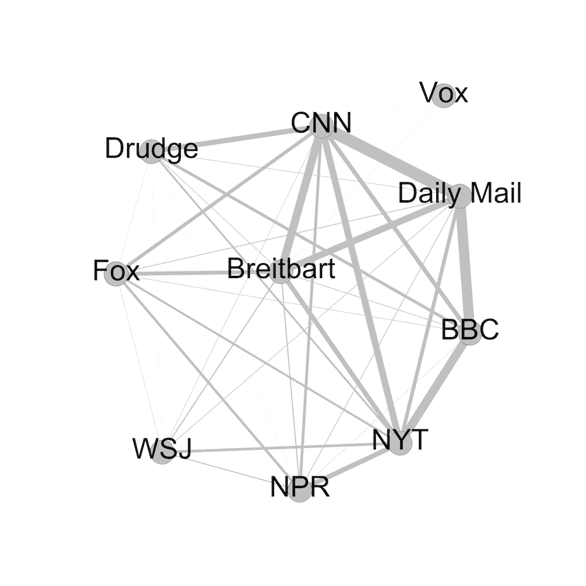

# 神经网络对新闻有什么看法

> 原文：<https://towardsdatascience.com/what-a-neural-network-has-to-say-about-the-news-e19d977f6a75?source=collection_archive---------15----------------------->

关于新闻，神经网络可以揭示什么？利用机器学习，我研究了新闻媒体中“偏见”的复杂本质，如何在人工智能中无意中出现“对意识形态的理解”，以及“声音”的差异如何影响人们消费信息的方式[1][2]。受[博士漫画](http://phdcomics.com/tv/2.minute.thesis.php)的启发，这个“1 页论文挑战”总结了我最近的论文([看这里](https://www.preprints.org/manuscript/201906.0051/v1))。

News agency relationships where line thickness is proportional to similarity.

**在发现之前，有些前后关系。语言的细微差异揭示了说话者的偏见和身份信息。当然，作者对论点的有意[【框架】](http://www.edx.org/course/framing-how-politicians-debate-delftx-frame101x-1)可以反映他们的观点，但潜意识的用词选择也可以揭示他们的信仰【3】【4】。我想知道，是否像人类一样，一种叫做神经网络的人工智能可以解释这些信号。考虑到这一点，我的电脑阅读了五个月的新闻文章*来学习“语言”模式，这样它就能以 74%的准确率猜出一篇从未见过的文章的出版商。该模型还指出了组织之间的相似性(见网络图片)，并揭示了例证机构“声音”的“原型”文章(最“像 CNN”的 CNN 文章)。考虑这些讨论气候的文章的例子:**

Articles most like their publishing agency describing climate

尽管研究通常集中在政治上，这个模型强调了新闻中的“声音”和“偏见”并不总是完全符合左与右的光谱。我将我的结果与先前存在的关于媒体意识形态和情绪极性的工作进行了比较(“具有灾难性影响的糟糕政策”带有负极性，而“英雄爱国主义的光荣行动”表现出正极性)[5][7][8]。该模型似乎理解两者的属性，但数据表明，政治或语言的“严重性”都不能单独解释该模型的全部行为[7][8]。上面的范例气候文章可能有助于展示这种复杂性:一个不太极端的情绪极性将《华尔街日报》和《NPR》联合起来，但一个从经济角度看待气候，而另一个则从科学角度看待这个问题。同样，福克斯和 CNN 在模型中有共同之处，尽管[之前的工作表明意识形态倾向的差异](https://www.journalism.org/2014/10/21/political-polarization-media-habits/)，非气候样本可能表明这两家机构使用相似的极性语言，并经常讨论犯罪【7】。简而言之，在想象新闻前景时，要考虑到不仅仅是政治决定了一个机构的声音。偏见不仅仅是向左或向右倾斜。

> 当想象新闻的前景时，要考虑到不仅仅是政治定义了一个机构的声音

这个实验还揭示了意识形态偏见是如何在机器学习中无意间出现的。我没有告诉模型去寻找政治倾向或语境化，但它仍然学习“意识形态特征”(例如，这些可能是对社会主义的积极框架或对暴力的报道倾向)。当人工智能决定用户看到什么时，“推荐者”可能会类似地学习意识形态，并越来越多地显示项目以适应用户的观点。像这样的人工智能可以降低一个来源的文章出现在用户面前的频率，并导致所谓的“过滤气泡”变得比其他情况下更强[9]。尽管系统背后的工程师从来没有打算过，但这些障碍可能会出现，尽管用户订阅了一系列广泛的渠道。类似地，在所有用户看到相同项目的其他 ML 系统中，“非中立性”可以在平台内增长以反映大多数人的偏好。当然，虽然推荐者很好地激发了这些重要的问题，但其他过滤和排名(评论权重或不适当标志)的机器学习产品可以通过接触这种内容，学习检测类似的属性，即使平台希望意识形态中立。综上所述，[解决方案是有先例的](http://arxiv.org/abs/1607.06520)，但是加强回音室可能会产生更多的点击(金钱)，即使是以[的共同理解为代价](http://www.pewresearch.org/fact-tank/2018/08/23/republicans-and-democrats-agree-they-cant-agree-on-basic-facts/)【10】【11】。

> 像这样的人工智能可以降低一个来源的文章出现在用户面前的频率，并导致所谓的“过滤气泡”变得比其他情况下更强。

尽管如此，可能从我的人工智能中学习的不仅仅是科技公司。再一次，[读者被与他们的信仰一致的媒体所吸引](http://doi.org/10.1177/0093650209333030)，我的工作揭示了一些特征，就像一篇文章的政治倾向一样，可能会类似地强化“媒体消费”(人们从那里获得新闻)[5]的差异。如果这是真的，现代记者不仅需要警惕限制其受众的政治偏见，还需要警惕语气和框架如何吸引一些读者，同时拒绝另一些读者。

** 10 家通讯社发表的文章描述——共约 49k*

至此，我已经到达了我在 [LibreOffice](https://www.libreoffice.org/discover/writer/) 中的页面末尾。值得记住的是，我们对世界的看法是通过我们消费的媒体渠道和越来越多的新闻发布平台形成的。我们这样做不是通过一个平面的物镜，而是通过一个广泛的，可能是无意的视角，这可能[危及共同的理解](http://www.pewresearch.org/fact-tank/2018/08/23/republicans-and-democrats-agree-they-cant-agree-on-basic-facts/)【10】。作为一个社会，我们面临的挑战是巨大的，随着许多选举刚刚发生或即将到来，值得记住的是，计算机在给我们想要的东西方面很棒。然而，考虑你需要什么来做出明智的决定，以及你希望你的技术如何为你工作。最后，研究可以突出问题，但只有选民消费者可以要求改变。

如果你有时间和耐心，有很多细微差别和细节根本不适合在这里，所以我会谦虚地推荐[论文本身](https://www.preprints.org/manuscript/201906.0051/v1)。即使社交媒体可能会像迷宫般的回音室一样破坏媒体消费，并且根据一些人的说法，[危及民主](https://www.wired.com/2016/11/filter-bubble-destroying-democracy/)本身，也不要忘记喜欢(鼓掌？)这篇文章和分享。记住，[机器人在看着](https://www.youtube.com/watch?v=R9OHn5ZF4Uo)。

*想要在数据、设计和系统的交叉领域进行更多的实验吗？* [*关注我获取更多*](https://tinyletter.com/SamPottinger) *！*