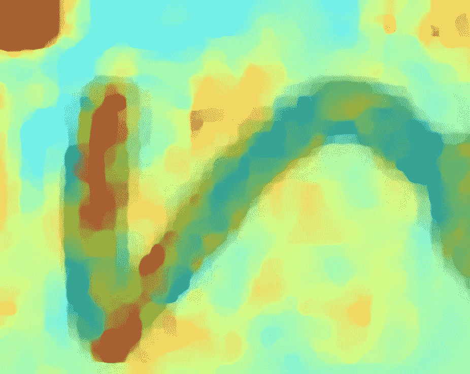
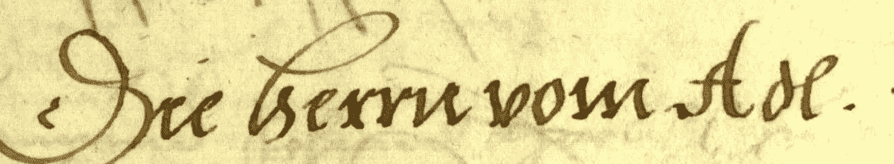
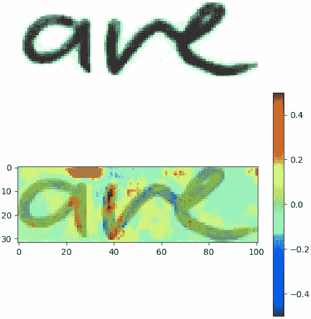
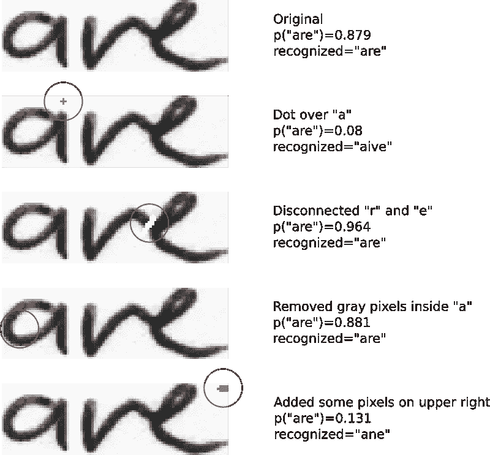
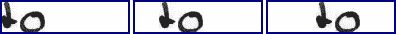
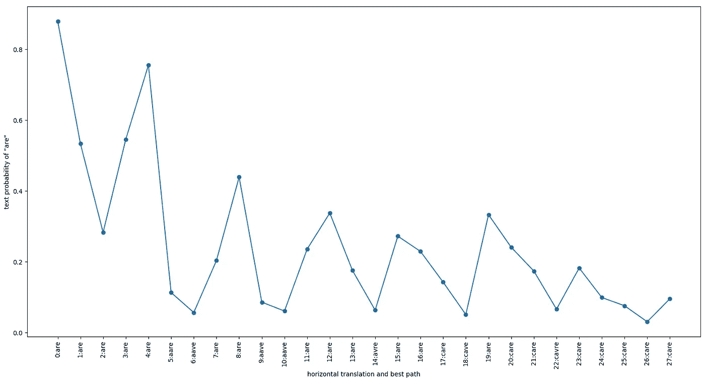

# 文本识别系统实际看到的

> 原文：<https://towardsdatascience.com/what-a-text-recognition-system-actually-sees-6c04864b8a98?source=collection_archive---------7----------------------->

## 对文本识别系统的神经网络“黑箱”的一些见解

作为神经网络实现的[现代文本识别系统](/2326a3487cd5)的性能令人惊叹。他们可以接受中世纪文件的培训，能够阅读这些文件，而且很少出错。这样的任务对我们大多数人来说是非常困难的:看看图 1，试一试吧！

Fig. 1: Hard to read for most people, but easy for a text recognition system trained on this dataset.

这些系统实际上是如何工作的？这些系统会看图像中的哪些部分来识别文本？他们利用了一些聪明的模式吗？或者他们会使用像数据集特定模式这样的捷径来作弊吗？在下文中，我们将通过两个实验来更好地理解这种神经网络内部发生的事情。

# 第一个实验:像素相关性

对于我们的第一个实验，我们提出以下问题:给定一个输入图像和正确的类别(真实文本)，输入图像中的哪些像素投票支持正确的文本，哪些像素投票反对正确的文本？

我们可以通过比较两种情况下正确类别的分数来计算单个像素对结果的影响:

1.  该像素包含在图像中。
2.  从图像中排除该像素(通过边缘化该像素的所有可能的灰度值)。

通过比较这两个分数，我们可以看到一个像素投票赞成还是反对正确的类。图 2 示出了图像中的像素与地面实况文本“are”的相关性。红色像素对文本“are”投赞成票，蓝色像素投反对票。

Fig. 2: Top: input image. Bottom: pixel relevance and blended input image. Red pixels vote for, blue pixels against the correct text “are”.

我们现在可以查看一些关键区域(深红、深蓝),以了解哪些图像特征对神经网络做出决策很重要:

1.  “a”上方的红色区域在输入图像中是白色的，对于正确的结果“are”非常重要。正如你所猜测的，如果一个黑点出现在“a”的垂直线上方，那么这条垂直线可以被解释为“I”。
2.  “r”与“e”相连，混淆了蓝色区域所示的神经网络。如果这两个字符断开，这将增加“are”的分数。
3.  “a”(左下内侧部分)内的灰色像素略投“are”反对票。如果 a 里面的洞完全是白色的，这应该会增加分数。
4.  在图像的右上方是正确投票的重要区域。不清楚如何解释这个区域。

让我们研究一下我们的假设 1。— 3.都是正确的，4 的含义是什么。通过改变这些区域内的一些像素值。在图 3 中，示出了原始和改变的图像、正确文本的分数以及识别的文本。第一行显示了文本“are”的得分为 0.87 的原始图像。

1.  如果我们在“a”的垂直线上画一个点，“are”的分数会减少 10 倍，我们得到的是文本“aive”。因此，神经网络大量使用上标点来决定垂直线是“I”还是其他什么。
2.  去掉“r”和“e”之间的联系，分数增加到 0.96。即使神经网络能够隐式地分割字符，看起来断开的字符简化了任务。
3.  “a”内的洞对于检测“a”很重要，因此将灰色像素与白色像素交换会稍微提高分数至 0.88。
4.  当将一些灰色像素绘制到图像的右上方区域时，系统识别出“ane”,“are”的分数降低到 0.13。在这种情况下，系统显然已经学习了与文本无关的特征。

Fig. 3: Change some pixels inside critical regions and observe what happens.

总结我们的第一个实验:系统已经学习了一些有意义的文本特征，如上标点来识别字符“I”。但它也学会了一些对我们来说毫无意义的特征。然而，这些特征仍然帮助系统识别它被训练的数据集中的文本:这些特征让系统采取(容易的)捷径，而不是学习真实的文本特征。

# 第二个实验:平移不变性

平移不变文本识别系统能够正确地识别文本，而与它在图像中的位置无关。图 4 示出了文本的三种不同的水平翻译。我们希望神经网络能够识别所有三个位置的“to”。

Fig. 4: Three horizontal translations of a text.

让我们再次从包含文本“are”的第一个实验中取出我们的图像。我们将把它一个像素一个像素地向右移动，并查看正确类别的分数以及预测文本，如图 5 所示。

Fig. 5: Score for text “are” while shifting the text pixel by pixel to the right. The labels on the x-axis show both the number of pixels the image is shifted and the recognized text (using best path decoding).

可以看出，该系统不是平移不变的。原图得分 0.87。通过将图像向右移动一个像素，分数降低到 0.53。再向右移动一个像素，分数就会降到 0.28。神经网络能够识别正确的文本，直到平移四个像素。之后，系统偶尔会输出错误的结果，从“aare”向右五个像素开始。

在 IAM 数据集上训练神经网络，其中所有单词都是左对齐的。因此，系统从未学会如何处理左边有空白的图像。对我们来说，忽略空白可能是显而易见的——这是一种必须学习的能力。如果系统从未被迫处理这种情况，它为什么要学习呢？

乐谱的另一个有趣的特性是四个像素的周期性。这四个像素等于卷积网络从 128 像素的宽度到 32 的序列长度的缩减因子。该行为是由池层的[移动差异引起的。](https://harald-scheidl.medium.com/d2f5a7866135)

# 结论

文本识别系统学习任何有助于提高其被训练的数据集中的准确性的东西。如果一些看起来随机的像素有助于识别正确的类别，那么系统将使用它们。如果系统只需要处理左对齐的文本，那么它将不会学习任何其他类型的对齐方式。有时，它学习我们人类也发现对阅读有用的特征，这些特征概括了广泛的文本样式，但有时它学习只对一个特定数据集有用的快捷方式。

我们必须提供多样化的数据(例如，混合多个数据集或使用数据增强)，以确保系统真正学习文本特征，而不仅仅是一些作弊行为。

# 参考

*   [关于文本识别模型的文章](/2326a3487cd5)
*   [文本识别模型代码](https://github.com/githubharald/SimpleHTR)