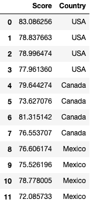
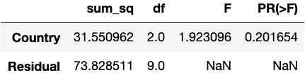
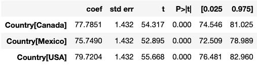
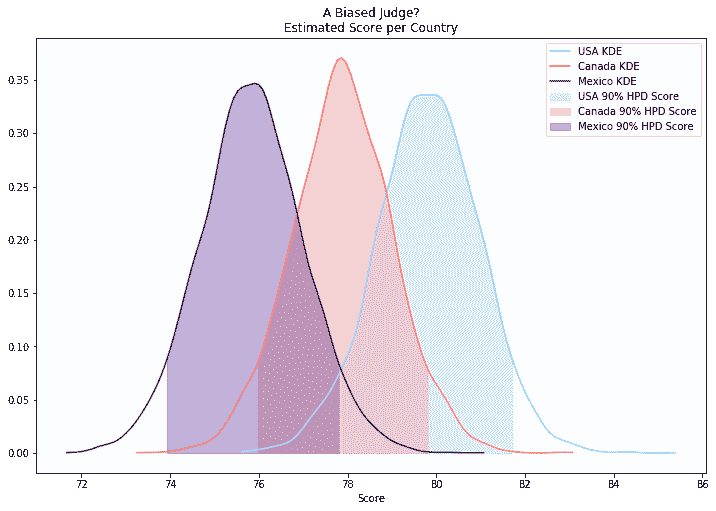

# 小数据呢？贝叶斯方差分析解。

> 原文：<https://towardsdatascience.com/what-about-small-data-e8993e06eaca?source=collection_archive---------13----------------------->

# 什么是小数据？

作为数据科学家，我们接受过处理大数据的培训，通常我们在这个领域非常得心应手。在我们找到答案之前，大数据集让我们可以使用任何数量的工具来刺激和探索。几乎每一种方法都可以处理这些数据，尽管为了让事情正常运转，必须时不时地对其进行处理。尽管回报递减，我们投入的精力越多，得到的就越多。

但是，小数据呢？它是否完全符合我们已经使用的方法？把小数据想象成普通人无需过多处理就能理解的任何东西。例如，他的同事的年龄和他们在公司的当前职位是一个小数据集。如果他的员工群体相对较小，Joe 可以很快看到趋势并发现数据集中的异常值。

看看这个小数据集，它显示了一位评委给来自不同国家的参与者打分。根据我们的定义，似乎我们应该能够从中得出一个直观的结论。

Is this a biased judge?

你认为美国的分数比加拿大和墨西哥高是对的，但是这是一种趋势吗？你能自信地说，从长远来看，美国的得分高于加拿大和墨西哥吗？或者这只是雷达上的一个亮点？乔能否断言年纪较大的员工在公司中拥有更高的职位，或者这也是雷达上的一个光点？

小数据的麻烦就在于此。它很小。我们可以从中得出直观的结论，但当需要利用这些数据做出决策时，我们就陷入了困境。如果你是一名数据科学家或分析师，其工作依赖于从数据中做出正确的判断，这一点尤其正确。那么你应该怎么做呢？如果你的第一个想法是，“我会避免小数据”，那么再想一想！小数据无处不在，迟早你会不得不使用它。事实上，收集一个小数据集有时是最好的途径。它能让你更快地处理数据，让你成为更敏捷的数据科学家。

# 理解小数据

让我们回到上面的数据集来理解它。想象一下，一名奥运会跳水裁判刚刚被停职，因为他被发现给美国选手的分数高于加拿大和墨西哥选手。他承认了，参加了再培训课程，并签署了一份协议，如果发现他的分数有偏差，就禁止他参加这项运动。该数据集显示了他在四次国际比赛中给予不同国籍参与者的平均分数。你可以假设另一位裁判的分数变化相等，但可能与他的分数不匹配。如果你是为监督跳水裁判的奥委会工作的数据科学家，你有什么建议？

It’s the judge in the middle that we’re worried about. He’s clearly up to no good.

这是一个很大的难题，不是吗？你的直觉告诉你分数有偏差，但你需要证明。你的目标是确定国家之间的平均分数是相同的(H0: 0 = 1 = 2)还是不同的(哈:0 ≠ 1 ≠ 2)，这意味着你应该运行方差分析，ANOVA，测试来得出结论。让我们设置α = 0.10，这样我们就有一个低的阈值来继续研究。方差分析的结果如下所示。

The results of ANOVA on the data. p > α**,** so we accept the null hypothesis.

即使以我们自由派的信心水平，我们也不能拒绝零假设。难道是我们的直觉错了？不一定！我们的直觉是基于这样一个事实，即我们对这个特定法官的行为有先验知识。换句话说，我们倾向于寻找偏见，因为我们有证据表明过去存在偏见。我们遇到的问题是小数据。根本没有足够的数据来否定我们的假设，而且我们也没有办法在这个分析中包含我们的先验知识。在这种情况下，等待获得更多数据会损害竞争对手，并有可能降低观众对公平评判比赛能力的信心。幸运的是，我们没有被卡住。

# 贝伊斯来救援了。

贝叶斯统计非常适合这个问题。如果你还没有遇到贝叶斯统计，那么我建议你[读这篇文章](/bayes-theorem-the-holy-grail-of-data-science-55d93315defb)，然后[读这篇论文](https://www.ncbi.nlm.nih.gov/pmc/articles/PMC4158865/pdf/cdev0085-0842.pdf)。使用先验信息是贝叶斯统计强大的原因之一。分析像这样的小数据集是可能的，因为我们有输入模型的先验信息。通过使用马尔可夫链蒙特卡罗方法将先验信息耦合到新信息，我们可以推断出新信息符合我们先验理解的可能性。让我们再次运行分析，但是这次使用贝叶斯框架。

# Python 中的贝叶斯方差分析

方差分析在功能上等同于使用分类预测的简单线性回归。事实上，方差分析的 F 统计量*与仅使用类别作为预测因子的模型的线性回归的 F 统计量*完全相同。为了更好地理解正在计算的内容，我们可以利用系数的置信区间，以便在某个置信水平上测试假设。如果每个系数的 95%置信区间重叠，那么我们期望 F 统计量产生 p 值> 0.05。数据的线性回归系数显示了这种关系。

Notice how the confidence intervals overlap? That’s a sign that we can’t reject the null hypothesis.

我们可以使用这些信息，即线性回归相当于 ANOVA，使用 PyMC3 模块在 Python 中运行贝叶斯分析。我的代码复制如下。

这是怎么回事？首先，我加载了一个 PyMC3 模型(pm。模型()作为模型)。然后，我用先验信息填充模型。适马是我们在整个模型中期望的标准差。我将 sigma 设置为来自半柯西分布(标准实践)，这将 sigma 限制为大于 0，低值比高值更有可能。参数β设置分布的宽度-值 10 是一个很大的宽度，从 0 到 10 的值基本上是相等的。

然后，我在模型中加入法官过去表现出的偏见。美国、加拿大和墨西哥选手的平均得分非常相似，但他给美国选手的平均得分比加拿大选手高 2 分，比墨西哥选手高 4 分。使用频率主义者的方法很难发现这种微小的差异。

最后，我将可能的结果定义为每个系数乘以为竞争对手国籍编码的虚拟变量的总和，并将其与实际数据 df.Score 进行比较。为了获得结果，我运行了两条马尔可夫链，每条链有 3000 个样本。

我如何确定是否存在偏见？我在 frequentist 方法中利用了查看系数置信区间的概念！我不是查看置信区间，而是查看每个系数的概率分布，并确定 90%的最高后验密度(HPD)是否重叠。下图显示墨西哥和美国的 HPD 没有重叠，这证明平均分数不相等。

The thin region where the HPDs of USA and Mexico do not overlap, around 77.8, is evidence that the scores are not equal.

现在我们有证据表明可能存在偏见，我们应该继续调查，以确保分数没有真正反映竞争对手的表现。我们可以通过比较其他裁判给参赛者的分数和这位裁判的分数来做到这一点。给定少量的数据，我可以想象这些分析也必须用贝叶斯统计来执行。

所以你有它！贝叶斯统计是另一种管理数据的工具，特别是小数据，以提供更好的建议或得出结论。请看一下 [PyMC3 文档](https://docs.pymc.io/)，了解更多关于如何使用这个强大的库的信息。如果你对上面例子的完整代码感兴趣，[那么看看我的笔记本链接这里](https://github.com/pjofrelora/BlogNotebooks/blob/master/ANOVA%20in%20Bayesian%20Framework.ipynb)。