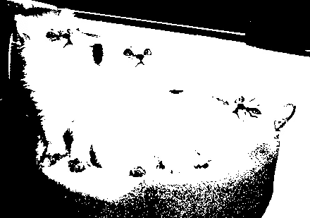
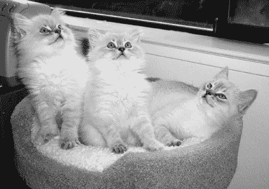
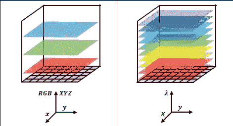

# 什么是高光谱图像？

> 原文：<https://towardsdatascience.com/what-are-hyper-spectral-images-a5de5d9fa91?source=collection_archive---------16----------------------->

## 它们与我们处理的数字图像有什么不同？

Photo by [Patrick Tomasso](https://unsplash.com/@impatrickt?utm_source=medium&utm_medium=referral) on [Unsplash](https://unsplash.com?utm_source=medium&utm_medium=referral)

上面的墙看起来确实非常丰富多彩，移动相机在捕捉同样生动的颜色供我们的眼睛见证方面做得非常棒……但是我们的眼睛能够感知的东西是有限的，在同一张图像中可能有*个方面是我们的肉眼或移动 RGB 相机都无法捕捉到的。这就是超光谱相机发挥作用的地方。*

## 实时快速查看数字图像

Photo by Alex Holyoake on Unsplash

在某种程度上，数字图像只是一串数字(但话说回来，这不是对所有事情都适用吗！？🤔).赋予这些数字一个图像的*形状*的是在它们上面定义的应用一些约束的参数——比如说，以行/列格式堆叠的数字，具有特定值范围的数字，等等。

**二进制图像** :
这些是我们称之为*的黑白*图像，就像文字清晰地向你尖叫一样——它们只由两个不同的数字(0 和 1)组成，对应着两种不同的颜色，即。分别是黑色和白色。这些数字被保存为一个二维矩阵，格式为 *n* 行/ *m* 列，其中 0 为黑色，1 为白色。

sample binary image

**灰度图像:** 它们信息量更大，因为它们大多由 255 个不同的数字(比如说，从 0 到 255)组成，以传达信息；每个数字对应于灰度值的强度。换句话说，

sample greyscale image

*   数字 0 代表最浅的灰色(换句话说，白色)
*   100 号有点灰色
*   200 号就像是一种深灰色
*   数字 255 将是图像中最灰色的阴影(换句话说，黑色)

Greyscale range, from 0 to 255

**彩色图像:** 现在，这就是我们的眼睛(视锥细胞)如何感知我们周围的环境，给它一个彩色的呈现。取代单一的灰度图像，我们将有 3 个通道的红色、绿色和蓝色图像。这三种强度的组合将被我们的眼睛感知为许多可能的“颜色”之一。因此，它的尺寸为:( *n* 行* *m* 列 *)*3* 个通道。

## 超光谱图像:

正如我们所知，不同的红色、绿色和蓝色是由于物体反射的光属于电磁辐射可见光谱中不同的波长范围[即长波长，峰值在 564–580[nm](https://en.wikipedia.org/wiki/Nanometre)(红色)附近]；中等波长，峰值在 534–545 纳米附近(绿色)；以及 420–440 纳米附近的短波长光(蓝色)]；这就是我们人类的眼睛所能感知的全部，但是有很多波长没有被可见光谱覆盖，很容易被我们的眼睛错过/看不见。

这些被人类眼睛忽略的颜色/特征可能会被其他动物的的[眼睛相对地看到——就像他们说的那样，*颜色存在于旁观者的眼中*。](http://www.webexhibits.org/causesofcolor/17C.html)

由于成像技术的进步，我们可以获得可见光谱以外的波长信息，并理解它。因此，从广义上讲，光谱成像是在图像空间中并行获取空间和它们相应的光谱信息以及它们的组合。它有点类似于 RGB 彩色图像，但它有更多的通道，因此对整体可视化提出了挑战(但我们仍然有我们的*智能机器*到 understand🧐).的所有数据出于理解的目的，假设我们有一个 *n* 波段超光谱图像:它只是在一个连续的波长范围内将 *n 个*灰度图像(每个波段根据其波长值捕捉不同的光强度数据)堆叠在彼此的顶部，给我们一个尺寸为 *n 行* m 列* n 个波段的图像。*

RGB vs HSI images

在高光谱图像之前，我们还有**多光谱图像**，它们本质上是 *n* 波段图像，但它们不一定分布在连续的波长范围内，就波段数量而言，与任何平均高光谱图像相比，它们的波段较少。我们可以在从卫星收集的[遥感数据](https://www.e-education.psu.edu/geog480/node/494)中看到真实世界的多光谱图像。

因此，从任何 HSI 摄像机获取的图像将采用*超立方体的形式，*具有 n 维图像数据，这有时会令人不知所措。因此，对超立方体应用降维技术并不罕见，并且有许多其他方法来处理超立方体。在这里，如果我们试图专注于单个超像素，我们将能够绘制出相同的连续光谱数据。

它在众多领域都有应用，从医疗、农业、纺织到汽车工业。HSI 帮助我们探索未知领域，通过可视化人类肉眼不可见的信息，并找到理解这些信息的方法。

**参考文献:**

*   威泽基、京特；斯泰尔斯，W.S. (1982)。颜色科学:概念和方法，定量数据和公式。).纽约:纯粹和应用光学中的威利系列。[ISBN](https://en.wikipedia.org/wiki/International_Standard_Book_Number)[978–0–471–02106–3](https://en.wikipedia.org/wiki/Special:BookSources/978-0-471-02106-3)。
*   机器视觉技术论坛 2017，17.10。2017 年 10 月 18 日，德国 unterschleiheim； [www.spectronet.de](http://www.spectronet.de)
*   图片提供-[https://sherylwilliamsart.wordpress.com/tag/value/](https://sherylwilliamsart.wordpress.com/tag/value/)