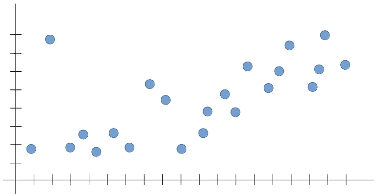
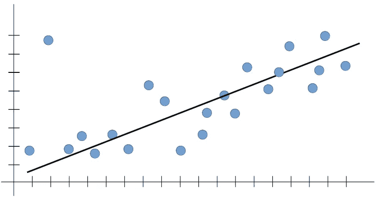

# 机器学习中的过拟合和欠拟合是什么？

> 原文：<https://towardsdatascience.com/what-are-overfitting-and-underfitting-in-machine-learning-a96b30864690?source=collection_archive---------0----------------------->

当你进入机器学习的领域时，几个模糊的术语会自我介绍。过度拟合、欠拟合和偏差-方差权衡等术语。这些概念通常位于机器学习领域的核心。在这篇文章中，我用一个例子来解释这些术语。

# 我们为什么要在乎？

可以说，机器学习模型只有一个目的；概括得好。我在之前的几篇帖子中提到过这一点，但强调一下也无妨。

> 泛化是模型对以前从未见过的输入集给出合理输出的能力。

正常的程序做不到这一点，因为它们只能“自动地”输出它们知道的输入。模型以及整个应用程序的性能在很大程度上依赖于模型的泛化。如果模型概括得很好，它就达到了它的目的。已经引入了许多评估这种性能的技术，[从数据本身开始](https://medium.com/datadriveninvestor/what-are-training-validation-and-test-data-sets-in-machine-learning-d1dd1ab09bae)。

基于这个想法，像**过拟合和欠拟合这样的术语指的是模型的性能可能会受到**的影响。这意味着知道模型的预测“有多差”就是知道它有多接近过度拟合或不足拟合。

> 概括得好的模型是既不欠拟合也不过拟合的模型。

这可能没有多大意义，但我需要你在这篇文章中记住这句话，因为这是关于我们主题的大画面。这篇文章的其余部分将把你学到的东西和它在这幅大图中的位置联系起来。

# 我们的例子

假设我们正在尝试为以下数据集建立一个机器学习模型。

请注意，我认为该领域的新人应该有更多的实践经验，而不是研究。因此，像函数这样的数学术语在这篇文章中不会涉及。现在，让我们记住，在数据集中，x 轴是输入值，y 轴是输出值。

如果你以前有过机器学习模型训练的经验，你可能知道我们这里有几个选项。然而，为了简单起见，在我们的例子中让我们选择[一元线性回归](/how-does-linear-regression-actually-work-3297021970dd)。**线性回归允许我们将数字输入映射到数字输出，将直线拟合到数据点中。**这种线拟合过程是过度拟合和欠拟合的媒介。

# 训练阶段

在我们的示例中，训练线性回归模型完全是为了最小化我们试图拟合的直线和实际数据点之间的总距离(即成本)。这将经历多次迭代，直到我们在数据集中找到相对“最优”的配置。这正是过拟合和欠拟合发生的地方。

在线性回归中，我们希望我们的模型遵循类似如下的直线:

即使总成本不是最小的(即，存在一种更好的配置，其中该线可以产生到数据点的更小距离)，上面的线非常符合趋势，使得模型可靠。假设我们想要推断当前不在数据集中的输入值的输出(即概化)。上面的线可以给出新输入的非常可能的预测，因为就机器学习而言，输出预计会遵循训练集中看到的趋势。

# 过度拟合

当我们在数据集上运行我们的训练算法时，我们允许总成本(即从每个点到线的距离)随着更多的迭代而变得更小。让这种训练算法长时间运行会导致最小的总成本。然而，这意味着线将适合所有点(包括噪声)，捕捉模型概化可能不需要的次级模式。

回到我们的例子，如果我们让学习算法长时间运行，它可能会以下面的方式来拟合直线:

这看起来不错，对不对？是的，但是可靠吗？不完全是。

线性回归等算法的本质是捕捉主导趋势，并在该趋势内拟合我们的线。在上图中，算法捕捉到了所有趋势，但不是主导趋势。如果我们想对超出线限制的输入测试模型(例如，概化)，那么这条线会是什么样的？真的没办法说。因此，输出是不可靠的。**如果模型没有捕捉到我们都能看到的主导趋势(在我们的例子中，是正增长)，它就无法预测一个从未见过的输入的可能输出——这违背了机器学习的初衷！**

> 过拟合是整体成本确实很小，但是模型的泛化不可靠的情况。这是因为模型从训练数据集中学习了“太多”。

这听起来可能很荒谬，因为当我们可以找到最小的成本时，我们为什么要满足于更高的成本呢？一般化。

我们离开模型训练越久，过度拟合发生的几率就越高。**我们总是想找到趋势，而不是拟合所有数据点的直线。**过度拟合(或高方差)导致弊大于利。一个从训练数据中学习得很好，但仍然不能对新输入做出可靠预测的模型有什么用？

# 欠拟合

我们希望模型从训练数据中学习，但不希望它学习太多(即太多模式)。一个解决办法是早点停止训练。但是，这可能会导致模型无法从训练数据中学习到足够的模式，甚至可能无法捕捉到主导趋势。这种情况称为欠拟合。

> 欠拟合是指模型“没有从训练数据中学习到足够的知识”，从而导致泛化能力低和预测不可靠。

正如您可能预期的那样，欠拟合(即高偏差)与过拟合一样不利于模型的泛化。在高偏差情况下，模型在线拟合方面可能没有足够的灵活性，导致线过于简单，不能很好地进行概化。

# 偏差-方差权衡

那么什么才是正确的衡量标准呢？根据手头的模型，介于过拟合和欠拟合之间的性能更理想。这种权衡是机器学习模型训练最不可或缺的方面。正如我们所讨论的，当机器学习模型很好地概括时，它们就实现了它们的目的。泛化受到两个不良结果的限制——高偏差和高方差。检测模型是否受到其中任何一个的影响是模型开发人员的唯一责任。