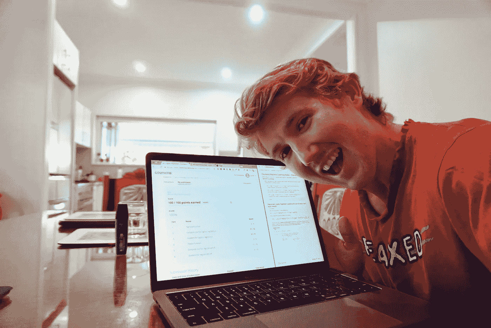

# “学习机器学习最好的 Coursera 课程有哪些？为什么？”

> 原文：<https://towardsdatascience.com/what-are-some-of-the-best-coursera-courses-for-learning-machine-learning-why-70363295995?source=collection_archive---------5----------------------->

## 在线学习不同于课堂学习。最好的资源唾手可得。你只要出现就行了。

When I passed one of Andrew Ng’s machine learning quizzes on Coursera. Stoked is an understatement. 40% of my self-study occurs in pyjamas at my dining room table.

我想学习机器学习。所以我花了一周时间在网上搜索最好的学习资源。

Coursera 不断出现。我以前从未见过它。但是很熟悉。一次，我在苹果店接待的一个女孩告诉我，她会在火车上用手机看视频。她给我看了这个应用程序。它是蓝色的。

“为了什么？”我问。

“没什么，我只是觉得学点东西总是好的。”

你知道当有人说一件事的时候。一件事，它会永远伴随着你。

她离开了商店。

几个月后，我在做搜索的时候，发现了 Coursera，想起了她。她的话被记住了。

自从我离开苹果公司，我们合作的创业公司失败后，我有了一些空闲时间。

我收集了几门课程，创建了自己的人工智能硕士学位。

在为我们的初创公司建立网站时，我听到的都是机器学习和深度学习。这里颠覆，那里创新。这都要归功于计算机自己学习东西。靠他们自己？怎么会？我必须知道。

# 吴恩达的机器学习教程

这是第一个。很艰难。真的很难。我不得不(大部分)用谷歌搜索了几次答案。否则，我早就累垮了。

我几乎什么都不记得了。没有代码，因为它是在 MatLab 和 Octave 中。我不喜欢 MatLab 界面。另外，我还在兼职学习 Python。

我带走的是安德鲁对教学的热情。他对机器学习的精力。他对人工智能的热情。它让我笑逐颜开，并感染了我。

有时候，老师激发学生的兴趣比知识本身更重要。

如果你想进入机器学习领域，这门课会教授一些基础知识。如果你不能通过编码作业，我不会太担心，我会看讲座，获得直觉，并用它来推动你的下一步学习。Python 的教程。

# 密歇根大学使用 Python 开发的应用数据科学

当我开始成为一名机器学习工程师时，我探索数据集的技能很差。我花了太多时间为准备好的数据集建立深度学习网络，而不是深入战壕，从头开始探索数据。

这门课程帮助我学习了探索性数据分析(EDA)的基本步骤。

如果你想进入数据科学和机器学习，你可能会发现自己花了很多时间使用 Python 库熊猫做 EDA。这正是本课程第一部分的内容。

完成后，我用这些技能参加了我的第一次 Kaggle 比赛。比赛结束了，但我还是挺过来了。在此之前，Kaggle 一直是那些难以捉摸的事情之一，我会看到提到的地方，但从来没有尝试过自己。直到我做到了。这让我写下并制作了一个视频，告诉我其他人如何做同样的事情。

在我所学的所有课程中，Python 应用数据科学与我作为机器学习工程师的日常工作最为契合。

事后看来，这门课应该是我开始学习机器学习/数据科学时的第一门课。

# 吴恩达的 deeplearning.ai

吴恩达释放的任何东西，我都会吞噬。我的学习风格和他的教学风格非常一致。

文字和视觉的结合让我学得最好。安德鲁在他的讲座中做到了这两点。经常在打印的课堂笔记上画例子。

这门课程教会了我深度学习的基本原理以及如何应用它们。如果说用 Python 的应用数据科学是数据科学的珠峰大本营，deeplearning.ai 就是顶峰。

它给出了计算机视觉(教计算机看)、自然语言处理(教计算机理解语言)和口语检测(教计算机听)中涉及的概念的概述和工作示例。

在这些主题之间，Andrew 分享了他丰富的经验，并深入研究了深度学习背后的一些数学和统计学。

# 额外收获:学习如何学习

这门课程应该是所有学生的必修课。我把它留到了最后，但如果让我重新开始，我会先做这个。每年更新自己是值得的。

为什么？

因为学会如何学习才是终极技能。

如果你知道学习本身的技术和最佳实践，你可以把它们应用到其他任何事情上。

我最喜欢的(也是我日常使用的)是:

*   避免拖延的番茄定时器——设置一个 25 分钟的定时器，在定时器到时之前，除了你面前的单一任务，什么也不要做。一天 6-10 次对我来说是个好日子。前 4 分钟是地狱，但当计时器响起，你不想停下来。
*   **集中和分散思维** —集中思维发生在你专注于一项任务的时候，分散思维发生在你没有做任何特别的事情的时候。最好的学习发生在这两个点的交叉点。这就是为什么休息和无所事事的时间是有价值的。没有智能手机。没有社交媒体。给你的大脑空间。当你的大脑有空间时，它能把事情联系在一起。有没有想过为什么你的一些伟大的想法会在洗澡的时候冒出来？是因为你的大脑有思考的空间。
*   不需要天才羡慕——每个人都必须从某个地方开始学习之旅。事实是，每个大师都知道，学习永不停止。总是第一天。查尔斯·达尔文大学辍学，后来发现了进化论。不要以为你是查尔斯·达尔文。但是也不要认为高中或大学毕业后学习就停止了。

在高中知道这些事情可能会对我的成绩有一点帮助。也许是它让我在大学的头两年没有及格。

我非常喜欢这门课，我制作了一个视频，总结了我最喜欢的其他课程。

这里剩下的课程都被我对机器学习和数据科学的兴趣带偏了。

但是我认为不管你喜欢什么，你都会从学习如何学习的课程中有所收获。

# 加州大学圣地亚哥分校的生物信息学

我还没有做这个，但是我打算明天开始做。

为什么？

因为没有什么比健康和科技的交叉更让我着迷了。简而言之，这就是生物信息学。

几周后，我退学了。我有太多事情要做。我犯了一个错误，追求更多的证书，而不是利用我已经获得的知识。也许有一天我会回去。

# 因为这足以成为学习任何东西的理由

网上有这样的资源，太神奇了。Coursera 只是其中之一。有 YouTube，Udemy，edX，走向数据科学，大量的免费文档。

它仍然得到我。在澳大利亚的布里斯班，我可以坐在我的房间或餐桌上，学习我想学的东西。最初在 5000 英里外教授的东西。

如果你想学习新的东西，你可以。你要做的就是注册，然后不断出现。

你也不需要理由。

我记得苹果店里的那个女孩转向我说。

> 没什么，我只是觉得学点东西总是好的。

最好的事情是，如果老师没有像吴恩达那样激发你的好奇心，或者如果材料不是你所期望的，在线学习的好处是，你可以随时尝试其他东西。一些能激发你好奇心的东西。与你的学习方式一致的东西。

为什么？

因为。