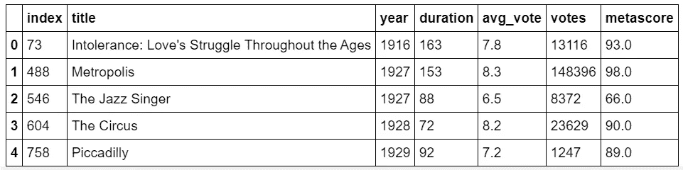
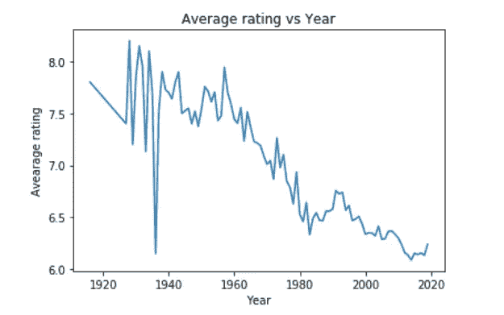
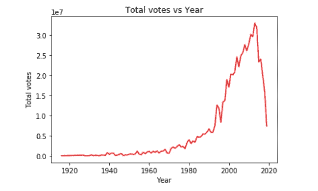
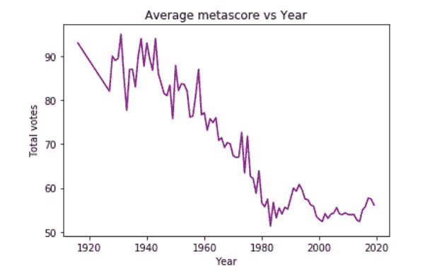
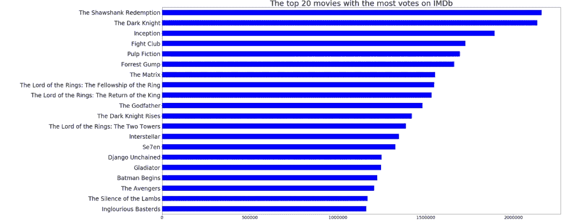
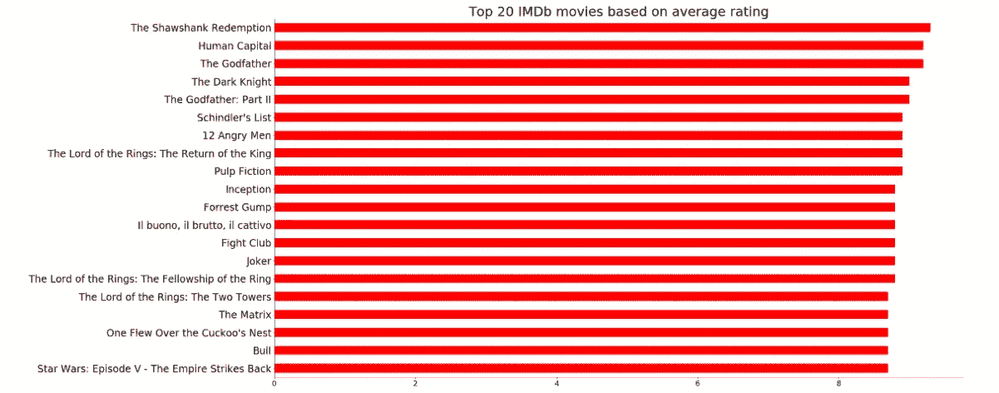
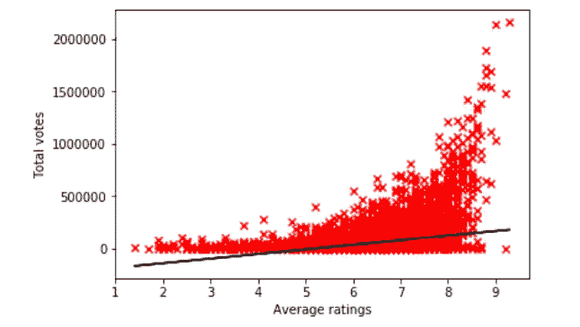

# IMDb 最好的电影是什么？

> 原文：<https://towardsdatascience.com/what-are-the-best-movies-on-imdb-891ab367c5ea?source=collection_archive---------28----------------------->


Photo credit: [https://www.canva.com/design/DADu-0ZcZCM/gcIYtjzGs-_Io0m8H8LQKA/edit](https://www.canva.com/design/DADu-0ZcZCM/gcIYtjzGs-_Io0m8H8LQKA/edit)

## IMDb 电影收视率透视

“不要一路关着门。我不喜欢那样。只是……让它开着一点点。”

这些是我可以毫无疑问地说是 2019 年最佳电影的最后一句话，这部电影是*爱尔兰人*。在这最后一幕之后，片尾字幕补充了五色缎子乐队的《夜深人静中的*。*

观看爱尔兰人是一次很棒的经历。我坐下来，整个感恩节上午都在网飞看电视。这是一部非凡的电影。我看了劳勃·狄·尼诺的 10/10 表演，他从扮演一个 40 多岁的年轻人到扮演一个 90 多岁的老人。

他把自己的角色演得如此之好，以至于他把动作和风格完美地运用到了他所扮演的各个时代。我还目睹了其他演员如乔·佩西、阿尔·帕西诺和安娜·帕奎因的精彩表演。

我喜欢看电影，尤其是马丁·斯科塞斯、克里斯托弗·诺兰或昆汀·塔伦蒂诺等经典导演的电影。我观看这些电影制作人的电影，因为演员们如何进行有意义的对话，镜头角度如何捕捉令人惊叹的时刻，以及电影如何传达强大的符号。

像这样的电影让我想知道哪些电影是 IMDb 收视率最高的，并问电影质量如何随着时间的推移而变化。

因此，进行了一项研究来找出 IMDb 收视率最高的电影。

# 数据收集

数据集是通过这个[链接](https://www.kaggle.com/stefanoleone992/imdb-extensive-dataset)在 Kaggle 上收集的。然后，他们被修改，以便有适当数量的功能，如标题，年份，持续时间，平均评级，投票和 metascore。此外，还删除了无效值。

转换数据集的代码如下所示:

```
df_movie = df_data_1[['title', 'year', 'duration', 'avg_vote', 'votes', 'metascore']]
df_movie.head()
df_movie_1 = df_movie.dropna()
df_movie_11 = df_movie_1.reset_index() 
df_movie_11.head()
```



Top five rows of the truncated dataset.

获得正确的数据集后，进行数据分析以进行研究并得出结论。

# 平均评分、总票数和 Metascore

第一项任务是找出电影随着时间的推移是如何被分级的。下图显示了 IMDb 电影按制作年份的平均收视率。



A line plot graph of Average rating of the movie on IMDb vs the year they were produced.

事实证明，根据 IMDb 收视率，电影的收视率随着时间的推移大幅下降。

第二个任务是通过创建另一个线图来显示 IMDb 在不同年份每年记录的投票数，从而找出每年电影的总投票数。



The graph on the left shows how total votes per year has changed on IMDb. The graph on the right focuses on total votes from 2000 to 2019.

看这两个图表，IMDb 电影的投票数每年都有显著的增长，从零票到大约 3500000 票的峰值。

最后的线形图显示了电影的平均元得分也是如何随时间变化的。



A line plot graph of Average metascore of the movie on IMDb vs the year they were produced.

根据上面的折线图，平均元得分和平均评级一样，显示了平均元得分的年度下降。

上面的四张图显示，随着投票数逐年增加，电影的平均评分和平均元得分下降。出现这种情况的原因是因为每年生产的电影越来越多，这导致了许多好电影和许多坏电影。因此，随着制作的电影的增加，投票数也增加。

此外，直到 1990 年才出现 IMDb，所以 1990 年以前的电影可能只有极少数有兴趣看的人来评价，而且那时候每年只生产很少的电影。因此，1990 年以前的年度总票数比随后几年记录的票数少。

# IMDb 投票最多的 20 部电影

创建了一个水平条形图来显示 IMDb 投票最多的前 20 部电影。



Top 20 movies with the most votes on IMDb

《肖申克的救赎》以大约 2159628 票位居第一。位居第二，以大约 25000 票的差距落败的是《黑暗骑士》。《盗梦空间》是票数第三多的电影。《搏击俱乐部》和《低俗小说》分别位居第四和第五。其他著名的电影有第十名的《教父》和第二十名的《无耻混蛋》。

# IMDb 收视率最高的 20 部电影

生成另一个水平条形图来显示 IMDb 上最高评级的前 20 部电影。



Top 20 highest rated movies on IMDb

《肖申克的救赎》以 9.3 的平均评分再次位居榜首。《人力资本》和《教父》并列第二，平均评分 9.2。《黑暗骑士与教父 II》以 9.0 的平均评分排在第四位。

《小丑》是票房收入最高的 R 级电影，票房超过 10 亿美元，排名第十，平均评分为 8.8 分。

一个明显的趋势是，一些获得最多投票的电影也获得了最好的评级。因此，创建了一个散点图来显示总投票数与平均评分之间的关系。



A scatter plot of Total votes vs Average ratings

根据散点图，随着电影被分级，从左到右有某种向上的转移。相关系数约为 0.35，这意味着总投票数与平均评分呈正弱/中等相关。

# 结论

电影是当今世界上最大的娱乐形式之一。每个人都喜欢电影，所以做这项研究证明了电影的评级是如何随着时间的推移而变化的，以及一部电影获得的票数会对其评级产生多大的影响。

**用于执行项目的完整版代码可以在这里看到**[](https://github.com/MUbarak123-56/DataBEL/blob/master/MOVIES%20ANALYSIS.ipynb)****。****