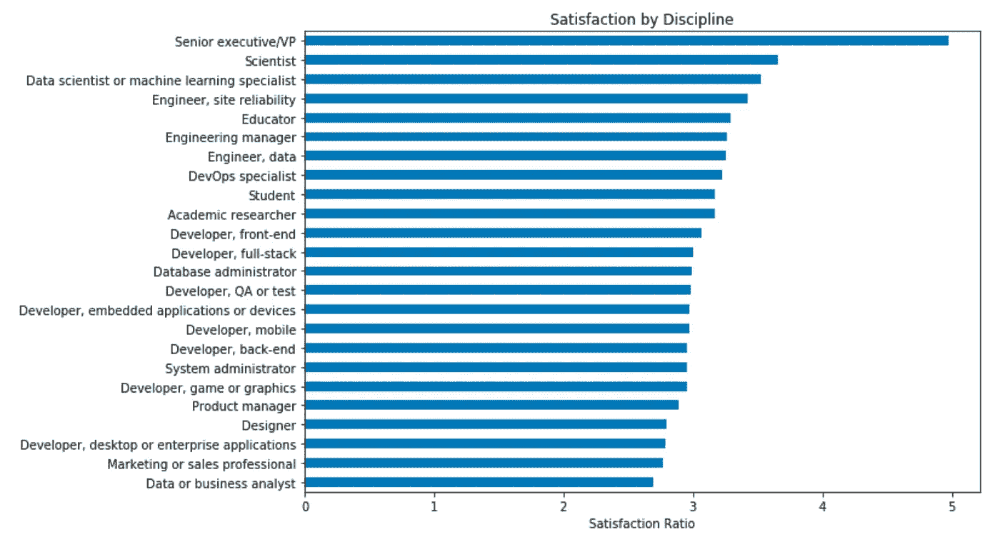
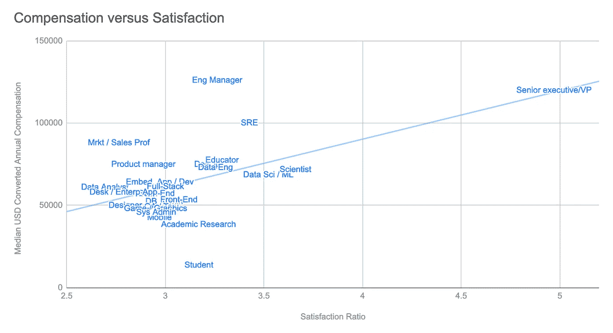
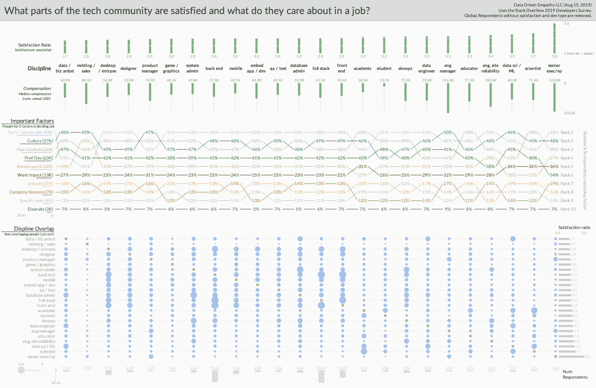

# 科技界有哪些最快乐的工作？

> 原文：<https://towardsdatascience.com/what-are-the-happiest-jobs-in-tech-4c4d33e065f0?source=collection_archive---------5----------------------->

科技行业的薪资最高，T2 的离职率也最高。在调查这个竞争激烈但高流失率的生态系统时，讨论往往会转向[的工作满意度如何因公司而异](https://techcrunch.com/2018/12/04/these-are-the-15-best-u-s-tech-companies-to-work-for-in-2019-according-to-glassdoor/)和[的留任率如何因雇主而异](https://www.businessinsider.com/employee-retention-rate-top-tech-companies-2017-8)【3】【4】。然而，对公司的关注忽略了一个事实，即科技公司不仅拥有众多的公司，还拥有各种各样的人，他们在相互关联的工作领域中有不同的优先事项和关系。调查经验如何因学科而异，[2019 Stack Overflow Developer Survey](https://insights.stackoverflow.com/survey/2019)可以通过工作领域、薪酬和其他因素来帮助了解工作满意度，不仅可以揭示谁的薪酬最高，还可以揭示谁最满意，以及什么可以帮助他们在工作中找到快乐[5]。

Satisfaction ratios by “discipline” (devType from the 2019 Developer Survey). Senior executives report high satisfaction while data analysts exhibit relatively low satisfaction.

首先，不同学科之间的满意度确实不同。更具体地说，数据显示了工作领域之间的统计显著差异，给出了表示对工作满意的人数与表示不满意的人数(p < 0.05). Consider a metric which divides the number of people who report being satisfied (slightly or very satisfied) by the number dissatisfied (slightly or very unsatisfied) with their job. Using that “satisfaction ratio” metric to rank the fields of work within the Stack Overflow Developer Survey, four groups dominate the top ten most satisfied: *管理*(高管，在较小程度上还有工程管理)*、科学*(包括数据科学)*可靠性* (SRE 和德沃普斯)，以及*学术界*(教育家和研究人员)。数据还显示，大多数“开发人员”的职位都在中间值 3.0 左右，低于这个值的是设计师、项目经理、销售/营销和分析师。

人们可能会怀疑，薪酬可以解释工作领域中的这种差异，事实上，那些报告对工作满意的人的工资明显高于那些报告不满意的人(差异约为 21，000 美元的差异，p < 0.05). Even still, consider that compensation may not be fully capturing variation in satisfaction. Though [这可能是一个麻烦的指标](https://data.library.virginia.edu/is-r-squared-useless/)，仅针对中值学科薪酬的线性回归”[解释道](https://people.duke.edu/~rnau/rsquared.htm)“学科满意度比率(R = 0.29)中约三分之一的差异[6][7]。仔细观察这些数据，人们可以开始看到挑战这一重要而复杂的关系的工作领域。例如，与工程经理相比，学术研究人员的薪酬较低，但两者的满意度仍然相当高。同样，工程经理、数据科学家和 sre 在薪酬上可能有显著差异，但在满意度上不一定有巨大差异。当然，如果你想优化满意度和薪酬，你可以考虑高级主管/副总裁、SRE 或工程经理。尽管金钱可能会有所帮助，但它似乎并不总能买到更多的幸福。

Median compensation and satisfaction ratios for different devTypes.

如果薪酬不能完全解释这个样本中的满意度，那么在科技领域还有什么可能是重要的呢？开发人员调查询问受访者关于可能影响他们接受工作决定的因素(“…在两个薪酬、福利和地点相同的工作机会之间做出决定…哪三个对你来说[最]重要？”)而且，有趣的是，不同学科选择因子的频率存在统计学上的显著差异(p < 0.05)。值得注意的是，各种类型的开发人员(前端、后端等)将“他们将使用的语言、框架和其他技术”排在他们列表的顶部，而文化排在 PM、工程经理、销售/营销和数据科学家/分析师列表的顶部。有趣的是，在高满意度学科中，一个人的工作对科学家(包括数据科学)和高管的影响可能比平时更重要。不管怎样，就像薪酬一样，这种可变的因素排名可能意味着不同类型的技术人员正在从他们的工作中寻找不同的东西，许多因素可能会整体上支持满意度。

Visualization of satisfaction and job factors by discipline while also showing how those disciplines are inter-related. [Full resolution image available](https://gleap.org/static/img/viz/dev_happiness.png).

最后，开发者调查的受访者通常认同不止一个学科，通过利用这些领域中的“重叠”，人们可以开始看到技术领域中具有不同体验的“集群”。具体来说，使用共享受访者的 [Jaccard 指数](http://infolab.stanford.edu/~ullman/mmds/ch3.pdf)，工程管理和高级管理人员之间有相当多的重叠(两者都有很高的薪酬和满意度)[8]。同样，许多“开发人员”领域密切相关(前端、后端、完整堆栈等)，同时也看到类似的满意度。也就是说，一些学科强调，一个集群内的微小变化会产生非常不同的结果。最值得注意的是，尽管数据科学家和数据分析师拥有大量从业者，但他们报告的满意度却大相径庭。还要考虑到一些可靠性(DevOps 和 SRE)学科比系统管理员报告更高的满意度和薪酬，即使就人们的自我报告而言，这些领域之间可能有相对较大的重叠。可能有些技术人员可以担任多个角色，但是他们属于哪个角色会极大地影响他们的工作体验。

Relationships between different disciplines in tech using a Jaccard Index over respondents shared between different fields. Line width proportional to index with values under 0.05 filtered out.

虽然技术部门经常被作为一个社区来讨论，但技术内部的体验有很大的差异，对于不同的成员来说什么才是重要的。纪律是与工作满意度相互作用的一个重要方面，不仅薪酬以外的其他因素也很重要，而且这些因素的重要性可能因工作领域而异。也就是说，虽然选择学科的学生或寻求改变的从业者可能会考虑不同领域的财务和情感经历，但这篇文章也为其他人强调了教训:经理和领导者。在为不同类型的从业者建立职位时，值得强调的是不同的事情对不同类型的人很重要，[在日益紧缩的技术劳动力市场](https://business.linkedin.com/talent-solutions/blog/trends-and-research/2018/industries-biggest-talent-shortages-2030)，对这些学科当前现实的更深入了解可能有助于建立更好的职业家园【9】。

【https://github.com/sampottinger/dev_satisfaction】代号**。**

**想要在数据、设计和系统的交叉点进行更多的实验吗？* [*关注我获取更多*](https://tinyletter.com/SamPottinger) *！**

*Works cited, code, and notes*