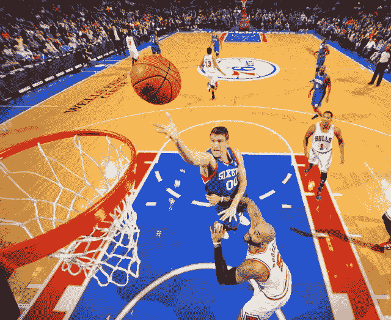
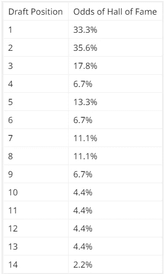
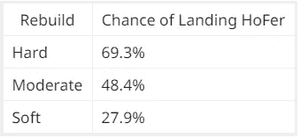

# 赔率是多少:NBA 惨败的统计分析

> 原文：<https://towardsdatascience.com/what-are-the-odds-a-statistical-analysis-of-tanking-in-the-nba-2c5fe228cd67?source=collection_archive---------17----------------------->

Image by [Philadelphia 76ers](https://www.flickr.com/photos/sixersphotos/) on [flickr](https://www.flickr.com/photos/sixersphotos/10804544724)

## 什么是坦克？

坦克是一种艺术，创造一个有目的的坏团队，意图输掉比赛，以获得高选秀权。最终，几乎所有人都同意，在今天的 NBA，你的球队需要一个真正伟大的球员来赢得总冠军。坦克的目标是获得这个球员的状元选秀权，并最终赢得一个拥有坦克核心的冠军。

随着赢得 NBA 总冠军变得越来越困难，这种策略近年来变得越来越普遍。

## 这一分析的目的

随后，这一分析旨在确定三件不同的事情:

1.  什么是一个合理的场景，坦克可能看起来像什么？
2.  那支球队会得到什么样的选秀权，这些选秀权中的一个能产生真正伟大的球员的几率有多大？
3.  如果那支球队真的得到了一个超级巨星，他们有多大可能用那个球员赢得冠军？

为了这个分析的目的，我将一个伟大的球员定义为名人堂级别的球员。

# 第一部分:坦克场景

确定一个合理的坦克场景是这个分析中最主观的部分。坦克可以采取许多不同的形状。一个团队的排名有多差取决于激烈的“竞争”，他们起草的有多好，以及他们有多投入。作为开始，我做了一个决定，一个坦克团队已经做出了一个明显的决定来重建和暂时放弃竞争力(即，他们不只是坏)。由于没有一个场景可以涵盖一切，我决定创建三个，模仿 NBA 最近的三次重建。他们在这里:

## 费城 76 人队:艰难的重建场景

76 人队的重建始于 2013-2014 赛季，交易走了大牌球员朱·霍勒迪。76 人队以他们极端的承诺著称，他们摧毁了所有可能有助于获胜的资产。在他们的最低点，他们是 NBA 历史上第二差的球队，因此这是一次艰难的重建。在重建开始的四个赛季后，76 人队自重建开始以来首次进入季后赛，就这一分析而言，这标志着重建的结束。重建期间的 76 人播种如下:

**胜率** : 23%

## 明尼苏达森林狼队:温和的重建方案

森林狼的重建始于 2014-2015 赛季，交易走了特许球员凯文·乐福。然而，他们在安德鲁·威金斯保留了交易中的第一个整体选择，这有助于使反弹更快。在他们再次进入季后赛之前，坦克可以持续三个赛季。在此期间，他们的播种如下:

**胜率** : 31%

## 犹他爵士:软重建方案

犹他爵士在失去阿尔·杰佛森和保罗·米尔萨普后开始了他们的重建。然而，第四年的戈登·海沃德帮助爵士在重建期间比其他两个场景更受人尊敬。2013–2014 赛季也是他们的第一个赛季重建，持续了三个赛季才再次进入季后赛。

**胜率** : 42%

# 第二部分:入选名人堂球员的几率有多大？

为了确定这一点，我们需要考虑两个因素:

1.  选秀抽签在每个种子位置有可能产生什么样的选秀权？
2.  每个选秀位置选中一名 HoF 球员的可能性有多大？

在这里，我们将解决第一个问题，因为它很容易。从 2019 年 NBA 选秀开始，新的彩票赔率如下:

现在我们有了从每个种子中获得每个选秀顺位的几率，我们需要从每个选秀位置中选出名人堂成员的几率。为此，我使用了[篮球参考的草稿搜索器](https://www.basketball-reference.com/play-index/draft_finder.cgi)来分析一些数据。我分析了从 1950 年到 1995 年每个位置的选秀选择(1995 年后包括一些现役或最近退役的球员，他们还没有机会进入 HoF)。每个位置入选名人堂的几率如下:

有一些不寻常的差异，根据这一点，你宁愿在第八名而不是第四名选秀。这是小样本的不幸后果。

为了将这两个部分结合起来，我对每个种子收到每个选秀选秀权的可能性和在那个位置为每个种子选出名人堂球员的可能性进行了加权(由于时间限制，我只完成了三个场景所需的种子)。

其结果如下:

现在，使用这些信息，我们可以很容易地将其与每个场景的播种结果进行交叉引用，以确定重建产生名人堂球员的可能性。这些结果陈述如下:

所以我们现在已经成功地回答了这个分析的第二部分。这里需要注意的是:更长的坦克时期可能并不意味着更高的可能性起草名人堂人才。相反，这可能表明该团队的起草工作一直很差，这就是他们未能改进的原因。然而，对此进行控制将会非常困难。

# 第三部分:和那个球员一起拿 NBA 总冠军的可能性有多大？

这部分要复杂得多。这不是一门精确的科学(我将在结论中详述)，而且非常耗时。为了衡量这一点，我回到了篮球参考的选秀搜索器，查看了自 1950 年以来每一位入选名人堂的球员。有 122 个条目。出于几个原因，我删除了 18 个条目；有的是双打(联盟早期历史上偶尔有球员被选秀两次，两次选秀都算)。其他人是作为教练或管理人员进入名人堂的球员，有些人主要是 ABA 球员。剩下 104 个条目可以使用。

一旦我有了 104 名球员，我手动检查每一个人，并确定其中 60 人被选中的球队在他们到达那里的前一年取得了失败的记录。其他 44 人在他们到达之前就已经被 50%或更高的队伍选中了。在这个例子中，为了简单起见，我们将“失去”视为等同于重建/坦克。在这 60 名球员中，有 23 名在职业生涯中从未获得过 NBA 总冠军。这使得 37 名名人堂球员被选入输掉 NBA 总冠军的球队。然而，还有 19 名球员在职业生涯后期才在其他球队赢得冠军。这留下了 18 名名人堂成员的最终样本，他们来自一支失败的球队，并在他们第一次在那里工作时赢得了 NBA 总冠军。因此，如果一支失败的球队入选名人堂，历史上他们有 30%的机会赢得 NBA 总冠军。

然而，这里有一个重要的调整。随着新奥尔良鹈鹕队的加入，NBA 在 2004 年才成为一个有 30 支球队的联盟。上面提到的 18 名球员没有一个在 2004 年或之后赢得过 NBA 总冠军。这意味着所有的球员都是在挑战性比现在小的时候赢得冠军的。

为了控制这一点，我应用了一个调整因子来说明球员赢得冠军的时间。调整系数的计算方法很简单，取当时 NBA 的球队数，除以 30。例如，一名在 15 支球队的联赛中赢得冠军的球员将获得 0.5 的调整系数，相当于今天难度的 50%。如果一个球员在那支球队赢得了多个冠军，我会用最难的一个。结果如下:

新的调整后的总得分为 11.433/60，即赢得 NBA 总冠军的 19.1%。然而，我想更进一步。我想确定赢得冠军的机会是否会因为车队的糟糕程度而改变。

为此，我根据每个场景创建了三个类别。我取了每个场景在重建过程中的平均胜率，并将其应用于+/- 5%,以获得 10%的类别范围。所以分类结果如下:

1.  **努力，23%获胜%**:18–28%
2.  **中等，31%获胜%**:26–36%
3.  **软，42 胜%**:37–47%

经过数据整理，我得到了以下结果:

据此，一个中等糟糕的团队比一个非常糟糕的团队或更平庸的团队更有可能成功。这可能是有意义的，也可能是小样本的结果。遗憾的是，这仅仅是我们能处理的最好的数据。

**局限性**

我想我会做一个简短的部分，专门讨论这种分析中存在的无限局限性。基本上，每次重建都是不同的，我无法解释这一点。一些重建设法得到许多额外的选秀权(凯尔特人)，另一些设法失去他们的(网队)。一些重建设法交易现有 NBA 超级明星的选秀权和前景，这在这里不会被捕获。一些重建有很长的坦克时期，因为他们只是在建设好的篮球队方面很糟糕(自从德怀特离开后，魔术队一直在“重建”)。基本上，有太多的移动部分来解释这一切。我已经尽我所能了。

# 结论

为了把这些联系起来，我必须把这两个因素结合起来，以便为每种情况得出一个最终的可能性。我已经把最终的结果放在了下表中:

这一切有多大意义？我不知道。有许多因素仍未得到解释。但希望这至少是一种乐趣或有趣的阅读，如果没有别的。