# 2019 年成为一名数据科学家需要具备哪些技能？

> 原文：<https://towardsdatascience.com/what-are-the-skills-needed-to-become-a-data-scientist-in-2019-1ed5afa8d989?source=collection_archive---------7----------------------->

“数据科学家”是美国最好的工作，这对科技和相关行业的任何人来说都不足为奇。毕竟，这是《哈佛商业评论》和《T2 玻璃门》连续四年(T5)报道的内容。即使我们把 117，000 美元的基本工资从等式中剔除，这个职位在所有其他方面仍然很有吸引力。例如，目前转向使用机器学习来快速跟踪业务增长，这确保了跨行业对能够处理数据和新兴技术的熟练专业人员的稳定需求。量化需求:根据 LinkedIn 的劳动力报告，151，717 名数据科学家将受到热烈欢迎。让我们不要忘记在职满意度——大多数数据科学家实际上是[快乐的](https://www.zdnet.com/article/data-scientists-really-love-their-jobs-survey-finds/)*(他们的话，不是我们的)。*

*但是本文并不是要概述数据科学是一个明智的职业决策。*

# *这份报告的目的是让“数据科学家”这个集体实体了解数字运算算法，并理解是什么造就了数据科学家。*

*对数据科学家进行逆向工程需要分析他们的技能组合、工作经历、工作行业、学术背景和正式资格。了解这一点后，有抱负的数据科学家可以采取明智的专业措施来获得这一头衔。*

*当我们 365 数据科学在 2018 年第一次试图[拆解数据科学家时，我们揭示了丰富的专业概况。自我们最初的研究以来已经过去了 12 个月，重复的研究表明，该领域正在发展，典型的专业人士也在发展。](https://365datascience.com/research-into-1001-data-scientist-profiles/)*

# *关于方法论的一点注记*

*集体“数据科学家”档案是由一项对 1，001 名目前受雇为数据科学家的专业人员的研究提供的。这些数据是根据一系列先决条件从这些数据参与者的 LinkedIn 个人资料中收集的。40%的样本目前受雇于财富 500 强公司，而其余的在其他地方工作；此外，引入了位置配额以确保有限的偏差:美国(40%)、英国(30%)、印度(15%)和其他国家(15%)。这一选择是基于对数据科学最受欢迎的国家的初步研究，这些国家的信息是公开的。*

# *2018 年的典型数据科学家和 2019 年有关联吗？*

*一眼看去，绝对！这个领域仍然由男性(69%)主导，他们可以用至少两种语言进行对话(不要与编程语言混淆，如果包括编程语言，这一数字至少会增加一倍)。他们已经工作了 8 年，但其中只有 2.3 年是数据科学家。他们可以自豪地获得第二轮学位(74%的人拥有硕士或博士学位)，至少用 Python 或 R (73%)编写“Hello World”以外的程序(通常两者都有)。*

*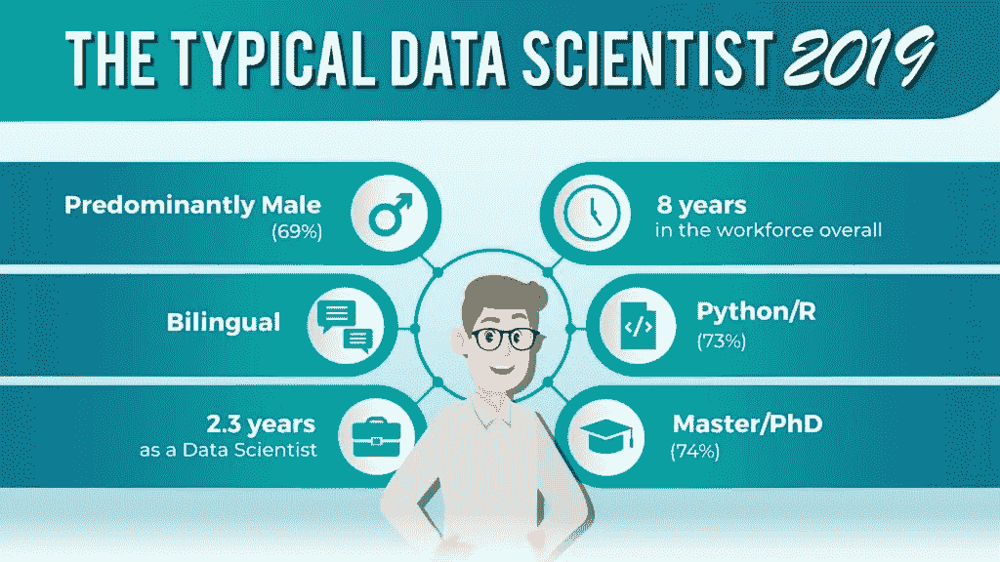*

*Summary*

*幸运的是，对于我们这些女性或尚未获得博士学位的人来说，数据的分割讲述了一个更丰富、更真实的故事。*

# *“数据科学家”是指哲学博士吗？*

*正如这个领域并非女性固若金汤，拥有博士学位也是这个职位的先决条件。事实上，不到三分之一的数据科学家拥有博士学位(28%)。这一数字与去年的 27%相当，这似乎意味着行业不会有意引入一个高不可攀的学术实力。*

**

*Highest level of education received*

*另一方面，如果硕士学位是有抱负的数据科学家愿意投入时间和精力的事情，它似乎是学术资格的黄金标准(46%的样本持有硕士学位)。*

*然而，有一个趋势似乎正在形成，那就是“数据科学家”职位上拥有第二周期学位的专业人士的比例将会下降，而只有学士学位的数据科学家将会进入该领域。数据证实了这一猜测，因为与去年相比，只有学士学位的数据科学家数量增加了 4%(2019 年为 19%，2018 年为 15%)。*

*最后，一些法学院毕业生(千分之一)成为数据科学家的事实给我们留下了一些回旋的余地，当谈到有抱负的数据科学家可以获得的学位水平时。*

# *教育水平和工作经验*

*从大学，到实习，再到最后的归宿一个‘数据科学家’。这是我们团队中 8%的数据科学家的故事。对这些专业人士来说，在美国找到最好的工作需要一个实习职位和一个硕士学位(71%)或学士学位(18%)。*

*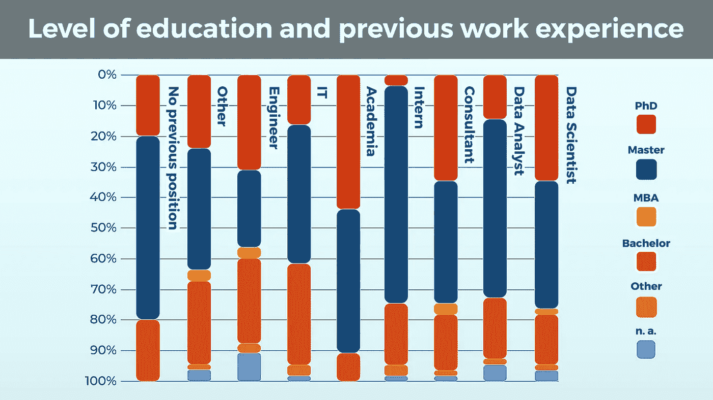*

*Level of education and previous work experience*

*对于其他人来说，这条路从未偏离离开学术界(9%)。正如所料，拥有硕士学位的数据科学家(47%)和拥有博士学位的数据科学家(44%)之间的比例相当，其他教育水平几乎不存在。*

*那么，除了实习或直接从学术界来，还有其他方法打开数据科学职业的大门吗？*

# *两男一女走进一个房间:谁将是下一个数据科学家！*

1.  *学术研究者*
2.  *信息技术专家*
3.  *实习生*

*根据我们的数据，所有这些都是进入数据科学的门户职位，成功率相当:分别为 9%、9%和 8%。虽然这可能不是我们的一些读者所希望的，但这些数字开始描绘出一个有许多切入点的职业的画面。*

*还要考虑数据分析师职位(13%)、顾问(6%)，当然还有当前数据科学家可能从事的其他工作(13%)(包括不少于 15 个职位和头衔)。*

*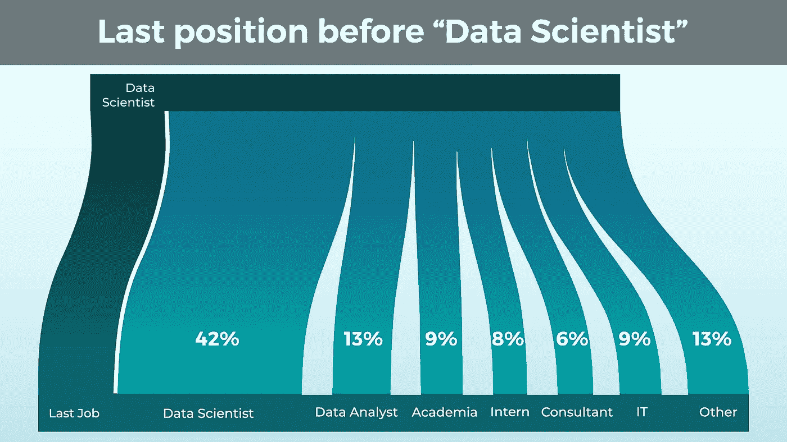*

*Last position before “Data Scientist”*

*如果你倾向于数学，我们希望你是，因为数据科学意味着一些分析能力，你会注意到这里有很大一部分以前的工作职位分析丢失了。事实上，我们团队中目前担任数据科学家的人中，有 42%已经在之前的职位上担任过数据科学家。这是一个悖论——获得“数据科学家”头衔的最佳方式是已经拥有它。*

*我们让读者进一步猜测数据科学家是否喜欢跳槽(他们也知道自己的价值！)，或者说自报数据并不总是最好的数据。*

# *我应该学习计算机科学和数学，还是可以学习植物学，然后继续成为一名数据科学家？*

*好吧。要成为一名医生，你需要去医学院；成为律师——法学院；警官——一个特殊的学院，等等。在撰写本文时，数据科学学校很少，如果有的话，那么数据科学家研究什么呢？*

*事实上，我们组中有相当一部分人学习了数据科学和分析，但在我们继续之前需要注意一下符号。由于大量独特的学位可用于学术研究，我们将它们分为七个学术研究领域。*

1.  *经济学和社会科学，包括经济学、金融、商业研究、政治学、心理学、哲学、历史、市场营销和管理*
2.  *自然科学，包括物理、化学和生物*
3.  *统计学和数学，包括统计学和以数学为中心的学位*
4.  *计算机科学，不包括机器学习*
5.  *工程*
6.  *数据科学和分析，包括机器学习*
7.  *其他，在那里你可以找到艺术和设计，大气科学，和…其他*

*也就是说，在我们的研究中，12%的数据科学家专业人士学习数据科学和分析。虽然这个领域本身很新，但越来越多的大学提供专业学位，为你在数据科学领域的未来做准备。鉴于典型的数据科学家档案揭示的受教育水平，大多数数据科学家都是硕士水平也就不足为奇了。*

# *然而，数据科学和分析并不是我们这个群体中最受欢迎的学位。*

*取而代之的是计算机科学(22%)。数据科学家的工具箱中有很大一部分是编程语言和数字处理工具，由于缺乏更广泛的替代品，这个学位是一个自然的选择。*

*令人惊讶的是，今年研究的亚军学位不是统计学和数学(以 16%的普及率稳居第三)，而是经济学和社会科学(21%)。尽管如此，工程毕业生仍占该群体的 9%，这支持了一个观点，即最能让你为处理和处理大数据做好准备的三大学位是计算机科学、统计和数学以及工程(合起来占该群体的 50%)。*

**

*Area of academic studies*

*另一方面，样本中经济学和社会科学毕业生的大量存在(21%)对于不太倾向于数学的有抱负的数据科学家来说可能是个好消息！几乎和仅仅从计算机科学领域进入这个领域的人一样多。还有 11%来自自然科学背景。考虑到数据科学通常是用统计学来编程的(或者用编程来编程的统计学)，这个结果相当有趣。*

# *常春藤联盟还是‘拜拜，数据科学…’？*

*数据科学绝对不是常春藤联盟毕业生的私人竞技场。虽然我们样本中有三分之一的专业人士毕业于排名前 50 的大学(根据 2019 年[泰晤士报高等教育世界大学排名)，但第二大群体是由泰晤士报甚至没有排名的大学毕业生组成的(23%)。大家都松了一口气——这个领域没有对那些接受世界级高等教育机会有限的专业人士敞开大门。](https://www.timeshighereducation.com/world-university-rankings/2019/world-ranking#!/page/0/length/25/sort_by/rank/sort_order/asc/cols/stats)*

*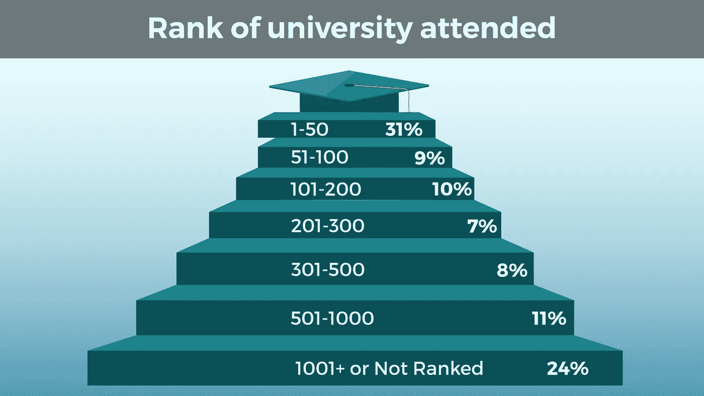*

*Rank of university attended*

*数据表明，数据科学是一个仅凭技能和优点就能获得成功的领域，这并不完全令人震惊。毕竟，分析和处理数据是实用的动手技能。我们中最热情的人可能会通过实践、好奇心和足智多谋而变得与众不同。*

*关于排名中的其余集群，它们的人口相对均等。但是，读者应该注意到，群集的大小不同(例如，1–50 对 301–500 或 501–1000)。尽管如此，这对有抱负的数据科学家来说都是好消息:这个领域不仅有来自各种背景和不同学术水平的人，而且也欢迎来自《泰晤士报》排名中任何大学的专业人士。*

# *自我准备和在线课程*

*众所周知，数据科学家来自许多不同的背景。数据科学与许多其他学科不同，它拥有强大的教育基础设施。这意味着许多想在这个领域获得成功的人需要承担起自己学习技能的责任。*

*但是我们如何准确地衡量是谁干的呢？*

*最可靠的方法是看他们个人资料上贴的网上证书。有太多的在线平台提供优质课程，价格堪比浪漫的晚餐约会，打造一套量身定制的技能从未如此容易(或便宜)。*

*我们发现，我们收集的资料中有 43%发布了至少一门在线课程，平均有 3 个证书。*

*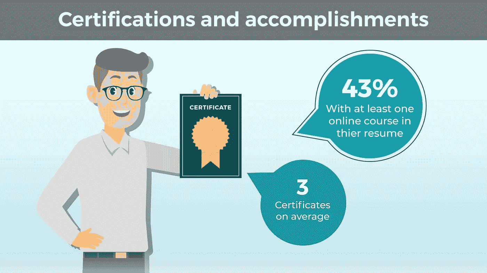*

*Certifications and accomplishments*

*当然，一些数据科学家可能已经通过不同的方式自学了。而其他人甚至可能不张贴他们收到的所有或任何证书。如果他们不相信一旦他们获得了更多的经验，他们会相关，为什么他们会浪费时间或空间在他们的电子简历上？考虑到收集数据的平台，这一点值得记住。*

*那么，我们能用这些信息做什么呢？*

*首先，我们可以看看参加(或至少发布)在线课程的人和没有参加的人的背景是否有任何关联。学历水平是一个因素吗？可以毫不夸张地假设，来自排名较低的大学的人会选择更多的在线课程。但也许来自排名更高的大学的学生更专注于他们的教育，所以，让我们不要假设，而是看数据。*

# *在线课程和大学排名*

*事实上，当比较这两个因素时，有一个非常有趣的结果。*

*在我们回顾之前，请记住大学排名集群在规模上确实有所不同，包括研究参与者和大学排名。我们还想指出，1000+集群仅包含 7 个参与者，这是不够的数据。所以，我们不会把它们作为有效结果来讨论。*

*也就是说，我们从剩余的数据中得到了一些非常有趣的见解。*

*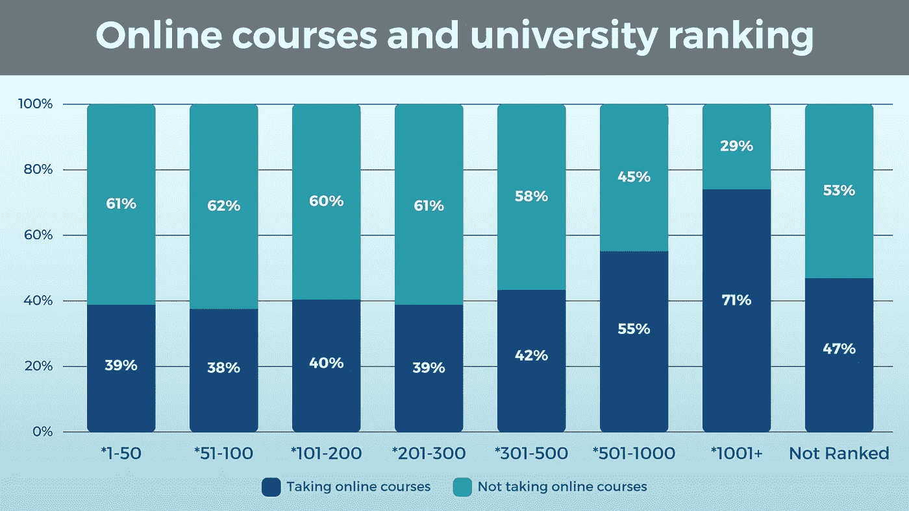*

*Online courses and university ranking*

*第一个有趣的结果是，排名前 500 的四所大学的结果略有不同。这并不令人意外，但它确实显示了与去年研究结果的明显差异，去年排名前 100 位的大学毕业生发布的在线课程明显减少。*

# *也许这说明自我准备是有价值的，甚至对名牌大学的学生来说也是如此。*

*下一个有趣的结果出现在* 501–1000 排名聚类中，它显示了证书数量的急剧增加。同样，这不会被认为是令人震惊的:我们愿意推测，你去的大学排名越低，你就越想通过大量的在线证书脱颖而出。令人惊讶并对我们假设的有效性产生怀疑的是下一个集群(未排名)的行为。在那里，证书的数量下降到与前 500 名相当的百分比。*

*虽然很难知道这是为什么，但不难看出自我准备的重要性，并且考虑到自去年以来这一数字一直在上升，特别是在顶级大学，有抱负的数据科学家也意识到了这一点。*

*获得网上证书是一回事，但是学习哪些技能最有益呢？用人单位找哪些？当然，我们已经有数据来发现这一点。*

# *就业国家和编程技能*

*由于实施就业配额的国家不同，我们不仅可以查看总量，还可以进行可靠的国家间比较。我们将样本分为四个地区:美国、英国、印度和其他地区，样本权重与去年的研究相同(见上文方法)。*

*在我们进入地理细分之前，我们需要一些最好由汇总数据提供的背景信息。*

*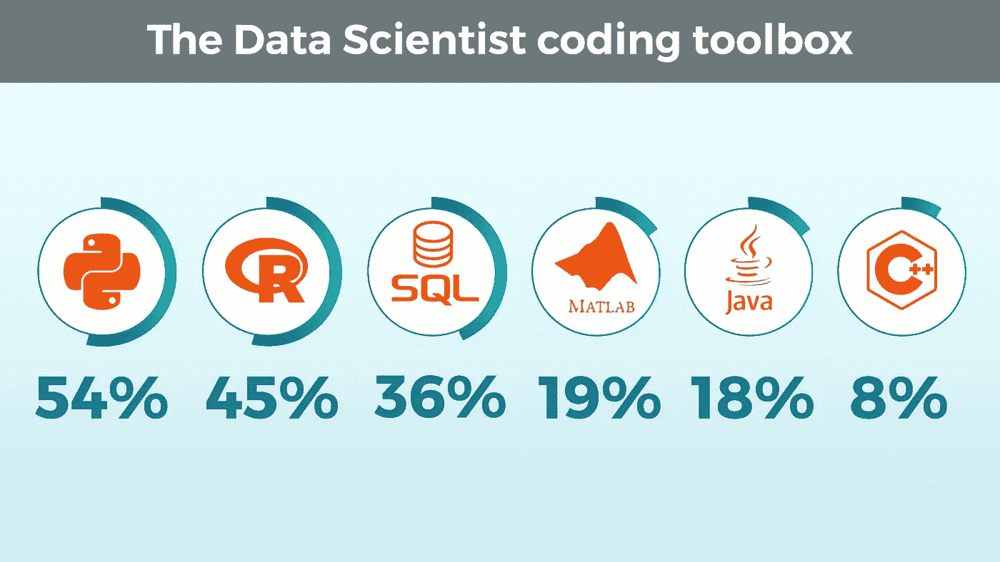*

*The Data Scientist coding toolbox*

*数据科学社区中最流行的编程语言是 Python，其次是 R。值得注意的是，与去年相比，R 的受欢迎程度下降了 10%，鉴于 Python 的多功能性，这并不完全令人惊讶。*

*但是让我们进一步细分。*

*从区域划分来看，结果与总量相差不远。*

*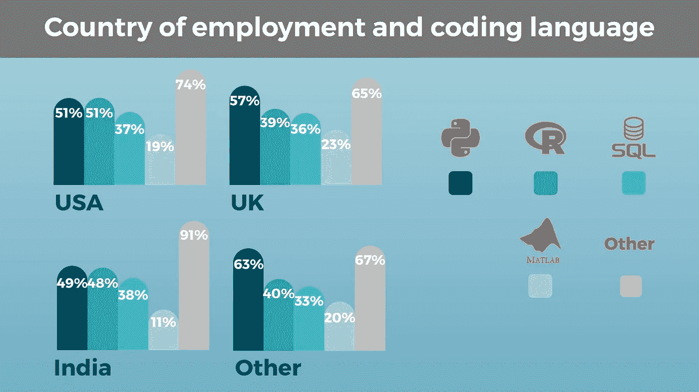*

*Country of employment and coding language*

*为了简单起见，我们研究了 4 种最常用的语言:Python、R、SQL 和 MATLAB。与去年版本的第一个最突出的不同是，Java 已经被 MATLAB 取代，成为第四大最常用的编程语言。领先的三人组在参赛者方面保持不变，但在组成方面没有变化。几年来， [Python 一直在蚕食 R](https://www.kdnuggets.com/2018/05/poll-tools-analytics-data-science-machine-learning-results.html) 的市场。*

*事实上，这也是我们在这里看到的。Python 无疑是世界上最常用的数据科学语言，只有美国和印度使用它。*

*值得注意的是，关系数据库的使用在全球范围内似乎是持平的，SQL 在任何地方都被同等地使用。*

*随着印度最近成为外包天堂，也许有必要看看另一个细分领域——工业。*

# *就业和工业国家*

*我们将样本分为 4 大类行业:工业、医疗保健、金融和科技。医疗保健是整体中微不足道的一部分，因此关注其余部分是有意义的。*

*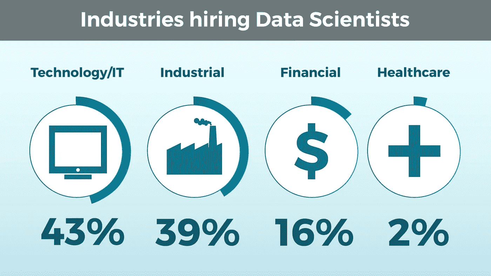*

*Industries hiring Data Scientists*

*事实上，数据并没有显示出很大的跨国差异(见下文)，除了英国的数据科学仍然是“金融”多于“技术”，而印度的数据科学比其他国家的数据科学“工业”程度低。虽然后者并不令人惊讶，但值得注意的是，在我们之前的研究中，技术部门拥有 70%的数据科学家人才。在过去的一年里，这似乎发生了巨大的变化。*

*最后，与金融相关的数据科学在印度和世界其他地方发展迅猛，赶上了其他行业。*

*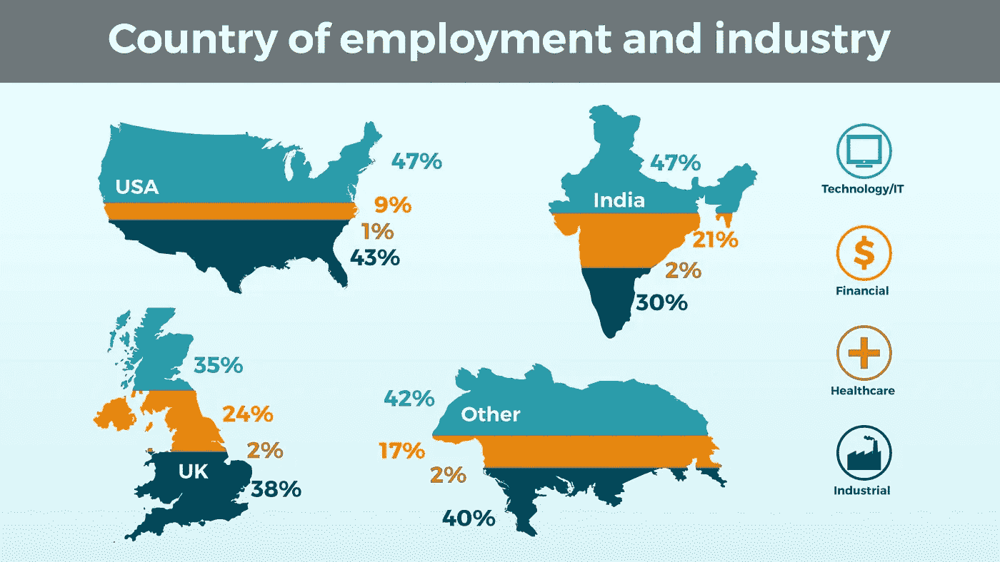*

*Country of employment and industry*

*对于美国的数据科学家来说，我们可以说技术和产业集群正在获得大部分人才。*

# *就业国家和学位*

*对我们来说，最有趣的细分之一是学位细分。潜意识里，我们认为博士将主宰这个领域。去年的数据显示，只有三分之一的样本是“哲学博士”。在超过一半的情况下，仅仅一个硕士学位就足够了。*

*今年，我们看不到什么不同。对于英国、印度和其他国家，我们没有变化。本科就够了，硕士更好。*

*然而，最引人注目的是美国博士人数的增加。再加上科技行业在美国一直占据更大份额的事实，你就会拥有它——受过高等教育、以技术为导向的数据科学家可能比以往任何时候都更努力地工作，以提供我们都期待的未来数据科学。*

*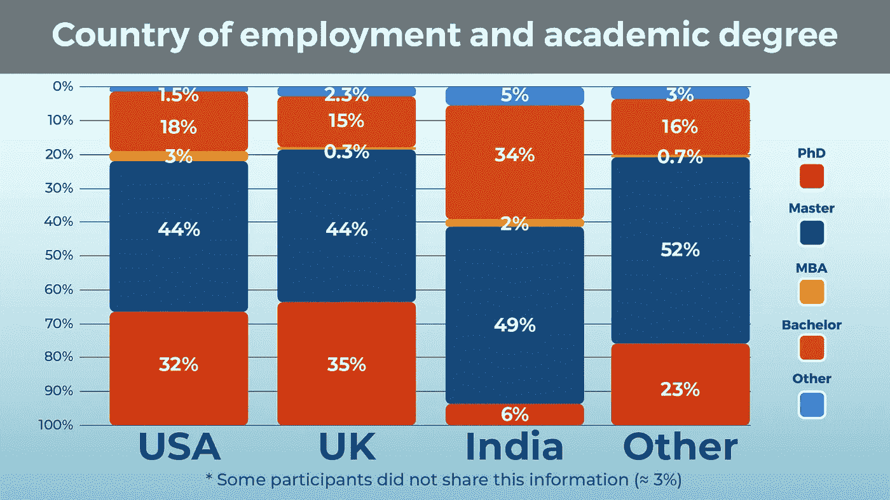*

*Country of employment and academic degree*

*如果你还没有拿到博士学位，并且在我们的名单上，那么你很有可能来自印度。但是，当涉及到实际工作经验时，这又是怎么回事呢？*

# *就业国家和工作经历*

*哪个地方的职业发展最快？*

*要获得这种洞察力，有必要看看数据“奇才”在实现成为数据科学家的梦想之前的经历。*

**

*Country of employment and work experience*

*在 2018 年版中，我们看到了国家之间的巨大差距。美国超过一半的数据科学家拥有 5 年以上的经验。*

*今年？*

*一点也不像。*

*他们可能已经辞掉工作，或者成为了经理。毕竟，作为一名数据科学家也是令人沮丧的。但是“年轻人”正在让路。在印度和英国更是如此。似乎有更多的职位空缺，即使没有工作经验，你也有 20-30%的机会得到那个职位！*

# *公司规模和编程语言*

*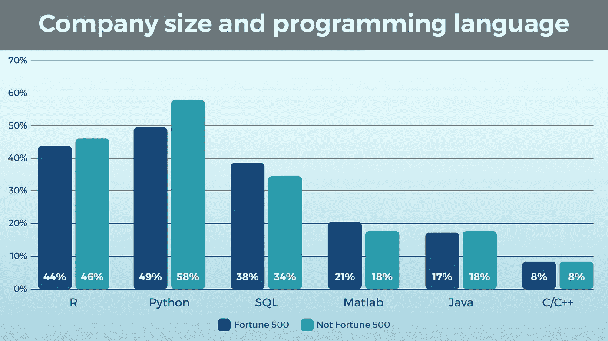*

*Company size and programming language*

*虽然 Python 仍然在非 F500 公司中得到更广泛的应用，但在几乎所有其他类别中，F500 都在与非 F500 公司携手前进。对于任何喜欢当前技术(R 和 Python)的数据科学新手来说，这是一个好消息。与去年的成绩相比，我们已经迎头赶上了很多…*

# *公司规模和大学排名*

*令人惊讶的是，大学排名对数据科学家的雇主没有影响。*

*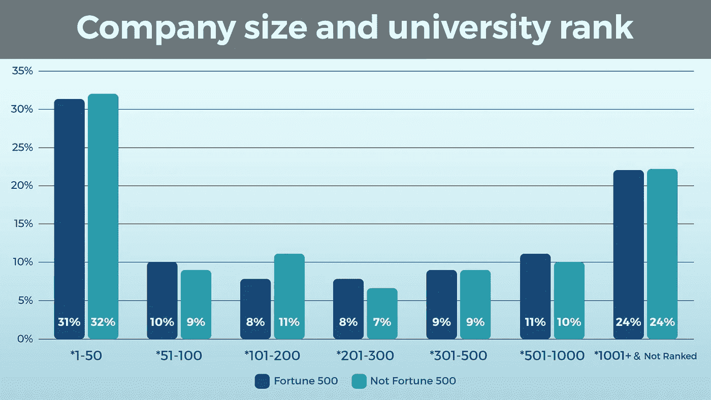*

*Company size and university rank*

*引用我们去年的话:*‘到处都需要数据科学家。从 500 英镑到一家科技初创企业！”**

*这也加强了我们的信念，即个人技能和自我准备是成为一名成功的数据科学家的更重要的因素，*的雇主知道这一点。**

# *结论*

*希望这篇文章不会让你怀疑数据科学家这个职业是否是你可以实际从事的职业。相反，我们希望能够伸出援助之手。我们从去年和今年的研究中提取的主要信息之一是，如果你拥有成为数据科学家的技能基础，你 ***可以*** 成为数据科学家。看到数据科学专业在未来 2-5 年内如何变化将是有趣的，但现在，一个通用的数据科学家档案似乎正在形成:一个跨行业和跨地区的独特编程语言工具箱；最好是硕士学位，或学士学位和实践能力证明；和自信的不断学习的态度是这个领域的主流。*

*最后一点:我们的目标是随着数据科学家的发展，创建一个完整而有用的数据科学家档案。如果任何人对我们可以做得更好或更仔细检查的事情有建议或意见、反馈和想法，请让我们知道！开放式对话对于帮助有抱负的数据科学家做出明智的职业决策至关重要。*

*祝您的数据科学之旅好运，感谢您的阅读！*

*附:这是我们去年的研究。也许你能发现我们忽略的趋势？*

**原载于 2019 年 1 月 30 日 365datascience.com***。***