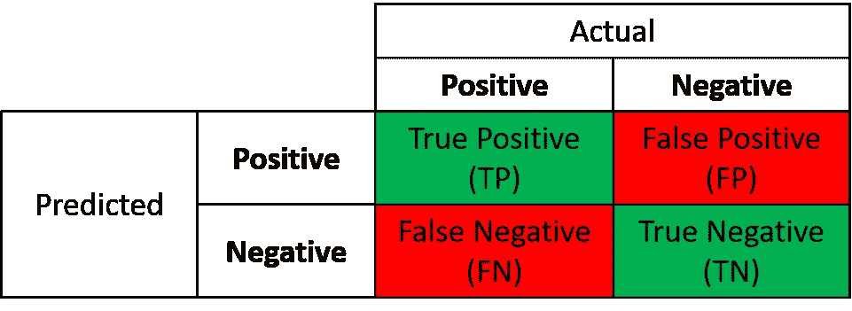
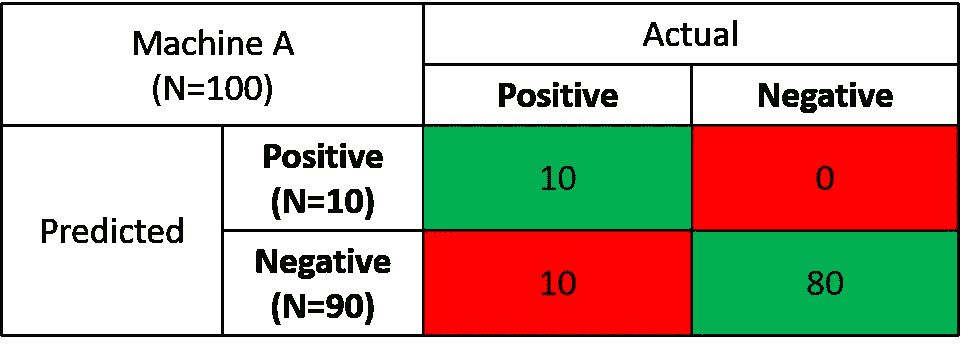
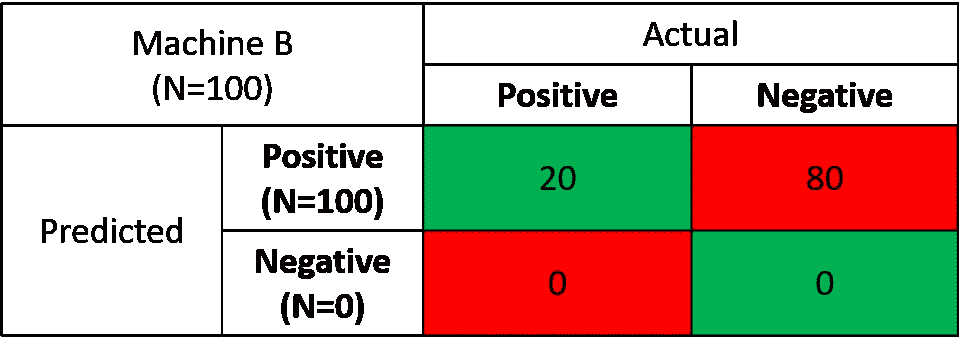

# 人工智能产品经理——你在优化什么？

> 原文：<https://towardsdatascience.com/what-are-you-optimizing-for-17c4406544ec?source=collection_archive---------21----------------------->

15 个月前，我加入了一家初创公司，负责产品管理。在不涉及太多细节的情况下，我们为 B2B 公司的客户成功团队开发了一个基于人工智能的软件解决方案。在这篇文章中，我将讨论用户体验和人工智能(AI)之间的关系，以及对产品经理来说有什么意义。

Photo by [Rock'n Roll Monkey](https://unsplash.com/@rocknrollmonkey?utm_source=medium&utm_medium=referral) on [Unsplash](https://unsplash.com?utm_source=medium&utm_medium=referral)

产品经理的人工智能是什么？

产品经理需要了解他/她的客户。她需要了解他们的工作环境、他们的使命、他们想要实现的目标、他们面临的挑战，然后设计一个有针对性的解决方案来最好地满足这些需求。他们需要和一群有才华的人一起，将这些想法变成一个连贯且易于使用的产品。

人工智能现在是技术的中心已经有几年了，而且预计会停留更长时间。人工智能不再只是一个时髦的词，它已经有了现实世界的应用程序，这些应用程序在它们的类别中进行了一场革命:Siri、Alexa、网飞推荐引擎、谷歌照片等等。

产品必须解决现实世界的问题。技术和实现细节应该服务于产品，并且对可用性有最小的影响(至少在软件中)。人工智能是一种解决问题的实现方法，但它的预测性对用户体验和可用性有重大影响。

当一家公司为任何市场/类别设计基于人工智能的解决方案时，它总是会问自己——我们优化产品是为了什么？我们是在优化准确性、阳性预测值还是命中率？或者换句话说——精确还是回忆？回答这些问题至关重要，因为它会影响产品 UX 及其价值主张。

作为一家开发基于人工智能的解决方案的初创公司的产品经理，我每天都在思考这个问题，并根据决策来制定我们的解决方案。

**你能回忆起它们的意思和区别吗？**

我想回忆和精确听起来很熟悉。你甚至知道它们的意思，但已经忘记了。精确度和召回率是统计术语，用于衡量算法返回结果的相关性。这些术语有官方的学术解释，但是我想用一个例子来回顾一下。

**下雨了吗，伙计？**

假设我有一台机器可以预测明天是否会下雨。每天，如果明天会下雨，机器会返回“是”,如果不会下雨，机器会返回“否”。我们连续运行机器 100 天，得到了以下结果:

*   机器预测会有 10 次降雨
*   剩下的 90 天，据说天气会很干燥(没有雨)

现在我们想将预测与实际天气进行比较:

*   十次天气预报说要下雨，结果都下雨了。预测非常准确。有多精确？10 次预测中有 10 次下雨→ 10/10。我们有 100%的精确度。哇！这是否意味着我拥有了终极降雨预测机器？不确定..让我们检查一下其他 90 天。
*   当我们计算雨天的总数时，我们发现实际上总共有 20 个雨天。这是什么意思？机器回忆(正确预测)了 20 个雨天中的 10 个雨天→ 10/20 → 50%。所以它预测了 50%的雨天，但也错过了其中的 50%。
    现在，你觉得我的机器还厉害吗？

Photo by [Geetanjal Khanna](https://unsplash.com/@geetanjalkhanna?utm_source=medium&utm_medium=referral) on [Unsplash](https://unsplash.com?utm_source=medium&utm_medium=referral)

让我们把它发挥到极致，我的机器刚刚坏了，每天它都说明天会下雨。收到的结果:

*   将要下雨——100 天
*   不会下雨— 0 天

现在让我们再次评估结果:

*   机器现在没有那么精确了，因为实际上只下了它预测的总共 100 次雨中的 20 次→ 20/100 → 20%
*   但是从实际的 20 个雨天来看，机器正面预测了所有的 20 天→ 20/20 → 100%回忆

现在，假设您可以去商店购买上述机器中的一台，您更喜欢哪台机器？更精确的一个，如果它说要下雨，你可以肯定，但会错过许多雨天，或者机器不会错过任何雨天，但其他许多天都是错误的？

答案并不那么直截了当。也许对于降雨预测来说是这样，但对于许多其他基于人工智能的应用来说，真的不是。

**你糊涂了吗？**

没关系。正是出于这个原因，我们创建了混淆矩阵，来帮助您对事物进行分类，并计算精确度和召回率:

Confusion Matrix

精度= TP / (TP+FP)
召回= TP / (TP+FN)

让我们用天气预报机器再检查一遍:

Weather Prediction — Machine A

精度= 10/(10+0) = 10/10 = 100%
召回率= 10/(10+10) = 10/20 = 50%

Weather Prediction — Machine B

精度= 20/(20+80) = 20/100 = 20%
召回率= 20/(20+0) = 20/20 = 100%

**那么，你在优化什么呢？**

现在当我们真正理解了其中的区别，我们应该如何优化我们的模型和产品呢？精准还是召回？大多数时候，我们不得不选择一个而不是另一个，同时拥有高精度和召回率几乎是不可能的。

决定优化什么是基于许多因素:心理，财务，犯错的成本，错过的成本，声誉，时间等等。

让我们来看三个真实场景并进行讨论:

*   **癌症检测** —作为一名患者，你愿意被检测出患有癌症，开始治疗，然后发现自己并未患病(假阳性)吗？或者发现自己得了癌症时已经来不及治疗了(假阴性)？
    如果你是健康保险公司，你的答案会改变吗？你能资助所有不必要的治疗吗？你会提高保险费率以确保不会错过任何人吗？作为一名医生，你会拿自己的名誉冒险去错过检查吗？
    至少作为患者，没有人愿意错过被检测。因此，当构建检测癌症的产品时，优化召回(避免假阴性)将更有意义。
*   **网飞推荐**——作为用户，你更希望得到与你高度相关的推荐，而不是那些可能受欢迎但不适合你的一般东西。所以在这种情况下，产品是优化精度(避免误报)。
*   机场安检——作为一名乘客，你愿意排着长长的安检队伍等待，这样就不会有危险意外通过安检了吗？或者你更愿意冒着枪支可能被走私到飞机上的风险快速通过这些检查？
    监管可能会说不要错过任何危险。从商业角度来看——安全是一种负担，它要花很多钱，让人烦恼，而且在护照检查之后，留给人们花钱的时间更少了。

我们可以讨论几十个例子，并试图了解产品试图优化什么，以及在与它交互时，它如何影响整体用户体验。

**客户流失预测**

我们开发了一个基于人工智能的产品，用于预测 B2B 公司的客户流失。我们使客户成功团队能够将他们的努力集中在真正重要的客户身上，并交付更好的结果。

优化精度意味着该产品将精确定位有流失风险的目标客户名单，并确保没有人误入其中。朝这个方向发展的不利之处是会错过一些会流失的客户端，而这些客户端没有被检测到。
缓解这种情况的一个想法是将列表分成几页，第一页包括最相关的客户，如果用户想了解更多，他们可以进入下一页。谷歌搜索结果提供了这样一种体验——第一页包含最相关的结果。如果你想探索更多，你也可以查看其他页面(真的有人这样做吗？！)

优化召回意味着产品不那么敏感，会产生更长的有流失风险的客户名单，并确保我们不会遗漏任何人。不利的一面是，该列表还包含误报，这些客户没有流失的风险。缓解这种情况的一个办法是增加其他客户特征的列表，这些特征可以提供更多的风险提示(例如优先级)。

作为产品经理，我需要了解我们的客户——他们是更能容忍假阳性(没有风险的客户)还是假阴性(没有检测到所有有流失风险的客户)？

他们期望从产品中获得什么样的体验？他们有足够的资源来处理更长的列表吗？

你怎么想呢?你会优化什么？你还有其他可以分享的例子吗？

感谢阅读，有任何问题可以在这里联系我[或者通过我的](mailto:guymolho@gmail.com) [LinkedIn](https://www.linkedin.com/in/guymolho/)