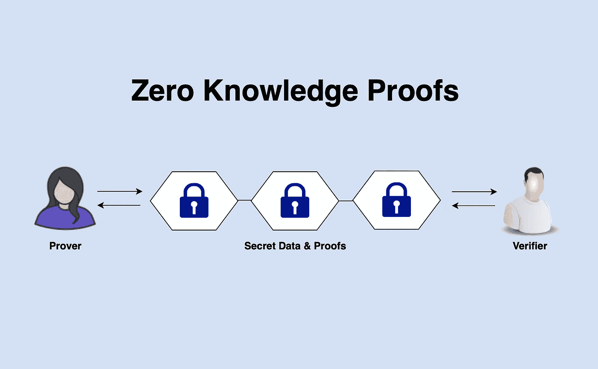
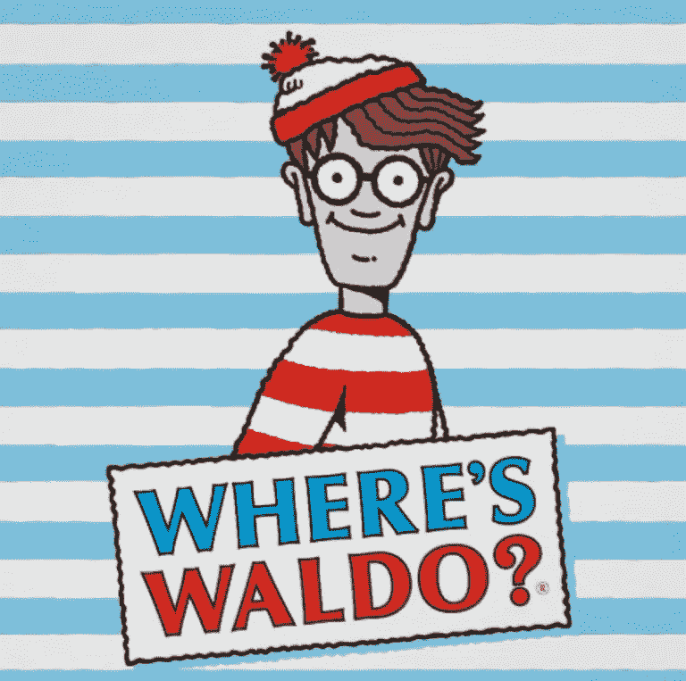
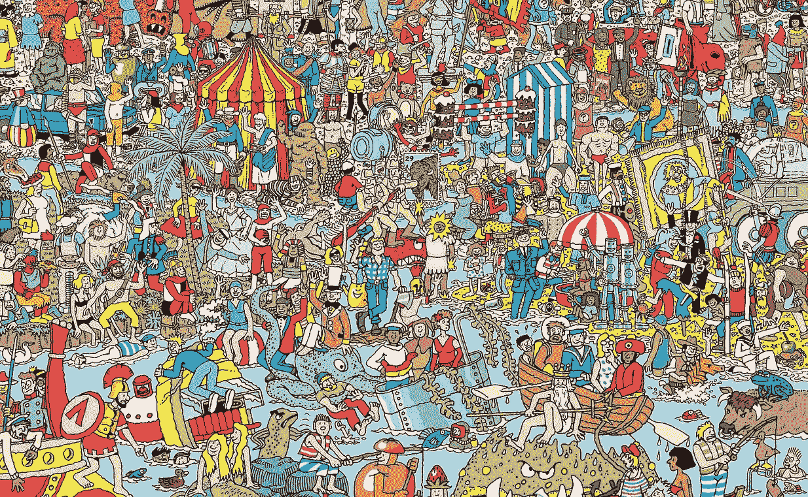
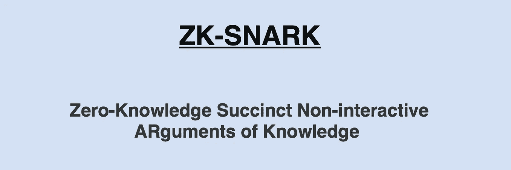

# 什么是零知识证明？

> 原文：<https://towardsdatascience.com/what-are-zero-knowledge-proofs-7ef6aab955fc?source=collection_archive---------4----------------------->

除非你不在网上生活，否则你使用的应用程序会捕获并可能转售你的个人数据(比如你的联系信息、兴趣和偏好)。即使你不使用应用程序，你的网络提供商和手机操作系统也会收集你的数据。公司通过两种方式从这些数据中受益:利用这些数据优化他们的服务，以更好地吸引你，并将其转售给其他公司。

我们如何让[人重新掌控他们的数据](/how-blockchains-will-enable-privacy-1522a846bf65)？问题是有些服务确实需要你的数据来为你服务。例如，不与保险公司共享健康信息就很难获得健康保险，或者不披露信用评分就很难获得贷款。

如果有一种方法可以显示您在所有指标上都处于健康范围内，而无需分享您的实际健康信息，或者证明您的信用评分足够好，而无需披露实际信用评分，会怎么样？

**零知识证明**

零知识证明(zkp)允许在不泄露数据的情况下验证数据。因此，它们有可能彻底改变数据收集、使用和处理的方式。

每个交易都有一个“验证者”和一个“证明者”。在使用 ZKPs 的事务中，证明者试图向验证者证明某件事，而不告诉验证者关于这件事的任何其他事情。

通过提供最终的输出，证明者证明他们能够在不暴露输入或计算过程的情况下计算一些东西。同时，验证者只知道输出。

一个真正的 ZKP 需要证明三个标准:

1.*完整性*:它应该让验证者相信证明者知道他们所说的

2.*可靠性*:如果信息是假的，它不能使验证者相信证明者的信息是真实的

3.零知识度:它不应该向验证者透露任何其他信息

例子:沃尔多在哪里

在去年的一次演讲中，Elad Verbin 用一个例子“Waldo 在哪里”很好地解释了零知识证明。

在“沃尔多在哪里”儿童读物中，读者被要求在一群做着各种事情的插图人群中找到沃尔多(戴着眼镜、红白相间的毛衣、蓝色牛仔裤和无沿帽)。

Waldo (left), and a Where’s Waldo puzzle (right). Sources: Zazzle & TechSpot.

假设我(作者)是证明者，你(读者)是验证者。我声称有一种算法可以很容易地找到沃尔多，但我只会让你用它来换取一笔费用。你想要算法，但不想在我证明它有效之前付钱。

所以，像很多交易一样，我们想要协作，但是我们并不完全信任对方。

为了证明我有一个可行的算法，我在地板上放了一个展示一大群人的插图。在请你遮住眼睛后，我用一块大而平的黑纸板(覆盖的面积比插图本身大得多)盖住插图，上面有一个小小的切口。这个微小的切口让我们可以看到瓦尔多，但是他在图像中的位置或者谜题开始和结束的地方。然后，我请你再次闭上眼睛，我把木板从沃尔多在哪里的谜题上拿下来。

Here’s Waldo!

我已经证明了我可以很快在拼图中找到瓦尔多，而不需要告诉你瓦尔多在那张图片中的位置，我是如何这么快找到他的，或者关于那张插图的任何其他事情。这个练习我们重复的次数越多，我就越有可能找到一个有效的快速算法。

**交互式和非交互式 ZKPs**

zkp 有两种类型:交互式和非交互式。

*互动*:上面的沃尔多在哪里的例子是一个互动证明，因为我，证明者，执行了一系列的动作来说服你，验证者，某个事实。交互式证明的问题是它们有限的可转让性:为了向其他人或验证者多次证明我找到 Waldo 的能力，我必须重复整个过程。

*非交互式*:在非交互式证明中，我可以提供一个任何人都可以自己验证的证明。这依赖于验证者为证明者选择一个随机的挑战来解决。密码学家菲亚特和沙米尔发现，使用一个[哈希函数](https://hackernoon.com/cryptographic-hashing-c25da23609c3)来选择挑战(不需要与验证者进行任何交互)，可以将一个交互式协议转换成一个非交互式协议。证明者和验证者之间的重复交互变得不必要，因为证明存在于从证明者发送到验证者的单个消息中。

**Zk-SNARKs**

Zk-SNARK

零知识简洁的非交互式知识论证(Zk-SNARKs，一种非交互式 ZKP)是零知识，因为它们不向验证者揭示任何知识，简洁是因为证明可以被快速验证，非交互式是因为证明者和验证者之间不需要重复交互，知识论证是因为它们提供可靠的证明。

**ZKPs 的用例**

ZKPs 可用于保护医疗保健、通信、金融和市政技术等领域的数据隐私。

金融领域一个有趣的用例是 ING 的[提议，证明一个数字在特定范围内，但不透露该数字。因此，贷款申请人可以证明他们的工资在一定范围内，有资格获得贷款，而不必透露他们工资的确切数额。](https://www.ingwb.com/themes/distributed-ledger-technology-articles/ing-launches-major-addition-to-blockchain-technology)

到目前为止，zkp 最突出的用途是 [Z-Cash](https://z.cash) ，一种允许私人交易的加密货币。

AdEx 网络允许分散的 ZKP 广告拍卖，在这种拍卖中，用户可以为投放广告的价格出价，而无需向其他用户透露该价格。

**结论**

零知识证明具有巨大的潜力，通过允许其他人验证数据的某些属性而不暴露数据本身，让人们重新控制他们的数据。这将对金融、医疗保健和其他行业产生巨大的影响，既能实现交易，又能保护数据隐私。

—

[陕雷](http://www.shaanray.com)

关注 [Lansaar Research](https://medium.com/lansaar) 关于媒体的最新新兴技术和新商业模式。