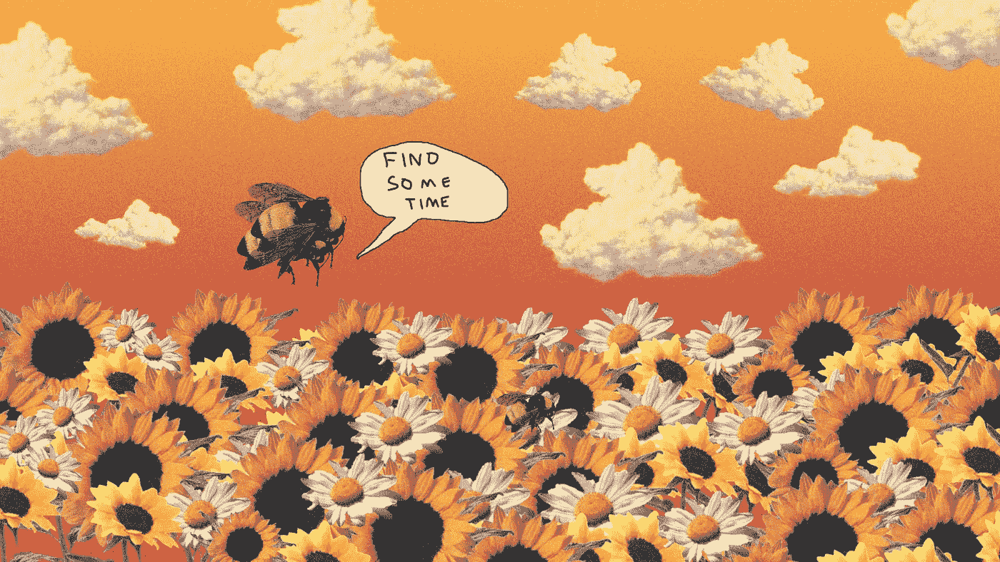
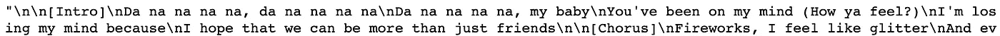
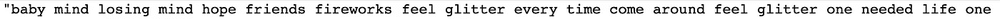
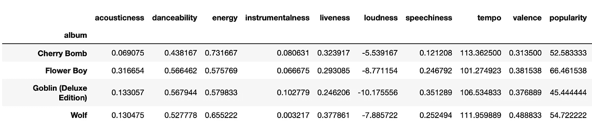
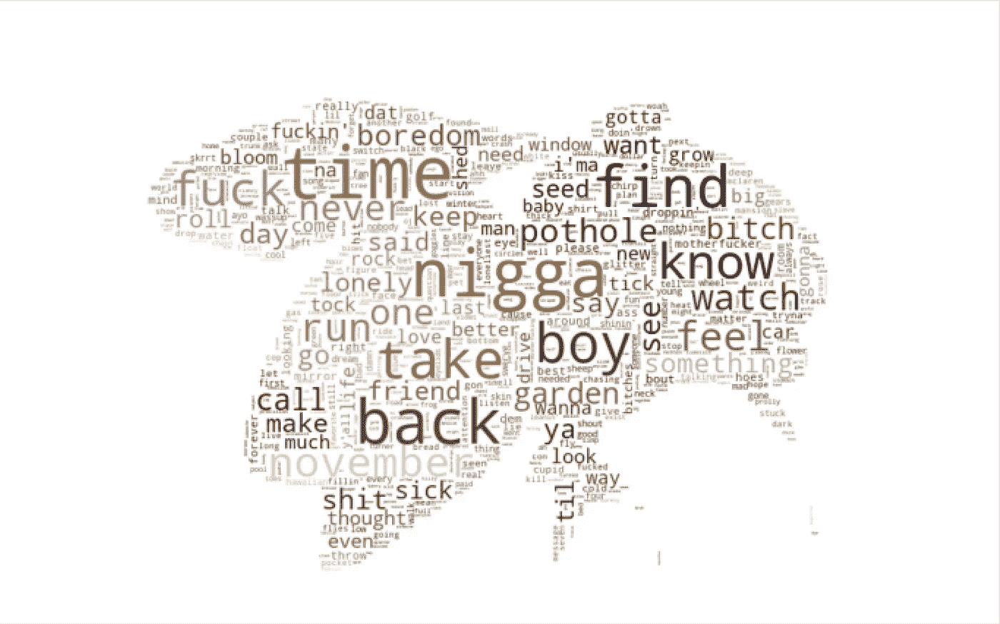
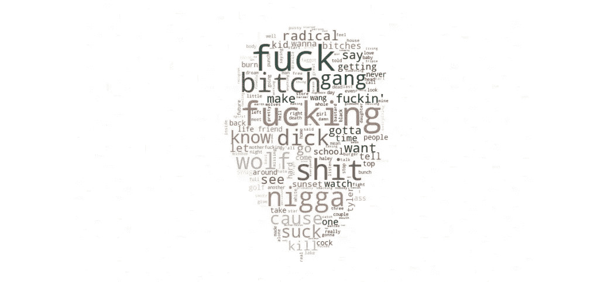
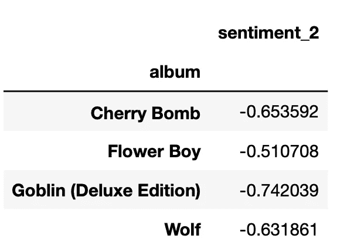

# 关于花童，数据分析能告诉我们什么

> 原文：<https://towardsdatascience.com/what-can-data-analytics-tell-us-about-flower-boy-59c037b1622c?source=collection_archive---------28----------------------->

## 《创始者泰勒》的碟学分析

《花童》被评论家们誉为泰勒这位创作者最好、最成熟的专辑。他得到了 Pitchfork 的 8.5 分，Pitchfork 称这张专辑“具有变革性、热恋性和穿透力”，并获得了 2018 年格莱美奖最佳说唱专辑类别的提名。

虽然我喜欢泰勒以前的专辑，但我不得不承认花童是我最喜欢的一张。从《花园小屋》梦幻般的吉他和弦，到《无聊》的绝妙结尾和《我没有时间》的野蛮节奏，我认为所有这些元素的并列融合得非常好。

作为一个音乐迷和数据爱好者，我问自己这样一个问题:是什么让花童与泰勒过去的专辑如此不同？已经有无数的博客帖子和视频从音乐的角度回答了这个问题，我想通过分析的方法来补充这个话题。我认为这也是一个正确的时机，因为他明天将发行一张新专辑，谁知道也许会有一个完全不同的风格。

所有的分析都是在 Python 3 上完成的，一旦我可以清理它，我将在 GitHub 上发布我的代码。

# 获取和清理数据

为了这个项目，我综合了通过 Spotify 和 Genius 获得的数据。非常感谢 [**这篇**](https://medium.com/@RareLoot/extracting-spotify-data-on-your-favourite-artist-via-python-d58bc92a4330) 帖子的作者，他展示了一种易于理解和快速实现的调用 Spotify API 的方式，并且节省了我大量的时间。不幸的是，由于私生子不在 Spotify 上，我无法获得关于这张专辑的数据，所以我从分析中排除了它。

对于每首歌曲，Spotify 都提供了大量信息，其中最让我感兴趣的是音频功能。有很多东西可以定义一首歌曲的特征，如声音、能量、舞蹈性、乐器性等等。我强烈推荐你阅读 Spotify 文档，你可以在这里找到**，对每个对象有一个精确的定义。Genius 允许我获取每首歌曲的歌词，以便进行文本分析。**

**Spotify 数据已经是一种易于分析的格式，我只需将它们转换成一个数据框架。不过，歌词需要清理。为了做到这一点，我用 NLTK 库删除了所有的标点符号和停用词，将所有内容都用小写，还删除了泰勒歌词中大量使用的表达，而没有添加太多的含义，如:“耶”、“那”或“嗯”。**

****

**Original data from Genius**

****

**Cleaned data**

**现在到了有趣的部分！**

****

# **分析音频特征**

**我首先看了一下每个音频特征和每个专辑的含义，以便有一个大致的概念。**

****

**在所有可用的功能中，花童显然从一个方面从其他专辑中脱颖而出:声音。这被 Spotify 定义为*“一个从 0.0 到 1.0 的关于音轨是否是声学的置信度。1.0 表示音轨是声学的高置信度”。*在这个尺度上得分最高的歌曲是《无聊》，其次是《花开的地方》和《妖精》。**

**如果我们看一下这个特征的分布，我们可以看到，虽然其他专辑是倾斜的，有一个长的右尾巴，但花童的分布更均匀，显示出更大的多样性。**

**为了进一步测试这个假设，我运行了一个 95%置信水平的单样本 t 检验。这里的零假设是，花童的声音均值与总体均值相似。发现的 p 值是 0.039，这显示了我们可以拒绝零假设的有力证据。然而，由于人口规模相对较小，我们必须小心这一结果。**

**在我看来，花童在声学方面得分最高，因为使用了:采样原声鼓(无聊，前言)，古典风格的弦乐安排(再见，这朵花盛开的地方)，干净的电吉他(花园小屋，无聊，闪闪发光)和钢琴(有时会再见)。这些元素当然存在于泰勒之前的作品中，但程度较低。他甚至在 2017 年 12 月举行的微型桌面会议上制作了一些花童歌曲的声学版本。所以，请善待自己，在阅读本文其余部分的同时，听听下面的视频吧！**

**影评中经常提到的另一个评论与《花童》的整体连贯性有关。事实上，泰勒的作品经常被批评为缺乏统一性，并且如 Pitchfork 所提到的那样“凌乱”。**

> **过去，泰勒的专辑臃肿而凌乱。《卖花男孩》比泰勒的普通专辑短 17 分钟，有更多低调的过渡，更少的无序和混乱。**

**作曲家和音乐理论家阿诺尔德·勋伯格写道，音乐的连贯性是通过反复使用一个处于歌曲中心的动机，同时保持与其他动机的关系而产生的。不幸的是，Spotify 的数据不允许我们研究歌曲的连贯性。然而，我们可以看看每首歌曲之间每个特征值的变化，从而对连贯性有一个大致的概念。**

**在计算了每个特征的标准偏差(它表明一组值离平均值有多远)后，我发现花花男孩的节奏和能量值都最低，这意味着每首歌曲的节奏和能量与平均值之间的差异较低。通过绘制一条曲线，我们可以看到，除了最后两首歌曲之外，花童歌曲之间的节奏变化没有其他歌曲那么明显。因此，花童在节奏和能量变化方面似乎更加稳定。**

# **文本数据分析**

**警告:本部分的某些内容可能不适合所有人。**

**尽管每首歌的平均字数最低，但《卖花男孩》的歌词丰富度最高，这是由独特字数与总字数之比定义的，紧随其后的是《樱桃炸弹》。**

**如果我们看看最常用的词，我们可以看到，与泰勒的上一张专辑相反，花童最常用的词(即“时间”，仅在歌曲《无聊》中就使用了 71 次和 50 次)不是脏话。事实上，随着泰勒年龄的增长，他歌词中的脏话比例从《妖精》的 10%下降到《花童》的 4%。**

**The share of swear words are represented in brown**

**下面的 wordcloud 很有趣，突出了花童最突出的主题。在这张专辑中，泰勒谈了很多他的感受，他让我们一瞥他每天的白日梦，我们可以通过他最常用的一些词(“感觉”、“厌倦”、“孤独”、“生病”等)来看。).将花童的词云与他之前的一部作品相比，歌词中的鲜明对比显而易见。**

****

**Word cloud for Flower Boy**

****

**Word cloud for Goblin**

**最后，我用 NLTK 的 vader 函数根据歌词来判断一首歌的正面或负面。在这个量表中，分数在-1 和 1 之间，1 是最消极的，1 是最积极的。**

****

**总的来说，泰勒的歌曲往往有负面的意义，而花童似乎更积极。同样，由于我们人口少，很难说明这个数字的重要性。《卖花男孩》的平均分较高，可能是因为它包含的脏话较少，一些主题也没有他之前的作品那么“黑暗”。**

# **结论**

**根据我的分析,《花童》与泰勒以往的专辑有以下不同:**

*   **更加“声学”**
*   **在每首歌曲之间的节奏和能量变化方面更加连贯和恒定**
*   **具有更高水平的抒情性、丰富性和一些积极性**

**这是不是他最好的专辑是一个主观的问题，但我认为这是他迄今为止最独特的专辑，这些都是他成熟的证明。**

**我希望你喜欢读这篇文章，就像我喜欢做这个小项目一样。我很想得到一些反馈，并在这方面做得更好，所以请不要犹豫，评论和挑战我的发现！**