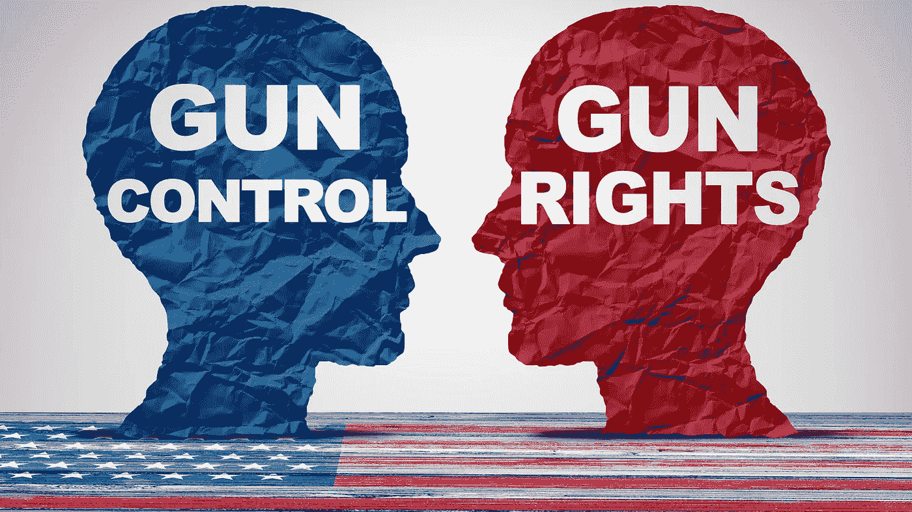
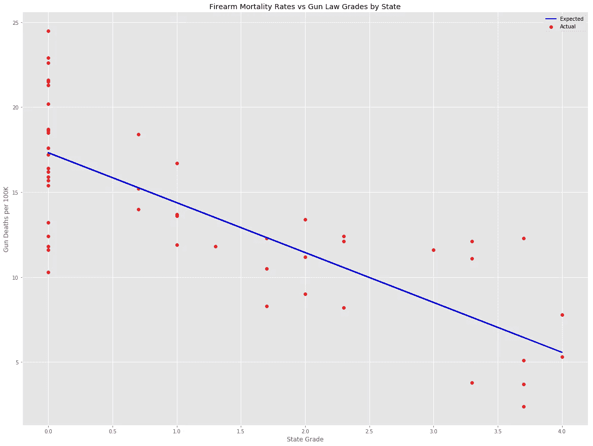
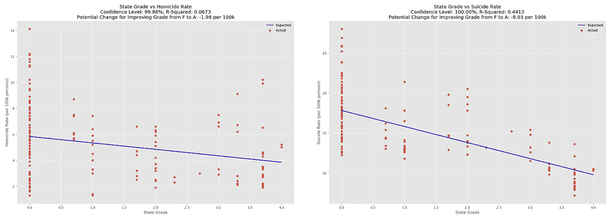
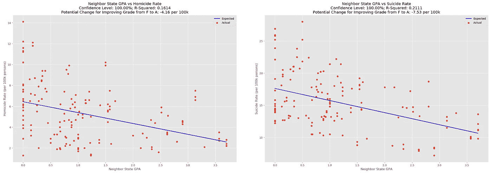
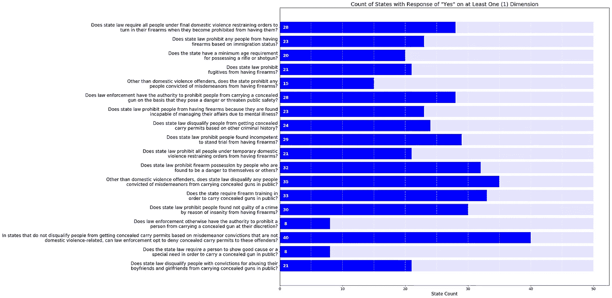
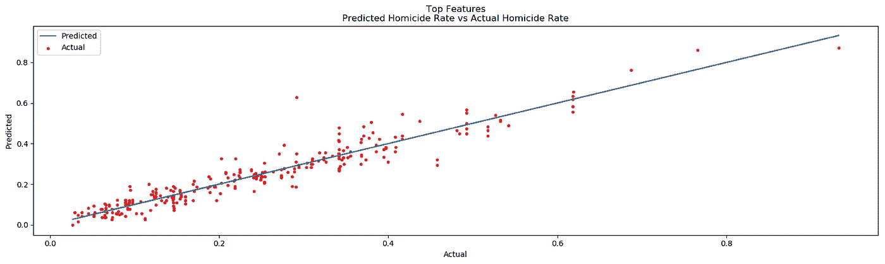
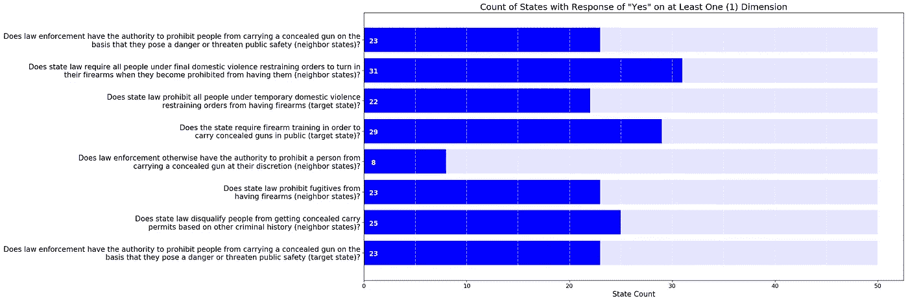
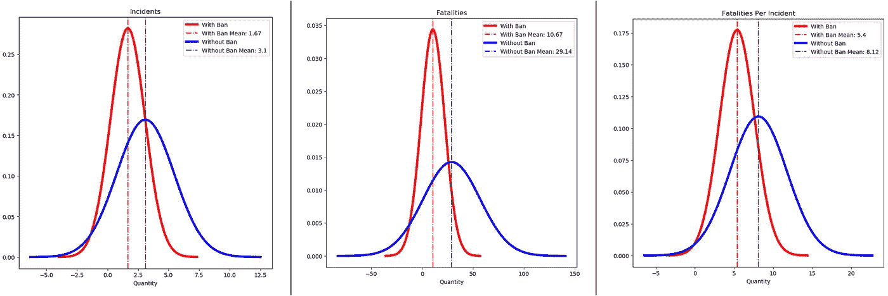
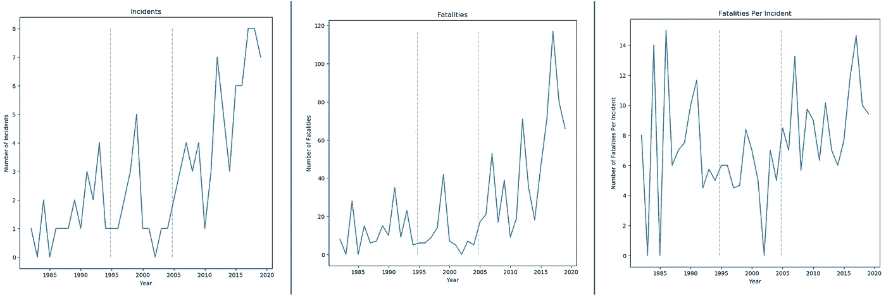
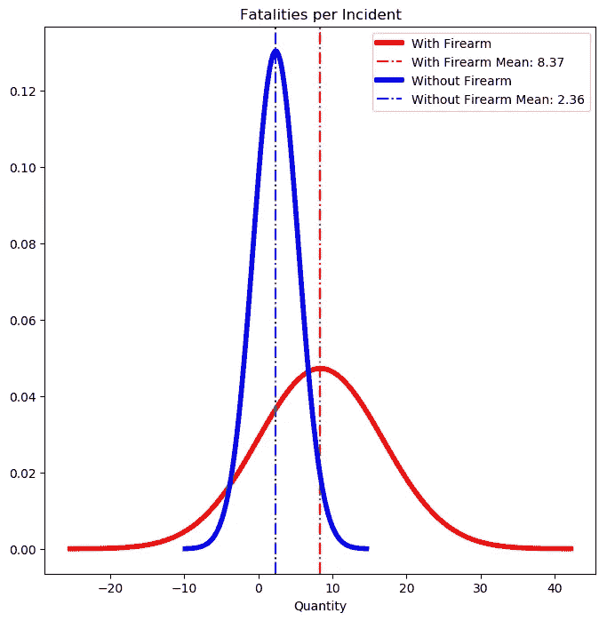

# 关于美国的枪支法律，机器学习能告诉我们什么？

> 原文：<https://towardsdatascience.com/what-can-machine-learning-tell-us-about-americas-gun-laws-da01d9fb7413?source=collection_archive---------15----------------------->

## 深入分析

## 一项 25 年的分析揭示了惊人的见解。



在美国，似乎我们从来没有超过几个星期没有听到另一个大规模枪击事件。随着每一起新事件的发生，要求加强枪支管制法、扩大联邦背景调查以及废除突击步枪的呼声不断高涨。尽管反对派别援引第二修正案权利迅速驳回了每一项上诉，但其他实用性讨论经常出现。具体而言，这些法律的效力经常受到质疑。

我们如何知道哪些法律有效，哪些无效？有没有什么法律可以在不侵犯个人权利和自由的情况下实施？在这里，我们将利用机器学习和人工智能的力量，看看我们能否找到这些问题的答案。

## 强有力的枪支法律能降低枪支死亡率吗？

我们不想做任何假设，所以我们将从回答一些最基本的问题开始。为了回答这个问题，我们求助于[吉福德法律中心](https://lawcenter.giffords.org/):一个非营利组织，其使命是减少枪支暴力。他们提供了 T4 各州枪支法的年度排名，给每个州分配了一个传统的字母等级。如果枪支法*是*有效的，我们预计枪支死亡率会随着等级的上升而下降。利用美国疾病控制中心(CDC)2017 年的数据，我们可以绘制出各州之间的关系。



Using a standard GPA calculation, a grade of 4 represents an A, while 0 represents an F.

所以，更强有力的法律意味着枪支死亡率下降，我们可以到此为止，对不对？！要是这么简单就好了。我们只有一年的数据，不知道吉福兹是怎么算出成绩的。更重要的是，我们不知道总死亡率会发生什么变化？枪支死亡率包括自杀率和他杀率。我们怎么知道人们不仅仅是用一种方法代替另一种方法？让我们以总体自杀率和凶杀率为目标，来看看更广泛的时间段(2014-2017)。



Data Sources: [Giffords Law Center](https://lawcenter.giffords.org/scorecard/) and CDC’s Wide-ranging Online Data for Epidemiologic Research ([WONDER](https://wonder.cdc.gov/mortSQL.html)) tool.

尽管强有力的枪支法似乎确实降低了杀人和自杀的比率，但数据中有很多噪音。此外，自杀率与他杀率之间的关系要明显得多。事实上，数据表明，从 F 到 A 的成绩提高可能会导致自杀率下降近 50%。

凶杀率是怎么回事？这种关系在统计学上可能是显著的，但 r 平方得分表明法律的力量只能解释凶杀率变化的 6.7%。但是枪支法真的对降低凶杀率无效吗，还是发生了其他事情？

一些人认为，邻国薄弱的法律可能会破坏另一个国家强有力的法律。让我们探索一下这种可能性。

## 邻国的法律

通过计算每个州的邻居的平均分数，我们可以衡量该州对枪支法律的影响。首先，我们将使用一个由[本帖](/which-u-s-states-have-the-most-neighbors-2b4f24c68ad9)中的 [Ritvik Kharkar](https://towardsdatascience.com/@ritvikmathematics?source=post_page-----2b4f24c68ad9----------------------) 描述的便捷代码块，它使用 Shapely 库来识别每个州的邻居。下面是这段代码的一个稍微修改过的版本。

```
OUTPUT
Alabama: ['Tennessee', 'Florida', 'Georgia', 'Mississippi']
Alaska: []
Arizona: ['Nevada', 'Utah', 'California', 'Colorado', 'New Mexico']
Arkansas: ['Tennessee', 'Texas', 'Louisiana', 'Mississippi', 'Missouri', 'Oklahoma']
California: ['Nevada', 'Arizona', 'Oregon']
```

从这里开始，只需要得到每个邻居的分数，然后计算所有邻居的平均绩点。没有邻居的州(阿拉斯加和夏威夷)使用所在州的等级。

```
OUTPUT
{'Alabama': 0.175,
 'Alaska': 0.0,
 'Arizona': 1.4,
 'Arkansas': 0.11666666666666665,
 'California': 1.0}
```

像以前一样，我们将绘制邻州 GPA 与目标州凶杀率的关系图，看看我们得到了什么。



有趣的是，邻居州的法律似乎比家乡州的法律对凶杀率有更大的影响。就自杀率而言，这种关系比以前弱了。同样值得注意的是，当枪支法律健全时，杀人率的变化会更低。这意味着强有力的法律能够抑制通常会推高利率的其他因素。

然而，16.1%的 r 平方值比我们希望看到的要弱得多。让我们深入法律本身，看看我们是否能获得一些具体的、可操作的情报。

## 州法律分析

理想的解决方案是分析州法律随时间的变化，而不是依赖一个无法独立分析的任意分级系统。收集数据、对特征进行分类以及对结果进行编目的过程需要大量的时间、专业知识和资源。幸运的是，另一个枪支控制倡导组织 [Everytown Research](http://www.everytownresearch.org) ，从 1991 年起就记录了这些信息。

通过对 85 个维度的分析，该小组将每个特征框定为一个二元或分类问题。例如，“州法律是否普遍禁止所有被判重罪的人拥有枪支？”以这种方式组织问题的一个好处是，它们在回答中没有给主观性留下多少空间。

每个元素都属于八个类别之一:

1.  背景调查
2.  罪犯
3.  家庭暴力
4.  毒品和酒精
5.  精神病
6.  最低年龄
7.  许可过程
8.  其他的

答案不是用 1 和 0 来表示是或否，而是按照数字越大代表法律越严格的方式来排列。尽管这种方法需要预先做额外的工作，但结果的可解释性大大提高了。

还计算了邻近各州的平均响应，并将其纳入数据集中。经过额外的清理以减少数据中的噪声后，主要和相邻状态的 134 个维度仍然存在。

## 识别最重要的特征

从多元线性回归中的向后排除开始，我们排除了 p 值低于 0.05 ÷剩余元素数的特征。此外，后来发现一些特征适用于州和年份的最小选择，导致它们在最终结果中被过度表示。因此，排除了 85%的回答处于一个极端的问题(即 85%的回答为“否”)。

下面列出了前 20 个功能，以及它们各自给出至少部分“是”响应的状态数。例如，如果一个州回答“是，但仅适用于手枪”，则在图表中它将被视为部分“是”的回答。



Note: The response count for question 16 includes states that *do disqualify people from getting permits.*

请记住，这些问题中的一些在适用于邻近州时更有分量，而另一些则是指本州的法律。在我们开始尝试解释这些结果并确定潜在的主题之前，我们需要测试它们的重要性。从随机选择的州和年份中给定这些问题的一组答案，我们应该能够高度精确地预测各自的凶杀率。

## 机器学习和人工智能模型

使用 80%的数据子集，通过 5 重交叉验证和 SciKit Learn 的 [GridsearchCV](https://scikit-learn.org/stable/modules/generated/sklearn.model_selection.GridSearchCV.html) 对以下回归模型架构进行了训练。

*   决策图表
*   随机森林
*   支持向量机
*   Adaboost 回归
*   XGBoost 回归器
*   Keras 回归器(人工智能模型)

通过训练模型，每个人都试图预测剩余 20%数据的凶杀率，成功程度各不相同。最后，发现 XGBoost 回归器是表现最好的模型，实现了 91.23%的[解释方差得分](https://scikit-learn.org/stable/modules/generated/sklearn.metrics.explained_variance_score.html)。在下面的图表中，红点代表各州和各年份的实际凶杀率。蓝线代表模型根据 20 个问题的答案做出的预测。



Explained Variance Score: 0.9123

因此，我们的模型可以高精度地预测凶杀率，但它没有告诉我们任何关于所述比率潜在下降的信息。要回答这个问题，请考虑两种假想状态:一种状态对所有项目的回答是，另一种状态对所有项目的回答是否。预测的凶杀率有什么不同？对所有问题回答“是”的州比回答“否”的州的凶杀率平均低 52.41%。

在对个体反应进行调整时，通过测量预测凶杀率的变化，我们可以确定具有最大影响的特征。以下按重要性顺序列出了最重要的特征，并给出了 2019 年的肯定回答。



## 观察

一些清晰的主题出现在秘密携带、警察自由裁量权和家庭暴力方面。似乎当警察有权解除他们认为对公共安全构成威胁的个人的武装时，杀人率就会下降。当法律禁止持有家庭暴力禁止令的个人拥有枪支时，凶杀率也会下降。

也许最令人惊讶的是，不到一半的州禁止逃犯拥有枪支。请注意，这个话题与邻州最相关，而不是与本州最相关，为邻州法律的影响提供了进一步的证据。

[宾夕法尼亚大学医学院 2019 年 3 月发表的另一项研究](https://www.sciencedaily.com/releases/2019/03/190306110629.htm)佐证了这一发现。该学校使用了完全不同的方法和数据集，追踪凶杀案中使用的枪支的购买情况。资深作者 Mark J. Seamon，医学博士，FACS，宾夕法尼亚医科大学创伤学、外科重症监护和急诊外科副教授说:

> 严格的州枪支立法可能会驱使一些人去更宽松的邻州收回枪支，这反过来增加了家乡的枪支和凶杀案数量，尽管其法律更具限制性。

研究中的一个关键发现是，“在最严格的州收回的枪支中，65%来自其他州。”

那么，我们该如何处理这些信息呢？我们稍后会谈到这一点。现在，我们将改变思路，进行不同的分析，这一次是考察法律对大规模枪击事件的影响，而不是整体凶杀率。

## 枪支法对大规模枪击事件的影响

从 1982 年到 2019 年的大规模枪击事件数据库可以在[这里](https://www.motherjones.com/politics/2012/12/mass-shootings-mother-jones-full-data/)找到。同样的追踪枪支法与凶杀率的方法也被应用，这一次使用分类模型而不是回归变量。不幸的是，在这种情况下，最初的结果相当令人沮丧:没有一个模型能够以高于随机概率的准确度预测大规模枪击事件。这是否意味着枪支法对大规模枪击案没有影响？不一定，因为大规模枪击事件相对较少，这使得这种相关性更难发现。所以，让我们尝试另一种方法。

不要看所有的州法律，让我们来看一个单一的国家法律:公共安全和娱乐枪支使用保护法案，也被称为攻击性武器禁令(AWB)。在 1994 年 9 月颁布时，美国司法部将攻击性武器定义为“[半自动火器，带有大量弹药，设计和配置用于快速射击和战斗用途。](https://www.cnn.com/2013/01/31/politics/gun-language/index.html)“禁令一直实施到 2004 年 9 月。那么，效果如何呢？

通过简单的假设检验，我们可以确定禁令实施后事故和死亡人数是否显著降低。下面，我们可以看到任何给定年份的总死亡人数、事故数量和每次事故死亡人数的平均值和方差的差异。蓝线代表禁令无效时的结果，红线代表禁令有效时的结果。



根据这些结果，当联邦禁令实施时，事故发生频率降低了 86%，总死亡人数降低了 173%，每次事故的死亡人数降低了 50%。我们可以在 90%的事故数量和总死亡人数水平上对这些结果有信心，而在查看每个事故的死亡人数时有 95%的信心。然而，有一个重要的警告需要考虑。看看这些结果是如何随时间变化的。灰色虚线之间的时间段代表禁令实施的时期。



正如我们所看到的，存在明显的数据不平衡，大多数事故和死亡发生在禁令到期后的几年里。当 2004 年以后的数据被排除在比较之外时，所有重要的迹象都消失了。如果有两个不同的时期没有实施禁令，并且每个时期都表现出非常不同的结果，那么就很难得出禁令本身就是解释变量的结论。换句话说，我们没有任何明确的证据表明 AWB 对总死亡人数或事故数量产生了有意义的影响。

然而，当考虑每起事故的死亡人数时，这种不平衡并不存在，这被发现是 95%置信水平下最重要的因素。这告诉我们，虽然 AWB 不一定能有效减少大规模枪击事件的发生，但*似乎确实减少了由此导致的死亡人数。*

## 大规模枪击与其他形式的大规模谋杀

想象一下这样一种场景:平民百姓不再能获得枪支:潜在的大规模枪击者可能会求助于其他手段。其他方法会导致更多或更少的死亡吗？我们可以从[全球恐怖主义数据库](https://www.start.umd.edu/gtd/search/Results.aspx?start_yearonly=1982&end_yearonly=2017&start_year=&start_month=&start_day=&end_year=&end_month=&end_day=&asmSelect0=&country=217&asmSelect1=&weapon=7&weapon=8&weapon=9&weapon=12&weapon=11&weapon=13&weapon=10&dtp2=all&success=yes&casualties_type=b&casualties_max=)中提取数据，并将结果与我们已有的数据进行比较。在一组中，我们调查了涉及枪支事件的死亡率。另一方面，我们考虑大多数人认为可以替代火器的武器类型。



从 1982 年到 2017 年，每起无火器事件的平均死亡人数为 2.36 人(不包括 9/11 袭击)。在同一时期，当选择火器作为武器时，每起事件的平均死亡人数为 8.37 人。差异代表 255%的差异，在 99%的置信水平下被发现是显著的。虽然枪支限制可能无法有效防止攻击，但证据表明，这种限制可能能够提高攻击的生存能力。

## 结论和建议

就整体凶杀率而言，对逃犯和持有家庭暴力禁止令的人实施枪支限制是一个州可以采取的最明确的行动。然而，授权执法部门酌情收缴枪支可能会遭到两党的强烈反对。作为一种替代办法，当直系亲属发现自己有危险信号时，他们可以向法院申请驱逐。

也称为“极端风险保护令”或“危险信号法”，这种方法可能会产生类似的结果，而不会给执法机构太多的权力。2015 年，只有两个州有这样的法律，但这一数字已经增加到 17 个。因为这些法律太新了，要过几年才能衡量它们的有效性。此外，法院就此类申请做出决定所使用的标准仍有待确定。

人们希望这样的法律能够遏制大规模枪击事件的发生，但截至目前，还没有法律在这方面产生明显影响。尽管攻击性武器禁令确实对每起事故的死亡率有一定的影响，但更高的目标应该是首先降低此类事件的发生频率。

尽管如此，各州仍有太多的选择，以有意义、无争议的方式加强枪支法律。弥合全国各州法律中的这种差距有可能大幅降低凶杀率。下面是几个唾手可得的果实的例子:

*   在 19 个州，拥有最终家庭暴力限制令的个人被允许拥有枪支。
*   在 27 个国家，不禁止逃犯拥有枪支。
*   在 23 个州，不禁止被认定无受审能力的个人拥有枪支。
*   在 21 个州，因精神错乱而被判无罪的人不被禁止拥有枪支。
*   在 21 个国家，如果合法当局发现一个人对自己或他人构成威胁，不禁止这个人拥有枪支。

值得注意的是，在其中一些案例中，联邦法律已经存在。然而，根据 1997 年美国最高法院案例 [*Printz 诉美国*](https://cdn.loc.gov/service/ll/usrep/usrep521/usrep521898/usrep521898.pdf) ，联邦政府不能强迫各州执行联邦法律。除非各州有类似的法律，否则联邦政府没有可靠的实施手段。

最终，目标是降低凶杀和自杀率，而不是解除守法公民的武装。在全国范围内齐心协力制定真正的常识性法律并执行已经成文的联邦法律是取得进展的最佳途径。

这一分析是在 Jupyter 笔记本中使用 Python 进行的，该笔记本可以在 [Github](https://github.com/rwilleynyc/us_gun_laws) 上找到，并提供了完整的数据源和方法。