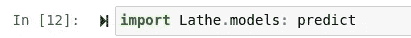
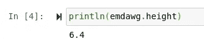
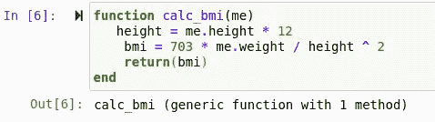
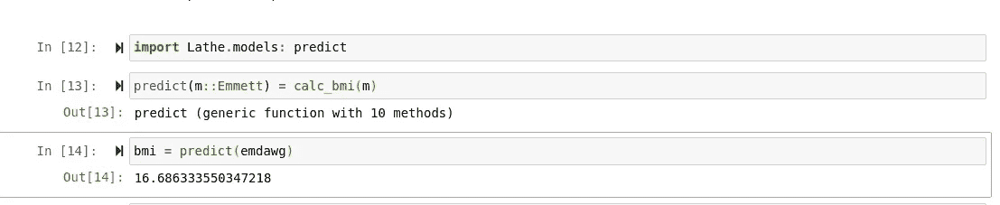
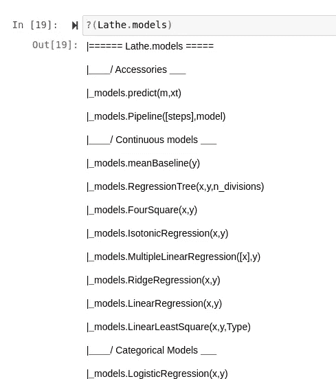
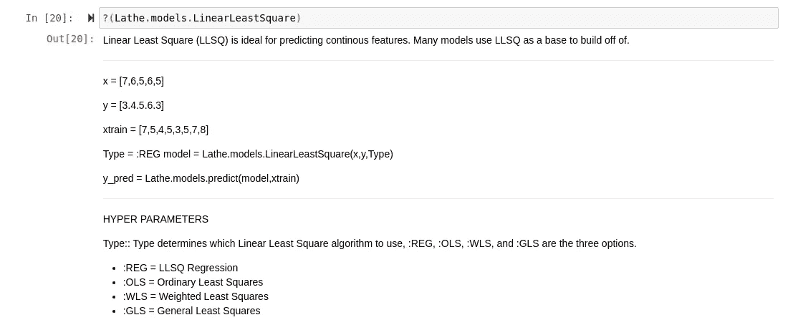

# 用车床 0.0.8 可以演示什么？

> 原文：<https://towardsdatascience.com/what-can-we-demonstrate-with-lathe-0-0-8-for-julia-1-3-b262dce24dd9?source=collection_archive---------31----------------------->

## (对于朱莉娅 1.3)


车床 0.0.8“文件和调度”是车床画布上一个相当大的发布。顾名思义，这个版本有大量的文档。但这还不是全部，速度已经被优先考虑，大多数功能现在都优化了很多。此外，模型构造函数现在通过 Julia 的类型调度使用参数多态，而不是条件。

> [笔记本](https://github.com/emmettgb/Emmetts-DS-NoteBooks/blob/master/Julia/Parametric%20Polymorphism-Dox%20Lathe.ipynb)
> 
> [车床(Github)](https://github.com/emmettgb/Lathe.jl)


# 参数多态性

如果您想知道当谈到函数式编程时，我是否会经常谈到这个概念，

> 是的，我是。

Lathe 中的参数多态允许更简洁地使用 Lathe 中的“预测”函数作为结构的属性，而不是接受结构输入的函数。不用说，这要快得多，也简洁得多。但是事情远不止如此。

通过 Julia(awesome)的调度使用这种形式的参数多态性，我们可以使用同一个函数做数百万件事情，越来越容易，甚至不需要访问代码库就可以**。**

这意味着任何头脑正常的人都可以为车床编写扩展，同样，车床可以做比现在更多的事情。有了 Julia 的参数多态性，来自 Lathe 的函数基本上可以做任何事情。为了让您了解添加结构有多简单，我们来快速做一下。

第一步是从车床导入预测功能。



现在我们可以制造任何构造函数，甚至可以使用车床模型并为它重写一个函数。


4

我选择将我的可变结构命名为“Emmett”我选中这个名字的原因是 ***还是*** 未知。接下来，我们构造一个名为 emdawg 的变量(真的？)并且我们可以断言我的身高和体重。既然在构造函数中已经有了我的身高和体重，我们可以打印单独的结果。



酷！因此，让我们编写一个利用该构造函数的函数，然后我们将从 Lathe.models.predict()中调度它。我决定写一个函数来计算身体质量指数，因为我们有身高和体重。一个问题是我们的身高是一个代表英尺和英寸的浮点数，即 6.4 == 6 英尺 4 英寸。



现在我们有了函数，我们只需要通过调度调用它。这是我想到的:

```
predict(m::Emmett) = calc_bmi(m)
```

现在，当我们将构造函数插入到 Lathe.models.predict()中时，我们得到一个返回:



> 不要去查那个身体质量指数

# 证明文件

有了这次更新，我想停止去维护者的网站搜索文档的传统方法。您可能需要了解的一切都应该可以在语言本身中找到，所以让我们来测试一下。

当然，作为一个新用户，很难模仿我自己，这个项目的维护者…但我们现在会试着假装我根本不知道如何使用车床。我们可以完全用这个来操纵车床。()函数来自 Julia 的 base。


我们什么时候？(车床)，我们得到这样一个返回:一个树，里面有所有单独的模块，以及一些包信息，包括版本、依赖项和 UUID。关于这些的更多信息，可以查看任何 Julia 包的 Project.toml 文件(包括 Lathe。)

那么接下来呢？就在树下，我们看到使用说明。(车床.包)获取信息。让我们在车床上试试。模型



现在我们可以看到每个结构的每个参数，以及我们的附属函数。所以，举例来说，我们可以看看车床。模型。线性最小平方



这样，我们得到了一个全面的超参数列表、一个简短的描述和一个使用示例。理想情况下，这将是我们训练和验证模型所需的一切。

# 结论

车床是一个非常酷的包，0.0.9 的画布承诺了更多酷的特性，特别是在分类预测领域。如果你想更多地了解车床的新版本控制，有看板可以很好地记录到底发生了什么。

## [车床 0.0.8 板](https://github.com/emmettgb/Lathe.jl/projects?query=is%3Aclosed)

## [车床 0.0.9 板](https://github.com/emmettgb/Lathe.jl/projects?query=is%3Aopen)