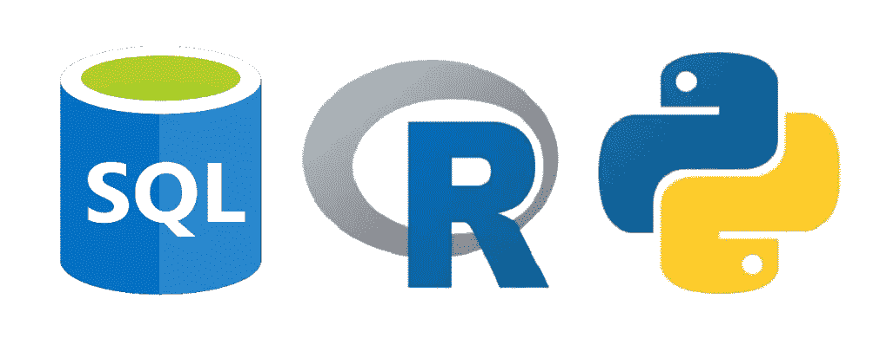
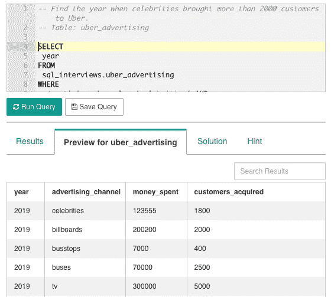
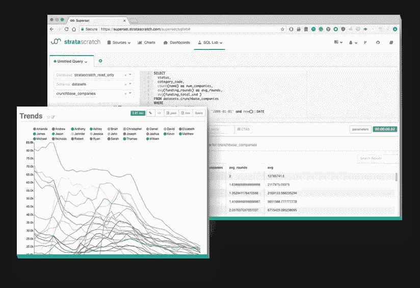

# 为了在分析领域取得成功，我需要知道哪些编码语言？

> 原文：<https://towardsdatascience.com/what-coding-languages-do-i-need-to-know-for-a-career-in-analytics-595887deadbd?source=collection_archive---------16----------------------->

## SQL、python、R——有这么多的语言和工具可供选择，哪些是我绝对需要知道的，我可以从哪里开始学习它们？

当谈到分析的世界时，你可能不会惊讶地发现它会变得非常复杂。大多数分析工作的一个典型特点是，您可能需要学习如何编码，这通常需要学习一套旨在执行特定分析任务的语言。

> 但是编码语言需要很长时间去学习。那么，在我的分析职业生涯中，哪些是我绝对需要知道的呢？

# 哪些编程语言用得最多？

如果你正在进入分析领域，并将其视为一项职业，用不了多久，你就会被开始职业生涯可能需要学习的所有技术平台和语言所淹没。因此，如果你正在考虑从事分析方面的职业，你可能会有第一个问题——我绝对需要学习哪些编码语言？以及哪些语言是“最好拥有的”。

在本文中，我们将向您简要介绍我们推荐的顶级编程语言，供您在分析职业生涯中学习。这些是招聘人员最常寻找的语言，如果你试图进入数据科学或商业分析领域，这是你的最佳选择。让我们从概述我的首选开始。

> 你可以参考文章底部我们最喜欢的资源

# 结构化查询语言

> 任何分析的最低资格

SQL 是一种脚本语言，用于访问和操作数据库中的数据。数据库是存储大量数据的强大工具，而 SQL 是用来访问和提取数据、操作数据或清理和重组数据的工具。

SQL 访问的数据存储在关系数据库中。每种数据都存储在一个表中。表格有列和行来表示不同事物的不同属性。使用 SQL，您可以访问这些表，查找相关信息，比较信息，甚至操作信息。当然，所有这些命令都超出了本文的范围，但要知道这是许多分析职业的基本工具。

> 关于 SQL 的另一个重要考虑是不同的公司使用不同类型的数据库。例如，您有 HIVE、MySQL、postgres 和许多其他语言，所有这些语言的语法都有不同的细微差别。好消息是，如果您总体上很好地掌握了 SQL，那么适应这些数据库中的差异应该没有问题。

有许多很棒的在线 SQL 资源。例如，如果你正在寻找一个从头开始教你 SQL 的指南，我喜欢[模式分析](https://mode.com/sql-tutorial/)。如果你已经知道 SQL(即使你只是一个初学者)，并且正在寻找真实世界的实践问题， [Strata Scratch](https://www.stratascratch.com/) 提供了来自公司真实采访的 500 多个 SQL 实践问题。

# Python 还是 R

> 如果你对数据科学的职业感兴趣，这是一个首选资格

对于数据科学和分析工作来说，两种非常流行的编程语言是 Python 和 r。这两种语言适应性非常强，因此可以用于类似的目的，这可能使人们很难在两者之间做出决定。根据您熟悉的领域，这两种方法都很有帮助，但重要的是要知道根据您想要进入的特定分析领域的差异。

r 主要用于研究，并已发展到对统计非常有用。因此，它被数据科学家和统计学家广泛用于各种与统计和数据分析相关的功能。对于您想要进行的几乎任何类型的数据分析，基本上都有一个选项。r 以多种方式存储数据(表格、矩阵、向量等)。)支持回归、坐标等对象。

Python 更像是一种通用的编程语言。它是一种非常庞大的语言，因此它有库来执行 R 可以完成的几乎所有任务。Python 也是机器学习和人工智能的一个非常强大的工具，它有专门为执行这些任务而构建的库。

> 我喜欢用 python 而不是 R，因为 python 有很棒的自动化库和函数。

当然，对于初学者来说，所有这些听起来可能非常复杂。所以要知道，如果你正在考虑从事数据科学或分析方面的职业，Python 和 R 都会非常有帮助。它们都是开源语言，有越来越多的大型社区支持它们。

Datacamp.com[为 R 和 python 都提供了巨大的资源。](http://www.datacamp.com)

# 额外收获:像 Tableau 和 Plotly 这样的商业智能工具

> 一个很好的分析技能的任何角色

商业智能工具(或 BI 工具)是基本上帮助您可视化数据的软件类型。这些平台不一定是编码语言，但会有自己的语法，或者将 SQL 等现有语言整合到它们的平台中，或者两者都有。这些平台帮助您可视化和识别趋势，理解模式，并基于这些模式开发影响。这些工具主要从 SQL 和/或 python/R 获取输出，并添加交互式图形组件，以帮助您向利益相关者和业务合作伙伴提供见解。

Tableau 是最流行的 BI 工具之一。Tableau 帮助您理解关键的业务数据点，并基于这些数据做出深刻的见解。它可以连接到几乎任何数据源，包括 Salesforce、Google Analytics 和 SQL 数据库。它在一个方便的交互式仪表板中呈现所有信息，还允许您控制和生成新的信息和见解。

# 结论

如果你正在考虑进入分析行业，这些是你应该学习的编码语言的首选。当然，分析和数据科学是非常广泛的领域。出于这个原因，在你全身心投入某种编程语言之前，更具体地考虑一下你对分析和数据科学的哪一部分最感兴趣。

> 对你真正想从事的角色类型做一些研究，然后确定上面哪种编程语言最有价值。我保证它将包括 SQL、python/R，也许还有可视化工具/语言。

# 帮助您起步的资源

最重要的是，这些语言在数据科学和分析领域拥有极其强大的能力。所有这些对于从事分析行业都非常有价值。无论你选择哪一个方向，知道这些语言中的任何一种肯定会打开许多大门。

*   [Strata Scratch](http://www.stratascratch.com) :超过 500+来自真实公司的 SQL 和 python 练习题
*   [模式分析](https://mode.com/):如果你是从零开始，这是一个很好的 SQL 和 python 教程
*   [DataCamp](http://www.datacamp.com) :提高你的 python 和 R 技能的资源。主题和模块本质上是特定的，需要你有一些 python 或 r 的背景知识。

*原载于*[*https://www.stratascratch.com*](https://www.stratascratch.com/blog_feed/what-coding-languages-do-i-need-to-know-for-a-career-in-analytics)*。*