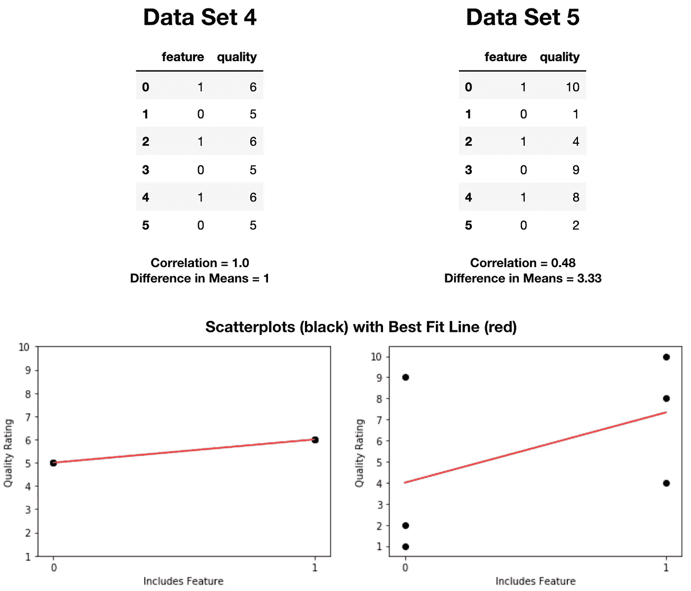

# 相关分数能告诉你什么，不能告诉你什么

> 原文：<https://towardsdatascience.com/what-correlation-scores-can-and-cant-tell-you-75fb061eeaa1?source=collection_archive---------20----------------------->

## 为什么你不应该假设高度相关的变量对彼此有很大的影响

最近，我向数据科学训练营的同学介绍了爱荷华州 Aimes 的房价。除了预测房屋的销售价格，我们还被要求选择另一个问题来回答。

我选择回答的问题是:对一个人已经拥有的房子可以做哪些实际的改变来提高它的质量？(如果你感兴趣，可以在这里找到该演示文稿。)

## 总体质量相关性得分


在我的报告中，我分享了一张热图，它将各种因素与房屋的整体质量联系起来。在这些因素中，我主要关注以下二元变量:

*   在过去的 30 年里被改造过
*   有附属车库
*   有一条铺好的车道

对于这些因素中的每一个，我观察了有和没有这些因素的房屋的平均质量，以了解它们的影响。

## 平均质量的差异

除了这张热图，我还展示了以下小提琴图:


上面的图显示了有和没有最近改造(左)、附带车库(中)或铺设车道(右)的房屋的质量分数分布。这些地块的一个关键点是，为了提高质量，最好的特征是改变车道类型，其次是车库类型，然后是最近的改造。

我的一个同学注意到与整体质量最相关的变量对整体质量的变化影响最小，问我为什么会这样。当时，我不知道，所以我决定深入调查…

## 数学——平均值的差异

如果你正在读一个统计学博客，你可能不需要我告诉你两个平均值之间的差是如何计算的。但是作为一个复习…


## 数学相关性

特征和总体质量之间相关性的计算方式有很大不同。当您运行。corr()函数在一个熊猫数据帧上(就像我做的那样)，默认的方法是计算皮尔逊相关系数( *ρ)。*

```
sns.heatmap(df.corr(), cmap=’BrBG’, vmin=-1)
```


计算皮尔逊相关系数的公式为:


其中 E 是输入值的期望值或长期平均值。

更直观地说——相关性告诉你一条线与变量对的拟合程度。1 分意味着你可以完美地拟合一条斜率为正的线，0 分意味着你根本无法拟合一条线，-1 分意味着你可以完美地拟合一条斜率为负的线。

## 这在实践中意味着什么？

让我们来看三个数据集，每个数据集有 6 个样本(特征分数为 1 表示该住宅具有该特征，分数为 0 表示它不具有该特征):


在每个数据集中，平均质量值的差异为 2.67，质量处于相同的范围内，这就是为什么三个图表的最佳拟合线(以红色显示)的斜率相同。

然而，相关分数差异很大。左边的数据集几乎可以完美地拟合成一条线，而右边的数据集根本不能用它的最佳拟合线来表示。

为了更生动地展示相关性如何实际上不提供关于对具有特征的质量的影响的信息，让我们看另外两个数据集:



在所有上述图中，相关性得分的值完全基于红色最佳拟合线代表黑色散点图点的程度，而平均值的差异基于红色最佳拟合线的斜率。

最佳拟合线的斜率与相关分数相关的唯一方式是，对于正斜率，其符号为正，而对于负斜率，其符号为负。(上面所有的图都有一个正斜率，这就是相关性分数都在 0 和 1 之间的原因。)

## 结论

当您寻找线性相关的值时(例如:当您创建线性回归模型时)，相关性分数是一个很好的工具。然而，应该清楚的是，他们给你的分数不是一个变量的变化对另一个变量的影响程度。更简单地说，相关性的通俗定义(两个或更多事物之间的相互关系或联系)并不总是由统计相关性分数来表示。

在进行探索性数据分析时，您应该确保查看其他指标，以了解变量之间的相互影响(例如，最佳拟合线的斜率)。