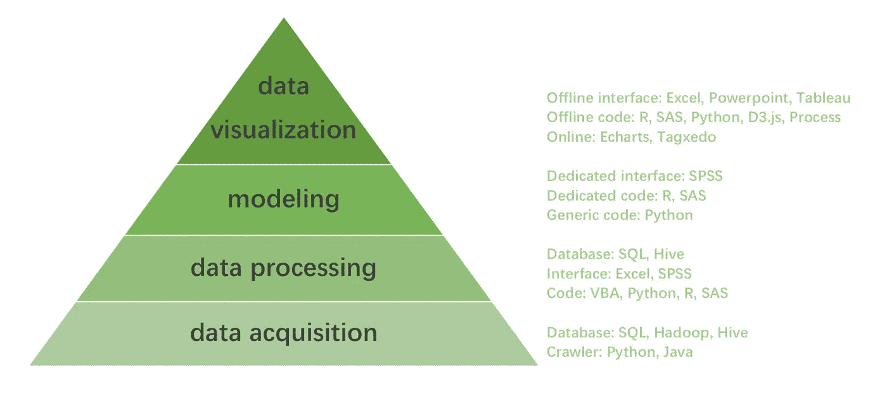
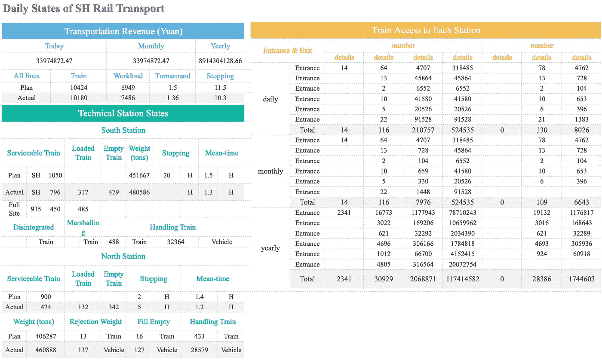
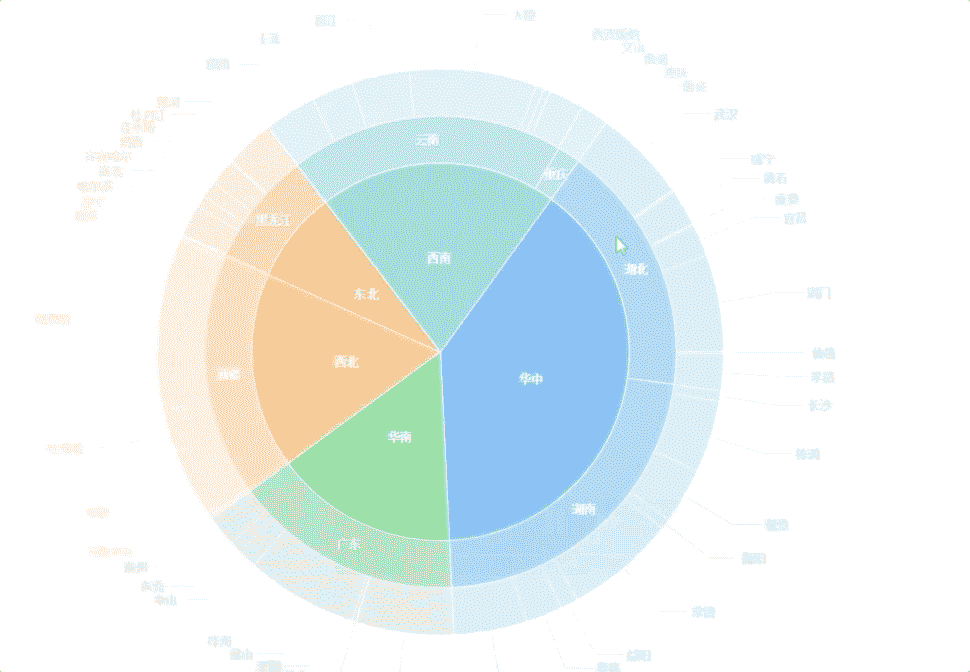

# 开始数据分析师的职业生涯需要学习哪些数据分析工具？

> 原文：<https://towardsdatascience.com/what-data-analysis-tools-should-i-learn-to-start-a-career-as-a-data-analyst-af650b54c9e9?source=collection_archive---------15----------------------->

对于数据分析，我一直强调核心是业务。我们将业务的分析逻辑与数据分析的处理逻辑联系起来，数据分析工具是帮助我们实现结果的手段。就像我们根据不同的道路选择不同的交通工具一样，合适的工具可以帮助我们更快地到达终点。我们应该为数据分析的不同环节选择不同的工具。

今天的文章就是要告诉你，开始数据分析师的职业生涯，应该学习哪些数据分析工具。

# 1.确定分析师的需求:业务还是技术

在企业中，数据分析师通常分为两类:业务分析师和技术分析师。而且两者的能力和工作内容差别很大，对工具的要求也相应不同。

**商业分析师**经常在市场部、销售部等部门工作。日常工作更多的是整理业务报表，针对具体业务做专题分析，围绕业务增长测算数据，制定计划。

**技术分析师**一般属于 IT 部门或数据中心。根据工作环节的不同，分为数据库工程师、ETL 工程师、爬虫工程师、算法工程师等等。在中小型企业中，这些流程通常由一名技术分析师处理。在大型企业中，一个标准的数据中心需要一个数据仓库、特殊分析、建模分析等小组来完成数据开发工作。

之所以这样区分，是因为我们需要一个多层次的复杂数据系统来处理数据。一个数据系统需要结合数据收集、数据整合、数据库管理、数据算法开发和报告设计。这样就可以把散落在周围的点点滴滴的数据集合起来，设定共同的指标，做出各种酷炫的图表。这里的每一个环节都需要相应的技术支持和人员工作，所以有不同的岗位。

你在找数据分析岗位的时候，一定要分清是技术端还是业务端，是否与自己的职业倾向相匹配。

# 2.识别工具的属性:分析工具还是代码工具

分析师有技术和业务的区分，相应的数据分析工具也有这样的属性。

## 分析工具

对于初级数据分析师来说，掌握 [Excel](https://products.office.com/en-us/excel) 是必须的。您必须精通数据透视表和公式。和使用 [VBA](https://docs.microsoft.com/en-us/office/vba/library-reference/concepts/getting-started-with-vba-in-office) 将是一个加号。此外，你必须学会一个统计分析工具。SPSS 比较适合初学者。

对于高级数据分析师来说，分析工具的使用是一项核心能力。VBA 是基本必需品。而且你要掌握 SPSS、SAS、r 这三个分析工具中的至少一个，你也可以学习其他工具比如 [Matlab](https://www.mathworks.com/products/matlab.html) ，不过要看情况。

对于数据挖掘工程师来说， [R](https://www.r-project.org/) 和 [Python](https://www.python.org/) 是必须的，就像你要写代码一样。

## 代码工具

对于初级数据分析师，只需要编写 [SQL](https://www.w3schools.com/sql/) 查询即可。还可以学习一些 [Hadoop](https://hadoop.apache.org/) 和 [Hive](https://hive.apache.org/) 查询。

对于高级数据分析师来说，除了 SQL 之外，学习 Python 也是事半功倍获取和处理数据的必要手段。当然，其他编程语言也是备选方案。

对于数据挖掘工程师来说，你得用 Hadoop、Shell、Python、Java、C++等。总之，懂一门编程语言绝对是数据挖掘工程师的核心能力。

下图说明了数据分析工具的属性和功能。

# 3.确定企业的数据架构

数据分析工具的使用取决于业务的需求和环境。为什么小公司的数据分析师只用 Excel 做报表，大公司的分析需要 Python 和 R？这取决于企业的数据架构。

从 IT 的角度来看，工具在实际应用中可以分为两个维度。

**尺寸 1**

**尺寸 2**

## 3.1 数据存储

你不必深究数据库存储和数据库语言的概念，毕竟有专业的 DBA。但是你至少要了解数据的存储方式，数据的基本结构，以及可用的数据类型。SQL 查询语言至关重要。您可以从通常的选择、更新、删除和插入开始。

Access 是最基本的个人数据库。 [MySQL](https://dev.mysql.com/) 是部门或互联网数据库应用所必需的，此时你需要了解数据库结构和 SQL 查询语言。SQL Server 2005 或更高版本足以满足中小型企业的需求。一些大型企业也可以使用 SQL Server 数据库。其实除了数据存储，还包括数据上报和数据分析。

[DB2](https://www.ibm.com/analytics/db2) 和 [Oracle](https://www.oracle.com/index.html) 都是大型数据库，主要为企业服务。大型企业需要存储大量数据，因此这种类型的数据库是必须的。一般大型数据库公司都会提供非常好的数据集成和应用平台。

至于 BI，它其实不是一个数据库，而是建立在之前数据库基础上的企业级数据仓库。建立在数据仓库上的数据存储基本上是一个商业智能平台，它集成了各种数据分析和报告功能。

## 3.2 数据报告

企业需要读取和显示数据。和报告工具是最常用的工具。以往的传统报表大多只是解决了可视化的问题。现在，一些分析报告工具正在出现，它们与其他应用程序交叉处理以生成数据分析报告。通过接口打开、数据填充、决策等功能，实现数据存储和数据展示，这就是早期的商业智能。

像 [Tableau](https://www.tableau.com/) 、 [PowerBI](https://powerbi.microsoft.com/en-us/) 、 [FineReport](http://www.finereport.com/en/?utm_source=medium&utm_medium=media&utm_campaign=blog&utm_term=02) 和 [Qlikview](https://www.qlik.com/us/products/qlikview) 这样的 BI 工具涵盖了多个层次的报告、数据分析和数据可视化。底层也可以连接到数据仓库，构建 OLAP 分析模型。

## 3.3 数据分析

数据分析工具很多，我们用的最多的是 [Excel](https://products.office.com/en-us/excel) 。

很多人只掌握了 5%的 Excel 函数。Excel 很强大。它可以完成大量的统计分析工作。但是我经常说，专门做一个统计软件，比用 Excel 做统计工具要好。

## 附加电源装置（Supplementary Power Supply Set 的缩写）

[现在的版本](https://www.ibm.com/products/spss-statistics)是 18，名字也改成了 PASW 统计。我从 3.0 版本开始，用它在 Dos 环境下进行编程分析。随着时间的推移，它已经成为一个预测分析软件，从强调医学和化学发展到目前强调商业分析。

## 斯堪的纳维亚航空公司

[SAS](https://www.sas.com/en_us/home.html) 比 SPSS 更强大。而且是基于平台的。相对来说，SAS 更难学。但是如果你掌握了 SAS，你就可以解决更多的问题。例如，对于离散选择模型、抽样、正交实验设计等。，不如用 SAS。除此之外，还有更多 SAS 的学习资料。

其他工具还有 Python 和 R，我下次会详细介绍。

## 3.4 数据展示

数据展示也叫数据可视化。几乎上面提到的每个工具都提供了一些数据显示的功能。但企业最常用的工具是 BI。

BI 代表商业智能(Business Intelligence)，是传统企业中的完整解决方案。它有效地集成了企业数据，并快速生成报告以做出决策。它涉及数据仓库、ETL、OLAP、访问控制等模块。

这里我拿一个 2019 年非常流行的 BI 工具， [FineReport](http://www.finereport.com/en/?utm_source=medium&utm_medium=media&utm_campaign=blog&utm_term=02) 举例。它有两个主要用途。

一个是制作自动报告。数据分析师每天都要接触大量的数据。而且他们需要对数据进行整理汇总，工作量很大。我们可以把这部分工作交给 FineReport。它自动进行数据整形、建模和下载。

From FineReport

另一种是利用其可视化功能进行分析。 [FineReport](http://www.finereport.com/en/?utm_source=medium&utm_medium=media&utm_campaign=blog&utm_term=02) 的优势在于提供了比 Excel 更丰富的可视化功能。而且很好用。如果你每天花两个小时画画，FineReport 会把时间缩短一半。

From FineReport

From FineReport

From FineReport

在学习数据分析的初级阶段，BI 工具无疑是最容易学的。如果你准备进入数据分析师领域，我强烈推荐你使用这个数据分析工具， [FineReport](http://www.finereport.com/en/?utm_source=medium&utm_medium=media&utm_campaign=blog&utm_term=02) 。你可以[点击这里](http://www.finereport.com/en/download?utm_source=medium&utm_medium=media&utm_campaign=blog&utm_term=02)免费下载使用。并且官网还提供了[教程](http://www.finereport.com/en/about-finereport/learning-path-for-finereport-beginners.html?utm_source=medium&utm_medium=media&utm_campaign=blog&utm_term=02)帮助你快速入门。

*原载于 2019 年 5 月 16 日*[*http://www.finereport.com*](http://www.finereport.com/en/data-analysis/what-data-analysis-tools-should-i-learn-to-start-a-career-as-a-data-analyst.html)*。*