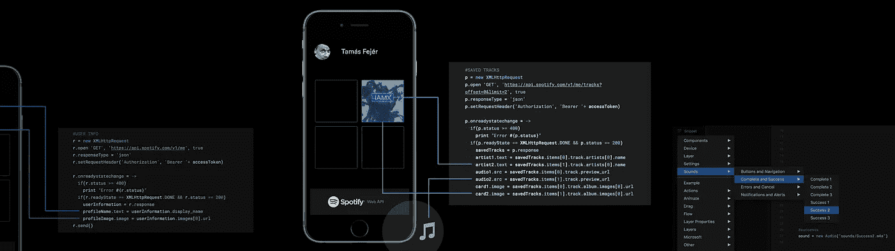
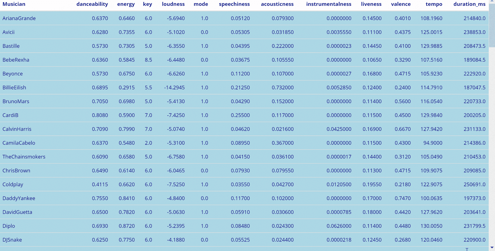
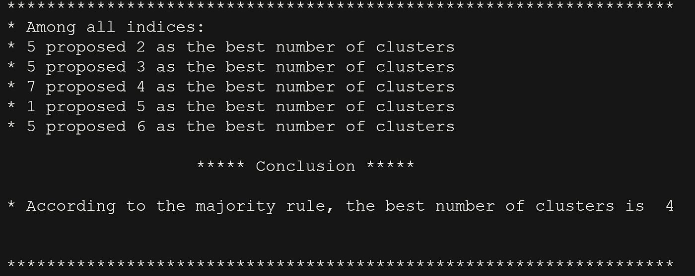
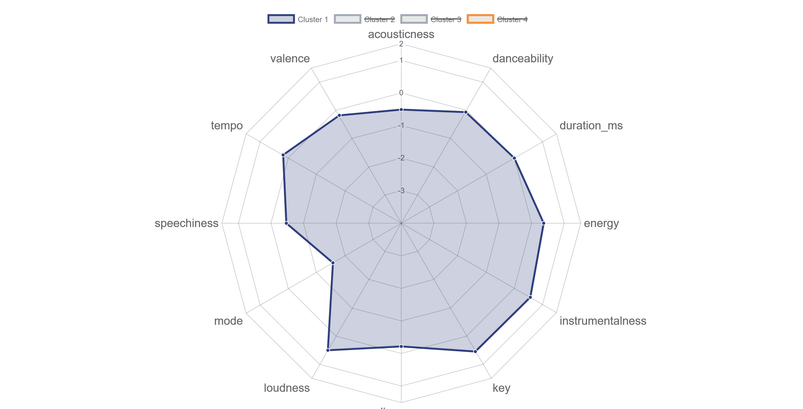
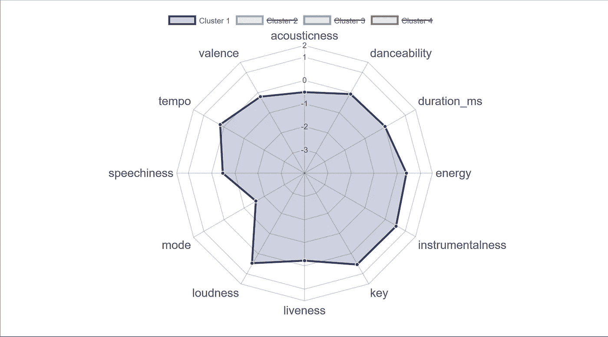
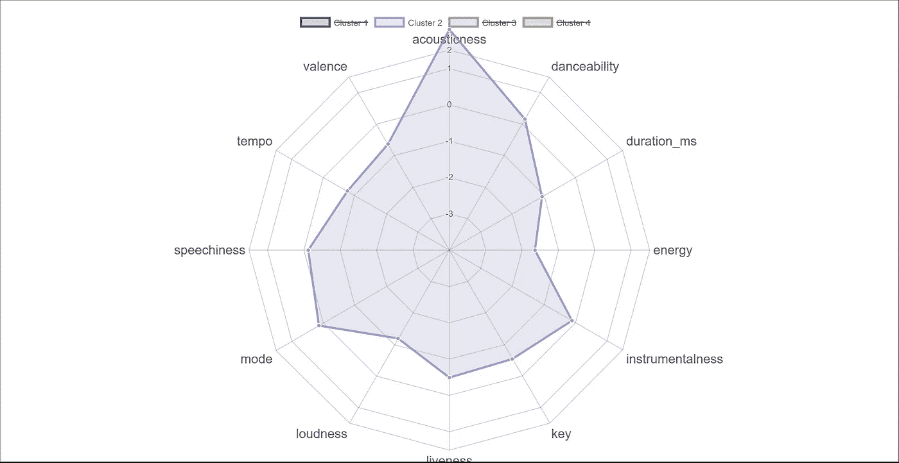
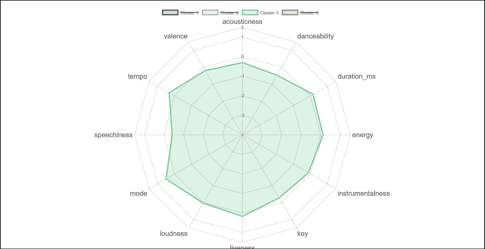
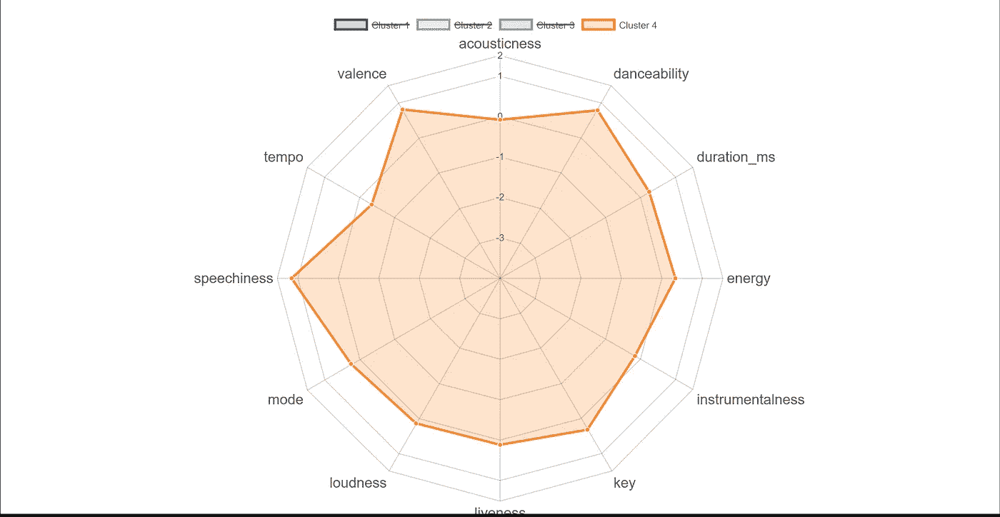

# 关于主流音乐，数据科学能告诉我们什么…🤔

> 原文：<https://towardsdatascience.com/what-data-science-can-tell-us-about-mainstream-music-e56b20e00a25?source=collection_archive---------13----------------------->

*Spotify 上前 100 名艺术家的 k 均值聚类*

Photo by [Thomas Habr](https://unsplash.com/@thomashabr?utm_source=medium&utm_medium=referral) on [Unsplash](https://unsplash.com?utm_source=medium&utm_medium=referral)

# 介绍

多年来，音乐之声随着社会的发展而发展，因此，声音的创新实际上是我们文化和技术进步的反映。几十年前，由于缺乏技术手段，与主流人群相关的音乐是不可能创作出来的。

不仅制作音乐的过程变了，音乐的消费也进步了。流媒体服务使得在各种平台上消费音乐变得前所未有的容易。毫无疑问，像 [**Spotify**](http://www.spotify.com) 这样的流媒体服务也降低了进入音乐行业的门槛。

Photo by [Anastasia Ischnopoulou](https://unsplash.com/@a_ischn?utm_source=medium&utm_medium=referral) on [Unsplash](https://unsplash.com?utm_source=medium&utm_medium=referral)

通过向全球 2.17 亿月活跃用户提供音乐，Spotify 不仅向用户提供了数百万艺术家的音乐，还允许任何人发布自己的歌曲。这在很大程度上改变了音乐行业，这确实值得写一篇自己的文章，但在这里，我打算更多地关注 2019 年主流音乐的流派。

# **目标**

这个项目的目的是分析 Spotify 上排名前 100 的艺术家发布的音乐。我开始通过分析他们的音频特征来将这些艺术家分类。然后，我通过评估突出的音频特征来研究每个集群代表的音乐风格。

首先，我访问了 [Spotify Web API](https://developer.spotify.com/documentation/web-api/) ，它允许我通过对 API 端点的标准 HTTPS 请求来访问 Spotify 音乐目录中的数据。

Photo by [Tom Fejér](https://blog.prototypr.io/@grotandthemob) on [Prototypr.io](https://blog.prototypr.io/)

Spotify Web API 允许您访问一首歌曲的几个[音频功能](https://developer.spotify.com/documentation/web-api/reference/tracks/get-several-audio-features/)。这些音频特征量化了音乐的几个方面，对这一分析至关重要。我使用了 12 种音频功能，如下所示:

> **可跳舞性**:可跳舞性描述了一首曲目在音乐元素组合的基础上适合跳舞的程度，包括速度、节奏稳定性、节拍强度和整体规律性。值 0.0 最不适合跳舞，1.0 最适合跳舞。
> 
> **声音度:**从 0.0 到 1.0 的一个衡量标准，衡量音轨的声音程度。
> 
> **能量:**能量是从 0.0 到 1.0 的度量，代表强度和活动的感知度量。通常，高能轨道感觉起来很快，很响，很嘈杂。
> 
> **乐器性:**预测一个音轨是否不包含人声。乐器度值越接近 1.0，轨道不包含人声内容的可能性就越大。
> 
> **活跃度:**检测录音中是否有观众。较高的活跃度值表示音轨被现场执行的概率增加。根据官方文档，“高于 0.8 的值提供了该轨道是活动的很大可能性。”
> 
> **响度:**一个音轨的整体响度，单位为分贝(dB)。响度值是整个轨道的平均值。值的典型范围在-60 和 0 db 之间。
> 
> **语速:**语速检测音轨中是否存在口语单词。越是类似语音的录音(例如脱口秀、有声读物、诗歌)，属性值就越接近 1.0。
> 
> **速度:**轨道的整体估计速度，单位为每分钟节拍数(BPM)。在音乐术语中，速度是给定作品的速度或节奏，直接来源于平均节拍持续时间。
> 
> **效价:**从 0.0 到 1.0 的量度，描述音轨所传达的音乐积极性。高价曲目听起来更积极(例如，快乐、愉快、欣快)，而低价曲目听起来更消极(例如，悲伤、沮丧、愤怒)。
> 
> **调:**音轨所在的调。整数映射到使用标准[音高等级符号](https://en.wikipedia.org/wiki/Pitch_class)的音高。例如，0 = C，1 = C♯/D♭，2 = D，等等。
> 
> **调式:**调式表示音轨的调式(大调或小调)，其旋律内容来源于音阶的类型。大调用 1 表示，小调用 0 表示。
> 
> **Duration_ms:** 是歌曲的时长，以毫秒为单位。

现在，我总结一下我的方法:

*   在[Kworb.net](https://kworb.net/spotify/)的 Spotify 上获得前 100 名艺术家的名单
*   通过 Spotify Web API 手动获取每个艺术家的音频特征数据
*   用相关的音频特征可视化艺术家数据
*   基于艺术家各自的音频特征，应用 k-means 聚类将艺术家分成不同的组
*   分析每个聚类中明显的音乐风格

让我们看看这几天有哪些艺人受欢迎！

# **获取数据**

第一步是在开发者的 Spotify 上注册。然后，我在平台上注册了我的应用程序，以获取密钥，也就是客户机 ID 和客户机秘密，以备将来的请求。

我使用密钥请求一个访问令牌，以便授权我的应用程序检索和管理 Spotify 数据。

我使用了一个名为 [**的 R 包装器 spotifyr**](https://www.rcharlie.com/spotifyr/) 从 Spotify 的 Web API 中批量提取每个艺术家的音频特征。通过自动批处理 API 请求， **spotifyr** 允许您输入艺术家的名字，并在几秒钟内检索他们的整个唱片目录，以及 Spotify 的音频功能和曲目/专辑流行度指标。spotifyr 的创始人 Charlie Thompson 有一个非常有趣的网站 ，如果你对音乐或数据科学感兴趣，我强烈建议你去看看。)

只需对每个艺术家使用`get_artist_audio_features()`函数，我就可以从 Spotify 获得数据。你可以在下面的平台看到月听众最多的前 100 位艺人。

最后，我将每首歌的音频特征放在它们各自的唱片目录中，所以我将它们全部组合到一个 data.frame 中。

然后，我使用`aggregate()`函数计算每个艺术家对应的音频特征的中值。最初，我在这个项目中使用了平均值，但我认为中值会更好，因为考虑到数据的高度可变性，平均值的效率很低。

让我们快速看一下我生成的表格，它包含了所有艺术家的音频特征的中值。

# **K-均值聚类分析**

> K-means 聚类是最流行的[无监督机器学习算法](https://en.wikipedia.org/wiki/Unsupervised_learning)之一。它将相似的数据点组合在一起，并寻找潜在的模式。为此，K-means 在数据集中寻找固定数量( *k* )的聚类。K 的值可以由运行算法的人定义，也可以使用各种技术[找到。](https://en.wikipedia.org/wiki/Determining_the_number_of_clusters_in_a_data_set)

现在我已经有了每个艺术家唱片目录的音频特征的中值，我可以进行聚类分析了。但是首先，我必须将数据标准化，也就是说，将数据转换为平均值为 0，标准差为 1。下一步是缩放数据，因为在找到 k 的最佳值之前必须这样做。

Charlie Thompson 在科切拉 2017 的聚类分析上做了一个[帖子](https://www.rcharlie.com/post/coachellar/)，在那里他使用`NbClust`包找到了最优的聚类数。同样，我使用了 Ward 的层次聚类，发现 k 的最佳值是 4。

Output for the gist above

在找到最佳的集群数量后，我用`ggplotly()`可视化了我的结果。此外，我还使用了韦斯·安德森电影《大吉岭》中优雅的调色板。

You can zoom in for better view of the labels!

评估上面的图表，我做了一些有趣的观察:

*   比莉·埃利什是前 100 名中最具音乐性的艺术家
*   XXXTENTACION 的唱片包括从说唱金属摇滚到原声民谣的各种音乐，与比利·埃利什和艾德·希兰属于同一类😮
*   Marshmello 是这里最有活力的艺术家！
*   酷玩乐队和皇后乐队似乎在图表中很突出，这是有道理的，因为他们是这项研究中少数几个传统乐队中的两个

让我们单独看一下每个集群！

# 主流音乐的集群

**第 1 组:电火花加工/电穿孔/Pop Rap**

这个集群主要由 EDM 艺术家组成。这个集群中的流行/说唱艺术家经常制作舞曲，这可以解释他们为什么在这里。该集群的特点是:

Radar chart for Cluster 1

*   **最高能量:**可以轻描淡写地说舞曲是充满能量的，所以这个指标的值完全有意义。
*   **高乐器性:**这些艺术家的每一张唱片都融合了各种乐器和流派，可以感觉到他们在歌曲制作上非常专注。
*   不太强调口语，因为大多数现代 EDM 歌曲的合唱都是器乐作品。
*   最高音量:试着给你的祖母播放这些歌曲中的任何一首，她会证实这一点。

**群组 2:声音爆音**

这个群体中的流行艺术家比其他人更传统。让他们在这里脱颖而出的是他们制作音乐的传统方式。当每个人都在跳着 EDM 和 Trap beats 制作电子派对歌曲时，这些艺术家却通过坚持自己的声学根源来区分自己。他们音乐的一些特征是:

*   **最高声音:**这一指标向我们显示，该集群似乎最有可能不使用电子放大。很多艺术家的歌曲都只有原声吉他和人声。
*   可以肯定地说，这个群体中的艺术家创作的歌曲唤起了悲伤和愤怒的情感。考虑到 XXXTENTACION 也在这个群体中，我毫不怀疑，因为他要么创作了让你哭泣的歌曲，要么是你的邻居报了警。
*   **最低能量和节奏:**证实这是制作缓慢、悲伤、原声民谣的组合。

**集群三:** **最主流的主流音乐**

从爱莉安娜·格兰德到德雷克的每个人都在这个集群中(所以德雷克毕竟不是一个说唱歌手。)这是所有乐队中最多样化的一组，所有的流行/摇滚乐队都在这里。这让我想知道，当人们说所有流行音乐听起来都一样时，这个集群是不是指的那个。我还观察到，该集群中没有太多突出的音频功能，但这里有一些我的想法:

*   最高节奏:该组中的艺术家具有所有其他艺术家中最高的节奏。这并不一定意味着他们总是制作积极向上的歌曲，因为效价不是特别高。
*   **最高活跃度:**这意味着歌曲被现场录制的可能性最高。我认为这是因为许多乐队发行他们歌曲的现场版本，并且大多数乐队都在这个集群中。
*   **相当一般的特征:**其余的音频特征似乎并不突出，这可能是因为这是拥有多样化艺术家的最大集群，或者他们确实制作了相对“一般”的音乐。

**集群 4:嘻哈/说唱**

这是我最喜欢的集群。作为一个说唱乐迷，看到算法把我最喜欢的艺术家放在一个群中，真的很令人满意。虽然这个群体中的说唱歌手有时使用不同的语言，但他们都有能力忠于他们的嘻哈根源。以下是我做的一些观察:

*   **最高语速:**说唱歌曲中的独特字数必然高于其他，这也是语速高的原因。此外，说唱歌曲传统上是由其抒情内容和声音流驱动的，而不是乐器。
*   **最高价:**最受欢迎的说唱歌曲关注积极的事情。说唱歌手经常谈论他们的破产，他们赚了多少钱，戴着昂贵的珠宝。吹牛是件好事。
*   **最高可舞性:**谁知道说唱音乐会比 EDM 本身更可舞？随着 groovy Trap beats 接管主流嘻哈，我并不感到惊讶。

# **模型结论**

*   所有主流音乐**听起来都不一样**。今天的流行音乐可以分为四类。
*   今天最流行的四种音乐风格是:EDM，原声音乐，说唱和流行音乐。
*   虽然这么说很伤我的心，但摇滚乐已经不再流行了。如今，为数不多的几个仍然排在前 100 名的摇滚艺术家已经将他们的音乐与流行音乐融合在一起，以保持相关性。
*   聚类 3 中的艺术家似乎具有平衡的音频特征，只有少数艺术家从其他艺术家中脱颖而出。在我看来，这正中主流观众的下怀。

下一步是什么？

数据科学可以告诉我们很多关于音乐的信息。Spotify 提供了发现自我的工具，让这变得前所未有的简单。该项目的下一步将是建立一个推荐系统，根据用户在音乐平台上的收听历史来创建播放列表。Spotify 已经在这方面做了很多工作，但如果能做到这一点就更好了。如果任何人有建议或想在这方面合作，请随时联系我。

我喜欢收到对我工作的反馈。如果你有任何建议，意见，或者只是想谈谈音乐，请随时联系我，在 inagpal2@illinois.edu！