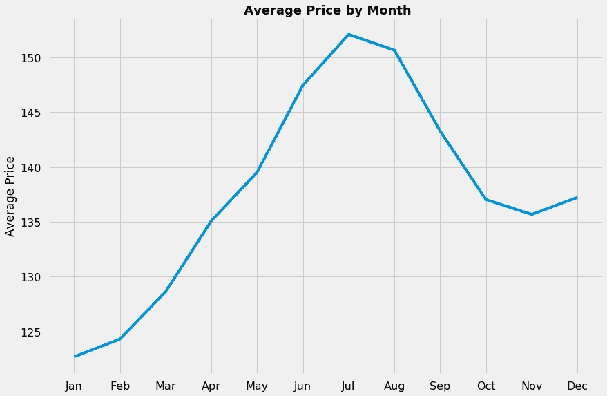
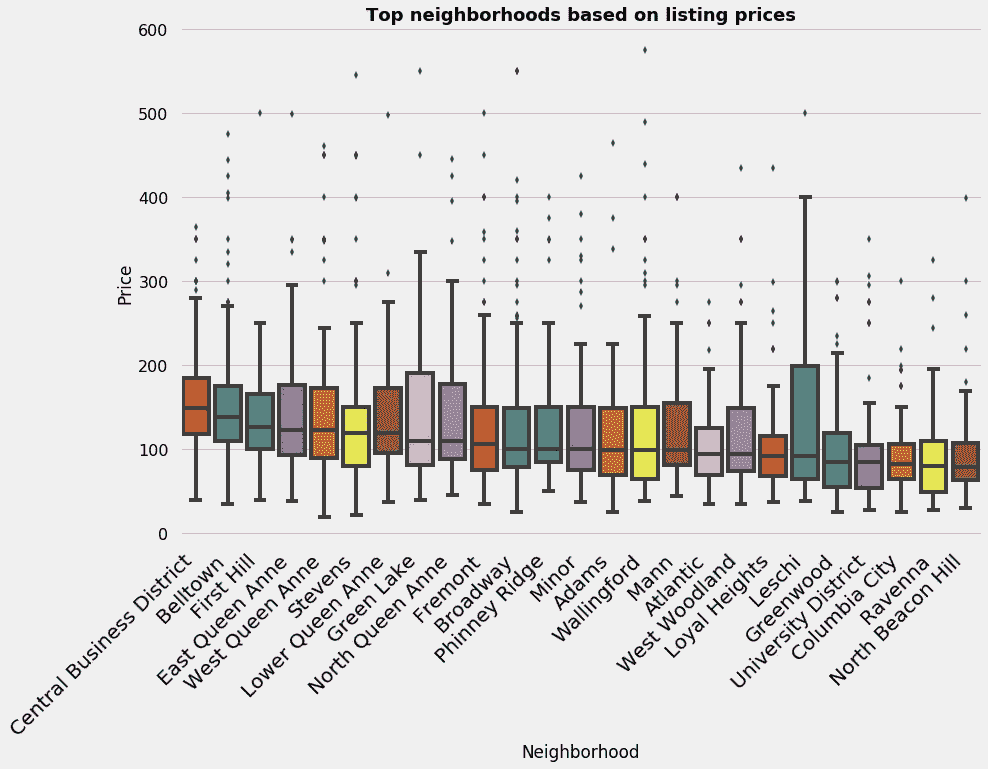

# 有哪些数据告诉我们 Airbnb 在西雅图的使用情况

> 原文：<https://towardsdatascience.com/what-data-tells-us-about-how-airbnb-is-being-used-in-seattle-b948a05b84b6?source=collection_archive---------18----------------------->

# 介绍

Airbnb 是一个在线市场，让你向客人出租房产或空房间。它是世界上最大的住宿分享网站，目前价值超过世界上任何连锁酒店。

Airbnb 的主人和顾客面临的一个主要挑战是，确定房源收费或付费的最佳价格。作为数据科学家，我们能否对 Airbnb 房源进行一些分析，以了解 Airbnb 的使用情况，并在这方面提供一些见解？

然而，Airbnb 没有提供开放的数据转储供我们使用。我们可以利用 Airbnb 内部一个名为[的独立实体提供的数据来分析并得出我们自己的见解。](http://insideairbnb.com/get-the-data.html)

我查看了西雅图的 2016 年 Airbnb 房源数据，并进行了一些探索性分析，为我的一些问题找到了答案。

该数据集有 3818 条来自西雅图不同社区的记录。每个列表记录都包含与其定价、主机详细信息、位置、便利设施等相关的详细信息。虽然总共有 92 列，但我只选择了几列进行分析。

我的第一个问题是:

**当你去西雅图的时候，一年中最繁忙的时候是什么时候？**

我使用日历数据来绘制月平均入住率，以直观显示它们在一年中的变化情况。

西雅图的 Airbnb 房屋似乎在年初最繁忙。然后在三月底会有一个暴跌，在七月和八月再次达到顶峰。

**平均来说，什么时候入住 Airbnb 房源最贵和最便宜？**

西雅图的 Airbnb 价格在 6 月份左右开始见顶，在 7 月和 8 月达到最大业务量。一月和二月的价格最便宜。

平均而言，游客在旺季每晚要比淡季多付 35 美元。

从上面的两个图像中可以看出:

*   一月份的高入住率似乎令人费解。根据简单的价格和入住率相关性，人们会认为 7 月至 8 月是最繁忙的时期。
*   此外，对于出现的周期性趋势，年初和年末的价格和入住率应该大致处于同一水平。

我们需要查看不同年份的数据才能得出更好的结论。

此外，我查看了一周中各天的价格和入住率，发现它们在周末相对较高，这与预期相符。

**房源数量最高的小区是哪些？**

如下图所示，百老汇、贝尔敦和沃灵福德是上市数量最多的三个社区。

然而，列表计数只提供了一半的情况，因为一些社区由于规模较大而可能有更大的计数。为了更好地了解顶级社区，我们需要查看列表密度，即列表的集中程度或分散程度。为了直观地探索这一点，我在地图上标出了这些列表的地理坐标(参考帖子中的标题图片)。

在基于挂牌数量的顶级社区中，百老汇和贝尔敦及其周边地区似乎是大多数挂牌的地方。

平均来说，住在哪里最贵和最便宜？

根据平均价格，中央商务区是最贵的，北比肯山是最便宜的。

为了对此有一个更广泛的理解，我还查看了前 25 个街区的价格分布。

价格较高的社区的大部分房源都在 101 美元到 200 美元之间，而其他社区的大部分房源都在 1 美元到 100 美元之间。

百老汇位于榜单的中间位置，价格在 101-200 美元之间，与贝尔敦的房源数量几乎相同。但这被价格在 1 美元至 100 美元之间的更多商品抵消了。

**一个上市的受欢迎程度和它的价格有什么关系？**

我用顾客对一个列表的评论数量来掩饰它的受欢迎程度。假设是，更多的评论对应着更高的需求和受欢迎程度。

为了证实这一点，我绘制了 10 大社区的平均价格和平均受欢迎程度。我只考虑了前 10 个社区，以确保每个社区都有足够的样本列表来概括趋势。

似乎，一个社区的平均价格和受欢迎程度之间存在负相关关系。此外，从可视化中可以明显看出，这种关系并不牢固，因为一些社区与趋势相反。

**列表的哪些属性可以用来预测价格？**

为此，我使用列表的不同属性建立了一个预测模型。我们的想法是根据上市数据建立一个模型，然后找出对该模型有贡献的最重要的预测特征。

我排除了一些附属功能，如床、卧室，为其他独立功能提供空间。

我用 80%的数据来训练模型，剩下的 20%用于预测。

这是该模型如何预测价格的可视化效果。图表上的每个点代表测试数据中的一个列表，x 轴表示实际价格，y 轴表示预测价格。

该模型能够很好地预测低于 200 美元的价格，这很好，考虑到大多数上市价格都低于 200 美元。此外，这是一个基本模型，还有进一步提高模型性能的空间。

接下来，我使用训练模型的属性来获取最重要的功能及其在预测上市价格中的相对重要性的列表。

评论和便利设施的数量以及评论评分评级、总列表数和住宿似乎是列表价格预测中最重要的特征。此处需要注意的另一点是，住宿、额外人员、浴室和客人都与租赁物业的大小有关，并在确定挂牌价格时发挥重要作用。

# 外卖食品

我们研究了 2016 年西雅图的 Airbnb 房源，以寻找一些与 Airbnb 使用方式有关的问题的答案。有些答案是确凿的。例如，评论的数量、便利设施和“生活空间”的面积在确定房源价格时起着重要作用。有些问题需要更多的数据才能得出更好的结论。例如，一些街区的房源数量太少，无法得出一个总体趋势。我们将需要结合不同年份的数据，看看 2016 年数据中看到的模式是否跨年份保持不变。此外，作为下一个可能的步骤，我们可以研究不同城市的数据，看看它们之间如何相互比较。

*本次分析的完整代码可以在* [*这里*](https://nbviewer.jupyter.org/github/samardolui/AirBnBSeattle/blob/master/Airbnb%20Listing%20Seattle.ipynb) *找到。*