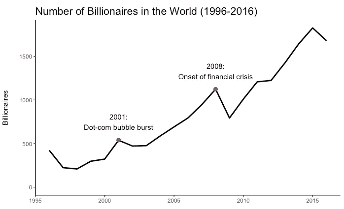
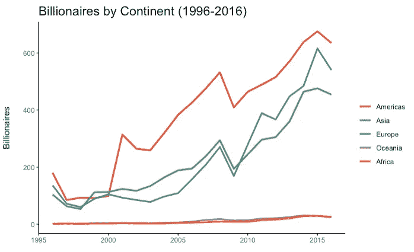
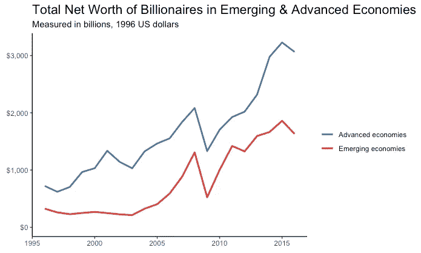
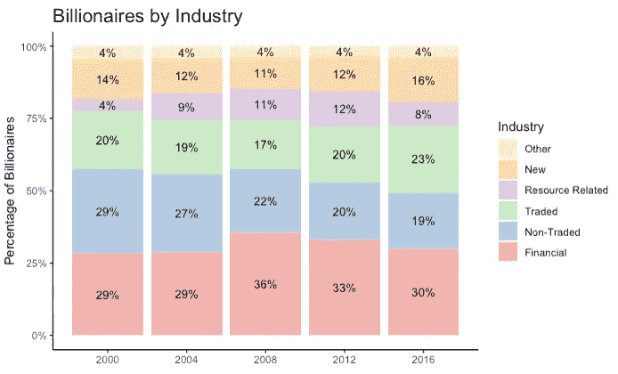

# 关于世界上最富有的人，有哪些数据告诉我们

> 原文：<https://towardsdatascience.com/what-data-tells-us-about-the-worlds-wealthiest-a8c54e6ddb84?source=collection_archive---------13----------------------->

在哈佛大学大一的春季学期，我上了一门名为“利用大数据解决经济和社会问题”的课。我们探讨的最有趣的话题之一是美国的机会平等。我们了解到，孩子们比他们的父母挣得更多的机会并不一致:这取决于他们的种族、性别和他们在哪里长大。

这门课的大部分内容集中在研究数据和分析收入分配最低百分位数的结果。我对另一个极端很好奇。我想看看世界上最富有的人的数量、地理位置、财富来源和净资产的趋势。

Photo by Forbes

我发现了彼得森国际经济研究所(PIIE)的研究人员创建的数据集，该数据集使用了 1996 年至 2016 年福布斯全球亿万富翁排行榜的数据。根据 PIIE 的研究人员:

> “从 1996 年到 2010 年，这些数据包括全球亿万富翁的姓名、排名、国籍和净资产(现值美元)。从 2011 年开始，还提供了财富的来源，要么列为特定公司，要么列为更广泛的行业。”

PIIE 大学的研究人员在《福布斯》的数据中加入了几个变量:亿万富翁的年龄、1996 年的美元净资产(考虑到通货膨胀)，以及他们国家的国内生产总值和经济发展水平。除了原始数据集中包含的 3 位数国家代码之外，我还为洲名和国名创建了变量。

以下是我从分析中发现的…

## 在过去的 20 年里，亿万富翁的数量翻了两番

显然，从 1996 年到 2016 年，全球亿万富翁人数激增(更准确地说，增长了 396%)。但上升轨迹并非一帆风顺:2000 年之前增长相对停滞，2001 年互联网泡沫破裂后立即出现负增长，最明显的是 2008 年的金融危机。

## 美国一直拥有最多的亿万富翁

这部动画对 1996 年至 2016 年每年亿万富翁人数最多的 10 个国家进行了排名。最引人注目的发现是，在过去十年中，不仅美国毫无例外地拥有比其他任何国家都多的亿万富翁，而且即使考虑到人口规模的差异，美国与亚军国家和其他国家的亿万富翁数量差异也非常大。除了 1999 年和 2000 年，美国每年的亿万富翁人数至少是其他任何国家的 2.5 倍。然而，这一差距正在慢慢缩小，很明显，中国正在赶上美国:中国在 2008 年首次上榜(排名第五)，自 2013 年以来一直排名第二。

关于各国在排名中的位置，有一些有趣的观察结果:

*   总共有 19 个国家至少上榜一次。
*   自 1997 年以来，每年都榜上有名的国家只有美国、德国、香港和英国。
*   这一排名反映了日本经济的逐渐衰落:2006 年之前，日本一直排在前 5 名，之后几年一直排在榜单的后半部分，2011 年之后又跌出了榜单。
*   自 2005 年以来，印度一直名列前茅(通常徘徊在第 4-6 位)。
*   自 2003 年以来，俄罗斯一直排名前五，尽管在 2014 年美国和欧盟实施制裁后，俄罗斯的亿万富翁人数急剧减少。
*   个人兴趣(和骄傲):加拿大自 1999 年以来几乎每年都榜上有名！

## 亚洲经历了亿万富翁人数增长最快的时期

亚洲和美洲的亿万富翁数量增长最快，其中最大的增长发生在 2008 年之后。有趣的是，在 2000 年之前，美洲和欧洲的亿万富翁人数非常接近，但在 2000 年之前，这两个地区的亿万富翁人数突然出现了显著差异。自那以后，它们的增长模式相互呼应，但美洲仍明显高于其它地区。同样令人惊讶的是，尽管非洲在过去二十年中取得了巨大的经济增长，但非洲亿万富翁的人数一直很低。

## 发达经济体的亿万富翁比欠发达国家的亿万富翁变得更加富有

2003 年后，亿万富翁的总净资产激增——特别是在新兴经济体，增长几乎是指数级的——直到 2008 年金融危机后立即大幅下降。然而，2010 年后，亿万富翁人数反弹，他们的净资产再次开始增长，尽管欠发达国家的增长速度明显放缓。

## 自 2000 年以来，超过四分之一的亿万富翁的财富来自金融业

该数据集将亿万富翁的财富来源分为以下 6 类:

*   **资源相关**:能源(不包括太阳能和风能)开采，钢铁
*   **新**:计算机技术、软件、医疗技术、太阳能和风能、制药
*   **非贸易**:零售、娱乐、媒体、电信、建筑、餐饮等服务业
*   金融:银行、保险、对冲基金、私募股权、风险资本、投资、多元化财富、房地产
*   **贸易**:农业、消费品、航运、制造业
*   **其他**:教育、工程、基建运动队所有权、身份不明的多元化财富

尽管最大比例的亿万富翁已经并将继续主要从金融业获得财富，但这一比例自 2008 年达到峰值以来一直在稳步下降。另一方面，自 2008 年以来，来自“新”和可交易商品行业的亿万富翁比例一直在上升。

需要注意的是，数据集并不完美。PIIE 的研究人员指出了它的一些缺陷:

## 缺失数据

> “报道的亿万富翁人数和世界上实际的亿万富翁人数之间可能存在差异，因为一些亿万富翁可能更喜欢对他们的财富规模保密……”
> 
> “还有一种可能是，许多私营公司被忽视了，至少在公司上市或创始人去世之前是如此。”
> 
> “另一类被排除在名单之外的亿万富翁是那些收入与非法获取租金有关的人，包括腐败的政府官员或毒枭。”

## 不一致的报告

> 《福布斯》通常不包括那些财富与其权力地位挂钩的君主和其他国家领导人。《福布斯》在 1997 年和 1998 年破例，包括 8 位君主和 4 位独裁者，但名单不完整，这一群体在后来几年被终止。”
> 
> “这个数据集的一个缺点是福布斯对样本中部分家庭财富的报告不一致。1996 年和 2001 年至 2014 年，亿万富翁是以个人身份报道的，除非“兄弟姐妹之间的所有权划分不清楚”……然而，从 1997 年到 2000 年，该榜单按家族汇总了个人亿万富翁。"

由于这些缺陷，我的分析少报了亿万富翁的数量和他们的总净资产，从而扭曲了一些国家和地区的结果。另一个含义是，由于数据质量的问题，我进行的一些分析返回了误导性的结果，所以我选择排除它们。例如，随着时间的推移，亿万富翁的平均年龄或中值年龄的图表将是不准确的，因为非常高比例的亿万富翁被错误地列为 0 岁(至少我希望这是不正确的……)或他们的年龄在数据集中缺失。

我还想制作一张每年新增亿万富翁人数的图表，以说明亿万富翁人数的年度增长被夸大了，因为亿万富翁在未来几年不太可能从榜单上消失。然而，正如 PIIE 的研究人员指出的那样，只有当《福布斯》发现他们的净资产时，从私营公司获得财富的人才会被列入名单(例如，只有当公司上市或创始人去世、有人继承了他们的财富成为众所周知的事情时)。这意味着一些人会在他们真正成为亿万富翁的几年后才首次被列入名单，这扭曲了“新亿万富翁”结果的准确性。

关于世界上的亿万富翁，还有很多东西需要了解。我很好奇性别和年龄分布如何随着时间的推移而变化，以及是否有更多的“白手起家”或继承财富的亿万富翁。希望随着数据的增长，我们可以开始回答这些问题以及更多的问题。

你可以在[这个 RPubs post](http://rpubs.com/dashamet/billionaires) 和[这个 Github repo](https://github.com/dashamet/billionaires) 上找到我所有数据可视化的数据和代码。

我在这篇文章中引用的 PIIE 研究是由 Caroline Freund 和 Sarah Oliver 撰写的名为“超级富豪的起源:亿万富翁特征数据库”的[工作论文](https://piie.com/system/files/documents/wp16-1.pdf)。