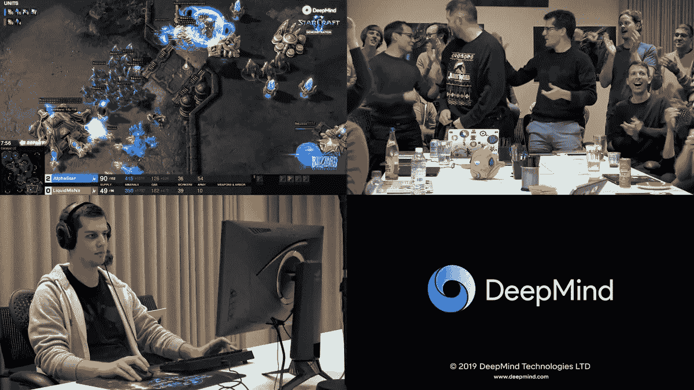
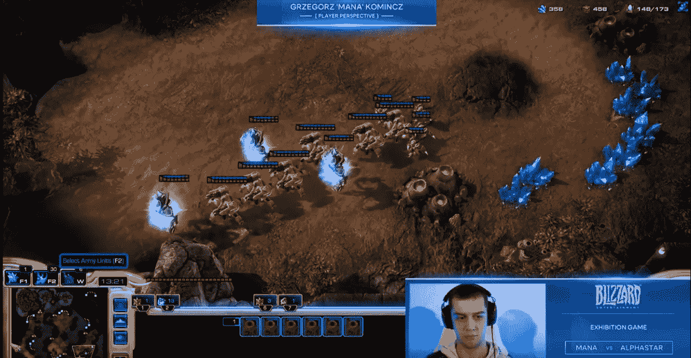

# DeepMind 的 AlphaStar 击败星际玩家对 AI 研究意味着什么

> 原文：<https://towardsdatascience.com/what-deepminds-alphastar-beating-starcraft-players-means-for-ai-research-62ca70ccb403?source=collection_archive---------12----------------------->

这篇文章是关于 AlphaStar 在 2019 年 1 月的胜利。

在 12 月份进行基准比赛后，DeepMind 的星际争霸(StarCraft)玩 AI AlphaStar 在一系列游戏中击败了职业选手。

image via [https://gigazine.net](https://gigazine.net/news/20190125-alphastar-mastering-starcraft-ii/)/

暴雪的星际争霸是一款复杂的电子竞技游戏，没有单一的获胜策略。它在单人模式下有自己的人工智能，但它依赖于手工制作的规则，比实际玩家拥有更多关于地图状态和对手的信息，并且能够同时执行命令，比人类快得多。鉴于其复杂性，击败人类被认为是人工智能研究的另一个巨大里程碑。但是所有其他的星际人工智能以前主要依赖于一系列手写的规则和限制。直到现在，他们都没有达到职业选手的水平。

**但是 AlphaStar 不是人工通用智能。** DeepMind 的系统不是一个单一的模型，能够同时在围棋、象棋和星际争霸中击败人类。无论是跳棋还是魔兽，他们的模型都无法击败人类。尽管如此，**从技术上来说，这一成就可能比其他成就更加重要**:

*   星际争霸赛很长，执行的动作数量远高于一局围棋的回合数。在游戏开始时做出的决定，可能只会在游戏结束时有用。错误的决定仍然可以伪装成有用的决定，如果玩家后来设法修正它们并扭转局面的话。一个策略的成功只能在每局游戏结束时才能得到充分的评估，而所有成功的策略仍然可以用其他策略进行反击(尤其是在星际争霸的情况下)。AlphaStar 代理能够学习多种通常良好的长期策略，而不仅仅依靠剥削。
*   玩家看不到整个地图和他们对手的所有行动，只有他们将要选择什么策略的粗略想法，这意味着星际争霸是一个不完整和不完美的信息游戏。这意味着 **AlphaStar 能够“想出”成功的长期战略，甚至在未知的情况下改变它们**。
*   行动需要时间来产生效果，命令只有在以后才能完全执行，而且只有在环境允许的情况下。AlphaGo 可以将棋子移动到任何自由的位置，它的决定会立即改变棋盘。**另一方面，AlphaStar 需要对时间有一些概念，**如何提前计划时间，并知道在游戏的不同阶段哪些策略更有用。
*   与回合制棋盘游戏不同,《星际争霸》是一款即时战略游戏，玩家可以同时采取行动。玩家对他们的观察反应越快，对他们来说结果就越好。DeepMind 的工程师已经成功训练了一个深度学习模型，**能够像专业人员一样快速地对环境做出反应**(甚至更快，但他们不允许这样做)。训练深度学习模型很昂贵，但运行它们又快又便宜，因此在新一代智能手机中运行模型的人工智能芯片越来越多。尽管对代理的培训是在 16 个[云 TPU v3](https://cloud.google.com/tpu/)上进行的，每个并行 420 万亿次浮点运算(作为衡量标准，PS4 Pro 有一个 [4.2 万亿次浮点运算](https://www.techradar.com/news/gaming/consoles/ps4-vs-xbox-720-which-is-better-1127315/2) GPU)，但最终的 AlphaStar league 模型适合 pendrive，甚至可以在普通的桌面 PC 上运行。

Final match against MaNa

那么为什么这还不是一般的智力呢？

所有的游戏都在一张地图上进行，只有一个种族(神族)与自己对抗。一个类似小地图的游戏领域的表示被输入到模型中，而不是来自星际争霸的一系列截图。AlphaStar 没有学习过星际争霸，它已经学会了在地图上执行哪些动作，以及如何根据现有的信息来计时。这不是一个微小的差异:AlphaStar 可能无法在不同的地图上击败人类，无论是与不同的种族，甚至是玩不同版本的游戏。虽然它的新版本很可能会玩其他种族，但学到的能力仍然会与我们在环境中的感知和选择行为不同。不要误解我，AlphaStar 获奖仍然是人类的一项巨大成就，但这也意味着它只在一个狭窄的领域取得了成功:提出一系列有用的行动，并不等于成为不同领域的战略家。这一点在与 MaNa 的最后一场比赛中表现得最为明显，他在 AlphaStar 的策略中找到了一个漏洞，并不断滥用它以最终获胜(迫使人类犯错或让电脑玩家重做次优策略也是职业玩家使用的策略)。他的诡计可以被大多数人类玩家避免，只要简单地建造一个单独的对抗单位并阻止它。但是 AlphaStar 以前从未见过这样的信息，也没有一系列学习过的动作来响应。AlphaStar 没有学过星际争霸。然而，对于需要战略规划的领域来说，这是一个前所未见的解决方案。

AlphaStar Agent Visualization

AlphaStar 获胜意味着，从理论上来说，**我们现在拥有在需要长期战略、信息仅部分可用、实时决策是关键的领域使用人工智能的技术。尽管不是人工一般智能，但它是迄今为止人类必须自己解决的最复杂认知问题的一个有前途的解决方案。除了我们仍然必须缩小问题的范围，如果我们想要人工智能成功地解决它。**

> 别忘了阅读 [DeepMind 自己关于 AlphaStar 成功的博客](https://deepmind.com/blog/alphastar-mastering-real-time-strategy-game-starcraft-ii/)。