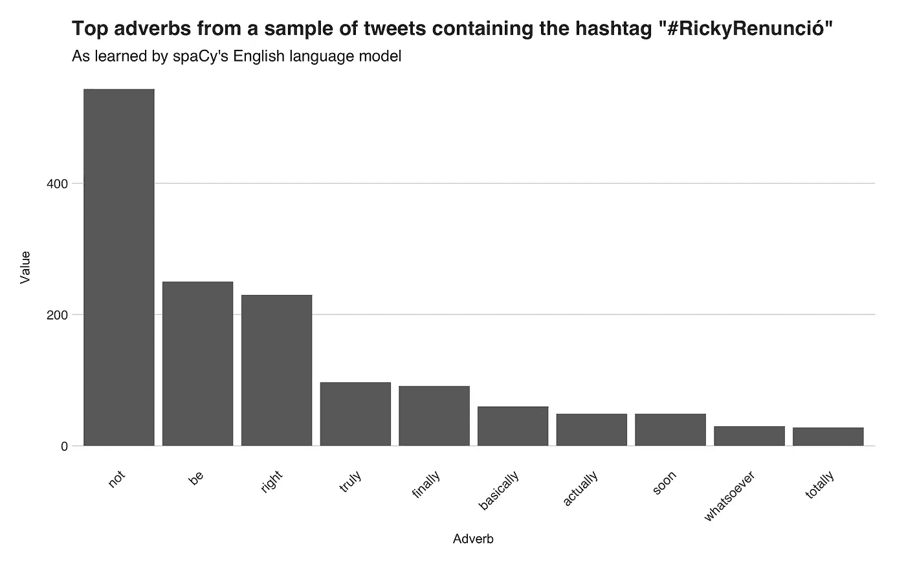

# 波多黎各总督辞职后说了什么？推特数据分析

> 原文：<https://towardsdatascience.com/what-did-puerto-rico-say-after-its-governor-resigned-a-twitter-data-analysis-a0a3dd727184?source=collection_archive---------25----------------------->

## 使用 spaCy、Google Cloud 和 NLP 解释包含# RickyRenunció标签的推文。

波多黎各岛和它的人民正在创造历史。7 月 13 日， [*波多黎各新闻调查中心*](http://periodismoinvestigativo.com/) 公布了一份由 [889 页电报](https://en.wikipedia.org/wiki/Telegramgate)组成的文件，这些电报是总督、**里卡多·罗塞尔洛**和他的内部工作人员之间相互交换的。其内容包括厌恶女性的内容、同性恋恐惧症、性别歧视、粗俗语言，甚至是对玛丽亚飓风受害者的玩笑。

人民的公关不赞成这样的行为，从其总督，并不想由他来代表。因此，由于泄漏，以及在此之前几天爆发的腐败案件，7 月 15 日，超过 50 万波多黎各人走上旧圣胡安的街头，连续 12 天举行抗议活动，包括 7 月 23 日的全国大罢工，有超过 75 万人参加。

Old San Juan. Picture of me.

但是罢工并没有在圣胡安的街道上结束。数千名不住在岛上的波多黎各人在世界各地举行示威活动，让人们听到他们的声音，并对在旧圣胡安战斗的人表示同情。此外，这些表现也存在于社交网络中。在那里，人们通过评论、讨论和模因表达自己的意见。

经过 12 天的抗议，里卡多·罗塞尔于 7 月 25 日辞职，于 8 月 2 日生效。就像波多黎各和全世界在网上发出声音一样，他们再一次通过社交网络让人们听到他们的声音，并庆祝他们的胜利。

为了更好地了解波多黎各人如何在网上庆祝，我收集了总共 **20058** 条推文，其中包含标签**# rickyrennució**(西班牙语为“*里奇*【里卡多的昵称】*辞职“*”)的生成，并对其进行分析。

The famous umbrellas of Old San Juan. Most of the protests took place at this location. Picture by me.

在本文中，我将展示我在调查中发现的结果。在其中，我使用了**自然语言处理**(NLP)**人工智能**、编程语言 **Python** 、库 [**spaCy**](https://spacy.io/) 和 [**谷歌云的自然语言 API**](https://cloud.google.com/natural-language/) 来解读推文的内容，更好地理解了波多黎各和世界在罗塞罗辞职后所说的话。有了这些工具，我分析了完整的 tweets 语料库来研究以下概念:

*   推文中出现最多的**名词**、**动词**、**形容词**和**副词**。
*   推文中的情绪或作者的态度。

在我开始之前，简短地补充一下:尽管这篇文章是关于使用人工智能和编程来研究上面提到的主题，但我的目标是将我将要介绍的内容传达给普通观众。因此，我将使用用户友好的词汇，并将技术术语保持在最低限度。尽管如此，对于那些想要复制这个实验的人来说，还是会有一些小的代码片段；然而，如果你不感兴趣，请随意忽略它们。此外，在分析数据时，我意识到我正在阅读推文的“简短形式”(这是一个巨大的错误)，而不是全文，因此每条推文都被截断为 150 个字符，由于我是实时收集数据的，所以我无法还原这个过程。

Old San Juan. Picture of me.

## **数据和准备步骤**

这条推文的语料库由 20058 条推文组成，是在 7 月 25 日和 26 日期间使用 Python 包 [**Tweepy**](https://www.tweepy.org/) 收集的。该数据集包含所有类型的推文，例如，带有图片链接的推文、带有提及的推文和转发推文。因此，我对数据进行了清理和预处理，使其适合我想要研究的不同用例。

为了发现排名靠前的名词、动词、副词和形容词，统称为**词性** (POS)，我从包含图片的推文中删除了标签、提及、转发提及，例如，“RT [@account_name](http://twitter.com/account_name) ”和 *https* 地址。而且，作为 spaCy 数据处理步骤的一部分，算法会忽略停用词，停用词是常用词，比如“ *tu* (西班牙语为 *you* )”和“ *yo* (西班牙语为 *I* )。”另外，我只使用了**引理**，就是它，每个单词的规范形式。例如，动词“ *hablamos* ”、“ *habló* ”和“ *hablando* ”是同一个词位的形式，其引理是“ *hablar* (西班牙语为 *talk* )”

下面这段代码显示了清理过程。

Old San Juan. Picture by me.

# 推文中出现的热门名词、动词、形容词和副词

spaCy 最强大的功能之一是词性标注，它为每个文档的术语分配一个**预测**标签，如**名词**和**动词**，允许我们为获得的推文赋予一些上下文和意义。为了实现这一点，我使用了所谓的**语言模型**，通俗地说，它是一个人工智能实体，在接触了一种语言的成千上万个单词后，它已经学会了该语言的特征。

发生在波多黎各的事件成为国际新闻。因此，对此发表评论的人不仅是波多黎各人，也不是说西班牙语的人。因此，收集的许多推文都是英文的，所以我不得不使用两种语言模型——一种是西班牙语**和英语**一种——来更好地评估内容。****

****重要提示:西班牙语模型是用取自西班牙语维基百科和新闻文章的单词训练的，不幸的是，当它用于其他体裁时，如社交媒体文本，它的性能会受到影响。尽管如此，我还是通过删除表情符号和搜索结果中指定语言以外的语言来手动修复了一些不一致的地方。所以我相信分析的总体结果不会因为这个原因而受到影响。在本文后面的存储库中，您可以找到完整的和未修改的输出。那个问题解决了，让我们继续分析。****

****在这一节中，我将通过八种可视化方式(四种西班牙语，四种英语)展示 Twitter 在谈论州长 Ricardo Roselló辞职时使用的十大名词、动词、形容词和副词。****

****下面是一个代码片段，展示了我如何使用 spaCy 获得 POS 标签(记住:您可以忽略它)。****

## ******动词******

****我想介绍的第一个词类是动词，表示动作的词。首先，我将显示西班牙语动词，其次是英语动词。****

********

****Top Spanish verbs****

****在顶部位置，我们有单词“***”aprender***，“这是西班牙语的“*学习*”这个词主要出现在一条转发的推文中，称在 12 天的抗议中，波多黎各给世界上了一课，每个人都应该学习。类似地，这个词也出现在推特上，人们说他们的国家，例如墨西哥和巴西，应该从波多黎各的事件中吸取教训。在第二个位置上，有一个大写的单词“***【RESPETA】***”，意思是“*尊重*”，它来自于一条推特，说波多黎各和整个拉丁美洲都应该得到尊重。(我将大写单词保留为大写，因为我相信与非大写版本相比，它们有另一种含义)。第三个动词是单词"***celebrar***"("*庆祝*")，它出现在一条针对**路易斯·丰西**(波多黎各歌手，德帕西托·盖伊)的转发推文中，告诉他不值得庆祝，因为他没有出现或承认抗议或运动。于是，就有了“***dimi TIR***”(*辞职*)、 ***放弃者*** (也有*辞职*)、 ***计***”(*介绍*)、***parir***(*举*) " ***hacer*** " ( *做*)， *lograr* " ( *实现*)， *sentir* " ( *感受*)，**ver**"(【 现在，让我们来看看英语的对应物。****

********

****Top English verbs****

****在第一个位置上，有一个词“*”辞职，它出现在人们谈论辞职的推文中，以及如果美国也这样做，川普会如何辞职。然后就是“ ***走*** ”，暗指*走*出去投票，或者*走*出去抗议。紧接着，我们有了“ ***抗议*** ”，指的是抗议本身。剩下的动词有: ***告诉*** ， ***得到*** ， ***拿*** ， ***撤销*** ， ***抓拍*** ， ***让*** ， ***赢*** 。*****

*****既然我们知道了动词，我将继续展示副词，修饰它们的词。*****

## *******副词*******

**********

*****Top Spanish adverbs*****

*****列表中第一个副词是“***Despacito***”(*慢慢的*)，这也是路易斯·丰西(Luis Fonsi)和《美国佬老爹》(Daddy Yankee)的 2017 年热门歌曲的歌名。Twitter 用户利用这个术语告诉 Luis Fonsi，他应该*慢慢地*后退或离开，这些推文与我上面介绍的那个相关。紧接在" *Despacito* "之后的是单词"***jáMAS***"(*never*)，它主要出现在带有短语"*un Pueblo UNIDO jamás serávencido，*"的推文中，意思是类似于" *united we stand。*“然后，还有另一个波多黎各俚语，“ ***pa'lante*** ”，意思是“*向前，向前，*”，这个来自歌手米盖尔·波斯的一条推文，他在其中向人民表示祝贺。其余排名靠前的副词有“***Anoche***”(*昨夜*)、“***Nuevamente***”(*再次*)、“***ACá***”(*此处*)、以及“【原文】***abajar********

************

******最热门的英语副词“ ***而不是*** ”随处可见，它出现在许多不同的推文中，例如人们感谢艺术家*而不是*放过他们的推文，关于人们*而不是*放弃的推文，以及在推文中声明*而不是*将针对**万达·瓦兹奎**(指定的继任者)的抗议变成了厌恶女性的抗议。列表中的其他副词是"*， ***右*** ， ***真正的*** ， ***最后的*** ， ***基本上*** ， ***很快*** ， ***无论如何*** ，以及*******

## ********名词********

******除了动词，名词也是句子的基本组成部分。这些必要的词存在的唯一用途是命名事物；就是这样，地点，人，想法，感觉。在这一部分，我将从 tweets 中找出热门名词。然后，我会列出顶级形容词，描述或修饰名词的词。******

************

******Top Spanish nouns******

******列表中的第一个单词，“***po blar***”(*populate*)是语言模型中的一个错误。首先，这个词不是名词，而是动词，其次，它没有出现在语料库中。我相信这是因为模型误解了一些单词(可能是一些英文单词)，将其规范化为“ *poblar* ”，并标记为名词。第二点，我们有单词"*"(*世界*)，你可以在许多推特上找到它，指出波多黎各刚刚给*世界*上了一课，关于一个国家如何才能取得这样的成就。然后，还有单词" ***país*** " ( *国家*)，它来源于关于人们为他们的*国家*而自豪的信息，这些信息指出那些为*国家*而战的人以及其他人说波多黎各再也不会是同一个*国家*。其余的名词包括“***lección***”(*课*)、“***corazón***”(*心*)、“ ***戈伯纳多***”(*总督*)、“ ***出家***”(*辞职********

************

******Top English nouns******

******最常见的英语名词是单词“ ***”人*** ，”你会在提到波多黎各人的推文中找到它。因此，在讲述波多黎各人如何在*日*后*日*日出现的信息中，出现了“**日日**日”这一术语，还有人发信息说那是多么美好的*日*日。然后，第三个词是“*”，它来自另一个被转发的内容，其中一个用户说波多黎各“*已经连续 11 天展示民主*”其余的名词有“*、“ ***显示*** 、“ ***周*** 、“*、“ ***直*** 、“ ***罪*** ”(这一个是由于西班牙语中的“T44”一词而引起的语言模式错误)*********

******为了知道这些名词是如何被修饰的，我还研究了顶级形容词。接下来的两幅图展示了它们。******

## ********形容词********

************

******Top Spanish adjectives******

******根据 spaCy 的说法，语料库中最常见的西班牙语形容词是单词"*"(*联合*)，虽然这个术语几乎没有在语料库中出现，但其规范形式，单词" ***unido*** " ( *联合*)确实出现了多次。你可以在那些提到或谈论一个团结的国家或人民的推文中找到这个词。紧随其后的术语是“ ***完成***”(*完成*)，来自之前讨论过的包含单词“ ***mundo*** ”的推文然后，还有动词“ ***vencer*** ”，它出现在顶部是因为形容词“***vencido***”(*打败了*)的许多实例，你会在路易斯·丰西的推文中找到这个词，宣布这个岛屿不是*打败了*；这条推文是许多波多黎各人在过去讨论的推文中反击和攻击他的原因。随后的两个术语“***sentir***”(*to feel*)、“***Haber***”(*to have*)都是可能的错误，因为它们不是形容词，我在语料库中找不到很多与它们相关的词。剩下的五个分别是“*”(*【群内】*)”***普通*** ，“*impressionte*”(*impressive*)，“T67”*Bravo*“(*勇者*)和”。”********

******最后，我将介绍英语形容词。******

************

******Top English adjectives******

******形容词“ ***直***”——这是我之前在名词部分引用的“*民主*”推文的一部分——在列表中领先相当大的幅度。然后，还有“*”和“ ***恐同*** ”(第 6 位)，这两个词大多一起出现，用来形容总督和他的施政。在第三个地方，你可以看到“*”这个词，经常被用来定义抗议活动的和平性质。剩下的形容词还有“*****历史******波多黎各人*** ”(大概来源于*波多黎各人*)、 ***美丽*** 、 ***伟大*** 。”**********

## ******讨论和解释******

******我从所讨论的条款中得到的总体感觉和收获是，自豪、民族、团结和对未来的希望弥漫在整个波多黎各人身上。用诸如" ***【国家】*** ，"*，" ***教训*** ，" ***开头*** ，" ***胜利*** "这样的西班牙语，波多黎各人民告诉世界，他们对岛上持续存在的虐待和待遇感到多么厌倦。相反，这些推文也透露了对州长、政客甚至艺术家的愤怒、愤怒和失望。*******

******波多黎各表现出的这种积极和充满希望的态度超越了该岛的边界，并传播到其他拉丁美洲国家，我们在推特上看到，来自这些地方的人们表示支持，甚至希望在他们的土地上开始类似的示威活动。******

******至于英文推特，我想说他们更关注事件的新闻，以及生活在美国的人所表现出的支持和同情。此外，经过更仔细的检查，我还发现许多推文包含针对美国及其总统唐纳德·特朗普的信息。这些推文表达了对如果美国人民像波多黎各人那样走上街头会发生什么的怀疑、不确定甚至希望。******

# ******情感分析******

******上一节介绍的 POS 术语让我们了解了推文的文本含义。然而，由于语料库的规模，相对来说很难感知推文背后确切的主要思想的明确印象。尽管如此，有一种方法可以用一个数字来总结和量化推文的一个特征:**作者的态度**。而用来识别、提取和量化的技术被命名为**情感分析**，一种人工智能方法。******

******为了用一个数字来概括这些推文，我通过情绪分析引擎运行了每一条独特的(非重复的)推文，以量化其内容的“*正面*或“*负面*”。我使用的情感模型是由**谷歌云的自然语言 API** 提供的，我选择它是因为它如何将语料库拆分成句子来计算每个句子的情感。******

******下面的代码显示了我是如何计算情感的。******

******总的来说，谷歌传递了它检测到的 4880 个句子的情感。每个情感输出由两个值组成:分数*和幅度*前者是一个介于-1 和 1 之间的值，其中-1 表示负面情绪，1 表示正面感受，而 magnitude(我在此不使用)指定*[*文档*](https://cloud.google.com/natural-language/docs/basics) *内有多少情绪内容。********

******下图显示了情感值。******

************

******Sentiment values. The vertical bar marks the mean value (0.12).******

******这种可视化被称为**直方图**，它用来显示数字数据的分布，在这种情况下是情感值。乍一看，这张图片告诉我们，大多数情绪都是中性的。这是正确的。平均情绪值 **0.12** (略正)。但是，要讲完整的故事，需要考虑标准差，也就是 **0.42** 。这种相当显著的标准差表明情绪值非常分散或不相似，这意味着语料库中有所有类型的推文。******

******让我们看一些例子，首先，我会展示一些唤起积极情绪的推文，然后是其他暗示消极情绪的推文。******

********阳性:********

*   *******好消息！*******
*   ******”*历史性的！*******
*   ******这非常激励人。******
*   ******"*奥古罗萨·德·瑟·博里库阿·❤️🇵🇷*"(*以身为博里库阿人而自豪*【波多黎各人的另一种说法】)******
*   *******一个 100%谷奥血统的人。* " ( *看看我们能从这个百分百 wow 中学到什么吧。*)******
*   ******"我想给其他人一些启发。(*我很高兴知道我们已经成为其他国家的榜样*)。******

********底片:********

*   ******腐败，谎言，可恶的行为… 。******
*   ******Rosselló州长的腐败和他充满仇恨的言辞更是雪上加霜。”******
*   ******"人民厌倦了被欺负… "******
*   ******"*操他妈的波多黎各政府，以为他们可以把他们的脏衣服藏在紧闭的门后……*"******
*   ******"*不要去参加婚礼*"(*我再也不会买你的歌了*******
*   ******"*RT @[姓名已删除]: Que tipo mierda。*”(*多么傻逼的人*)******

# ******总结和结论******

******在对他和他的政府进行了数周的抗议后，波多黎各总督辞职了。为了庆祝这一重要的历史时刻，波多黎各人民和全世界都在推特上发表意见，分享结果并进行庆祝。因此，我收集了一个包含# RickyRenunció标签的推特语料库，以进行一项实验，其目标是解释和总结推特用户所说的话。******

******在我调查的第一部分，我使用 NLP 库 spaCy 来发现热门的名词、动词、形容词和副词，以及用户想要通过推文传达的整体思想。在分析调查结果后，我得出结论，大多数推文都谈到了作为波多黎各人的自豪感、团结和希望，同时表现出成就感和幸福感。此外，许多非波多黎各人在推特上表达了他们的同情，并希望在各自国家效仿岛上刚刚发生的事件。******

******然后，在第二部分，我研究了推文的情绪，发现评论内的普遍情绪或态度略偏正面(平均值 **0.12** )。尽管如此，标准差还是相当高(0.42)，这意味着推文展示了一系列情绪和感受。******

******完整的 tweets 语料库和源代码可以在下面的资源库中找到。出于隐私原因，我删除了推文中的所有提及。******

****** [## juandes/pr-辞职-推文

### 此时您不能执行该操作。您已使用另一个标签页或窗口登录。您已在另一个选项卡中注销，或者…

github.com](https://github.com/juandes/pr-resignation-tweets) 

如果您有任何问题、意见或希望联系我，请在此留下您的意见，通过 Twitter(下面的链接)联系我，或访问我的网站(我的个人资料上的链接)了解更多信息。

 [## 胡安·德迪奥斯·桑托斯

### 胡安·德迪奥斯·桑托斯的最新推文(@ jdiossantos)。机器学习/数据工程师。还有，口袋妖怪大师，还有…

twitter.com](https://twitter.com/jdiossantos) 

感谢阅读。******