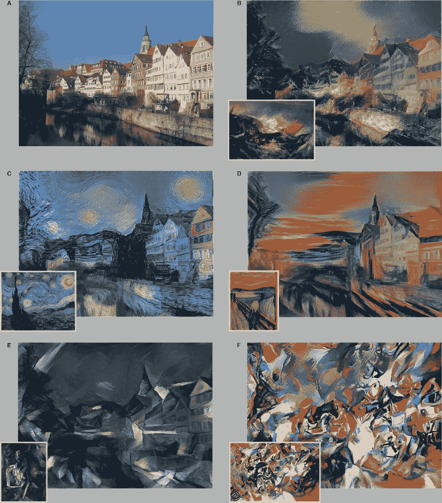

# 我们和 AI 的区别在哪里？

> 原文：<https://towardsdatascience.com/what-distinguishes-us-from-ai-dc98f71de9a3?source=collection_archive---------16----------------------->

## 人工智能的突破使得我们的智力——甚至我们的创造力——将保持无可匹敌的信念变得更加复杂

[*The Creation of Adam*](https://commons.wikimedia.org/wiki/File:Creaci%C3%B3n_de_Ad%C3%A1n_(Miguel_%C3%81ngel).jpg) by Michelangelo (c. 1512); modified by the author.

相信我们的独特性是人类自我理解的核心；然而，一次又一次，被认为是我们与众不同的特征被证明是海市蜃楼。

几千年来，人类一直宣称自己优于其他生物。从美索不达米亚到中国，古代文明的神话将人类的起源追溯到神的创造。宗教教义呼应并固化了这种情绪。在《圣经》和《可兰经》中，人类被描绘成神圣地注定要统治所有的造物。即使在佛教中，所有的生物都在无尽的轮回中相连，只有人类才能获得开悟。

科学突破挑战了这种世界观。查尔斯·达尔文的*物种起源*和基因组的发现让人类只不过是共享进化树上的一个分支。然而，与我们对独特性的渴望相呼应，科学发现了一组全新的特征，使人类恢复到我们想象的卓越状态。在许多被认为是人类独有的属性中，有抽象推理、语言、复杂的社会结构和工具的使用。当然，这些规则也有例外。随着时间的推移，我们观察到一些动物确实使用工具，以复杂的方式交流，并在类似早期人类社区的社会结构中组织起来。然而，毫无疑问，人类的这些能力远远超过了我们的动物同伴。没有其他物种建造过大教堂，利用过蒸汽动力，或者把自己的同类送上月球。

## 智慧之战

我们的祖先仰望天空，在神圣的起源中寻求确认；多亏了科学，我们不需要再从我们的头骨内部寻找我们的独特性。然而，随着能够模仿我们智力的人工系统的出现，甚至这种想法也开始瓦解。

算法帮助我们搜索信息，回答问题，并以我们当中最聪明的人做梦也想不到的速度进行复杂的计算。从跳棋、国际象棋到围棋和危险游戏，机器已经打败了我们最好的玩家。“就我个人而言，欢迎我们的新电脑霸主，”当 IBM 的超级计算机沃森战胜了他和另一位有血有肉的参赛者时，Jeopardy 冠军肯·詹宁斯在最后的回应中写道。

How Watson won Jeopardy by IBM Research (2013).

詹宁斯的屈从可能为时过早。尽管人工智能取得了显著进步，但拥有智能——更不用说雄心——成为我们霸主的有感知能力的超级计算机的世界仍然是科幻小说中的东西。即使是当今最聪明的机器也往往只能完成一项任务。IBM 的沃森可以回答 Jeopardy 上的几乎任何问题，但它不能，比如说，给出关系建议。甚至有一天会驱动我们汽车的复杂系统，也很有可能只能做到这一点。此外，还有许多任务——例如进行连贯对话的能力——即使是单一用途的人工智能系统也尚未掌握。

然而，鉴于深度学习和人工智能的快速发展，计算机超过我们所有的心智能力似乎只是时间问题。它始于象棋。掌握这种古老的棋盘游戏需要长期以来被认为是人类独有的智力类型:逻辑推理、战略思维和远见。1997 年 5 月 11 日，IBM 超级计算机“深蓝”在 6 局比赛中击败了世界象棋冠军加里·卡斯帕罗夫。这样做，深蓝不仅让玩家感到谦卑，也让我们相信人类思维是不可战胜的。

接下来是围棋比赛。平均每回合有 200 种可能的走法，围棋的复杂性让国际象棋相形见绌，国际象棋平均每回合只有 20 种可能的走法。总的来说，Go 的棋盘配置估计比宇宙中的原子数量还要多。精通围棋需要的推理水平远远超出了野蛮的数字运算——但也没有超出人工游戏思维的能力。2016 年，谷歌的 AlphaGo 击败围棋冠军李·塞多尔(Lee Sedol)，震惊世界。尽管“深蓝”和 AlphaGo 是狭隘的单任务人工智能系统的例子，但它们的成功表明，开辟一个人类智力将保持持久优势的利基市场是徒劳的。

## 在旁观者的眼中

随着人们越来越清楚地认识到，没有什么智力任务是计算机不可能在某一天掌握的，人们很容易从我们创造艺术的能力中寻求安慰。许多人认为，艺术体现了只有人类才能表达的无形品质。“人工智能没有内部世界，它也不需要创造它的欲望或恐惧，”认知神经科学家 Romy Lorenz 在接受 BBC 采访时谈到计算机创造力时说。很难想象一台无法呼吸的机器——无论多么复杂——会创作出像米开朗基罗在西斯廷教堂的壁画那样迷人的杰作。然而，艺术创造力是人类独有的这一信念可能会随着时间的推移被证明是一厢情愿的，就像壁画中描绘的神圣创造的场景一样。

越来越多的证据表明，机器甚至可以将人类艺术品看似无形的方面内在化，这预示着一个独立的人工系统与我们的艺术表达相匹配的未来。一个明显的迹象是机器艺术风格转移的能力。艺术风格是一个特定艺术家或艺术运动的一系列特征。它指的是*如何*描绘某物，而不是*主题是什么*。风格是克洛德·莫内的作品(避免线条和轮廓，支持自由笔触)与新古典主义特有的精确、学院派现实主义的区别。“风格转移”指的是以另一种风格呈现一幅图像——例如拿走莫奈的一幅画，使其与新古典主义艺术品的精确美学难以区分。

Left: [*Impression, Sunrise*](https://commons.wikimedia.org/wiki/File:Claude_Monet,_Impression,_soleil_levant.jpg)by Claude Monet (1872). Right: [The Intervention of the Sabine Women](https://commons.wikimedia.org/wiki/File:The_Intervention_of_the_Sabine_Women.jpg) by Jacques-Louis David (1799).

任何有才华的人类艺术家都能够转换风格。她会研究某个艺术家的标志性风格，然后用这种审美来描绘另一个艺术家作品的主题。然而，这不是我们期望人工系统能轻易完成的事情。不像国际象棋或围棋，没有明确的目标要实现。画布没有棋盘或 19×19 格子的限制。风格转移需要对一位艺术家的风格特征(独立于给定绘画的内容)和另一位艺术家的艺术作品的内容(独立于其风格元素)进行推理。很难想象支撑所有机器智能的冰冷的数学过程能够对作为无形艺术的东西有必要的抽象洞察力。

然而，这正是德国研究人员莱昂·a·加蒂斯(Leon A. Gatys)、亚历山大·s·埃克(Alexander S. Ecker)和马蒂亚斯·贝瑟格(Matthias Bethg)所完成的。在他们 2015 年的论文“艺术风格的神经算法”中，Gatys 和他的同事提出了一种技术，该技术利用深度神经网络将图像的风格表示从其内容中分离出来。为了证明其有效性，他们应用该技术来分离两幅任意图像的内容和风格，然后将它们重新组合成第三幅图像，该图像以第二幅图像的风格呈现第一幅图像的内容。

下图(直接取自 Gatys 等人)以五幅标志性杰作的风格在左上角展示了照片的内容:*j . m . w .特纳(1805)的《弥诺陶洛斯的沉船*；文森特·梵高(1889)的《星夜》(T7)；爱德华·蒙克的《呐喊》(1893)；巴勃罗·毕加索(1910)的裸体坐像。);瓦西里·康丁斯基的作品七(1913)。

Examples of artistic style transfer presented in [Gatys et al.](https://arxiv.org/abs/1508.06576)

每一件合成的艺术品都是以相应的绘画风格对照片进行的令人信服的渲染。画布之间的显著风格差异证明了这种技术的普遍性，可以捕捉任何艺术作品的风格表现。实际上，Gatys 和他的同事证明了艺术风格可以被算法内在化，以至于它可以独立于绘画内容而应用。

## 将这些点连接起来

Gatys 等人的方法论和他们取得的成果一样发人深省。Gatys 和他的同事们没有设计和训练一个特殊用途的人工智能模型来实现他们的目标，而是使用现有物体识别网络的计算副产品。他们观察到，当它训练对项目进行分类时，模型学会了提取构成图像主题的结构元素，将它们与构成图像外观的元素分开。内容和风格的表现可以被分开并独立操作。

Gatys 等人推测，将风格与内容分开的能力不仅是机器图像识别的重要标志，也是生物视觉的重要标志。⁴我们识别物体的能力不受其外表特征的影响。我们的眼睛和大脑可以识别一件物品，而不受光照条件、天气、时间和无数其他因素的影响。借用格特鲁德·斯坦因的名言，玫瑰就是玫瑰，不管是夜晚、白天、夏天还是春天，甚至不管玫瑰是不是画的。在保留对象身份的同时提取风格变化的能力是任何对象识别系统(无论是生物的还是人工的)的一个非常实用的特征。Gatys 和他的同事引用了令人信服的间接证据，证明我们的视觉皮层可能确实执行类似于他们提出的方法的计算。⁵

詹宁斯对电脑霸主的屈从也许会被证明是一种怪异的先见之明。这将是历史上最具讽刺意味的事情之一，机器将摆脱困扰人类数千年的那种存在主义的自我反省:对于是什么让它们与众不同，将不会有任何疑问。科学剥夺了我们对神的创造的幻想；对我们的人工智能统治者来说，我们是创造者。如果不是在起源中，人类可能在毁灭中变得神圣。

# 参考

*   [1] A. Sneed，[计算机首次击败围棋冠军](https://www.scientificamerican.com/article/computer-beats-go-champion-for-first-time/) (2016)，*《科学美国人》*
*   [2] E .劳里，[计算机能创造出比人更好的艺术吗？](https://www.bbc.com/news/business-47700701) (2019)， *BBC 新闻*
*   [3] L. A. Gatys，A. S. Ecker，M. Bethge，[一种艺术风格的神经算法](https://arxiv.org/abs/1508.06576) (2015)， *arXiv*
*   [4] *同上*
*   [5] *同上*