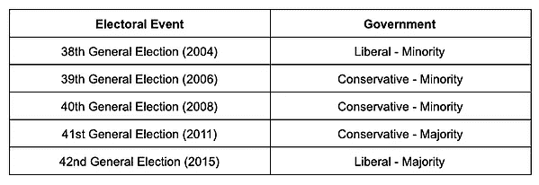
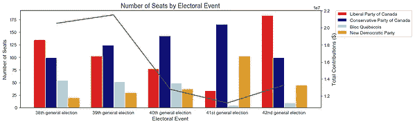
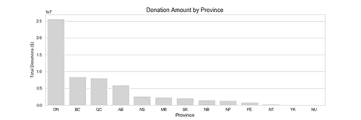
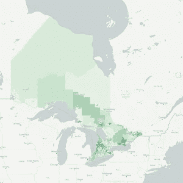
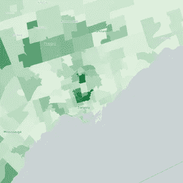
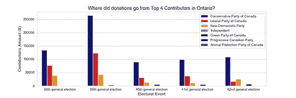
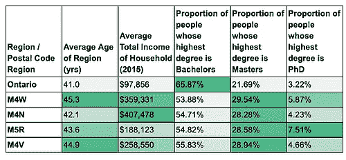
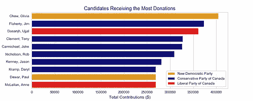
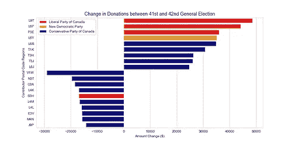

# 关于联邦选举，竞选捐款告诉了我们什么？

> 原文：<https://towardsdatascience.com/what-do-campaign-contributions-tell-us-about-the-federal-election-b4156a21e869?source=collection_archive---------36----------------------->

随着加拿大第 43 届联邦选举即将结束，我们在 ThinkData Works 的工作人员很好奇，从专家那里退一步，分析一些数据，我们能从最近的选举中了解到什么。毕竟，使用政府数据是了解我们政府如何运作的一个很好的方式。

有几十个开放的数据来源，我们可以用来探索这个问题，但我们想主要使用加拿大选举和加拿大统计局发布的数据。总的来说，我们使用了 8 个数据集来帮助我们发现关于选举的见解:

*   2004 年 1 月至今对所有政治实体的捐款
*   加拿大所有选区当选官员汇总表(5 个数据集，每年一个)
*   2016 年人口普查概况
*   FSA 边界

首先，我们对捐款数据集进行了一些高级分析，该数据集提供了自 2004 年以来每一次活动捐款的详细信息。我们想看看哪个政党在全国和各省收到的捐款最多。铭记加拿大自 2004 年以来的执政党如下:

**哪个政党获得的个人捐款最多？**

我们有捐款数据的最早选举是第 38 届大选。我们有捐款数据的最近一次选举是 2015 年举行的第 42 届大选。从 2004 年到 2015 年，这是每个政党的捐款情况。

除了第 38 届大选之外，在所有大选中，保守党一直从普通公众那里获得最多的捐款，但这在历史上并没有导致他们组成执政党。尽管保守党在第 42 届大选中获得了 50%以上的选票，贾斯廷·特鲁多的自由党还是赢得了多数席位。

**捐款的来源和该省如何投票有关系吗？**

但是，看看哪一个政党每年收到的捐款最多，这是在给选举画上一个大的句号。为了开始了解政治的区域性质，我们想找出捐款来自该国的哪里，以及捐款总额和该省投票方式之间是否有关系。

虽然政党捐款总额总体下降，但并非所有政党都是如此。2004 年至 2015 年期间，自由党(-$5，740，388)和保守党(-$2，313，050)受独立捐款下降的影响最大。相比之下，NDP(67，795 美元)、独立党(12，329 美元)和绿党(70，413 美元)等政党同期的捐款略有增加。

在此必须指出，更深入的分析表明，个人对政党的捐款与每个政党在议会中占有的席位数之间没有关联。加拿大最大的两个政党多年来收到的独立捐款越来越少，而较小的政党却越来越受欢迎，这无疑是一个有趣的趋势！

谁是最大的贡献者，他们在哪里？

我们在 ThinkData Works 做得非常好的一件事是结合不同的开放数据源来揭示见解。所以我们决定把选举数据和人口普查数据结合起来，看看我们是否能更好地了解捐款的来源。

我们问自己的第一个问题是，哪个省总体上做出了最大的贡献，我们是否能够遍历不同的数据集，以了解对政治候选人做出最大贡献的地区的更多信息。

到目前为止，安大略省对选举候选人的贡献最大。鉴于捐款金额的重要性，让我们看看是否可以了解更多关于做出这些捐款的地区的信息。

在上面的地图中，较暗的区域表示对政党的捐款较多，而较亮的区域表示对政党的捐款较少。最黑暗的区域出现在安大略省南部。对我们的数据集进行一些快速查询后发现，在整个选举期间做出最大贡献的五个邮政编码区域中，有四个位于多伦多(邮政编码以 M4 和 M5 开头)，一个邮政编码区域位于爱德华王子岛。

在向多伦多政党捐款最多的前四个地区中，大部分捐款都捐给了加拿大保守党。

使用由加拿大选举委员会(Elections Canada)提供的捐款数据集，邮政编码区域和加拿大 2016 年人口普查提供的信息，我们能够了解到，过去为政党捐款的个人通常比加拿大人的平均年龄稍大，收入明显更高，并往往获得更高的学位。

虽然拥有更多可支配收入的人更有能力做出贡献，这可能是常识，但人口普查数据有助于我们更深入地了解这个国家的意识形态面貌。

**哪位获奖者收到的捐款最多？**

接下来，让我们把注意力转移到了解哪些选举候选人获得了最多的贡献。

根据加拿大选举委员会提供的捐款数据集，我们汇总了捐款总额(货币和非货币)，并按选举候选人对总额进行了分组。以下是在第 38 届和第 42 届大选期间获得最多捐款的候选人。

我们再一次看到，保守党主宰了这张图表。但在这些选举年中，贡献最大的候选人是邹至蕙，他是 2006-2014 年三一-斯帕迪纳市的 NDP 议员。

**在第 41 届和第 42 届大选期间，对政党的捐款发生了怎样的变化？**

我们要看的最后一件事是第 41 届和第 42 届大选之间的捐款额变化。这次选举很有意思，原因有很多，尤其是加拿大在两次选举之间经历了从保守派占多数的政府向自由派占多数的政府的转变。鉴于这种波动，我们想调查从第 41 届选举到第 42 届选举，哪些地区的捐款变化最大。下面的条形图显示了对政党捐赠金额增加和减少最多的邮政编码地区。

从这张图表中，我们可以看到，在第 41 次和第 42 次大选之间，保守党失去了大量以捐款形式提供的支持，而自由党则出现了显著增长。自由党看到来自安大略地区的捐款激增；特别是米尔顿(L9T)，布兰普顿(L6P)，大萨德伯里(P3E)。而保守党在布兰普顿(L6R)、莱斯布里奇(T1K)、卡尔加里(T3H、T3J)和奥克维尔(L6T)的支持率有所上升。

在损失的形式上，保守派失去了来自基洛纳(V1W)、布兰特福德(N3T)、爱德华王子岛(C0A)、沃恩(L4K)、巴里(L4M)、伍德布里奇(L4L、埃德蒙斯顿(E3V)、多伦多(M4N)和瓦尔-多尔(J9P)的捐款形式的支持。

**跟着钱走**

竞选和政治献金显然不一定是衡量哪个政党将领导我们国家的基准，但它们是我们民主不可否认的特征。通过分析这些丰富的数据，并将其与我们从加拿大人口普查中获得的社会经济和人口信号相结合，我们不仅可以更清楚地了解加拿大人的政治倾向，还可以了解他们的捐款情况。与任何地方的信息一样，诀窍在于找到正确的数据并提出正确的问题。

有兴趣问**美国**一些问题吗？想开始使用我们在这篇文章中使用的数据吗？请联系我们，我们希望收到您的来信。

*原载于*[*https://blog.thinkdataworks.com*](https://blog.thinkdataworks.com/what-do-campaign-contributions-tell-us-about-the-federal-election)*。*