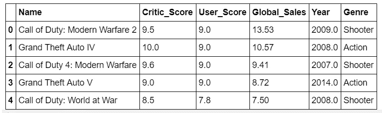
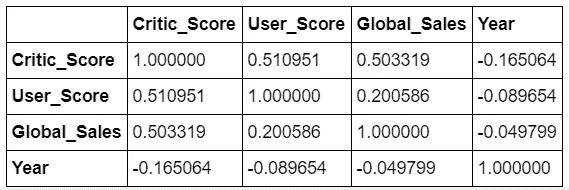
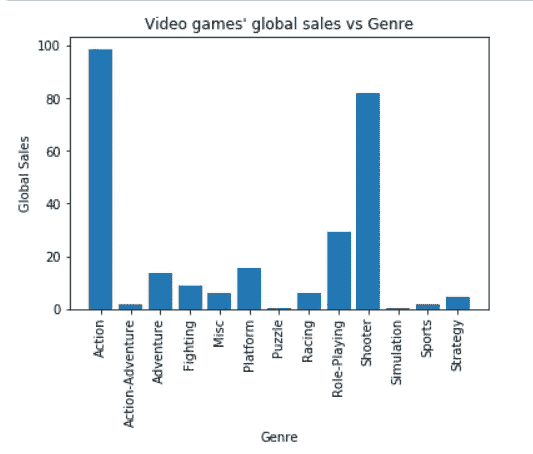
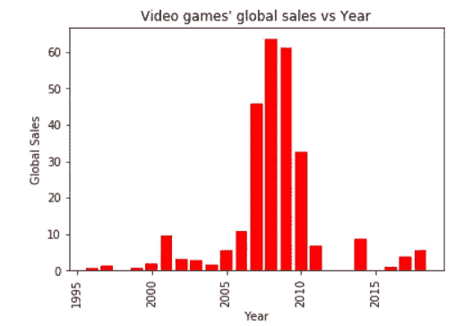
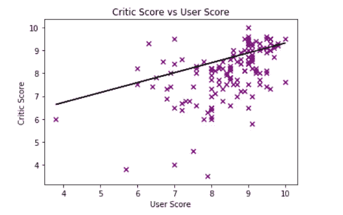
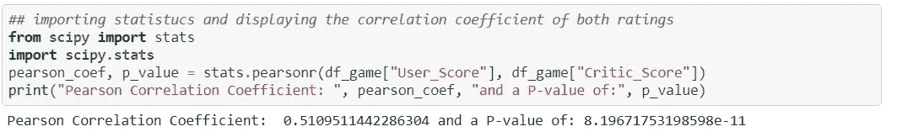
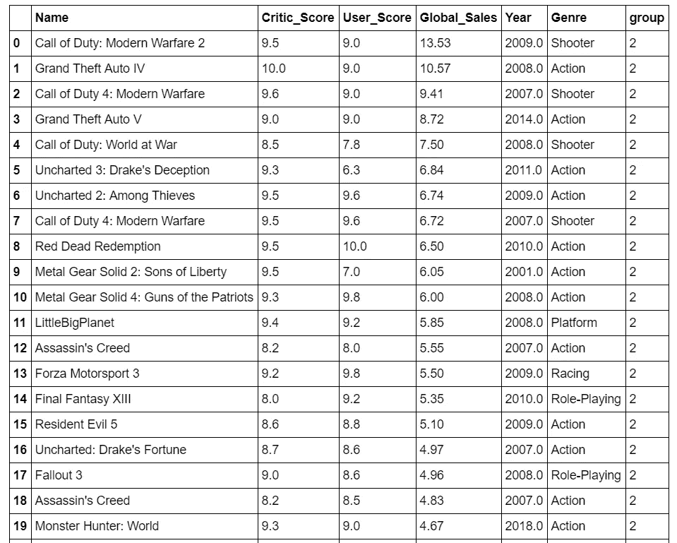
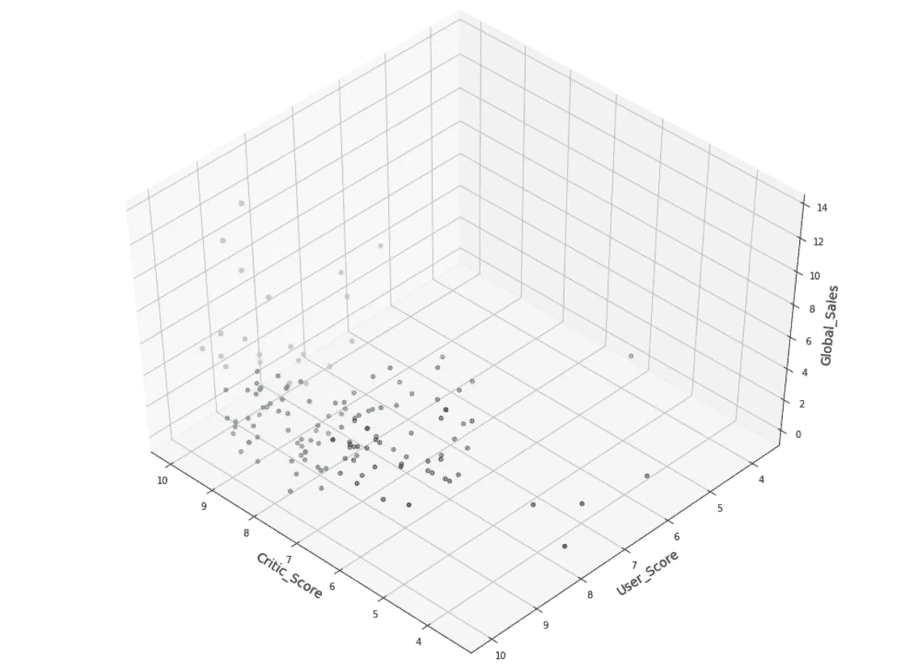
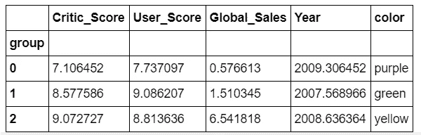

# 与全球销量相比，评论家和游戏玩家对视频游戏有什么看法

> 原文：<https://towardsdatascience.com/what-do-critics-and-gamers-say-about-video-games-compared-to-global-sales-bdf7a395e064?source=collection_archive---------13----------------------->


## 视频游戏的高销量是否意味着用户和评论家的评分更高

每年都会有从体育到冒险等多种类型的电子游戏发布。在这些游戏发布之前，粉丝们开始考虑游戏的画面会是什么样子，或者故事情节会是什么样子。

视频游戏发布了。游戏玩家去最近的游戏商店购买视频游戏。评论家发表文章提供他们对视频游戏的看法。在玩过电子游戏并对其进行批评后，每个人对它是糟糕还是表现良好都有一个大致的一致意见。

今年晚些时候，视频游戏的销售额会公之于众。对于一些游戏来说，这是有意义的，因为它们的质量无可挑剔。对其他人来说，这并不是因为他们很糟糕。因此，已经进行了一项分析，以找出评论家和游戏玩家的评级对视频游戏销售的影响有多大。

# 数据集

用于获取视频游戏销售信息的数据集是从[这里](https://www.kaggle.com/ashaheedq/video-games-sales-2019)获得的。该数据集有多个特征，但它被缩减为六个重要特征:名称、评论家评分、用户评分、全球销量、流派和年份。

然后，删除具有无效输入(如 NaN)的行，并使用下面的代码重新排列数据集:

```
df_game = df_game.dropna()
df_game.reset_index(inplace = **True**)
df_game.drop("index", axis = 1, inplace = **True**)
```

运行上面的代码后，数据集现在有 142 行和 6 列。下面是数据集前五行的快照:



The first five rows of the newly formed dataset.

评论家分数是满分 10 分，用户分数是满分 10 分，全球销售额是以百万计的，年份表示它发行的年份，而类型栏是视频游戏的类型。

# 探索性分析

对新形成的数据集进行研究，以了解数据集中不同的列是如何相互作用的。探索性分析的活动之一是相关系数表。



A correlation coefficient table showing the correlation coefficients between all the columns

该表告诉我们，在评论家得分和用户得分之间存在适度的正相关关系。评论家得分和全球销售额之间也存在这种关系。它显示了用户分数和全球销售额之间微弱的正相关关系。

然后，绘制了两个条形图来显示电子游戏的全球销售额如何随着类型和年份而变化。



A bar graph showing the video games’ global sales vs genre



A bar graph showing the global sales of video games over the years

根据这两个图表，射击游戏销量最大，约为 1 亿，2008 年是全球销量最大的一年，约为 6000 万。

## 评论家得分与用户得分

另一个目的是找出评论家是否同意游戏玩家对视频游戏的评价。因此，创建了一个散点图来显示评论家分数和用户分数如何相互关联。然后，计算 p 值。



A scatter plot of critic score vs user score



The mathematical calculation for the p-value.

查看回归线，两个变量之间如预期的那样存在适度的正关系。上图中的 p 值在 0.05 以下。因此，这两个变量之间存在显著差异。

# 数据集聚类

数据集被聚类以查看组中不同的行是如何根据其特征的数值进行分类的。因此，K-means 聚类是一种无监督的机器学习算法，用于使这一过程更容易。

数据集的行可以分成定义数量的组。游戏数据集被分成三组。将数据集分组后，每一行都被赋予一个数字 0、1 或 2。

然后，一个名为 group 的新列被添加到带有数字 0、1 和 2 的数据集中。



The first twenty of rows of the clustered dataset

# 结果呢

构建了一个三维散点图来清晰地描绘用户评分、评论家评分和全球销售额之间的关系。下面是三维图像的示意图:



A 3-d scatter plot of the clustered dataset.

这三组的数据点被染成紫色、黄色和绿色。聚类数据集中标记为 0 的组被染成紫色，而标记为 1 和 2 的组分别被染成绿色和黄色。

就全球销售额而言，黄色数据点的大部分数据最高。绿色第二高。紫色的最高。

由于无法从图表中直接看到数字差异，因此创建了一个表格来显示它们的平均差异。



根据表格，黄色组的平均得分最高，为 9.07 分。绿色以平均 8.57 分位居第二，紫色以 7.11 分位居第三。

然而，当涉及到用户评分时，结果却大相径庭，绿色团队的平均评分为 9.09。黄队和紫队分别得了 8.81 分和 7.73 分。可以准确地说，视频游戏的销量越高，平均来说影评人的分数就越高，但平均来说用户的分数并不越高。

**用于构建这个聚类模型的完整版本代码可以在这里**[](https://github.com/MUbarak123-56/DataBEL/blob/master/VIDEO%20GAME%20SALES%20AND%20CRITICS'%20SCORES.ipynb)****看到。****