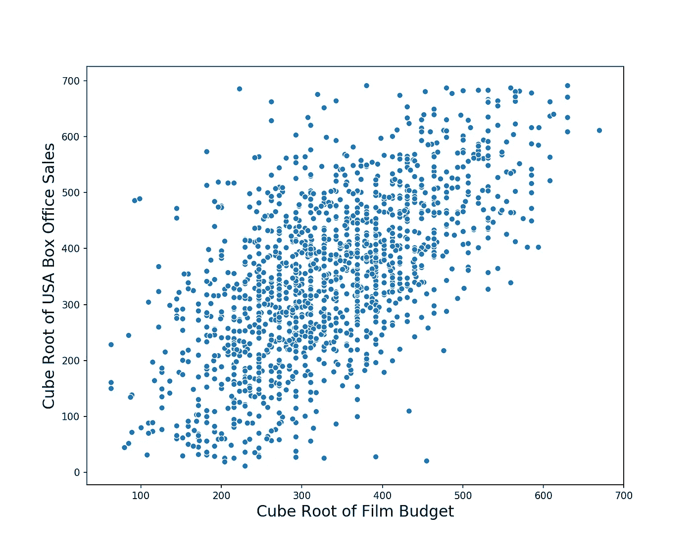

# 数据科学家是做什么的？

> 原文：<https://towardsdatascience.com/what-do-data-scientists-do-13526f678129?source=collection_archive---------10----------------------->

Photo by [rawpixel.com](https://www.pexels.com/@rawpixel?utm_content=attributionCopyText&utm_medium=referral&utm_source=pexels) from [Pexels](https://www.pexels.com/photo/person-using-phone-1927509/?utm_content=attributionCopyText&utm_medium=referral&utm_source=pexels)

## 试图阐明一个模糊的领域和职业

我最近完成了一个数据科学训练营，并开始在一家金融科技初创公司担任数据科学家。很明显，我很高兴又能找到有收入的工作了。

但是自从我开始工作以来，我注意到了一件事，那就是很多人，包括我爸爸(嗨，爸爸！)问我，“什么是数据科学，你具体做什么？”

通常，我会让他们看看我的博客，但是我意识到我以前从来没有写过这个。我写了大量关于特定数据科学和机器学习概念的文章，但我从未亲自定义这个职业和行业对我意味着什么。所以让我们现在就纠正这一点。

# 什么是数据科学？

首先声明，我绝不是数据科学专家。虽然我有相当多的统计和定量研究经验，但我认为自己在数据科学领域还是个新手。但这是一个自由的国家，所以我仍然可以给我的 2 美分！

让我们从世界认为数据科学是什么开始:

*   利用人工智能预测未来。
*   建立一个令人敬畏的机器学习模型，它可以接收大量看似毫无价值的数据，并产生价值连城的见解。
*   让汽车自动驾驶。
*   自动生成书籍、绘画或[电子音乐](https://medium.com/@leesurkis/how-to-generate-techno-music-using-deep-learning-17c06910e1b3)。

虽然其中许多都有一定的真实性(伴随着大量的夸张和一点讽刺)，但数据科学并不总是那么迷人。通常情况下，**我们的工作是帮助人们更好地经营他们的企业。我将数据科学定义为:**

> 使用量化数据产生商业见解，以帮助您的公司赚更多的钱。

我知道你在想什么——托尼真是个资本家。但最终，大多数数据科学家(以及其他定量分析师)受雇从事的工作是寻求销售更多的小工具或增加客户参与度或减少用户流失。即使是很酷的研究项目，归根结底也是为了提高他们所属的公司或大学的知名度和品牌(思想领导力这个词如今被抛得太多了)。

Photo by [rawpixel.com](https://www.pexels.com/@rawpixel?utm_content=attributionCopyText&utm_medium=referral&utm_source=pexels) from [Pexels](https://www.pexels.com/photo/person-using-phone-1927509/?utm_content=attributionCopyText&utm_medium=referral&utm_source=pexels)

# 帮助这个人赚更多的本杰明

因此，根据你对资本主义社会的看法，你可能会也可能不会乐于听到数据科学家都在推动增长或优化底线(利润)。

我的意思是，除非你是一名教师或消防员或社会工作者，那么你的角色很可能就是帮助你的老板赚更多的本杰明。我认为，优秀的数据科学家平均来说比其他工作职能更能影响他们工作的公司。让我解释一下为什么(也解释一下数据科学家是做什么的)。

# 那个“啊哈”时刻

你是否曾经在 Excel 电子表格中，将你的目标变量(你试图解释或预测的东西)与你能得到的每一个特征进行散点图绘制？就在你对找到与你的目标相关的东西失去希望的时候，你看到了类似下面的关系并大喊，“啊哈！”

Strong correlations are the nectar that every data scientist needs in order to survive

这是两个变量之间强有力的正相关关系(相关性)的一个例子(应用立方根变换使它们线性)——散点图显示，你在电影上花的越多(就电影预算和营销而言)，就越有可能在票房上赚到大钱。当然，给你的摄制组全权委托，让他们想花多少就花多少是愚蠢的(注意，目标变量是收入，而不是利润)；但在看到这个之后，我们知道，除非我们凭借独立病毒式的成功赢得大奖，否则总的趋势是:

> 要么做大，要么回家！

在数据中找到这些类型的关系是任何定量分析师的目标，包括数据科学家。那么，为什么我说数据科学家可能有更大的影响力呢？

如果我们针对我们的目标逐个手动绘制每个特性，或者运行简单的线性回归，那么遍历一个庞大的特性集将会花费很长时间。如果我们气馁并放弃，我们可能永远也到不了那个“啊哈”时刻。

**数据科学家利用自动化和通用算法梳理尽可能多的数据，寻找有趣的统计关系**——这增加了击中“啊哈”时刻的概率。

Photo by [rawpixel.com](https://www.pexels.com/@rawpixel?utm_content=attributionCopyText&utm_medium=referral&utm_source=pexels) from [Pexels](https://www.pexels.com/photo/person-using-phone-1927509/?utm_content=attributionCopyText&utm_medium=referral&utm_source=pexels)

# 非结构化数据

数据科学家的另一个优势是对隐藏在非结构化数据中的信号的**欣赏**(如 Reddit 评论、推文、图像或博客帖子)**以及从所有伴随的噪音中分离出这些信号的能力**。

想想看，**潜在有用的数据无处不在**。如果仅仅局限于我们公司决定存储在其数据库中的内容，那将是一种耻辱。

因此，数据科学的很大一部分是寻找“人迹罕至”类型的特征，为您提供分析优势。这些可以是多年来辛苦收集的专有数据集(想想脸书、谷歌、亚马逊、腾讯和网飞)。它还可能以一种前所未有的方式使用现有数据(例如[霍林格的球员效率评级](https://en.wikipedia.org/wiki/Player_efficiency_rating)，现在是每个定量篮球分析师工具包的一部分，完全是根据现成的得分数据计算出来的)。

数据科学家在寻求区分数据时常用的一些方法包括:

*   网页抓取。
*   将多个数据集拼接在一起，形成一个自定义的、功能更强大的功能集。
*   [降维](/the-curse-of-dimensionality-50dc6e49aa1e) ( [PCA](/understanding-pca-fae3e243731d) ，话题建模等。)将所有非结构化数据转换成可用的格式。
*   上 Kaggle(开个玩笑)。

# 关于算法和模型

请注意，到目前为止，我们几乎没有提到任何关于机器学习算法或统计模型的内容。虽然了解算法(如[神经网络](/understanding-neural-networks-19020b758230)或 XGBoost)的工作方式及其优势和局限性很重要，但**构建和运行模型只会占用数据科学家很小一部分时间**。

**更多的时间花在定义问题和方法、收集数据和清理数据上**(将会有大量这样的工作)。是的，有博士科学家从事最新和最前沿的研究，但不幸的是，我们不可能都是吴恩达。我们其余的人继续受雇于他和其他人的研究，并为他们找到有用的、有价值的应用。

所以如果你问我——对算法了如指掌和对公司的行业和产品了如指掌，哪个更重要，我会说是后者。

通常情况下，最好的算法和第二好的算法之间的性能差异并不大。因此，如果我们在 XGBoost 会产生更好的结果时选择[逻辑回归](/understanding-logistic-regression-using-a-simple-example-163de52ea900)，这是可以的。

但是如果我们不知道如何问正确的问题，结果浪费了大量的时间和资源试图解决不存在的问题，那就不好了(我们可能会被解雇)。因此，了解算法，但真正了解业务。

# 结论

我希望你喜欢我对数据科学家工作的漫谈。我真的很高兴能成为这个令人兴奋的领域的一部分。如果你有任何关于作为一名数据科学家工作的想法想要分享，请留下评论。干杯！

***更多数据科学与分析相关帖子由我:***

[*数据科学家挣多少钱？*](/how-much-do-data-scientists-make-cbd7ec2b458)

[*数据科学家面临自动化的风险吗*](/is-the-data-science-profession-at-risk-of-automation-ae162b5f052f)

[*拿到了数据科学的工作？*](/got-data-science-jobs-552e39d48da2)

[*了解 PCA*](/understanding-pca-fae3e243731d?source=post_page---------------------------)

[*了解随机森林*](/understanding-random-forest-58381e0602d2?source=post_page---------------------------)

[*理解神经网络*](/understanding-neural-networks-19020b758230?source=post_page---------------------------)