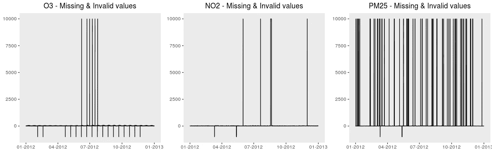

# 缺失的价值观背后隐藏着什么

> 原文：<https://towardsdatascience.com/what-do-missing-values-hide-behind-them-40b5406f7495?source=collection_archive---------23----------------------->

Toronto Downtown. Free edition of an image at [ISO Republic](https://isorepublic.com/photo/toronto-sunset/) under CC0 license

当然，我会一直说我很幸运登陆了安大略省的[环境开放数据门户](http://www.airqualityontario.com/history/index.php)，因为我在那里找到了一个非常有价值的关于多伦多及其周边地区的空气质量的信息来源，有完整的可下载信息，以 csv 文件的形式免费提供。当然，很好的练习数据。但是当我第一次以电子表格的形式打开这个门户网站的 csv 文件来看一看这些信息时，我意识到了这些奇怪的值:9999 和-999 什么…？如文件头中所述，这些分别是无效数据和缺失数据。好了，是时候面对数据分析的真相了，没有完美的数据集！

缺失值的问题是每个数据分析师必须面对的最常见的问题之一，也是无效数据的问题。通常，丢失的值只是 csv 文件中分隔符之间的空格，而一旦导入数据，就必须“手动”检测无效值，大多数情况下是异常值。我再次感到处理这些数据集很幸运，因为这些异常值已经被编码，显然，我不应该注意它们。

不管我们怎么想，丢失的值可能是一个有价值的信息来源，问题只是要注意它们何时出现，并观察模式以揭示它们隐藏了什么。让我们再次考虑 2012 年多伦多市区空气质量分析。对于所研究的三种污染物，改变异常值代码之前的原始数据如下图所示。由于三种污染物的水平值范围在 0 到 100 之间，所以很容易在图中看到异常值。

从这些情节中我们能看出什么？

*   NO2 和 PM25 具有相同的缺失值
*   PM25 有 78 个无效值周期。他们中的大多数只采取了一个连续措施，是 9 个连续无效措施中最长的一个。
*   另一方面，NO2 只有 4 个无效测量时段，然而其中一个时段(8 月)有 61 个连续无效测量。
*   4 个 NO2 缺失值时段中有 3 个与 PM25 的缺失值时段同时开始。
*   关于 O3 的异常值，鉴于其规律性，我们可以看到如此怪异的行为。连续无效值之间的差值始终为 183。两个第一次观测值之间的间隔，在图中似乎更大，是 266 刚好是双精度！
*   连续缺失值之差始终为 366。两组缺失值之间的间隔是 1526，这是一个不能被 366 整除的数，所以这次我们在某些方面失去了规律性。

在这一点上，数据分析师的好奇心应该会出现，提出许多问题来阐明这些见解，并从中获得有价值的知识。

但所有这些缺失值都不适合处理，因为事实上它们是不适合数据分析这样精确的科学的未知信息。一旦我们理解了它们，我们需要对它们执行一些操作，以便能够最好地分析这些数据并获得最准确的结果。要采取的行动将取决于它们的用途和意义，考虑到这个过程可能会影响随后的结果。

可以使用许多策略来转换缺失值:将所有值都置为 0，将它们设置为数据集中该属性的所有值的平均值或中值，或者只是最接近的值；使用机器学习算法来预测它们的值；诸如此类。您甚至可以考虑更激进的解决方案来克服缺失值，只需删除包含它们的行，但是这种策略不适合时间序列分析，因为所有的值都应该被告知。通常情况下，删除丢失的值并不是最好的主意，因为这样做最终可能会丢弃有用的信息，所以请记住，无论您的策略是什么，您都应该小心谨慎，考虑所有选项，并了解每个选项将如何影响您的数据以及结果。

数据集中缺失的值是不可取的，但是它们可以为我们提供有价值的信息。在理解了它们的性质和存在的原因之后，我们需要对它们采取一些行动，以便正确地执行所需的分析。