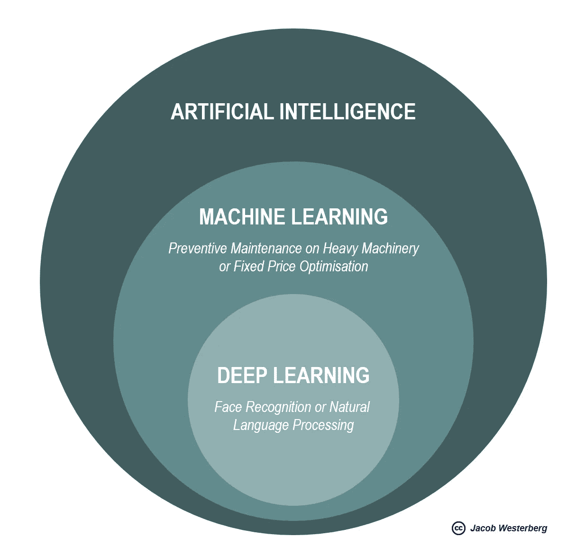

# 如何看待人工智能

> 原文：<https://towardsdatascience.com/what-do-you-know-about-artificial-intelligence-cd91cd3946dd?source=collection_archive---------31----------------------->

## 人工智能是否已经到了让你失业的边缘？你应该担心吗？或者你应该立即解散整个企业吗？

现在是 2020 年。你和你最好的朋友带着笔记本电脑坐在你家的餐桌旁。你最近经常坐在那里，为一家正在合作的初创公司调整软件。一分钟前，你们都在欢呼，但有些事情改变了气氛。你低头看着笔记本电脑的键盘，慢慢地移动手指来修饰几分钟前你疯狂按下的键。你们都在问自己——我们能做到吗？成千上万的人可能会失业。我们想对跨国家和大洲的大规模失业负责吗？

这听起来可能像科幻小说中的场景。但未来几十年，许多采用人工智能(AI)的企业家将面临这种困境和许多其他道德困境。

> “工厂的自动化已经大量减少了传统制造业的工作岗位，人工智能的兴起可能会将这种工作岗位的破坏延伸到中产阶级，只剩下最有爱心、最有创造力或最具监管力的角色。”(斯蒂芬·霍金)

# 什么是人工智能？

首先，人工暗示它不是自然的；它是人造的。智能意味着它能解决复杂的问题。在这方面，做一些区分是有帮助的。

**狭义 AI** 是人类迄今为止实现的唯一一种人工智能形式。从本质上来说，狭义人工智能擅长执行一个预先定义的任务，并设定一个目标。例如下棋、提出结账购买建议、在语言之间进行翻译或者建议在脸书上的特定照片中标记哪个朋友。因此，狭义人工智能在执行日常工作方面表现出色，这也是威胁当今许多工作的原因。自然，几个狭窄的人工智能可以结合起来，朝着一个共同的目标努力，例如，在人口稠密的城市中自动驾驶汽车导航。

**通用 AI** 是人类级别的人工智能。它能理解，推理，做决定。然而，尽管人工智能在过去的几年里取得了很大的进步，我们仍然不知道我们什么时候能够实现通用的人工智能，如果可能的话。也许我们没有足够的智慧去创造它。该领域的杰出科学家对我们何时能够实现人工智能的预测，从十年后到本世纪内都有。然而，每个人都同意，此后会发生什么很难预测。未来的发展可能会像我们以前从未见过的那样迅速。可能会很恐怖。人类将不再是地球上的思想领袖。

> 第一台超智能机器是人类需要制造的最后一项发明，只要这台机器足够温顺，能告诉我们如何控制它(尼克·博斯特罗姆，牛津大学人类未来研究所创始人)

今天，机器学习和深度学习风靡一时，但这些与人工智能有什么关系？从根本上说，机器学习是人工智能的子集，深度学习是机器学习的子集。

**人工智能可以解决复杂问题，模仿人类行为**。这包括基于多个模型和规则的编排做出复杂的决策。把人工智能看成一个综合的概念。

## **机器学习是人工智能的一个子集，与计算统计和数学优化密切相关**。

通过机器学习，数据科学家正在让计算机在没有明确编程的情况下采取行动。计算机装载了大量的数据。然后，应用各种技术，如线性回归或决策树，来开发最佳算法，以预测、回答或指导某个问题。换句话说，系统已经学会根据过去的例子预测未来。然而，这需要数据科学家与系统进行交互，并提供关于寻找什么的见解。

## **深度学习是使用多层神经网络的机器学习的子集**

多层神经网络的灵感大致来自于我们对人脑的理解。深度学习模型能够在更大程度上学习专注于正确的功能，几乎不需要程序员的指导。这使得深度学习在识别物体、声音和理解书面语言的上下文方面非常有效。举个例子，人脸识别现在已经到了机器和人类一样有能力或者比人类更有能力的地步。

# 结局是什么？

想象你和你的朋友回到了餐桌旁。然而这一次，桌子上没有了电脑，年份也不再是 2020 年。相反，还有第三个参与者，詹姆斯·瓦特。1781 年，你刚刚发明了第一台产生连续旋转运动的蒸汽机。在接下来的 100 年里，它将变得强大 1000 倍，并成为引发工业革命的重要因素，导致各国和各大洲大规模失业。

你想为此负责吗？我想你会的。试图阻碍技术进步就像试图用耙子把水推上山。每个人都需要适应；另一种选择是被抛在后面。

此外，历史告诉我们，人类能够一次又一次地重新创造自己在社会中的角色。200 年前，农业雇佣了 90%的美国人口，今天这个数字不到 2%。此外，在 1930 年，伟大的英国经济学家约翰·梅纳德·凯恩斯写了一篇乐观的后大萧条时期的文章，名为《我们子孙后代的经济可能性》。然而，在这篇文章中，凯恩斯担心会出现“技术失业……因为我们发现节约劳动力的方法的速度超过了我们发现劳动力新用途的速度。—您可能已经注意到，这种情况并没有发生，相反，我们比以往任何时候都更加努力。

希望就像应用机器学习的系统可以使用过去的例子来预测未来一样，我们可以回顾过去，并确信我们会找到新的方式来度过我们的时间，因为旧的工作由于自动化而变得过时。否则，我们将迫切需要一种新的经济模式。因为，如果劳动和价值完全脱节，资本主义将会让我们大失所望。

最终，尽管计算能力和数据存储发展迅速，但人工智能颠覆行业和世界仍需要时间。一些人认为人工智能是人类的末日，另一些人认为这是解决人类今天面临的一些最重大挑战的唯一方法。双方可能都是对的。只有时间能证明一切。

> “任何可以产生比人类更聪明的智能的东西——以人工智能、脑机接口或基于神经科学的人类智能增强的形式——都毫无疑问地成为最能改变世界的东西。其他的甚至都不在一个联盟里。”(机器智能研究所联合创始人埃利泽·尤德科夫斯基)