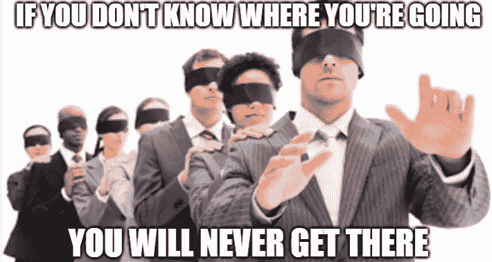
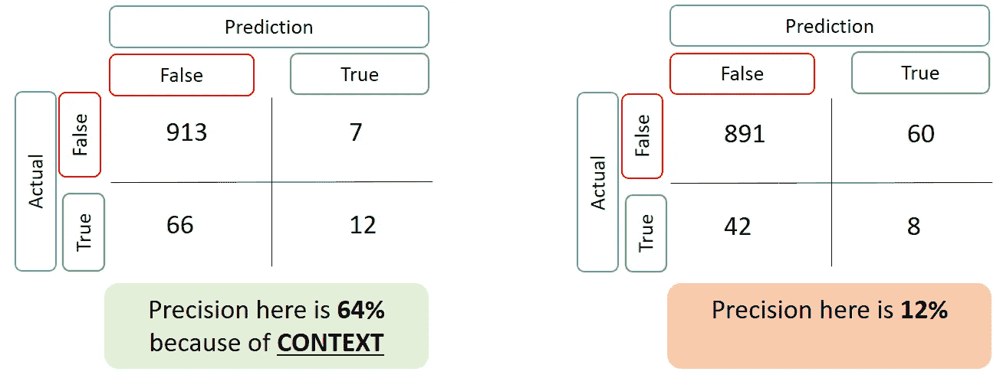

# 成为一名优秀的数据科学家需要什么？

> 原文：<https://towardsdatascience.com/what-do-you-need-to-be-a-data-scientist-fc864f42841c?source=collection_archive---------20----------------------->

## 商业合作:环境是王道

每天早上，我都会收到关于刚刚发布的新工作规范的提醒。他们都在谈论机器学习和统计，能够用 Python，R，SQL，Spark 等语言编码，等等。现在大约 25%的玻璃门广告甚至说你需要一个博士或硕士学位。

具备良好的机器学习基础和编码能力，以便能够从数据中梳理出信息，这是先决条件。但是硕士还是博士？如果我看看我的经历，以及和我一起工作的成功人士，我会完全不同意那些教育要求。那么你真正需要的是什么？

灵活性和改变认知的能力。

首先，也是最重要的，你需要能够与企业沟通，了解他们的问题。你需要能够以一种对他们有意义的方式来构建它，并给你一个明确的目标。

original image Credit: TheWeek

第二，你需要能够深入细节，并运用你对不同问题的不同方法的知识。

*   我是在为 EDA 做聚类，还是直接预测，还是需要解释行为？
*   我如何为控制测试设计一个合适的测试组？
*   我如何为这个问题创建一个 ETL？
*   在这里设置机器学习可能会面临哪些挑战？

在这样做的同时，你需要着眼于大局。我想解决什么？如果你不这样做，那么你很容易陷入一个细节层次，这会让你的交付慢如蜗牛，让你的团队成员和利益相关者沮丧。

Credit: LSAGlobal

这里有帮助的实际上是定期与你的利益相关者会面。提交更新会推动你朝着总体目标前进，但随着你在问题上的进展，会在稍微更详细的层次上。这也有助于将你看到的东西联系起来。你的利益相关者每天都生活和呼吸着这个业务。他们会知道你发现的是标准还是洞察力。你的利益相关者可能会质疑你，告诉你这是胡说八道。有时候他们是对的，有时候你需要坚持自己的立场，让他们相信这是回答他们问你的问题的方法。这并不容易，但它会帮助你引导和关注接下来的步骤。但是要到达这里，你需要

*   缩小细节，
*   以一种他们能理解的水平展示他们的见解，
*   然后听听他们怎么说，这样你就可以测试和/或实现它。

在这个简短的示例中，您可以看到一个高效的数据科学家是如何从高层次开始，深入细节，再回到高层次，然后再回到细节的。

当然，数据科学家需要具备询问数据的编码技能，以及选择正确方法的统计技能，但对我来说，这是与利益相关者的业务合作和互动，是需要的第三个支柱。我不认为这里需要博士或硕士学位。

现在有大量的数据可供我们使用，随着[*HBR 引用的*](https://hbr.org/2012/10/data-scientist-the-sexiest-job-of-the-21st-century)*跟随我们，有大量的人成为数据科学家。然而，*并不完全是技术元素。我听过同事说*“我不需要理解数据，算法会替我做的。”对我来说，这是完全错误的态度。这导致过度拟合和模型结果不佳——伪相关性或关联过程作为预测因素。这不仅仅是理论上的，我已经看到了它的发生，它会给企业带来糟糕的结果。不信，看下面…***

***语境的力量***

*下面是两个模型的结果。两者都有稀少的发生率(左边 7.8%，右边 5%)。我将结果缩放为每 1000 个客户，并显示了模型结果的缩减，为了公平比较，召回率为 16%。由于召回率较低，我的目标客户是这里的顶级客户，因此需要高精度。*

*对于左边的模型，我与企业进行了交流，了解了客户交互并构建了适当的变量。右边是 Kaggle 数据集，我无权访问该业务，也不在我的领域内。*

**

*左边模型的结果可以让我很确定地锁定最有可能的客户。从样本来看，右手边仍然比机会好 2 倍以上，但是成功的可能性比左手边低得多。*

*更具体地说，如果这两种情况都是客户流失的情况，并且我提供折扣来减少客户流失，右边的模型将意味着仍然为 88%不需要折扣的客户提供折扣，而左边的客户只有 36%。*

*我已经看到许多硕士或博士数据科学家进来，不想参与业务，这并不令我惊讶。他们在一个非常特定的领域投入了大量的时间独自工作，他们希望在他们感到舒适的地方工作。不幸的是，这通常不是与利益相关者交谈。*

*为什么我如此有灵感写这篇关于这个主题的文章？因为我担心在数据科学上已经有了很大的投入，当然这是有预期回报的。如果这个机会被浪费了，我担心它会导致分析的失败，因为信任被烧掉了。George Roumeliotis 在他的 [Cargo Cult 数据科学文章中精彩地描述了这一点。](https://www.linkedin.com/pulse/cargo-cult-data-science-george-roumeliotis)*

*你需要的核心技能可以在网上学习，也可以通过实践磨练。然而，软技能同样重要，可以通过与企业的互动来学习，使你能够将数据联系起来，并能够讲述你正在工作的故事。*

*对我来说，发展的下一步必须是数据业务合作伙伴的增长。*

*你怎么想呢?请在评论中让我知道…*