# 微调后的 BERT 模型关注什么？

> 原文：<https://towardsdatascience.com/what-does-a-fine-tuned-bert-model-look-at-2eb39b6868dd?source=collection_archive---------11----------------------->

试图理解通过微调 BERT 模型学习的特征和模式

Photo by [Katarzyna Pe](https://unsplash.com/@kasiape?utm_source=medium&utm_medium=referral) on [Unsplash](https://unsplash.com?utm_source=medium&utm_medium=referral)

*注:此内容是我在 2019 年 Analytics vid hya data hack 峰会上的讲话的一部分。*

最近有很多关于 NLP 的讨论，特别是在迁移学习技术的进步和像 transformers 这样的架构出现之后。作为一个来自机器学习应用领域的人，我觉得不仅在许多基准测试中拥有可以超越最先进结果的模型很重要，拥有可信任、可理解而不是完全黑盒子的模型也很重要。

这篇文章试图理解 BERT 在特定任务训练中的学习。让我们从注意力是如何在一个转换器中实现的，以及如何利用它来理解这个模型开始(如果你已经知道了，请随意跳过这一部分)。

# 立正！立正！

变压器使用自我关注在每一层对其输入序列的表示进行编码。有了自我注意，输入序列中的所有单词都有助于当前标记的表示(编码)。

让我们来看看这个来自[贾勒马的博客](http://jalammar.github.io/illustrated-transformer/)的例子(我强烈推荐阅读他的博客来更深入地了解变形金刚)。这里你可以看到单词“思考”(Z1)的表示是由句子中其他单词(在本例中是“机器”)的贡献形成的。每个单词对当前单词的贡献强度由注意力分数(Softmax 分数)决定。它类似于每个单词给出其自身的一部分，以形成当前单词的完整表示。

Source: [http://jalammar.github.io/illustrated-transformer/](http://jalammar.github.io/illustrated-transformer/)

强度可以被推断为句子中的单词与当前单词的语义关联。例如，单词“它”在下面变形金刚中的注意力层的可视化中，具有来自单词“动物”的更高的贡献。这可以被推断为单词“它”的共指解析。这种行为为变形金刚提供了上下文表示/编码。

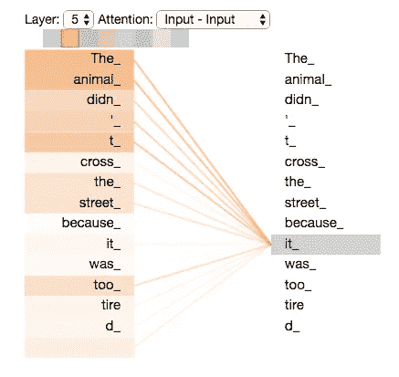

Inferring association between tokens using attention. source: [http://jalammar.github.io/illustrated-transformer/](http://jalammar.github.io/illustrated-transformer/)

这些贡献强度(注意力分数)可以用来理解标记之间的关联，从而也可以用来理解变形金刚的学习。这正是我们在这篇文章中要尝试的。我们将尝试理解由转换器学习的特定于任务的特性。

# 特定于任务的功能:

报纸——伯特在看什么？今年早些时候发表的 (Clark et al .，2019)讨论了通过 BERT 模型自学的各种语言和共指模式。说明了语法敏感行为是如何从自我监督训练中产生的。这让我很好奇，并想在对一项任务进行微调后，尝试对伯特学习的特定任务特征进行类似的研究。

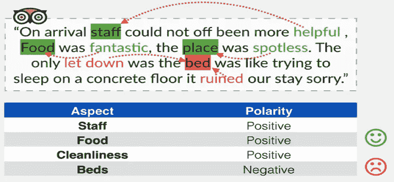

Example of Aspect based sentiment analysis — Source: [https://medium.com/seek-blog/your-guide-to-sentiment-analysis-344d43d225a7](https://medium.com/seek-blog/your-guide-to-sentiment-analysis-344d43d225a7)

## 手头的任务:

我们将在这里使用的微调任务是一个基于[方面的情感分析](https://monkeylearn.com/blog/aspect-based-sentiment-analysis/)任务，设计为一个问题回答/多类分类问题。这种方法受到了论文 T5 的启发(孙等，2019)。通过这种将情感数据集转换为问答对的方法(如下所示)，作者能够在 SEMEVAL [数据集](http://alt.qcri.org/semeval2014/)上获得最先进的结果。

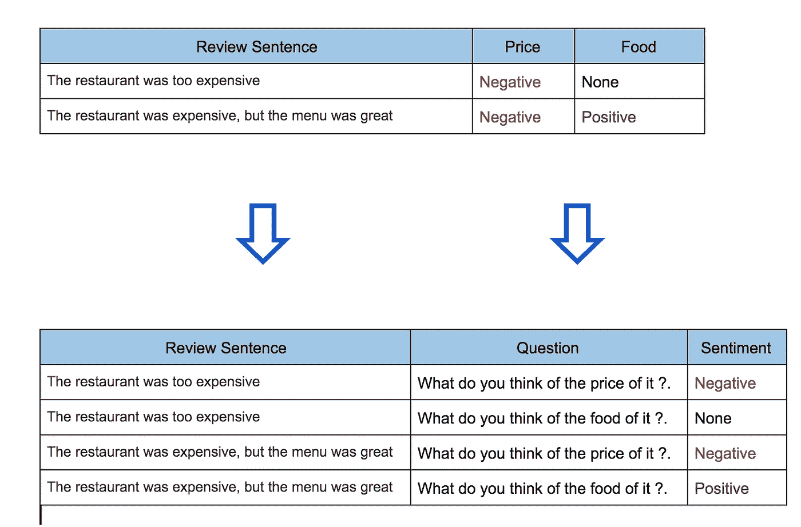

Aspect-based sentiment analysis as QA — [https://arxiv.org/pdf/1903.09588v1.pdf](https://arxiv.org/pdf/1903.09588v1.pdf)

我使用 huggingface 的 [transformers](https://github.com/huggingface/transformers) 库在 SEMEVAL 2014 数据集上微调了一个基于 BERT-base 的无案例模型，并使用 [bertviz](https://github.com/jessevig/bertviz) 可视化了注意力地图。

# 特定任务的学习:

在这里，我列出了一些有趣的模式，这些模式是我通过探索经过微调的 BERT 模型的注意层而观察到的，

1.  ***方面头—方面词理解*** :

我注意到，标题 9-8 主要关注评论中与方面相关的词，这些词对应于问题中的方面(下图中的词“服务”从词“服务员”获得了非常高的关注度)。在大多数情况下，所讨论的体词(左侧)在评论中具有来自体词(右侧)的更高贡献。所以这可以被认为是一个方面头。

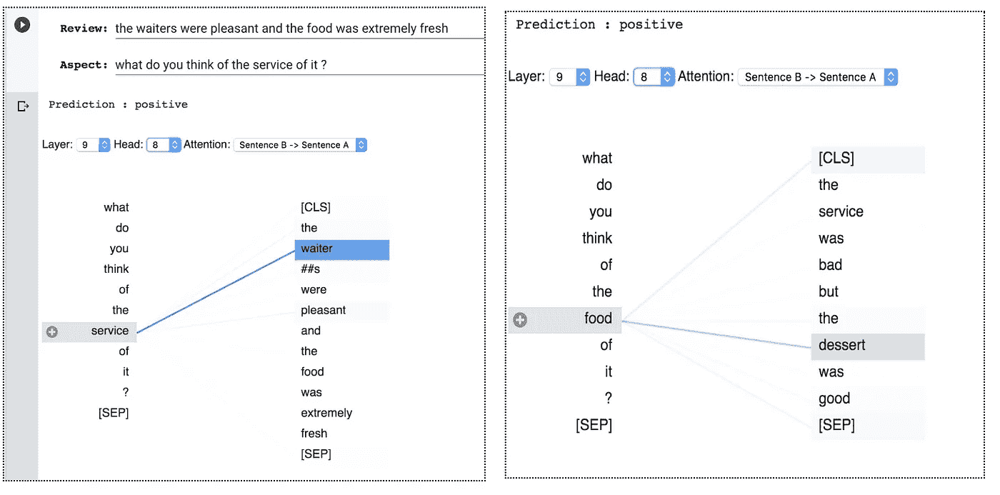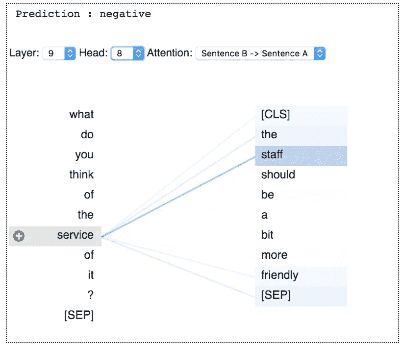

**②*。体貌-情感中心词-体貌词及相关情感词理解:***

在这里，我们可以看到标题 9-0 的例子主要集中在与问题相关的方面词及其相应的情感词上。

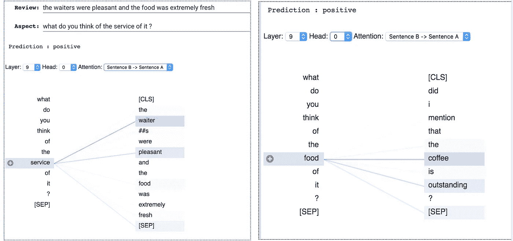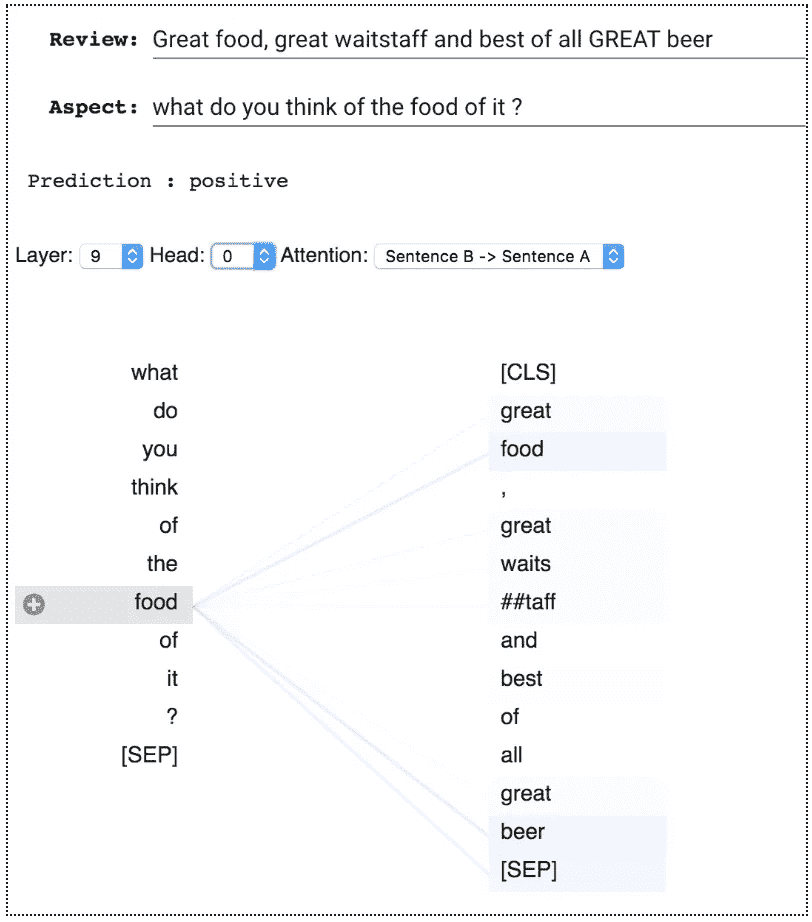

***3。短语级关注方面和情绪:***

我还观察到，有些人在评论中关注的是谈论问题相关方面的完整短语。

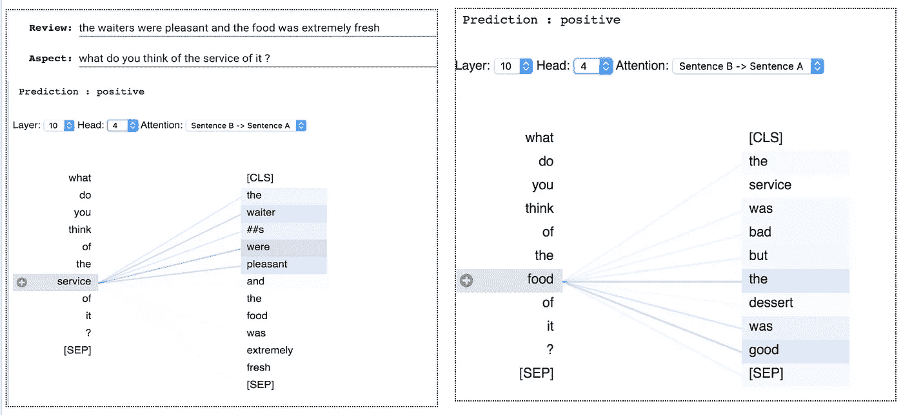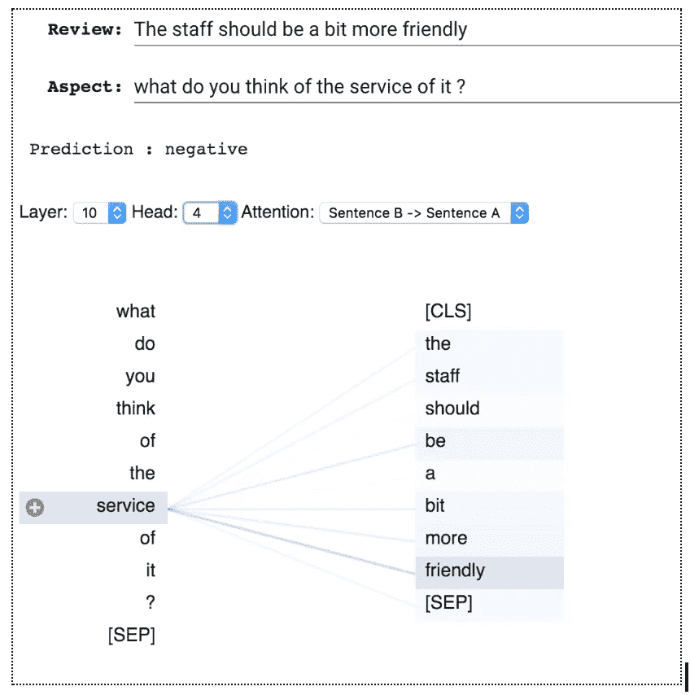

**4。⑩对反面:**

令人惊讶的是，第 10-3 题主要关注的是另一个方面以及问题中没有的相关词汇。这里我们可以看到，当所讨论的方面是“服务”时，head 关注与“食物”相关的词，反之亦然。

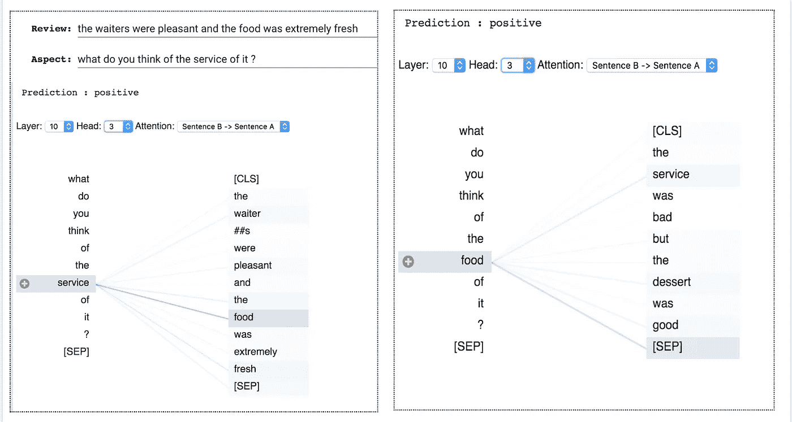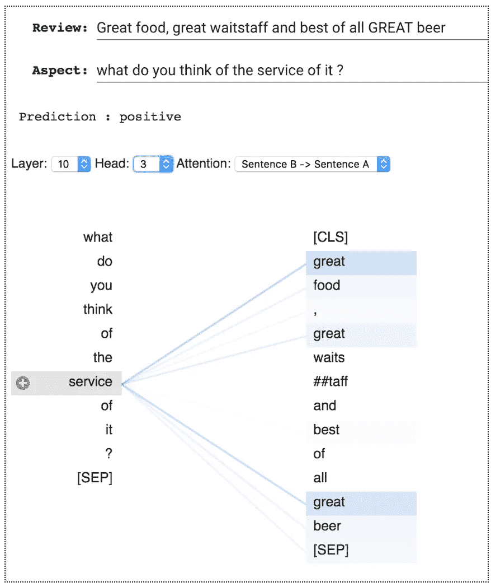

***5。审查中感兴趣方面的缺失—无操作:*T3**

当评审中没有提到某个方面时。头部关注[SEP] token。作为指示特征缺失(No-Op)的方式，被指定提取缺失特征的头部集中在[SEP]标记上。这个观察结果与论文的发现一致——[伯特看什么？](https://arxiv.org/pdf/1906.04341.pdf)(克拉克等，2019)。

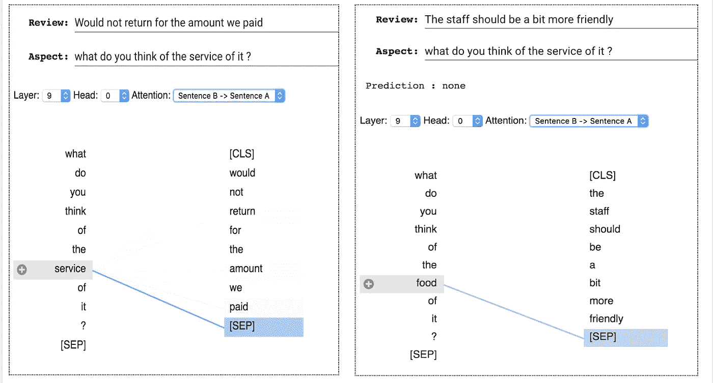

# 进一步的步骤:

1.  尽管我们到目前为止所看到的头部在大多数情况下都注意到了特定的特征，但也有头部没有注意到那些预期特征的例子。因此，对每个头部及其处理假设特征的能力进行更正式的研究(通过测量单个头部的准确性，类似于 Clark 等人，2019 年)将非常有趣。

# 代码:

1.  特定任务的学习—[https://colab . research . Google . com/drive/1 P4 HW HSO-bv 5 VW 8 pkdsqperet 507 kglr 3](https://colab.research.google.com/drive/1P4HWHso-bV5vW8pKDSqPERet507KGlr3)
2.  语言学和句法学习—复制 Clark 等人的结果 2019—[https://colab . research . Google . com/drive/1z5W-jgtybffbiwzbio 73 z 0 oiwtefzjyo](https://colab.research.google.com/drive/1z5W-JGtYBFfbIWZbIO73z0oIWtEFZJYO)
3.  我在 https://github.com/infinitylogesh/Interpretable-NLP-Talk DHS 2019 的演讲幻灯片—

# ***参考文献:***

1.  凯文·克拉克，乌尔瓦希·汉德尔瓦尔，奥默·利维和克里斯托弗·d·曼宁，[伯特在看什么？伯特注意力分析](https://arxiv.org/abs/1906.04341) (2019)。
2.  [图示变压器](http://jalammar.github.io/illustrated-transformer/)
3.  拥抱脸的[变形金刚](https://github.com/huggingface/transformers)库
4.  伯特维兹。