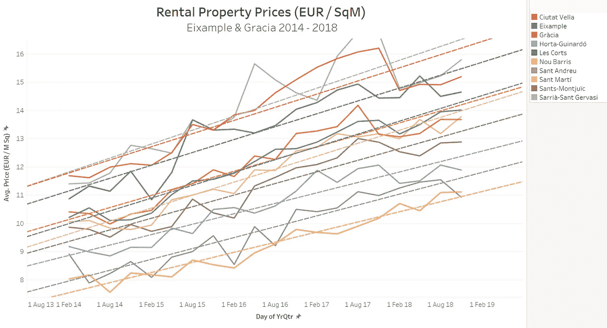
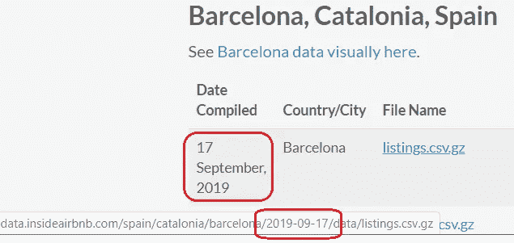
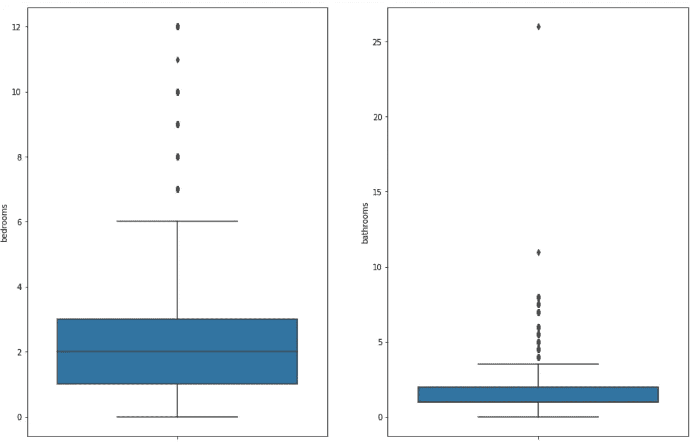
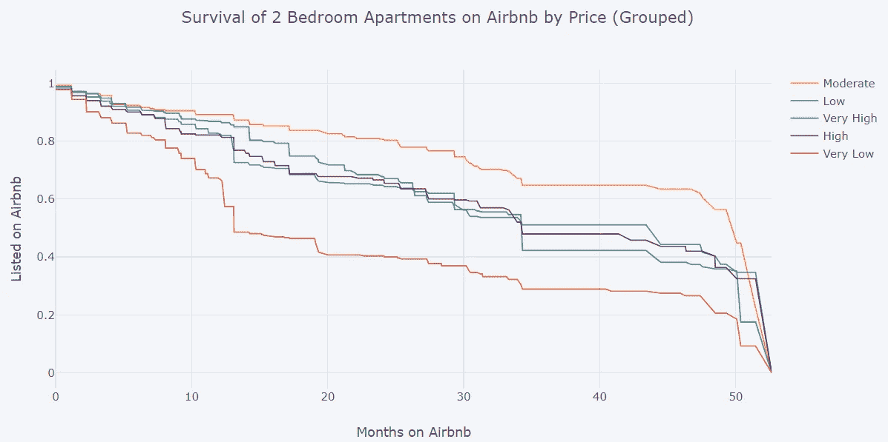
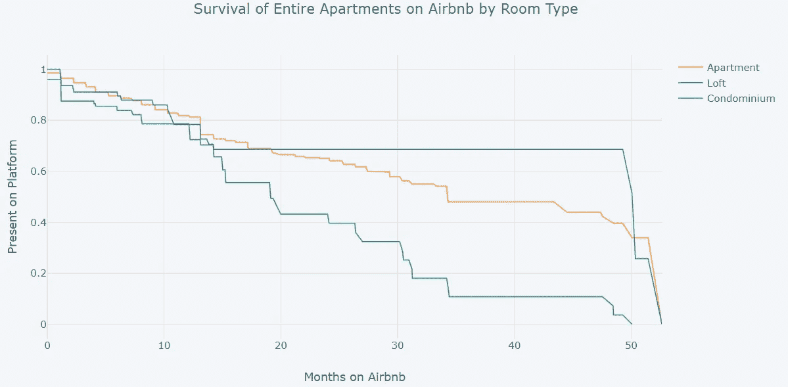
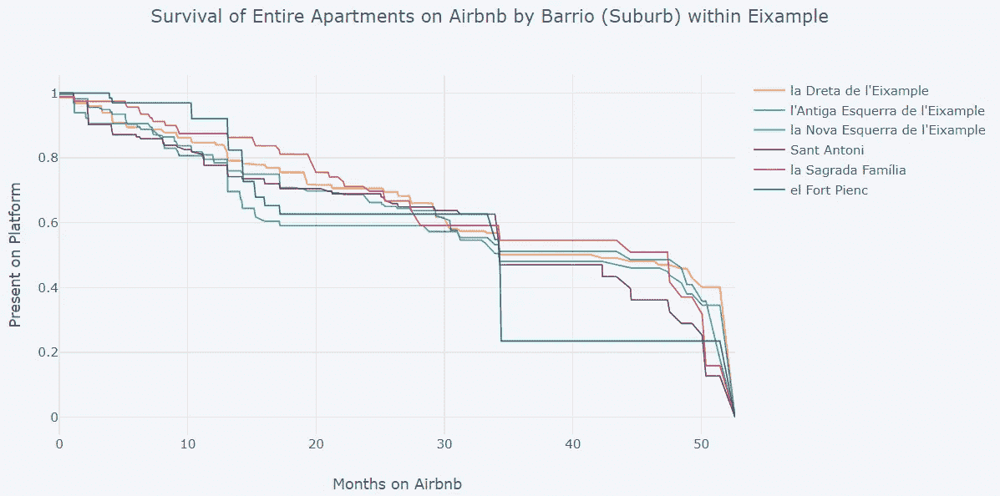
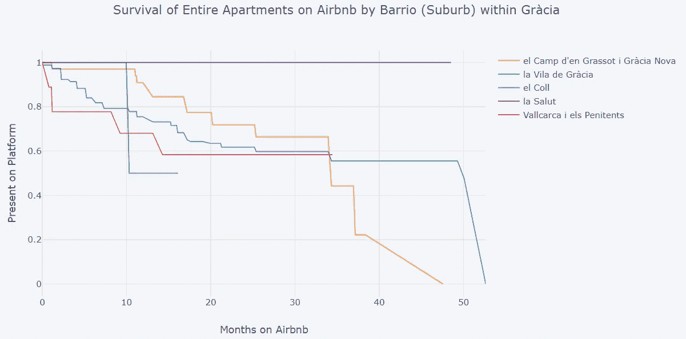
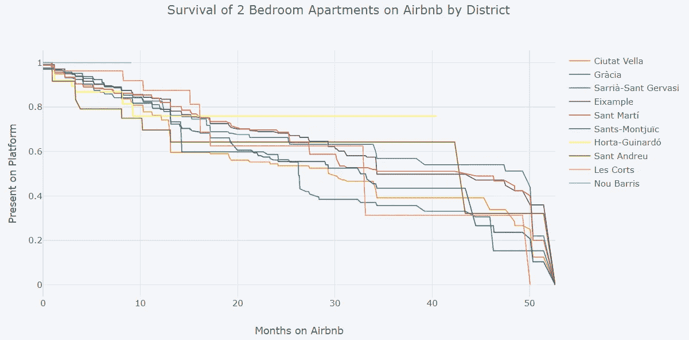

# 巴塞罗那的公寓如何才能成为“幸存者”？

> 原文：<https://towardsdatascience.com/what-does-it-take-for-an-apartment-in-barcelona-to-be-a-survivor-10e0ad337672?source=collection_archive---------29----------------------->

## 使用生存分析发现影响西班牙巴塞罗那一个受欢迎的短期租赁平台上的两居室公寓寿命的因素。

有人说巴塞罗那的房地产市场存在泡沫。这包括商业和住宅物业。

住宅物业市场有两个主要部分，迎合不同的观众。这些是短期租赁(一个晚上到 11 个月)和长期租赁(一年以上)。

Airbnb 是最知名的短租平台之一。几乎每个和我交谈过的城市居民都有关于 Airbnb 上市公寓的看法和/或故事。鉴于关于这个平台和上面列出的公寓有这么多说法，一个更具分析性的调查是有必要的。

在深入探讨这个话题之前，有必要对长期住宅房地产市场多了解一点。价格始终是衡量需求的一个很好的指标，因此，了解这些类型的房产在最近几年的平均租金价格可能会有所帮助。

什么东西上去了，就一定会下来？

这部分调查的第一站是[开放数据 BCN](https://opendata-ajuntament.barcelona.cat/data/en/dataset/est-mercat-immobiliari-lloguer-mitja-mensual) 。幸运的是，该网站提供了过去 4 年来全市每个郊区(或街区)的平均租金信息。这些数据通过使用“每平方米价格”指标进行了标准化。

数据以 CSV 文件形式提供，每年一个文件(2014–2018)。这些文件是手动下载的，因为该网站有一个动态链接(这意味着它们不能用 Python 脚本抓取)。

下载后，每个 CSV 都被列在一个数据帧中——在导入与这个项目相关的库之后。

```
#Libraries
from functools import reduce
import numpy as np
import pandas as pd
import matplotlib.pyplot as plt
import seaborn as sns#Load CSV files into dataframe
file_name = ‘{}_lloguer_preu_trim.csv’
df = pd.concat([pd.read_csv(file_name.format(i)) for i in range(2014, 2019)])
```

在探索性数据分析中有许多步骤，但这都是从将数据帧标题从加泰罗尼亚语(加泰罗尼亚语，巴塞罗那位于其中)重命名为英语开始的。下一步识别空值，这些值被丢弃，因为不能使用其他方法插入/更新/估计。该流程还发现“测量”列中提供了两种不同的指标。出于此分析的目的，确定了每平方米的租赁价格，并用于过滤和创建新的数据框架。

```
df_sqm = df.loc[(df[‘Measure’] == ‘Lloguer mitjà per superfície (Euros/m2 mes)’) ]
```

然后将干净的数据帧导出到 CSV，以便在 Tableau 中制作图表。在导入时，很明显 X 轴所需的季度(如年份和季度)维度有问题。通过使用以下公式创建新的计算字段，解决了此问题:

```
MAKEDATE([Year], 
IF [Qtr] = 1 THEN 2
ELSEIF [Qtr] = 2 THEN 5
ELSEIF [Qtr] = 3 THEN 8
ELSEIF [Qtr] = 4 THEN 11
END ,1)
```

既然有了合适的时间轴，就有可能绘制出每个地区的租金价格图。下图显示了 2014 年至 2018 年各区的平均租金价格(每平方米欧元)。



Annual Average Rental Prices (per SqM) for All Districts in Barcelona 2014–2018

相关性高得惊人——然而，鉴于唯一的变量是时间和价格，不可能得出任何结论，因为任何城市的租赁市场都受其他因素的影响。

**“挂帽子的地方”**

现在是时候把我们的注意力转向短期租赁市场了——也就是 Airbnb 上列出的房产。幸运的是，有一个网站定期抓取 Airbnb 房源，并把数据放到网上。 [Insideairbnb](http://insideairbnb.com/get-the-data.html) 有 39 个列表抓取文件，时间跨度远至 2015 年 4 月。这些数据文件非常全面——幸运的是，它们以一致的命名惯例发布，这意味着它们可以使用 [W Get](https://pypi.org/project/wget/) 自动下载，只需在网上搜索一下就能获得准确的名称。



Path for file download consistent with date scraped, as listed

感兴趣的文件的 URL 被添加到一个名为*ibnbdts*(YYYY-MM-DD 格式)的列表中，删除了重复的内容。然后一次下载一个感兴趣的文件，解压缩并作为数据帧作为值添加到字典中。相应的键是来自 *ibnbdts* 列表的元素。

```
#url = ‘[http://data.insideairbnb.com/spain/catalonia/barcelona/{}/visualisations/listings.csv'](http://data.insideairbnb.com/spain/catalonia/barcelona/{}/visualisations/listings.csv')
#folder = ‘./InsideBNBdetailedListing/{}/’
#[wget.download(url.format(i), folder.format(i)) for i in ibnbdts]
```

完成后，研究形状并确定列标题。考虑到列的数量，我们决定创建一个较小的数据框架，只包含感兴趣的列。

```
df_filtered = df_ibnb[[
 ‘id’,
 ‘last_scraped’,
 ‘neighbourhood_cleansed’,
 ‘neighbourhood_group_cleansed’,
 ‘latitude’,
 ‘longitude’,
 ‘property_type’,
 ‘room_type’,
 ‘bathrooms’,
 ‘bedrooms’,
 ‘beds’,
 ‘price’,
 ‘import_dt’]]
```

采取了以下其他步骤来过滤和清理数据:

1.  识别不同的房间类型。只有“整个住宅/公寓”房产是感兴趣的，其他的都被过滤掉了。
2.  选择并过滤感兴趣的属性类型，在本例中为“公寓”、“阁楼”、“公寓”。
3.  通过 map 使用 lambda 函数将 price (per night)列(当前是一个字符串)转换为浮点数。
4.  创建箱线图以查看卧室和浴室数量的分布。



Box & Whisker to See Spread of Number of Bedrooms and Bathrooms

5.过滤掉既没有两间卧室，也没有 1.5-2 间浴室的房产。

6.从该过滤的数据帧中移除重复项(在第一次按 property_id (id)升序和在平台上的最后出现日期(作为字符串)降序排序(‘import _ dt’)之前)。

经过滤的数据帧(在如上所述的去重之前)用于创建新的细长数据帧(df_slim)，其将仅包含平台上的 property_id (id)和最后出现日期(作为字符串)(‘import _ dt’)，这些分别按升序和降序排序。

然后，使用自定义函数将字符串导入日期转换为日期时间字段，并应用。

```
def strtodate(row):
 ‘’’
 Input: String in format YYYY-MM-DD
 Output: Correspdining Datetime

 The purpose of this function is to convert a string to datetime, so that timedeltas can be calculated on them.
 ‘’’
 return datetime.strptime(row[‘import_dt’], ‘%Y-%m-%d’)df_slim_stg[‘scrape_dt’] = df_slim_stg.apply(strtodate, axis = 1)
```

然后使用 group by 创建一个更小的子集，每个属性(id)只出现一次，它们出现的最小和最大日期是两个单独的列。

```
df_slim = df_slim_stg.groupby(‘id’).agg({‘scrape_dt’ : [np.min, np.max]})
```

然后创建一个新的列，以确定该属性在平台上是否仍然有效。

```
def mostrecent(row):
 ‘’’
 Input: Date
 Output: 1 if date matches 17 September 2019 or 0 if it does not

 This will help to determine if the property is still active on the platform.
 ‘’’
 if row == datetime.strptime(‘2019–09–17’, ‘%Y-%m-%d’):
 return 1
 else:
 return 0df_slim[‘stillactive’] = df_slim[‘scrape_dt’][‘amax’].apply(mostrecent)
```

然后使用自定义函数和 apply 计算该物业在平台上列出的天数。

```
def daysonline(row):
 ‘’’
 Input: First Date and Last Dates that the property was seen on the platform
 Output: Number of days

 This will help to determine how long the property is/ was listed on the platform for.
 ‘’’
 return row[‘scrape_dt’][‘amax’] — row[‘scrape_dt’][‘amin’]df_slim[‘days_online’] = df_slim.apply(daysonline, axis = 1)
```

然后，在删除列(id 加倍)和重命名之前，合并纤细的和过滤的数据帧。

接下来，干净的数据框架需要将价格(作为浮动值)归一化，以便可以使用平均值的+/-1.5 标准偏差来过滤异常值。

```
#Normalize the new ‘priceUSD’ column for analysis
# Create variable x and pass in the float verion of column ‘priceUSD’
x = df_final[[‘priceUSD’]].values.astype(float)# Create a minimum and maximum processor object
min_max_scaler = preprocessing.MinMaxScaler()# Create an object to transform the data to fit minmax processor
x_scaled = min_max_scaler.fit_transform(x)# Append the normalised values within a new column in the dataframe.
df_final[‘priceNORM’] = pd.DataFrame(x_scaled)#First find values that are UNDER 1.5 Standard Deviations of the mean
indexNames = df_final[ df_final[‘priceNORM’] < (np.mean(df_final.priceNORM, axis=0) — ( 1.5 * np.std(df_final.priceNORM, axis=0)) ) ].index
df_final.drop(indexNames , inplace=True)#Second find values that are ABOVE 1.5 Standard Deviations of the mean
indexNames = df_final[ df_final[‘priceNORM’] > (np.mean(df_final.priceNORM, axis=0) + ( 1.5 * np.std(df_final.priceNORM, axis=0)) ) ].index
df_final.drop(indexNames , inplace=True)
```

一个新的方框图，显示剩余的价格数据。

```
fig, ax = plt.subplots(1,2, figsize = (15, 10)) #columns and rows, number of axes, figure size 
sns.boxplot(y = df_final.priceUSD, ax = ax[0])
```

现在价格正常化了，为了便于解释生存曲线，它们将被组合在一起。

```
 df_final[‘price_band’]=pd.qcut(df_final[‘priceUSD’],q=5, labels = [‘Very Low’,’Low’,’Moderate’,’High’,’Very High’])df_final['price_band']**=**pd.qcut(df_final['priceUSD'],q**=**5, labels **=** ['Very Low','Low','Moderate','High','Very High'])
```

将日期时间字段转换为整数，以便可以执行计算。

最近计算的“在线天数”值需要转换为月数。

```
def days2month(row):
 ‘’’
 Input: Numerical value which is assumed to be days
 Output: Corresponding numner of months

 The int/ float input (days) is divided by 365 then multiplied by 12.
 ‘’’
 return ((row[‘days’]/365)*12)df_final[‘months’] = df_final.apply(days2month, axis = 1)
```

然后将生成的数据帧导出到 CSV 格式，以便在另一个 Jupyter 笔记本文件中使用生存分析进行分析。

**生存分析**

生存分析需要定义一个自定义函数。

```
def survival(data, group_field, time_field, event_field):
 kmf = KaplanMeierFitter()
 results = []
 for i in data[group_field].unique():
 group = data[data[group_field]==i]
 T = group[time_field]
 E = group[event_field]
 kmf.fit(T, E, label=str(i))
 results.append(kmf.survival_function_)
 survival = pd.concat(results, axis=1)
 front_fill = survival.fillna(method=’ffill’)
 back_fill = survival.fillna(method=’bfill’)
 smoothed = (front_fill + back_fill) / 2
 return smoothed
```

生存分析的结果提供了一些有趣的图表。

创建了三个数据集:
1 .Airbnb 上曾经列出的 2 卧室、1.5-2 浴室公寓的总人口(2015 年 4 月-2019 年 9 月)。
2。1 的子集(如上)，过滤为仅包含 ei example
3 中的公寓。1 的子集(如上)，过滤为仅包含 Gràcia 的公寓

随后生成了以下图形(绘图)。



Impact of Price Band on Survival Rate



Impact of Property Type on Survival Rate



Differing Survival Rates Amongst Properties in Eixample



Differing Survival Rates Amongst Properties in Gràcia



Differing Survival Rates Amongst Districts in Barcelona

总而言之，巴塞罗那的两居室公寓中，价格适中的公寓在 Airbnb 平台上停留的时间最长。这意味着这些公寓将不会出现在长期租赁市场上；因此，这部分市场的供应减少，这似乎(至少部分)导致了该市长期租赁价格的不断上涨。