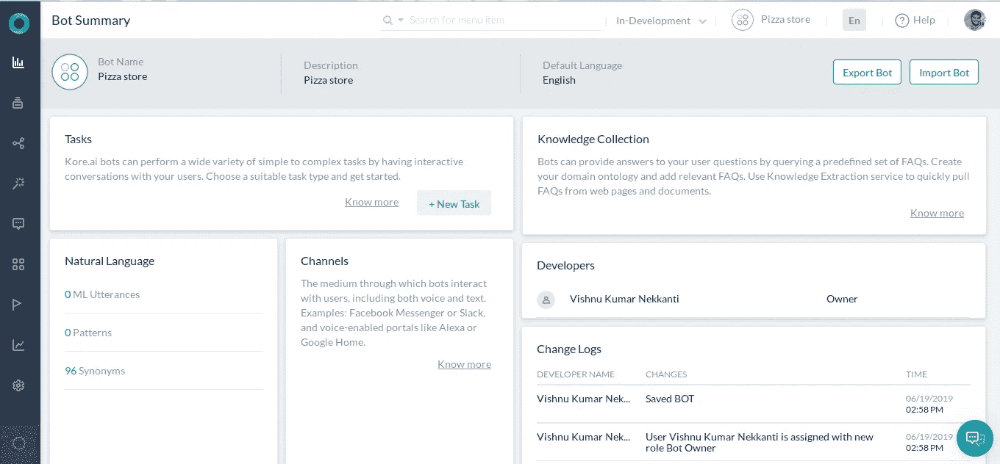
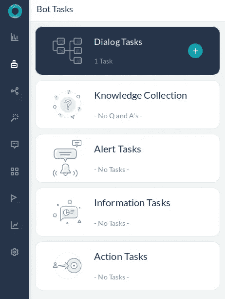
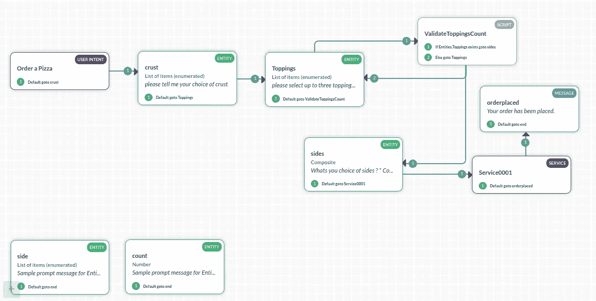
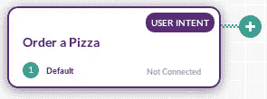
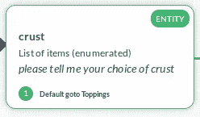
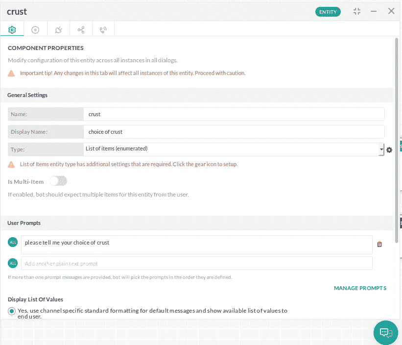
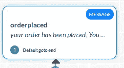
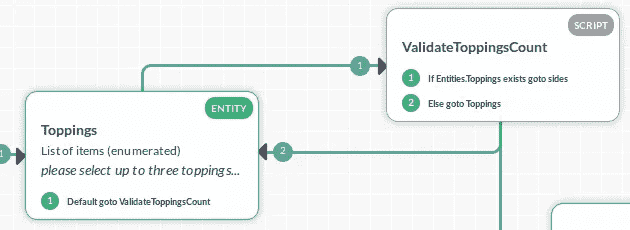
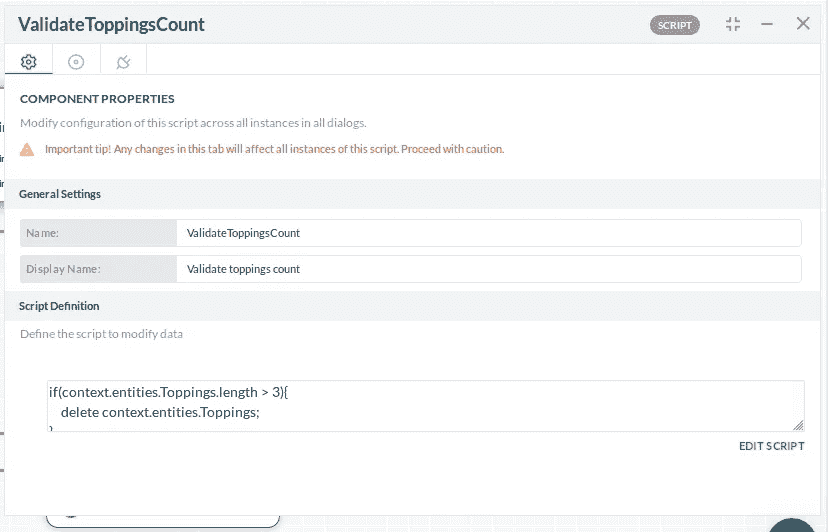
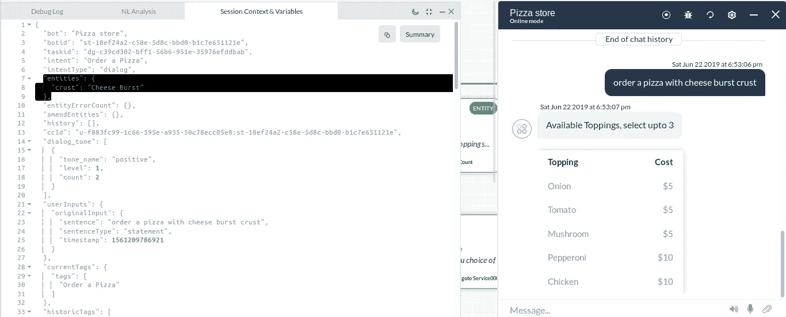

# 为你的应用程序构建一个聊天机器人需要什么？

> 原文：<https://towardsdatascience.com/what-does-it-take-to-build-a-chat-bot-for-your-application-f59c2ed074e5?source=collection_archive---------14----------------------->

## 利用 Kore.ai 机器人平台构建可大规模工作的智能聊天机器人。

你可能已经花了数小时来构建具有最佳应用内用户体验的应用，但当涉及到构建市场上最新、最热门的功能时，你就做不到了——一个可以与消息应用、电子邮件、语音助手、IVR 和许多其他渠道集成的对话界面。

现在怎么办？，你应该开始研究建立对话代理吗？你应该思考什么？…..

实际上很多。举几个例子来说，你必须考虑很多——让我们考虑你的应用程序可以为“外卖”订购一个比萨饼并检查订单的状态。

1.  (意图检测)如何弄清楚用户对 bot 说了什么。也就是说，如何理解用户是想要下订单、检查订单状态还是其他什么(这在这个玩具例子中听起来很简单，但是当你的应用程序可以执行几十个动作时就变得复杂了)
2.  (实体检测)如何提取对应用程序执行操作所需的信息。例如，在用户话语“我想点一份比萨饼，边上有鸡肉、洋葱配料和两杯可乐”中，外皮是什么？，浇头是什么？，有哪些方面？等等
3.  (实体验证)如何验证用户提供的信息。例如:日期、货币、数字、项目等
4.  如何在执行操作时处理来自用户的中断。例如，在完成“下订单”的对话之前，如果用户询问“我的 Id 为 ABCD 的订单状态如何”
5.  (渠道整合)我如何整合这个机器人与脸书或 Alexa 或谷歌助理等？
6.  你如何分析与用户失败的对话？
7.  你如何认证用户？
8.  如何有条件地控制对话？。例如，如果用户提供了无效的浇头数量，如何通知他并要求不同的首选浇头？
9.  我如何让它适用于多种语言？

如此等等…

在我们继续下去之前，你可能想让我停下来，指出一些平台，如 Luis、Dialog Flow、IBM Watson 等。当然，他们可以帮助你解决第一个问题，解决一点第二个问题，解决有限的第三个问题，解决很少的第五个问题，但是请记住，一个好的聊天机器人还需要满足很多要求。你可以有一个很棒的团队来构建机器人的其余部分，代价是什么？…以大量时间为代价。理想情况下，您会希望在不影响质量和功能的情况下，尽可能缩短“上市”时间。这需要一个已经解决了所有问题的工具——Kore . aibots 平台，这是一个对话平台，使您能够为数百个用例构建和管理对话机器人。

# 和其他平台有什么不同？

就像其他平台一样，Kore.ai 也解决了第一、第二和第三个问题。还有上面提到的每一点，还有更多。该平台提供了构建和管理机器人所需的完整开发工具包，而不必为机器人构建单独的后端服务。更容易给你看，让我们跳进平台，建立玩具机器人。如果您需要更多信息或帮助，请参考位于[https://developer . Kore . ai/docs/bots/chatbot-overview/chatbot-overview/](https://developer.kore.ai/docs/bots/chatbot-overview/chatbot-overview/)的文档

# 披萨店机器人

比方说，你有一家比萨店，人们可以点外卖一个比萨，可以选择饼皮、多达 3 种配料和一些配菜。您构建了一个人们可以在线订购的应用程序(假设您有这个程序)。现在让我们为这个比萨饼店建立一个机器人，在那里人们可以订购一个比萨饼带走，选择外壳，浇头和侧面，它还应该能够在被询问时检查订单的状态。

首先在 [https://bots.kore.ai](https://bots.kore.ai) 注册/登录。点击创建一个机器人，并给它一个名字，选择语言(现在让我们用英语)，让机器人类型是标准的(检查每个类型的意思在后面的文档)。现在，你将登陆这样一个机器人详细信息页面

Bot details page

浏览这个页面，然后在左边的菜单中进入机器人任务。在 bot 任务页面中，您将看到几个可以创建的 bot 任务类型

Types of Bot Tasks

对于我们的玩具机器人，我们将集中于对话任务，这些任务将用户和机器人之间的完整对话流表示为有向图。这有助于您设计涉及条件动作的复杂对话，例如，在“订购比萨饼”任务中，比萨饼上允许的最大浇头数是 3，您可以检查这一点，并通知用户重新选择，而无需您的后端应用程序参与。

现在让我们创建两个对话任务:

1.  “订购比萨饼”，允许用户订购比萨饼的外壳，浇头和方面的选择。
2.  “查看订单状态”，可以查看已下订单的状态。

让我们先看看完成的“订购比萨饼”对话框，然后看看它是如何构建的(我将提供详细文档的链接，对于玩具示例可以忽略这些链接，但以后一定要查看它们)

Order Pizza Dialog

看到这个，你的第一个想法应该是“图中的节点是什么？”。嗯，这些被称为对话组件，Kore.ai 平台提供了几种类型的对话组件，让我们简单看看它们是什么:

*   **意图节点**(用户意图)——与用户意图相关联的节点，即“订购比萨饼”是一个意图。当 Kore NLP 引擎识别出一个意图时，它对应的意图节点被触发(通常是一个对话任务的根节点，我说“通常”是因为它也可以作为一个非根节点存在，我们将在后面的文章中讨论)。因此，如果用户意图是“订购比萨饼”，则触发“订购比萨饼”对话任务中的“订购比萨饼”意图节点。你可以在[https://developer . Kore . ai/docs/bots/bot-builder-tool/dialog-task/working-with-the-user-intent-dialog-node/](https://developer.kore.ai/docs/bots/bot-builder-tool/dialog-task/working-with-the-user-intent-dialog-node/)了解更多信息

Intent Node

*   **实体节点** —向用户请求实体(如果用户尚未提供)的节点，例如:日期、时间、号码、电话号码等。除了系统自动验证的系统实体类型之外，您还可以选择一些非常有用的自定义实体类型，如 string、custom/RegEx、Composite、“枚举值列表”和“查找值列表”。你可以在[https://developer . Kore . ai/docs/bots/bot-builder-tool/dialog-task/working-with-the-entity-node/](https://developer.kore.ai/docs/bots/bot-builder-tool/dialog-task/working-with-the-entity-node/)了解更多信息

Entity Node

Entity Node Properties

*   **确认节点** —该节点是实体节点的特例，被配置为明确提示用户确认并识别用户的是/否意图。您可以在[https://developer . Kore . ai/docs/bots/bot-builder-tool/dialog-task/working-with-the-message-confirmation-nodes/](https://developer.kore.ai/docs/bots/bot-builder-tool/dialog-task/working-with-the-message-confirmation-nodes/)了解更多信息
*   **消息节点** —顾名思义，该节点向用户传递消息。需要注意的一点是，对于向用户发送消息的所有节点(实体、确认和消息),您可以添加机器人可以发送给用户的多个备选消息，还可以在特定通道上配置特定消息，例如，对于消息节点“orderplaced ”,您可以配置机器人发送“您的订单已下”或“全部完成，您的订单已下”。你可以在 10 分钟内到我们店里取你点的菜。”对于在脸书频道上聊天的用户和其他频道的不同消息。您可以在[https://developer . Kore . ai/docs/bots/bot-builder-tool/dialog-task/working-with-the-message-confirmation-nodes/](https://developer.kore.ai/docs/bots/bot-builder-tool/dialog-task/working-with-the-message-confirmation-nodes/)了解更多信息

Message node

*   **脚本节点** —该节点允许用户编写 JavaScript 来处理到目前为止收到的数据，并更新机器人上下文(上下文记忆)。例如，在我们的玩具机器人中，我们使用这个节点来检查用户是否要求 3 个以上的浇头，并决定我们是否再次要求浇头。

Links between toppings and Validate Toppings count script

Script node Properties

*   **服务节点** —通过这个节点，你可以点击应用服务器的端点来执行操作。获得下订单所需的数据后，对应用程序进行 API 调用来下订单。你可以在[https://developer . Kore . ai/docs/bots/bot-builder-tool/dialog-task/working-with-the-service-node/](https://developer.kore.ai/docs/bots/bot-builder-tool/dialog-task/working-with-the-service-node/)了解更多信息
*   **Web hook Node** —你可以在[https://developer . Kore . ai/docs/bots/bot-builder-tool/dialog-task/working-with-the-Web-hook-Node/](https://developer.kore.ai/docs/bots/bot-builder-tool/dialog-task/working-with-the-web-hook-node/)上读到这个
*   **对话任务** —这允许您调用/切换到不同的对话任务，并在该对话任务完成时返回。例如:在一个银行机器人中，当你转账的时候(通过设计),你可能想要“显示账户中的余额”,这本身就是一个“显示余额”对话框任务。您可以在[https://developer . Kore . ai/docs/bots/bot-builder-tool/dialog-task/working-with-the-user-intent-dialog-node/](https://developer.kore.ai/docs/bots/bot-builder-tool/dialog-task/working-with-the-user-intent-dialog-node/)了解更多信息
*   **代理转移** —顾名思义，这将聊天/呼叫转移给人工代理，您可以在[https://developer . Kore . ai/docs/bots/bot-builder-tool/dialog-task/working-with-the-Agent-Transfer-node/](https://developer.kore.ai/docs/bots/bot-builder-tool/dialog-task/working-with-the-agent-transfer-node/)了解更多信息

另一件你可能想知道的事情是“连接是如何定义的？”—每个节点都有连接属性，用户可以根据需要定义缺省转换和 if/else 条件。例如:从“订购比萨饼”对话框任务中的 ValidateToppingCount 脚本节点转换。

Example Transitions

等等！从对话中收集到的信息呢，“我如何访问数据？”——从“服务节点调用”的对话和响应中收集的所有数据在“上下文”Json 中可用，Ex 实体位于 JSON 路径 context.entities. <entity name="">中，即，用于选择外壳(外壳实体值)的位置在 context.entities.crust 中</entity>

Sample context json

现在，回到我们的玩具机器人“订购比萨饼”的对话任务，你现在可能已经弄清楚流程了

*   在将意图识别为“订购比萨饼”时，触发“订购比萨饼”对话任务中的“订购比萨饼”意图节点。
*   转换到“外壳”实体节点，并要求用户选择外壳，如果还没有提到。这是一个单项“值列表(枚举)”实体，它请求开发人员(您)定义的枚举列表项
*   转换到“浇头”实体节点，并要求用户“选择浇头”，如果还没有提到的话。这是一个多项“值列表(枚举)”实体，它从列表中查找更多的多项。
*   转换到 ValidateToppingCount 脚本节点，在该节点中验证用户询问的浇头数量。
*   如果浇头计数大于 3，则忽略选定的浇头，并转换到“浇头”实体。
*   如果浇头数小于或等于 3，那么转移到“sides”实体节点，在这里机器人请求边。
*   收集完所有细节后，使用服务节点将数据发送到应用服务器，并确认订单。尽管对于这个玩具示例，我点击了虚拟端点(在与您共享之前将删除这个节点，因为它是无用的),但它总是返回状态 200。
*   在“已下订单”消息节点中回复消息，就大功告成了。

这里有一个视频演示

Order a Pizza Dialog Run

订购披萨对话框完成了…或者没有，自然语言训练呢？所有聊天机器人平台都要求训练数据，那么 kore 呢——是的，Kore 也是这样做的，Kore.ai 的 NLP 的主题是另一天的帖子。截至目前，机器人正在利用其英语语法知识和任务名称工作。

我将删除服务节点，因为它没有用，并在最后附加 Bot 导出，您可以将它导入到您的帐户并检查它。此外，我留下了一些东西，所以你可以尝试

1.  [简单]当提供太多浇头时，让机器人显示不同的信息。这样做无需添加更多节点
2.  [HARD]“sides”实体将只接受<count item="">,而不仅仅是没有编号的项目，即当我只说“coke”时，说“2 coke”将会起作用，但不会起作用。让它工作(视频中的提示)</count>
3.  [简单]同样，在 sides 实体中，机器人不会接受否定的回答。即它将不断要求用户提供至少一种选择。让它成为可选的。(提示:查看实例属性)
4.  [MEDIUM]一个更复杂的对话框，通过添加最多 3 个节点(最好是 2 个)来订购多个披萨。提示:收集并确认。

**未来的帖子里会有什么？**

1.  添加“检查订单状态”对话框。
2.  启用通道。
3.  Kore.ai NLP 引擎一览。

**数据**

https://github.com/vishnukumarnekkanti/BotsData[的 bot Export = Pizza store . zip](https://github.com/vishnukumarnekkanti/BotsData)