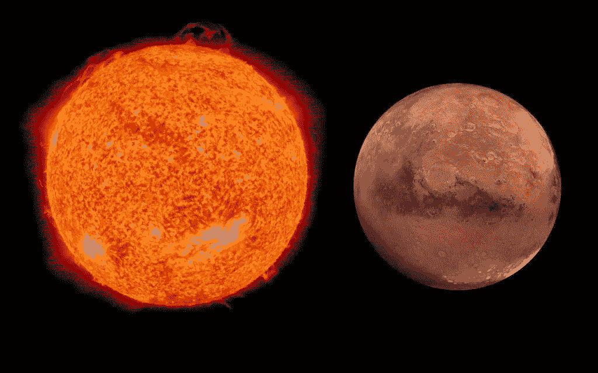
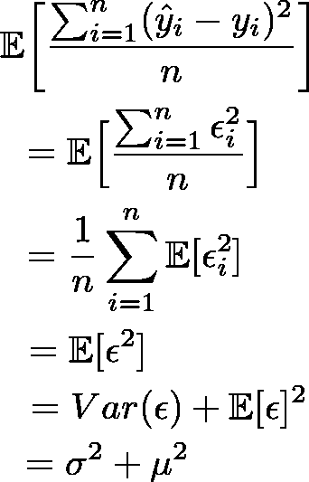

# RMSE 到底是什么意思？

> 原文：<https://towardsdatascience.com/what-does-rmse-really-mean-806b65f2e48e?source=collection_archive---------0----------------------->

均方根误差(RMSE)是衡量模型在预测定量数据时的误差的标准方法。正式定义如下:

让我们试着从数学的角度来探索为什么这个误差的度量是有意义的。忽略平方根下 n 的除法，我们首先注意到的是类似于ℝⁿ:中两个向量之间的欧几里德距离公式

这启发性地告诉我们，RMSE 可以被认为是预测值向量和观测值向量之间的某种(归一化)距离。

但是为什么我们在平方根下面除以 n 呢？如果我们保持 n(观察次数)不变，它所做的只是将欧几里德距离重新缩放一个因子√(1/n)。很难看出为什么这是正确的做法，所以让我们更深入地研究一下。

假设我们的观测值是通过给每个预测值加上随机“误差”来确定的，如下所示:

这些误差被认为是随机变量，可能具有均值为μ、标准差为σ的高斯分布，但任何其他平方可积 PDF ( *概率密度函数*)分布也适用。我们想把 ŷᵢ看作一个潜在的物理量，比如在某个特定的时间点从火星到太阳的确切距离。我们观测到的 yᵢ量将是我们测量时从火星到太阳的距离*，其中一些误差来自我们望远镜的误校准和大气干扰的测量噪声。*

**

*(NOT TO SCALE)*

*误差分布的均值μ对应于来自误校准的持续偏差，而标准差σ对应于测量噪声量。想象一下，现在我们确切地知道了误差分布的均值μ，并且想要估计标准差σ。我们可以通过一点计算看出:*

**

*这里 **E** […]是期望，Var(…)是方差。我们可以用第四行的**e**【ε】代替第三行的期望值 **E[** εᵢ ]的平均值，其中ε是与每个εᵢ具有相同分布的变量，因为误差εᵢ是同分布的，因此它们的平方都具有相同的期望值。*

*请记住，我们假设我们已经确切地知道μ。也就是说，我们仪器中的持续偏差是已知偏差，而不是未知偏差。因此，我们不妨通过从所有原始观测值中减去μ来立即校正这种偏差。也就是说，我们不妨假设我们的误差已经以均值μ = 0 分布。将这个代入上面的等式，取两边的平方根，得到:*

**

*注意左手边看起来很熟悉！如果我们从平方根中去掉期望 E，这就是我们之前的 RMSE 公式。中心极限定理告诉我们，随着 n 变大，σᵢ(ŷᵢ—yᵢ)/n =σᵢ(εᵢ)/n 这个量的方差应该收敛到零。事实上，中心极限定理的一个更清晰的形式告诉我们，它的方差应该像 1/n 一样渐近地收敛到 0。这告诉我们，σᵢ(ŷᵢ—yᵢ)/n 是对**e**[σᵢ(ŷᵢ—yᵢ)/n]=σ的一个很好的估计。但是 RMSE 是我们误差分布的标准差σ的一个很好的估计量！*

*我们现在还应该有一个在 RMSE 平方根下除以 n 的解释:它允许我们估计典型的*单次*观测的误差的标准偏差σ，而不是某种“总误差”。通过除以 n，当我们从小的观测值集合移动到更大的集合时，我们保持这种误差测量一致(随着我们增加观测值的数量，它变得更加精确)。换句话说，RMSE 是回答这个问题的一个很好的方式:“我们应该期望我们的模型在下一次预测中有多远？”*

*总结我们的讨论，假设我们的观测数据可以分解为:*

**

*这里的随机噪声可以是我们的模型没有捕捉到的任何东西(例如，可能影响观察值的未知变量)。如果噪音很小，正如 RMSE 估计的那样，这通常意味着我们的模型擅长预测我们观察到的数据，如果 RMSE 很大，这通常意味着我们的模型无法解释我们数据背后的重要特征。*

## *数据科学中的 RMSE:使用 RMSE 的微妙之处*

*在数据科学中，RMSE 有双重目的:*

*   *作为训练模型的启发*
*   *评估训练模型的有用性/准确性*

*这就提出了一个重要的问题:**RMSE 的“小”意味着什么？***

*我们首先要注意的是,“小”取决于我们选择的单位，以及我们希望的具体应用。在建筑设计中，100 英寸是一个很大的误差，但 100 纳米不是。另一方面，100 纳米在制造冰块托盘时是一个小误差，但在制造集成电路时可能是一个大误差。*

*对于训练模型，我们使用什么单位并不重要，因为在训练过程中我们所关心的是有一个启发式方法来帮助我们减少每次迭代的错误。我们只关心从一步到下一步的相对误差大小，而不是误差的绝对大小。*

*但是，在评估数据科学中经过训练的模型的有用性/准确性时，我们确实关心单位，因为我们不仅仅是想看看我们是否比上一次做得更好:我们想知道我们的模型是否能真正帮助我们解决实际问题。这里的微妙之处在于，评估 RMSE 是否足够小，将取决于我们对给定应用的模型精度要求。这永远不会有一个数学公式，因为它依赖于人的意图(“你打算用这个模型做什么？”)，风险厌恶(“如果这个模型做了一个不好的预测，会造成多大的伤害？”)，等等。*

*除了单位之外，还有另一个考虑因素:“小”也需要相对于正在使用的模型的类型、数据点的数量以及在评估模型的准确性之前模型经历的训练历史来度量。起初，这听起来可能违反直觉，但当你想起**过度装配**的问题时，就不会了。*

*每当模型中的参数数量相对于您拥有的数据点数量较大时，就有过度拟合的风险。例如，如果我们试图预测一个实数 **y** 作为另一个实数 **x** 的函数，并且我们的观测值是(xᵢ，yᵢ)与 x₁ < x₂ < x₃ …，一个通用插值定理告诉我们，对于 i = 1，…，n，存在某个次数最多为 n+1 的多项式 f(x)=yᵢ。这意味着如果我们选择我们的模型为 n+1 次多项式， 通过调整我们模型的参数(多项式的系数)，我们将能够把 RMSE 一直降到 0。 不管我们的 y 值是多少，这都是正确的。在这种情况下，RMSE 并没有真正告诉我们任何关于我们的基础模型的准确性:我们被保证能够调整参数，以获得 RMSE = 0，正如在我们现有的数据点上测量的那样，不管这两个真实量之间是否有任何关系。*

*但是不仅仅是当参数的数量超过数据点的数量时，我们可能会遇到问题。即使我们没有过多的参数，一般的数学原理和对我们数据的温和背景假设也能保证我们很有可能通过调整模型中的参数，使 RMSE 低于某个阈值。如果我们处于这种情况，那么 RMSE 低于这一阈值可能对我们模型的预测能力没有任何意义。*

*如果我们想像统计学家一样思考，我们会问的问题不是“我们训练的模型的 RMSE 小吗？”而是，“我们训练过的模型在如此这般的一组观察值上的 RMSE 随机变得如此之小的概率是多少？”*

*这类问题变得有点复杂(你实际上必须做统计)，但希望你们都明白为什么“足够小的 RMSE”没有预先确定的阈值，因为这将使我们的生活变得简单。*